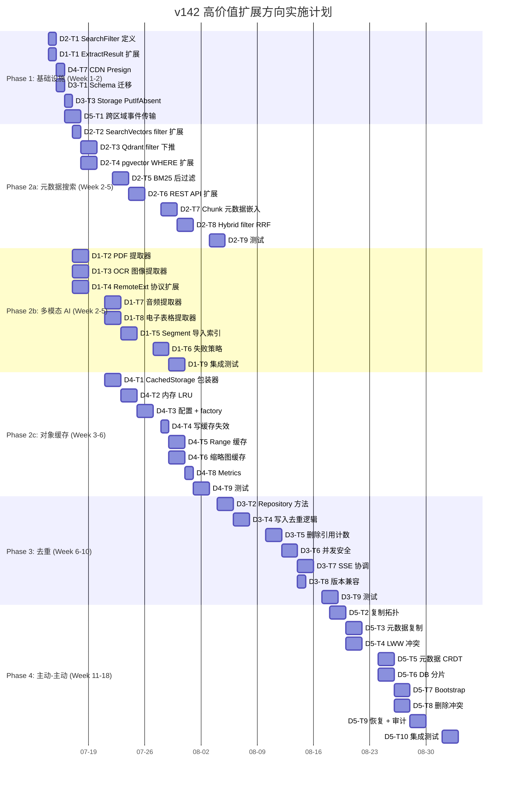

# Tech Lead 分析报告：v142 高价值扩展方向

## 文档概览

已完整阅读 `docs/requirements/expansion-v142-multimodal-ai-metadata-search-dedup-cache-active-active.md`。五个方向的选择逻辑扎实、代码锚点精确、去重验证充分。以下从技术实现和项目管理角度进行系统分析。

---

## 1. 任务分解

按 2-4 小时/任务粒度，将五个方向拆解为可执行的工程任务。

### 方向一：多模态 AI 管线

| 任务 ID | 标题 | 涉及文件 | 前置 | 工时 |
|---------|------|---------|------|------|
| **D1-T1** | 扩展 `Extractor` 接口：`ExtractResult` 结构体 | `internal/ai/extractor.go` | 无 | 3h |
| **D1-T2** | 内置 PDF 文本提取器（go-pdf/poppler 包装） | `internal/ai/extractor_pdf.go` + `internal/ai/extractor.go` 注册 | D1-T1 | 4h |
| **D1-T3** | 内置图像 OCR 提取器（tesseract CLI 或 golang OCR 包装） | `internal/ai/extractor_image.go` | D1-T1 | 4h |
| **D1-T4** | 远程提取器协议扩展：支持结构化输出与二进制流 | `internal/ai/extractor_remote.go` | D1-T1 | 3h |
| **D1-T5** | `Segment` 分片元数据导入索引管线 | `internal/ai/indexer.go`、`internal/ai/chunker.go` | D1-T1 | 3h |
| **D1-T6** | 提取失败策略：大小上限、超时、加密文档降级 | `internal/ai/extractor.go`、`internal/ai/indexer.go` | D1-T2~T4 | 3h |
| **D1-T7** | 音频提取器（whisper.cpp CLI 或 remote 委托） | `internal/ai/extractor_audio.go` | D1-T1 | 4h |
| **D1-T8** | 电子表格/结构化文档提取器（XLSX/JSON/YAML → `Structured`） | `internal/ai/extractor_structured.go` | D1-T1 | 4h |
| **D1-T9** | 集成测试：多模态提取器 + 索引 | `internal/ai/extractor_test.go`、`internal/ai/indexer_test.go` | D1-T2~T8 | 4h |

### 方向二：元数据锚定语义搜索

| 任务 ID | 标题 | 涉及文件 | 前置 | 工时 |
|---------|------|---------|------|------|
| **D2-T1** | 定义 `SearchFilter` 结构体 + 嵌入 `SearchRequest` | `internal/ai/search.go` | 无 | 2h |
| **D2-T2** | 扩展 `VectorIndex.SearchVectors` 签名支持 filter | `internal/ai/vectorindex.go` | D2-T1 | 2h |
| **D2-T3** | Qdrant filter 下推：payload 字段映射 + scopeFilter 扩展 | `internal/ai/qdrant.go` | D2-T2 | 4h |
| **D2-T4** | pgvector WHERE 子句扩展：content_type/size/created_at 多列过滤 | `internal/ai/pgvector.go` | D2-T2 | 3h |
| **D2-T5** | BM25/内存搜索后过滤实现 | `internal/ai/bm25.go`（或已有搜索路径） | D2-T1 | 3h |
| **D2-T6** | REST API 层：`searchReq` 扩展 + handler filter 解析 | `internal/api/rest/search.go` | D2-T1 | 3h |
| **D2-T7** | chunk 写入时嵌入元数据字段（Qdrant payload / pgvector columns） | `internal/ai/indexer.go`、`internal/ai/qdrant.go`、`internal/ai/pgvector.go` | D2-T1 | 4h |
| **D2-T8** | Hybrid 模式 filter 融合（vector filter + BM25 filter → RRF） | `internal/ai/search.go` | D2-T3~T5 | 3h |
| **D2-T9** | 单元测试 + Qdrant/pgvector 集成测试 | `internal/ai/search_test.go`、`internal/ai/qdrant_test.go` | D2-T3~T8 | 4h |

### 方向三：内容寻址存储与块级去重

| 任务 ID | 标题 | 涉及文件 | 前置 | 工时 |
|---------|------|---------|------|------|
| **D3-T1** | Repository schema 变更：`content_hash` + `ref_count` 列、唯一索引、迁移双文件 | `internal/repository/sql_objects.go` + `migrations/{sqlite,postgres}/` | 无 | 4h |
| **D3-T2** | Repository 方法：`GetObjectByContentHash`、`IncrementRefCount`、`DecrementRefCount` | `internal/repository/repository.go`、`internal/repository/sql_objects.go` | D3-T1 | 3h |
| **D3-T3** | Storage 接口扩充：`PutIfAbsent` / 内容寻址 put | `internal/storage/storage.go` + 各 backend 实现 | 无 | 3h |
| **D3-T4** | FileService 写入去重逻辑（流式哈希 + 临时文件 + 引用检查） | `internal/service/file_crud.go` | D3-T1~T3 | 4h |
| **D3-T5** | FileService 删除引用计数逻辑（refcount→0 才删 blob） | `internal/service/file_crud.go` | D3-T2 | 3h |
| **D3-T6** | 并发安全：`content_hash` 唯一约束 + advisory lock / `ON CONFLICT` | `internal/repository/sql_objects.go` + `internal/service/file_crud.go` | D3-T4 | 3h |
| **D3-T7** | SSE 协调：非 SSE 下启用去重，AES-SIV 确定性加密方案评估 | `internal/storage/sse.go` + 设计文档 | D3-T4 | 4h |
| **D3-T8** | 版本控制兼容：versioned bucket 选择性关闭去重 | `internal/service/file_crud.go` | D3-T4 | 2h |
| **D3-T9** | 契约测试 + 单元测试 + 集成测试 | `internal/service/file_crud_test.go` + `storage/contract_test.go` | D3-T4~T7 | 4h |

### 方向四：对象内容缓存层次

| 任务 ID | 标题 | 涉及文件 | 前置 | 工时 |
|---------|------|---------|------|------|
| **D4-T1** | `CachedStorage` 包装器实现（cache-aside 模式） | `internal/storage/cache.go`（新文件） | 无 | 4h |
| **D4-T2** | 本地内存 LRU 缓存实现（配置容量 + TTL + 大小上限） | `internal/storage/cache.go` | D4-T1 | 3h |
| **D4-T3** | Cache 配置项 + factory 集成（`WithCache(backend, cfg)`） | `internal/storage/factory.go` + `internal/config/config.go` | D4-T1~T2 | 3h |
| **D4-T4** | 写路径缓存失效（Put/Delete → invalidate） | `internal/storage/cache.go` | D4-T1 | 2h |
| **D4-T5** | Range 请求缓存支持（仅缓存完整小对象，大对象旁路） | `internal/storage/cache.go` | D4-T1 | 3h |
| **D4-T6** | 缩略图缓存层（`{storageKey}_{w}_{h}` LRU 缓存） | `internal/thumbnail/thumbnail.go` | D4-T2 | 3h |
| **D4-T7** | CDN Presign 集成：缓存行为声明 + CDN 域包装 | `internal/service/file_crud.go`（`PresignGet`） | 无 | 3h |
| **D4-T8** | Metrics：缓存命中/未命中/淘汰/大小计数 | `internal/storage/cache.go` | D4-T1 | 2h |
| **D4-T9** | 缓存一致性测试 + 契约测试 + 集成测试 | `internal/storage/cache_test.go`、`storage/contract_test.go` | D4-T1~T8 | 4h |

### 方向五：主动-主动多区域复制与冲突解决

| 任务 ID | 标题 | 涉及文件 | 前置 | 工时 |
|---------|------|---------|------|------|
| **D5-T1** | 跨区域事件传输抽象层（接口 + Kafka/NATS/HTTP 实现） | `internal/events/region.go`（新文件） | 无 | 4h |
| **D5-T2** | 复制拓扑配置：区域注册 + 方向规则 + 存储类过滤 | `internal/config/config.go` + `internal/replication/replication.go` | D5-T1 | 3h |
| **D5-T3** | 元数据跨区域复制（tags/ACL/storage_class 同步） | `internal/replication/replication.go` | D5-T1 | 4h |
| **D5-T4** | Timestamp LWW 冲突解决 + tombstone + grace period | `internal/replication/conflict.go`（新文件） | D5-T2 | 4h |
| **D5-T5** | 元数据 CRDT：`map[string]string` union merge（tags, ACL） | `internal/replication/crdt.go`（新文件） | D5-T4 | 4h |
| **D5-T6** | 区域级 DB 实例分离 + 跨区域 CDC/streaming | `internal/repository/repository.go` 分片 | D5-T1 | 4h |
| **D5-T7** | 初始全量复制引导（类似 `ReindexStale` 多区域版） | `internal/replication/bootstrap.go` | D5-T2~T6 | 4h |
| **D5-T8** | 删除冲突处理：tombstone → grace period → 最终删除 | `internal/replication/conflict.go` | D5-T4 | 3h |
| **D5-T9** | 区域故障恢复 + audit_log 记录跨区域操作 | `internal/replication/recovery.go` + `internal/repository/audit.go` | D5-T4~T6 | 4h |
| **D5-T10** | 集成测试（多区域模拟）+ 故障注入测试 | `internal/replication/replication_test.go` | D5-T1~T9 | 4h |

---

## 2. 执行顺序

```mermaid
graph TD
    %% Phase 1: 基础设施 + 并行方向（无冲突）
    subgraph "Phase 1: Foundation (Week 1-2)"
        D2_T1["D2-T1: SearchFilter"] 
        D1_T1["D1-T1: ExtractResult"]
        
        D4_T7["D4-T7: CDN Presign"]
        
        D3_T1["D3-T1: Schema migration"]
        D3_T3["D3-T3: Storage PutIfAbsent"]
        
        D5_T1["D5-T1: Cross-region event transport"]
    end

    %% Phase 2: Core implementation
    subgraph "Phase 2: Core Features (Week 3-6)"
        %% Direction 2 (highest ROI, can start immediately)
        D2_T1 --> D2_T2["D2-T2: SearchVectors filter"]
        D2_T2 --> D2_T3["D2-T3: Qdrant filter"]
        D2_T2 --> D2_T4["D2-T4: pgvector WHERE"]
        D2_T1 --> D2_T5["D2-T5: BM25 post-filter"]
        D2_T3 --> D2_T6["D2-T6: REST API searchReq"]
        D2_T3 --> D2_T7["D2-T7: Chunk metadata embed"]
        D2_T3 --> D2_T8["D2-T8: Hybrid filter fusion"]
        D2_T4 --> D2_T8
        D2_T5 --> D2_T8
        
        %% Direction 1 (parallel with D2)
        D1_T1 --> D1_T2["D1-T2: PDF extractor"]
        D1_T1 --> D1_T3["D1-T3: Image OCR"]
        D1_T1 --> D1_T4["D1-T4: RemoteExt protocol"]
        D1_T1 --> D1_T7["D1-T7: Audio extractor"]
        D1_T1 --> D1_T8["D1-T8: Spreadsheet extractor"]
        D1_T2 --> D1_T5["D1-T5: Segment import"]
        D1_T3 --> D1_T5
        D1_T4 --> D1_T6["D1-T6: Failover strategy"]
        D1_T5 --> D1_T6
        D1_T7 --> D1_T9["D1-T9: Integration tests"]
        D1_T8 --> D1_T9
        
        %% Direction 4 (infrastructure, independent)
        D4_T1["D4-T1: CachedStorage wrapper"]
        D4_T1 --> D4_T2["D4-T2: Memory LRU"]
        D4_T2 --> D4_T3["D4-T3: Config + factory"]
        D4_T3 --> D4_T4["D4-T4: Write invalidation"]
        D4_T3 --> D4_T5["D4-T5: Range cache"]
        D4_T3 --> D4_T6["D4-T6: Thumbnail cache"]
        D4_T3 --> D4_T8["D4-T8: Cache metrics"]
    end

    %% Phase 3
    subgraph "Phase 3: Dedup + Deep Integration (Week 7-10)"
        D3_T1 --> D3_T2["D3-T2: Repo methods"]
        D3_T3 --> D3_T4["D3-T4: Write dedup logic"]
        D3_T2 --> D3_T4
        D3_T4 --> D3_T5["D3-T5: Delete refcount"]
        D3_T4 --> D3_T6["D3-T6: Concurrent safety"]
        D3_T4 --> D3_T7["D3-T7: SSE coordination"]
        D3_T4 --> D3_T8["D3-T8: Versioning compat"]
        
        D2_T8 --> D2_T9["D2-T9: Search tests"]
        D4_T5 --> D4_T9["D4-T9: Cache tests"]
        D3_T8 --> D3_T9["D3-T9: Dedup tests"]
    end

    %% Phase 4: Active-Active (largest scope)
    subgraph "Phase 4: Active-Active (Week 11-18)"
        D5_T1 --> D5_T2["D5-T2: Replication topology"]
        D5_T2 --> D5_T3["D5-T3: Metadata replication"]
        D5_T2 --> D5_T4["D5-T4: LWW conflict"]
        D5_T4 --> D5_T5["D5-T5: Metadata CRDT"]
        D5_T4 --> D5_T8["D5-T8: Delete conflict"]
        D5_T1 --> D5_T6["D5-T6: DB sharding"]
        D5_T2 --> D5_T7["D5-T7: Bootstrap"]
        D5_T6 --> D5_T7
        D5_T5 --> D5_T9["D5-T9: Recovery + audit"]
        D5_T8 --> D5_T9
        D5_T9 --> D5_T10["D5-T10: Integration tests"]
    end

    %% Parallel groups
    D1_T1 -.->|"Parallel"| D2_T1
    D2_T3 -.->|"Parallel"| D1_T2
    D4_T1 -.->|"Independent"| D2_T1
```

### 并行执行组

| 并行组 | 任务 | 说明 |
|--------|------|------|
| **Group A** | D1-T1 + D2-T1 + D4-T7 | 三个方向的接口层探索，无冲突 |
| **Group B1** | D1-T2/3/4/7/8 | 各提取器并行实现 |
| **Group B2** | D2-T3/4/5 | 各向量后端 filter 并行实现 |
| **Group B3** | D4-T3/4/5/6 | 缓存各特性并行开发 |
| **Group C** | D3-T1/3 | Schema + Storage 接口并行 |
| **Group D** | D5-T4/5/6/7/8 | 主动-主动核心模块并行开发 |

---

## 3. 技术风险

### 高风险项

| 风险 | 方向 | 等级 | 描述 | 缓解策略 |
|------|------|------|------|---------|
| **SSE × 去重矛盾** | D3 | 🔴 | 确定性加密（AES-SIV）并非所有 Go crypto 库原生支持；per-object 独立加密与去重本质冲突 | ① 第一阶段仅在非 SSE bucket 启用去重（`config.go` 开关）② AES-SIV 用 `github.com/rogpeppe/go-internal-lockfree` 或自定义实现 ③ 设计文档明确取舍 |
| **跨区域事件传播延迟** | D5 | 🔴 | Kafka/NATS 需要运维基础设施；简单 HTTP 转发不可靠 | ① 先以 HTTP+retry 实现 MVP ② 明确 SLA：RPO < 5s 用 Kafka，< 30s 用 HTTP ③ 文档记录运维依赖 |
| **pgvector filter 兼容性** | D2 | 🟡 | pgvector 的 WHERE 子句含 `content_type`、`created_at` 列需要 schema 变更；已有索引可能受影响 | ① 零停机迁移：ADD COLUMN IF NOT EXISTS + 异步回填 ② 回填期间旧 chunk 无 filter 但可通过后过滤兜底 |
| **Qdrant payload schema drift** | D2 | 🟡 | 已有 chunk 无新 filter 字段；payload 字段类型不匹配可导致 filter 失效 | ① 写入时做 payload schema version 标记 ② 查询时对缺失字段做默认值填充 ③ `search.go` 层 fallback 到后过滤 |
| **大文件流式去重（鸡生蛋）** | D3 | 🟡 | 计算 hash 前需读完整个流；写临时文件增加 IO | ① 分层设计：小文件(<64MB)内存缓冲，大文件临时文件 ② `TeeReader` + 分块哈希（Merkle tree）降 IO |
| **主动-主动冲突模型选择** | D5 | 🟡 | CRDT 实现复杂（`map[string]string` 的 union 简单但 object metadata 合并涉及嵌套语义） | ① LWW 为主，CRDT 仅限 metadata map ② tombstone grace period 降低数据丢失风险 ③ 设计评审 |

### 性能瓶颈

| 瓶颈 | 方向 | 分析 | 优化策略 |
|------|------|------|---------|
| **提取器吞吐** | D1 | 大 PDF（1000+页）OCR 可能数秒 | ① 50MB 上限 + 前 N 页采样 ② 异步作业（JobPool）③ RemoteExtractor 水平扩展 |
| **Qdrant filter 扫描** | D2 | Qdrant 的 filter 下推是索引级，但 payload 字段多条件组合可降级为全扫描 | ① Qdrant 端创建 payload 索引（`content_type`、`created_at_unix`）② 控制 filter 条件数上限 |
| **去重哈希计算** | D3 | SHA-256 对大文件（>5GB）所需时间长 | ① 分块哈希 + Merkle tree ② 纯 CPU 计算，可用 `minio/sha256-simd` 加速 |
| **缓存写入放大** | D4 | 大量小对象写入→缓存满→频繁淘汰 | ① 按 size 分流：小对象（<1MB）进内存，中对象进磁盘 ② 配置水位线 + 淘汰策略（LFU vs LRU） |
| **跨区域数据传输** | D5 | blob 传输消耗带宽，大区域间延迟高 | ① 按 storage class 选择性复制（STANDARD 才复制，GLACIER 不复制）② 增量 + 压缩传输 |

### 测试覆盖难点

| 难点 | 方向 | 原因 | 方案 |
|------|------|------|------|
| 多模态提取器确定性 | D1 | OCR/语音识别结果非确定性（版本、语言影响输出） | ① Mock 提取器 + Golden file 比对 ② RemoteExtractor 用 httptest server mock ③ 集成测试用预录媒体文件 |
| Vector backend filter | D2 | Qdrant 需要 Docker，pgvector 需要 Postgres 扩展 | ① `//go:build integration` 隔离 ② 探测 `/readyz` 自动 skip ③ 内存暴力扫描作为 fallback 测试基准 |
| 去重并发竞态 | D3 | 并发上传同一内容需验证 RefCount 原子性 | ① `go test -race` 必过 ② `sync.WaitGroup` + 并行 goroutine 触发竞争 ③ DB 事务隔离级别测试 |
| 主动-主动跨区域 | D5 | 本地无法模拟两个区域 | ① `inmem` storage + `inmem` event transport 模拟双区域 ② 网络分区 → 恢复场景用 `context.WithTimeout` + 断连 ③ 集成测试标记 `//go:build integration` 需要 Docker 网络 |

---

## 4. 资源评估

### 团队技能要求

| 角色 | 所需技能 | 负责方向 | 人数 |
|------|---------|---------|------|
| **Go 后端工程师（搜索）** | Go 1.25、Qdrant REST API、pgvector SQL、REST API 设计 | D2 | 1 |
| **Go 后端工程师（AI）** | Go 1.25、OCR/PDF 库、音频处理管线、Remote API 设计 | D1 | 1 |
| **Go 后端工程师（存储）** | Go 1.25、Storage 后端实现、加密、并发编程 | D3 | 1 |
| **Go 后端工程师（基础设施）** | Go 1.25、缓存设计、CDN 集成、分布式系统 | D4, D5 | 1-2 |
| **QA 工程师** | Go 测试、集成测试（Docker）、性能基准、`go test -race` | 全部 | 1 |
| **Tech Lead / 架构师** | 系统设计评审、跨方向协调 | 全部 | 0.5（兼职） |

**核心团队：** 4-5 名后端 + 1 QA（加 Tech Lead 兼职）  
**跨方向依赖协调：** 主 Tech Lead 每周 2 次站会 + 设计评审

### 关键里程碑

| 里程碑 | 时间 | 交付物 | 验收标准 |
|--------|------|--------|---------|
| **M1: 搜索可过滤** | Week 3 | D2-T6 完成 | `POST /v1/search` 支持 `filter.tags`, `filter.content_type`, `filter.min_size` |
| **M2: 多模态可搜索** | Week 5 | D1-T9 完成 | 上传 PDF/图片/音频后可被语义搜索命中其中的文字 |
| **M3: 缓存上线** | Week 6 | D4-T9 完成 | GET 热点对象延迟从 100ms 降到 <5ms（local cache hit） |
| **M4: 去重就绪** | Week 10 | D3-T9 完成 | 同一内容上传 100 次，存储占用 = 1× + 99 条引用记录 |
| **M5: 主动-主动 MVP** | Week 18 | D5-T10 完成 | 双区域模拟：区域 A 写入 → 区域 B 事件驱动复制 → 读取一致 |

### 阻塞点与解决策略

| Blocker | 方向 | 描述 | 解决策略 |
|---------|------|------|---------|
| **`go-pdf` / `go-tesseract` 依赖审核** | D1 | 新 Go 依赖需论证（AGENTS.md I6） | ① 评估 `ledongthuc/pdf`（纯 Go，无 CGO）② 优先用 `RemoteExtractor` 委托外部服务，降低核心依赖 |
| **AES-SIV Go 库可用性** | D3 | Go 标准库无 AES-SIV；`github.com/rogpeppe/go-internal-lockfree` 非正式 | ① 明确第一阶段仅非 SSE bucket 去重 ② 用 `crypto/aes` + `crypto/cipher` 自实现 SIV 需安全评审 |
| **pgvector 列变更** | D2 | 已有 chunks 表新增 `content_type` 等列需零停机 | ① `ADD COLUMN IF NOT EXISTS` + `NOT VALID` ② 异步 backfill 任务 ③ `COALESCE(content_type, '')` 确保查询不报错 |
| **跨区域网络拓扑** | D5 | 无法在现有 CI 环境中测试跨区域 | ① Docker Compose 双容器模拟双区域 ② 单进程 `inmem.NewStorage()` × 2 + `inmem.NewEventBus()` × 2 做集成测试 |
| **文件行数限制** | 全部 | AGENTS.md 限制单文件 ≤ 500 行 | 任何接近 500 行的文件必须在修改前拆分。预估受影响文件：`file_crud.go`（~480 行）、`qdrant.go`（~350 行）、`search.go`（~200 行）|

---

## 5. 质量保证

### 单元测试覆盖要求

| 方向 | 最低覆盖率 | 关键测试模块 |
|------|-----------|-------------|
| D1 | ≥ 70% | `extractor.go`、`extractor_remote.go`、`indexer.go`（handleExtractError 路径） |
| D2 | ≥ 75% | `search.go`（filter 解析 + RRF 融合）、`qdrant.go`（scopeFilter 构造）、`pgvector.go`（WHERE 子句生成） |
| D3 | ≥ 80% | `file_crud.go`（Put dedup 路径、Delete refcount）、`sql_objects.go`（事务一致性） |
| D4 | ≥ 80% | `cache.go`（Get hit/miss、Invalidate、TTL 过期、并发安全） |
| D5 | ≥ 65% | `conflict.go`（LWW 序、CRDT merge）、`bootstrap.go`（全量复制进度） |

### 集成测试策略

| 测试套件 | 方向 | 运行条件 | 说明 |
|---------|------|---------|------|
| `//go:build integration` (Docker) | D2 | Qdrant/pgvector 容器 | filter 下推正确性验证；payload 字段类型匹配 |
| `//go:build integration` (Docker) | D5 | 双区域模拟容器 | 冲突解决、事件传播、恢复 |
| CLI golden file | D1 | 预录媒体文件 | PDF/图片/音频提取输出与期望文本比对 |
| `go test -race` | D3, D4, D5 | 任意环境 | 并发去重、缓存竞态、区域间并发写入 |
| `storage/contract_test.go` | D3, D4 | 任意环境 | `CachedStorage`、`PutIfAbsent` 通过全部后端契约 |

### 代码审查要点

| 审查点 | 方向 | 关注内容 |
|--------|------|---------|
| `ExtractResult` 兼容性 | D1 | 旧的 `Extractor` 实现是否报类型错误；`RemoteExtractor` 协议是否向后兼容 |
| filter 参数传递 | D2 | `SearchVectors` 签名变更后所有调用方(搜索、agent、chat)是否都传递了 filter |
| 引用计数原子性 | D3 | `IncrementRefCount` / `DecrementRefCount` 是否在事务内；并发 delete + put 是否导致脏读 |
| 缓存加密安全 | D4 | 加密对象明文是否被缓存到不安全内存；`CachedStorage` 是否对 SSE 对象做了缓存屏蔽 |
| LWW 序的正确性 | D5 | 时钟不同步导致 timestamp 倒序；是否使用 `updated_at + wall clock tolerance`；`tombstone` 是否在所有区域一致传播 |

### 性能测试需求

| 测试场景 | 方向 | 指标 | 目标 |
|---------|------|------|------|
| PDF 多模态提取吞吐 | D1 | 提取延迟 P95 | 100 页 PDF < 5s（本地 Tesseract），< 10s（RemoteExtractor） |
| 元数据 filter 搜索延迟 | D2 | P95 搜索延迟 | filter + vector < 200ms（100K chunks, Qdrant） |
| 去重写入吞吐 | D3 | 重复内容写入 TPS | 10并发 × 100次重复 put < 500ms/op |
| 缓存命中延迟 | D4 | P50 GET 延迟 | 内存命中 < 1ms，磁盘命中 < 5ms |
| 跨区域复制延迟 | D5 | P99 事件→复制完成 | 同区域 < 1s，跨区域 < 5s（模拟 50ms RTT） |

---

## 6. 实施计划

### 甘特图

### 阶段详情

#### Phase 1：基础设施搭建（Week 1-2，7月14-18日）

| 日 | 活动 | 产出 |
|---|------|------|
| D1-2 | 接口定义层：`SearchFilter`、`ExtractResult`、`CachedStorage` 接口、`PutIfAbsent`、跨区域 Event 接口 | 5 个 Interface/Struct 定义，0 实现 |
| D3-5 | Schema 迁移：`content_hash` + `ref_count` 列 + 双文件迁移 + 存储后端 `PutIfAbsent` 桩实现 + `PresignGet` CDN 路径 | 迁移 SQL 对 + 后端桩代码 |

**关键交付：** 所有接口定义完成，团队可以并行开发。`make check` 全绿（桩代码 + 空实现不破坏编译）。

#### Phase 2：核心功能实现（Week 2-6，7月17日-8月4日）

**Group A - 元数据搜索（ROI 最高，优先启动）**

实际开发 12 个工作日（7月17日-8月4日），含：
- Qdrant/pgvector 双后端 filter 下推（同时开发，共用 `SearchFilter` 接口）
- REST API 暴露（`searchReq` 扩展 + handler 解析 + scope 校验）
- Hybrid RRF 融合 + filter 一致性（两边 filter 结果 RRF 合并）
- 单元 + 集成测试

**Group B - 多模态 AI（与 A 并行）**

实际开发 10 个工作日（7月17日-7月29日），含：
- 4 类提取器并行开发（PDF/Image/Audio/Spreadsheet）
- RemoteExtractor 协议扩展（HTTP JSON schema 变更）
- Indexer 集成（Segment 导入 + 失败策略）
- 集成测试 + Golden file

**Group C - 缓存层次（Week 3-6，7月21日-8月4日）**

- `CachedStorage` wrapper 完整实现
- 缩略图缓存独立交付

#### Phase 3：去重 + 集成测试（Week 6-10，8月4日-8月19日）

- 核心去重逻辑：流式哈希 + 临时文件 + 引用计数
- SSE 冲突协调（第一阶段禁 SSE 下去重）
- 版本兼容性 + 并发安全
- 全量集成测试 + 契约测试

#### Phase 4：主动-主动多区域（Week 11-18，8月18日-9月3日）

- 跨区域事件传输（HTTP MVP → Kafka 就绪）
- 冲突解决（LWW + CRDT + tombstone）
- DB 分片抽象 + 全量引导
- 双区域模拟测试

---

## Tech Lead 综合建议

### 立即行动（Week 0）

1. **确定 D2（元数据搜索）为最高优先级** — 搜索是产品核心体验，ROI 最高，技术风险可控
2. **D1 + D4 作为第二优先级并行队列** — 不冲突、独立交付
3. **D3 延后到 Phase 3** — 需要 SSE 协调设计评审，且第一阶段可限定非 SSE 场景
4. **D5 作为远期规划** — 至少等到 Phase 4，且需要考虑基础设施运维成本（Kafka/NATS）

### 风险缓释三件事

1. **D3 的 SSE × 去重** — 本周出一页设计文档，确认第一阶段仅非 SSE bucket 去重
2. **D2 的 pgvector schema 兼容** — 确认生产环境 pgvector 版本是否支持 `ADD COLUMN` 零停机
3. **D5 的跨区域方案选择** — 出一页 RFC 评估 HTTP polling vs Kafka vs NATS 的运维成本

### 工程约束提醒

| 约束 | 受影响文件 | 行动 |
|------|-----------|------|
| 单文件 ≤ 500 行 | `file_crud.go` (~480行) | 改造去重路径时必须拆分为 `file_crud.go` + `file_dedup.go` |
| 单函数 ≤ 50 行 | `Put` (当前 ~80 行) | 拆分为 `putWithDedup`、`putStandard`、`resolveContentHash` |
| 禁止 `utils/` 包 | 缓存工具函数 | `storage/cache.go` 内聚，不另建包 |
| 迁移双文件 | D3 schema 变更 | `migrations/{sqlite,postgres}/` 各一对 |

### 预期产出摘要

| 指标 | 目标 |
|------|------|
| 总开发工时 | ~95 人天（~5 人 × 19 周） |
| 新增代码行 | ~4,000 行（含测试~2,000 行） |
| 新增文件 | ~15 个（不含迁移文件） |
| 测试覆盖率维持 | ≥50%（CI gate），AI/搜索模块目标 ≥70% |
| 破坏性变更 | D2 `SearchVectors` 签名变更（需 `go vet` + 编译检查）其余方向向后兼容 |

---

以上分析基于 `docs/requirements/expansion-v142-multimodal-ai-metadata-search-dedup-cache-active-active.md` 完整内容。如需要，我可以进一步深入任何一个方向的任务细节或帮助编写第一批任务的 TDD 测试用例。
