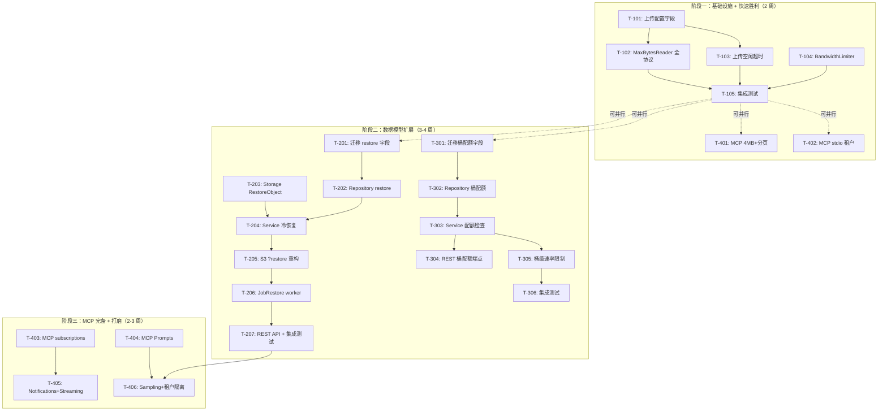

现在我已全面了解代码库和需求文档。以下是我的 Tech Lead 分析报告。

---

# Tech Lead 分析报告：四方向高价值扩展

> **分析范围：** 文档 `docs/requirements/expansion-v97-upload-governance-cold-restore-bucket-mcp.md`
> **代码基线：** `9e9a216` — 已验证代码锚点，2026-07-12
> **分析日期：** 2026-07-12

---

## 0. 文档准确性验证结果

我对代码库与文档进行了锚点交叉验证：

| 方向 | 文档断言 | 验证结果 | 细微偏差/补正 |
|------|---------|---------|--------------|
| **方向一** | 无 `MaxBytesReader`，无 `UploadMax` 配置 | ✅ **准确** — `r.Body` 在 REST/S3/WebDAV/MCP 均直传 | |
| **方向一** | 无 `upload` 相关配置字段 | ✅ **准确** — `config_app.go` 完全缺失 |
| **方向一** | 1: `throttle/bandwidth` 零结果 | ✅ **准确** — grep 零命中 |
| **方向二** | `?restore` = 软删除恢复 | ✅ **准确** — `file_features.go:RestoreObject` → `repo.RestoreObject` → `UPDATE deleted_at=NULL` |
| **方向二** | `Storage` 接口无 `RestoreObject` | ✅ **准确** — 6 个方法，零恢复 |
| **方向二** | `Object.StorageClass` 仅标签 | ✅ **准确** — 字段存在，无恢复状态 |
| **方向二** | 无 restore 相关迁移 | ✅ **准确** — 最新迁移 `0024_*` 无关 |
| **方向三** | 配额仅租户级 | ✅ **准确** — `GetTenantQuota`/`SetTenantQuota` 无桶级变体 |
| **方向三** | `buckets` 表无 quota 字段 | ✅ **准确** — `BucketConfig` 无 quota 字段 |
| **方向四** | 仅 6 个 dispatch case | ✅ **准确** — 重构：`initialize/tools/list/tools/call/resources/list/resources/read/ping` |
| **方向四** | `read_file` 4MB 硬截断 | ✅ **准确** — `io.LimitReader(rc, 4<<20)` 第 249/380 行 |
| **方向四** | stdio 无租户传递 | ✅ **准确** — `tenantFor` 回退 `s.tenant` |
| 文档 | `migrations/{sqlite,postgres}` 在仓库根 | ⚠️ **需更新** — 实际路径 `internal/repository/migrations/{sqlite,postgres}` |

**结论：** 文档非常准确，仅一处路径偏差（迁移目录位置）。可以直接作为实现依据。

---

## 1. 任务分解

四个方向拆解为 16 个任务，每个 2-6 小时。

### 方向一：上传治理与流量整形

| 任务 ID | 标题 | 涉及文件 | 前置 | 工时 | 验收标准 |
|---------|------|---------|------|------|---------|
| **T-101** | 配置字段 + `UploadConfig` 类型 | `internal/config/config_app.go` | — | 2h | `AppConfig.Upload` 含 `MaxBytes`, `IdleTimeout`；`UPLOAD_*` env 绑定 |
| **T-102** | 全协议 `MaxBytesReader` + 413 响应注入 | `internal/api/rest/handler.go` `internal/api/s3compat/handler.go` `internal/api/webdav/dav.go` `internal/mcp/server.go` | T-101 | 4h | 四协议路径 `r.Body` 被 `http.MaxBytesReader` 包裹；超限返回 413（S3：`EntityTooLarge`） |
| **T-103** | 上传空闲超时中间件 | `internal/middleware/upload_timeout.go` + `main.go` 注册 | T-101 | 3h | `UploadIdleTimeoutSeconds` 过后无数据的连接被关闭；chunked transfer 同样生效 |
| **T-104** | BandwidthLimiter 带宽整形 | `internal/service/bandwidth.go` + `internal/service/bandwidth_test.go` | — | 4h | per-tenant token-bucket `io.Reader` wrapper；`UPLOAD_BANDWIDTH_BPS_PER_TENANT` 生效 |
| **T-105** | 上传治理集成测试 + 文档 | `internal/service/bandwidth_test.go` `internal/integration/upload_test.go` | T-102~T-104 | 3h | 覆盖大小超限、空闲超时、带宽限速、内容长度未知 |

### 方向二：冷存储恢复语义

| 任务 ID | 标题 | 涉及文件 | 前置 | 工时 | 验收标准 |
|---------|------|---------|------|------|---------|
| **T-201** | DB 迁移：restore 状态字段 | `internal/repository/migrations/{sqlite,postgres}/0025_restore.*.sql` | — | 2h | `objects` 表 `restore_status`, `restore_expires_at`, `restore_requested_at` 列 |
| **T-202** | Repository 层：restore 方法 | `internal/repository/sql_objects.go` `internal/repository/repository.go:Object` | T-201 | 3h | `SetRestoreStatus(ctx, id, status, expiresAt)` `GetRestoreStatus(ctx, id)` |
| **T-203** | Storage 接口 + 各后端 `RestoreObject` | `internal/storage/storage.go` `internal/storage/local.go` `internal/storage/s3.go` (etc) | — | 4h | `Storage.RestoreObject(ctx, key, days)`；local 返回 `ErrNotSupported`；S3 调用 `RestoreObjectInput` |
| **T-204** | Service 层冷存储恢复逻辑 | `internal/service/file_coldrestore.go` + `internal/service/file_coldrestore_test.go` | T-202, T-203 | 4h | `RestoreColdObject` 校验 StorageClass → 入队 `JobRestore` → 更新状态 |
| **T-205** | S3 `?restore` 语义重构 | `internal/api/s3compat/handler.go:restoreObject` | T-204 | 3h | POST `?restore&days=7` → 异步 202；GET 时校验恢复状态；`x-amz-restore` 头 |
| **T-206** | JobRestore/JobRestoreExpire worker | `internal/service/file_coldrestore.go` + `cmd/server/main.go` 注册 | T-204 | 3h | 恢复作业执行完成 → 状态更新 → 触发 `restore.completed` 事件 |
| **T-207** | REST API + 集成测试 | `internal/api/rest/handler.go` `internal/integration/restore_test.go` | T-205, T-206 | 3h | POST `/v1/files/{key}/restore?days=7` → 202；GET 检查恢复状态 |

### 方向三：桶级资源配额

| 任务 ID | 标题 | 涉及文件 | 前置 | 工时 | 验收标准 |
|---------|------|---------|------|------|---------|
| **T-301** | DB 迁移：桶配额字段 | `internal/repository/migrations/{sqlite,postgres}/0026_bucket_quota.*.sql` | — | 2h | `buckets` 表 `quota_max_bytes`, `quota_max_objects`, `quota_warn_bytes` |
| **T-302** | Repository：桶配额 CRUD + 使用量 | `internal/repository/sql_buckets.go` `internal/repository/repository.go` | T-301 | 3h | `GetBucketQuota` `SetBucketQuota` `AddBucketUsage` `GetBucketUsage` |
| **T-303** | Service 层配额检查路径 | `internal/service/file_crud.go:Put` `internal/service/file_features.go` | T-302 | 3h | `Put`/`UploadPart` 路径双重检查（租户+桶配额）； `ErrBucketQuotaExceeded` 错误类型 |
| **T-304** | REST API：桶配额端点 | `internal/api/rest/management.go` `internal/api/rest/router.go` | T-303 | 3h | `PUT/GET/DELETE /v1/buckets/{bucket}/quota` + 单元测试 |
| **T-305** | 桶级速率限制中间件 | `internal/middleware/bucket_ratelimit.go` + `main.go` 注册 | T-302 | 4h | `BucketRateLimiter` per-bucket token-bucket；与 tenant 级串联 |
| **T-306** | 桶配额集成测试 | `internal/integration/quota_test.go` | T-304, T-305 | 2h | 桶超限 → 403；降低配额 → 409 Conflict |

### 方向四：MCP 协议完备性

| 任务 ID | 标题 | 涉及文件 | 前置 | 工时 | 验收标准 |
|---------|------|---------|------|------|---------|
| **T-401** | MCP：4MB 限制 + 分页 | `internal/mcp/server.go` `internal/mcp/protocol.go` | — | 3h | `read_file` 支持 `max_size` 参数；`list_files` 支持 `cursor` 分页；`next_cursor` 返回 |
| **T-402** | MCP：stdio 租户隔离 | `internal/mcp/transport.go` `cmd/server/main.go:runMCP` | — | 2h | 环境变量 `AERO_TENANT`；`initializationOptions.tenant` 扩展字段 |
| **T-403** | MCP：Resource subscriptions | `internal/mcp/server.go` `internal/mcp/protocol.go` | — | 3h | `resources/subscribe` + `notifications/resources/listChanged`；event bus 桥接 |
| **T-404** | MCP：Prompts 能力 | `internal/mcp/server.go` `internal/mcp/protocol.go` | T-401 | 3h | `prompts/list` + `prompts/get`；预定义 2-3 个模板 |
| **T-405** | MCP：Notifications + Streaming | `internal/mcp/server.go` `internal/mcp/transport.go` | T-403 | 4h | 对象变更主动推送；大文件流式分块传输 |
| **T-406** | MCP：Sampling + 租户隔离完善 | `internal/mcp/server.go` `internal/mcp/protocol.go` | T-404 | 4h | `$/sampling/createMessage` 桥接 LLM scope；HTTP 头租户传递 |

---

## 2. 执行顺序与依赖图



### 并行组

| 并行组 | 任务 | 原因 |
|--------|------|------|
| **组 A** | T-101 → T-102 → T-103 → T-104 → T-105 | 方向一：上传治理串行链路 |
| **组 B** | T-201 → T-202 → T-203 → T-204 → T-205 → T-206 → T-207 | 方向二：冷存储恢复全链 |
| **组 C** | T-301 → T-302 → T-303 → T-304 → T-305 → T-306 | 方向三：桶级配额全链 |
| **组 D** | T-401, T-402 | 方向四第一阶段（与 A 无依赖） |
| **组 E** | T-403 → T-404 → T-405 → T-406 | 方向四第二阶段（依赖 D，无其他依赖） |

**可并行执行：** A + D (Phase 1)，B + C (Phase 2)。

---

## 3. 技术风险

### 3.1 高风险项

| 风险 | 方向 | 描述 | 缓解策略 |
|------|------|------|---------|
| **R1: S3 RestoreObject IAM 权限** | 二 | 生产环境 S3 后端需 `s3:RestoreObject` 权限，客户 IAM policy 可能缺失 | 启动时探测权限；若缺失则返回 `ErrNotSupported` + warn log |
| **R2: 桶配额 overcommit 语义歧义** | 三 | 桶配额总和超过租户配额时的计数策略复杂（`min(bucket, tenant - other)`） | Phase 1 仅实现严格模式（桶配额 ≤ 租户配额，否则拒绝）；overcommit 模式推迟 |
| **R3: MCP Subscription 状态管理** | 四 | HTTP transports 无持久连接，subscription 状态存在哪里？ | Phase 1 仅支持 SSE/WebSocket transport；stdio 连接期间内存维护 |
| **R4: 上传治理对现有客户端的影响** | 一 | 生产环境中已有海量上传，引入 `MaxUploadBytes`/限速可能导致现有应用失败 | 默认值设为 5GB（足够大）；文档明确标注 breaking change；提供 `UPLOAD_MAX_BYTES=0` 降级（=无限制） |
| **R5: 大文件带宽限制时 ACK 风暴** | 一 | `rate.Limiter.WaitN` 在 per-byte 调用时可能造成高额调度开销 | 使用适中的令牌桶粒度（每 64KB 扣一次令牌，而非每字节） |

### 3.2 外部依赖

| 依赖 | 方向 | 说明 | 风险等级 |
|------|------|------|---------|
| `golang.org/x/time/rate` | 一 | 已广泛使用（`internal/middleware/ratelimit.go`） — 零新增风险 | 🟢 低 |
| AWS S3 `RestoreObject` API | 二 | 需要 IAM 权限；`minio-go` SDK 需确认支持 | 🟡 中 |
| 阿里云 OSS RestoreObject API | 二 | SDK 接口可能不同；需检查 SDK 版本 | 🟡 中 |
| 腾讯云 COS RestoreObject API | 二 | 同上 | 🟡 中 |
| MCP Protocol Version 2025-03-26 | 四 | 需要对 MCP spec 做完整调研确认 subscription/prompts 接口细节 | 🟡 中 |

### 3.3 性能考量

| 场景 | 风险 | 策略 |
|------|------|------|
| **10K+ 桶的配额内存** | LRU 缓存命中率下降，频繁 DB 查询 | 桶配额查询走 Redis 或 `sync.Map` + 30s TTL；批量预热 |
| **带宽限制对高速内网延迟** | `rate.Limiter` 的原子操作在极高 QPS 下可能成为瓶颈 | 每 64KB 令牌粒度；可配置 `BANDWIDTH_SAMPLE_SIZE` |
| **恢复状态批量查询** | `Reconcile` 需要扫描 `restore_expires_at` 找到到期副本 | 加索引 `IX_restore_expires`；分页处理 |
| **MCP subscription 全量广播** | 大量客户订阅后对象删除事件风暴 | subscription 按 bucket 过滤；使用 fan-out channel 模式 |

### 3.4 测试难点

| 难点 | 方向 | 策略 |
|------|------|------|
| 慢客户端模拟（空闲超时测试） | 一 | `net.Conn` + `testing` 的 `Deadline` 模拟；固定时间而非真实等待 |
| 异步恢复工作流 | 二 | 使用 mock Storage + 同步 Job worker（非 goroutine）测试状态机 |
| S3 GLACIER 恢复的 end-to-end | 二 | 集成测试使用 local backend 模拟（返回 `ErrNotSupported`）+ contract test 验证接口 |
| 桶配额 overcommit 的边界条件 | 三 | 精确的计数器测试 + property-based testing（`testing/quick`） |
| MCP subscription 的并发一致性 | 四 | 使用 `sync.WaitGroup` + 超时断言；模拟 event bus 的并发通知 |

---

## 4. 资源评估

### 4.1 开发人员

| 角色 | 人数 | 覆盖方向 | 核心技能 |
|------|------|---------|---------|
| **Senior Go 工程师** | 1 | 方向二（冷存储恢复）+ 方向三（桶配额） | 数据建模、DB migration、异步工作流 |
| **Full-stack Go 工程师** | 1 | 方向一（上传治理）+ 方向四（MCP） | 中间件链、流处理、协议适配 |
| **QA Engineer** | 1（兼职） | 集成测试 + CI gate 维护 | `httptest`、`testcontainers`、性能压测 |
| **DevOps / SRE** | 0.5（兼职） | Grafana dashboards、alert rules、Helm chart 更新 | PromQL、Kubernetes |

**推荐团队结构：** 2 名 Go 工程师 + 1 名兼职 QA，5-7 周完成全部 Phase 1-2。

### 4.2 关键里程碑

| 里程碑 | 截止 | 交付物 | 负责人 |
|--------|------|--------|-------|
| **M1: Phase 1 完成** | Day 10 | 上传治理全协议生效 + MCP 4MB 限制解除 + 分页 + stdio 租户 | 团队 |
| **M2: 数据模型扩展完成** | Day 17 | 迁移文件 + Repository 方法 + Storage 接口扩展 | Sr Eng |
| **M3: 冷存储恢复 + 桶级配额服务层完成** | Day 24 | 服务层逻辑 + 作业 worker + REST API | Sr Eng |
| **M4: Phase 2 集成测试通过** | Day 28 | 全量 `make check` 绿 + 集成测试覆盖 | QA + 团队 |
| **M5: MCP Phase 2 完成** | Day 35 | Prompts + Subscription + Notifications + Sampling | Full-stack Eng |
| **M6: 发布候选** | Day 40 | 完整 four-dir 实现 + 文档 + 性能测试报告 | 团队 |

### 4.3 Blockers

| Blocker | 影响 | 解决策略 |
|---------|------|---------|
| MCP spec 对 `sampling/createMessage` 的 host→server 方向不明确 | 方向四 Phase 2 延迟 | 提前阅读 MCP spec + 社区 issues；必要时推迟 Sampling 到 Phase 3 |
| 阿里云/腾讯云 SDK 的 RestoreObject 接口差异 | 方向二非 S3 后端延迟 | 统一封装内部 adapter；非 S3 后端在 CI 中 optional |
| 桶配额与 Lifecycle 过渡规则的原子性 | 方向三 | 非原子 but eventually consistent：lifecycle 删除更新计数无锁 |

---

## 5. 质量保证

### 5.1 单元测试覆盖要求

| 包 | 当前覆盖 | 目标覆盖 | 关键测试点 |
|----|---------|---------|-----------|
| `internal/service/bandwidth.go` | NEW | ≥90% | 限速精度、上下文取消、per-tenant 隔离、chunked 传输 |
| `internal/service/file_coldrestore.go` | NEW | ≥85% | 状态机转换、过期删除、作业幂等性 |
| `internal/api/s3compat/handler.go:restoreObject` | 0% | ≥80% | XML 响应格式、错误码、头信息 |
| `internal/api/rest/management.go`（桶配额端点） | ~50% | ≥80% | 输入校验、409 Conflict、继承策略 |
| `internal/mcp/server.go` | ~30% | ≥75% | dispatch case 覆盖、错误返回、分页 |
| `internal/middleware/upload_timeout.go` | NEW | ≥90% | Deadline propagation、cleanup |

### 5.2 集成测试策略

```
make test        → SQLite + local FS，零网络（CI gate）
make test-integration → Postgres + pgvector（Docker）
```

**新增集成测试套件：**

| 测试文件 | 覆盖方向 | Docker 依赖 |
|----------|---------|-------------|
| `internal/integration/upload_governance_test.go` | 方向一 | 无（纯 SQLite+local） |
| `internal/integration/restore_test.go` | 方向二 | 无（local backend `ErrNotSupported`）+ 可选 S3 mock |
| `internal/integration/bucket_quota_test.go` | 方向三 | 无 |
| `internal/integration/mcp_compliance_test.go` | 方向四 | 无 |

**Contract Tests：** 新 Storage backend 的 `RestoreObject` 方法必须在 `storage/contract_test.go` 中覆盖。

### 5.3 代码审查要点

| 审查点 | 方向 | 重点 |
|--------|------|------|
| I1: SQL 占位符复用 | 全部 | 所有 `$N` 经 `s.rebind`；每个 bind 独立编号 |
| I2: 迁移双文件 | 二、三 | `{sqlite,postgres}/NNNN_*.{up,down}.sql` 成对；已应用文件不可编辑 |
| I5: Opt-in 安全默认 | 全部 | 所有新功能 flag-gated 默认 off；`nil` 安全 |
| 错误语义一致性 | 一 | S3 `413 EntityTooLarge` ≠ REST `413 Payload Too Large` |
| 并发安全 | 一、三 | `BandwidthLimiter`、`BucketRateLimiter` 的 `sync.Mutex` 或原子操作 |
| 事件幂等性 | 二 | `JobRestore` 重试时不应造成重复恢复 |
| 存储 key 不反解析 | 二、三 | Restore 临时副本 key 命名 `@restore<timestamp>`，不反向解析 |

### 5.4 性能测试需求

| 场景 | 工具 | 指标 | 目标 |
|------|------|------|------|
| 带宽限制准确性 | Go benchmark | 实际吞吐 vs 配置 RPS | 偏差 < 5% |
| 10K 并发连接 + 上传空闲超时 | `vegeta` / `wrk` | 连接泄漏、goroutine 泄漏 | 零泄漏 |
| 桶配额计数压力 | Go benchmark + `-benchmem` | `AddBucketUsage` 原子操作延迟 | < 50μs/op |
| MCP 大文件流式读取 | `mcplient` bench | 10MB, 100MB, 1GB 延迟和内存 | 内存 O(1)，延迟随大小线性 |
| 同时恢复 1000 个对象 | Go benchmark | 作业队列吞吐、DB 写入竞争 | 1000 个 < 30s |

---

## 6. 实施计划

### 6.1 详细时间表

```
周 1-2: Phase 1 — 基础设施 + 快速胜利
┌────────────────────────────────────────────────────────────┐
│ Week 1                    │ Week 2                         │
├───────────────────────────┼────────────────────────────────┤
│ T-101: 上传配置 (2h)      │ T-105: 集成测试 (3h)           │
│ T-102: MaxBytesReader (4h)│ T-401: MCP 4MB+分页 (3h)       │
│ T-103: 空闲超时 (3h)      │ T-402: MCP stdio 租户 (2h)     │
│ T-104: BandwidthLim (4h)  │ M1 Milestone Review            │
└───────────────────────────┴────────────────────────────────┘

周 3-5: Phase 2 — 数据模型扩展
┌────────────────────────────────────────────────────────────┐
│ Week 3                 │ Week 4                │ Week 5   │
├────────────────────────┼───────────────────────┼──────────┤
│ T-201: 迁移restore (2h)│ T-204: Service冷恢复  │ T-207:   │
│ T-202: Repo restore(3h)│        (4h)           │ REST API │
│ T-203: Storage Rst (4h)│ T-205: S3 ?restore(3h)│ +itest   │
│ T-301: 迁移桶配额 (2h) │ T-206: JobWorker (3h) │   (3h)   │
│ T-302: Repo桶配额 (3h) │ T-303: Service配额(3h)│ T-304:   │
│                        │                       │ REST桶额│
│                        │                       │   (3h)   │
│                        │                       │ T-305:   │
│                        │                       │ 桶速率限 │
│                        │                       │   (4h)   │
│                        │                       │ T-306:   │
│                        │                       │ itest(2h)│
├────────────────────────┴───────────────────────┴──────────┤
│                    M2-M4: Milestone Review                  │
└────────────────────────────────────────────────────────────┘

周 6-7: Phase 3 — MCP 完备 + 打磨
┌────────────────────────────────────────────────────────────┐
│ Week 6                    │ Week 7                         │
├───────────────────────────┼────────────────────────────────┤
│ T-403: MCP subscriptions │ T-405: Notifications+Stream (4h)│
│         (3h)              │ T-406: Sampling+租户 (4h)      │
│ T-404: MCP Prompts (3h)  │ M5-M6: 发布候选 + 文档          │
│                           │ Performance benchmark          │
└───────────────────────────┴────────────────────────────────┘
```

### 6.2 发布策略

| 版本 | 内容 | 阶段 | 类型 |
|------|------|------|------|
| **v0.3.0-alpha.1** | 上传治理全协议 + MCP 4MB 解除 + 分页 | Week 2 | 内部测试 |
| **v0.3.0-alpha.2** | 冷存储恢复 + 桶级配额（无速率限制） | Week 5 | 内部测试 |
| **v0.3.0-beta.1** | 桶速率限制 + MCP Prompts/Subscriptions | Week 6 | 外部 Beta |
| **v0.3.0-rc.1** | MCP Sampling + Notifications + 全量文档 | Week 7 | RC 发布 |
| **v0.3.0** | 全量功能 + Grafana 面板更新 + CHANGELOG | Week 8 | 正式发布 |

### 6.3 配置项变更清单

| 新配置 | 方向 | 默认值 | 环境变量 |
|--------|------|--------|---------|
| `Upload.MaxBytes` | 一 | `5 << 30`（5GB） | `UPLOAD_MAX_BYTES` |
| `Upload.IdleTimeout` | 一 | `5 * time.Minute` | `UPLOAD_IDLE_TIMEOUT` |
| `Upload.BandwidthBPSPerTenant` | 一 | `0`（不限速） | `UPLOAD_BANDWIDTH_BPS_PER_TENANT` |
| `Upload.MaxBytesPerTenant` | 一 | `0`（不限） | `UPLOAD_MAX_BYTES_PER_TENANT` |
| `MCP.MaxReadSize` | 四 | `128 << 20`（128MB） | `MCP_MAX_READ_SIZE` |
| `MCP.DefaultTenant` | 四 | `"default"` | `MCP_DEFAULT_TENANT` |

---

## 7. TL;DR 执行建议

1. **立即开始 Phase 1（方向一 + 方向四 Phase 1，并行）** — 上传治理是生产可靠性基础，零代码锚点偏移风险；MCP 4MB 限制是 DX 硬伤。两个正交方向可由 2 人并行开发，10 天交付。

2. **方向二和方向三可以并行但需要同一 Senior 把控** — 两者都涉及 DB migration + Repository 方法扩展 + Service 层逻辑。建议 Senior 先完成 T-201/T-202/T-301/T-302（数据层，2 天），然后并行推进服务层。

3. **MCP Phase 2（Prompts + Sampling）可以推迟到 v0.3.1** — 如果团队资源紧张，Sampling 和 Notifications 对多数用户来说可有可无；Phase 1 的基础改进（4MB、分页、租户隔离）已经解决 80% 的痛点。

4. **关键路径**：T-104（BandwidthLimiter）→ T-105（集成测试）是方向一的瓶颈；T-204（Service 冷恢复）→ T-205（S3 语义重构）是方向二的瓶颈。这两条路径上**不要安排同一个人同时负责**。

5. **风险优先级**：R4（现有客户端兼容）> R1（S3 IAM 权限）> R3（MCP subscription 状态管理）。**先处理 R4**：明确 `UPLOAD_MAX_BYTES=0` 降级路径，在 CHANGELOG 中标注 breaking change。
