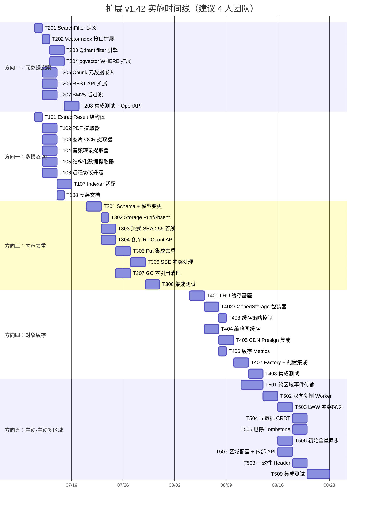

Now I have a thorough understanding of the complete codebase. Here is my Tech Lead analysis.

---

# Tech Lead 分析报告：v1.42 高价值扩展方向

## 1. 任务分解（Task Breakdown）

每个方向拆解为 2-4 小时粒度的可执行任务，以 DAG 表达依赖关系。

### 方向二：元数据锚定语义搜索（建议先行）

| 任务 ID | 标题 | 所属方向 | 涉及文件 | 前置依赖 | 预估工时 | 验收标准 |
|---------|------|---------|---------|---------|---------|---------|
| TASK-201 | 定义 `SearchFilter` 结构体 | 方向二 | `internal/ai/search.go` | — | 2h | `SearchFilter` 结构体定义完成，含 Tags/ContentType/SizeRange/CreatedRange/StorageClass，向后兼容 |
| TASK-202 | 扩展 `VectorIndex.SearchVectors` 接口签名 | 方向二 | `internal/ai/vectorindex.go` | TASK-201 | 2h | 接口增加 `filter *SearchFilter` 参数，所有实现编译通过 |
| TASK-203 | Qdrant filter 引擎支持额外元数据 | 方向二 | `internal/ai/qdrant.go` | TASK-202 | 4h | `scopeFilter` 可处理 tags 精确匹配、日期范围(→unix ts range)、存储类、大小范围；`SearchVectors` 新签名的集成测试通过 |
| TASK-204 | pgvector WHERE 子句扩展 | 方向二 | `internal/ai/pgvector.go` | TASK-202 | 3h | SQL WHERE 子句按 filter 字段动态拼接 tag 条件、date range、size range；所有条件为 AND 语义 |
| TASK-205 | Chunk 写入时嵌入元数据字段 | 方向二 | `internal/ai/indexer.go`, `internal/ai/extractor.go`, `internal/repository/repository.go` | TASK-201 | 4h | indexer 在 `buildChunks` 时将 object 的 tags/content_type/storage_class/created_at 写入 chunk payload/列；Qdrant payload 和 pgvector 列新增完成 |
| TASK-206 | 扩展 REST API `/v1/search` handler | 方向二 | `internal/api/rest/search.go` | TASK-201 | 3h | `searchReq` 增加 filter 字段 (JSON)；路由层解析并传递给 `ai.Request`；向后兼容（缺省 filter 不改变行为） |
| TASK-207 | BM25/In-memory 后过滤支持 | 方向二 | `internal/ai/bm25.go` | TASK-201 | 3h | BM25 和 repoVectorIndex 在搜索结果上应用后过滤；处理空 filter（无操作）|
| TASK-208 | 集成测试 + OpenAPI 更新 | 方向二 | `internal/api/rest/search_test.go`, `openapi.json` | TASK-203,204,206 | 4h | 测试：tag 过滤、日期范围、组合条件、空 filter、无匹配、hybrid 模式 + filter；OpenAPI spec 更新 filter schema |

### 方向一：多模态 AI 管线（并行于方向二部分任务）

| 任务 ID | 标题 | 所属方向 | 涉及文件 | 前置依赖 | 预估工时 | 验收标准 |
|---------|------|---------|---------|---------|---------|---------|
| TASK-101 | 接口扩展：`ExtractResult` 结构体 | 方向一 | `internal/ai/extractor.go` | — | 2h | 新增 `ExtractResult` struct（Text/Metadata/Segments/Structured），`Extract` 返回 `(ExtractResult, error)`；现有纯文本提取器兼容（返回 `{Text: body}`）|
| TASK-102 | PDF 提取器实现 | 方向一 | `internal/ai/extractor_pdf.go` (新建), `go.mod` | TASK-101 | 4h | 支持 PDF 文字层提取；加密 PDF 返回 `ErrUnsupported`；超大 PDF(>50MB)截取前 50MB；返回 page_count 元数据 |
| TASK-103 | 图片 OCR 提取器 | 方向一 | `internal/ai/extractor_image.go` (新建), `go.mod` | TASK-101 | 4h | 支持 JPEG/PNG/GIF；调用 Tesseract 或 golang  OCR 库；返回语言元数据；`thumbnail.go` 复用解码逻辑 |
| TASK-104 | 音频转文字提取器 | 方向一 | `internal/ai/extractor_audio.go` (新建) | TASK-101 | 4h | 支持 mp3/wav/flac/opus；通过 whisper.cpp 或远程 Whisper API；返回分段信息(Segments with Speaker labels) |
| TASK-105 | 结构化数据提取器（XLSX/JSON/YAML） | 方向一 | `internal/ai/extractor_structured.go` (新建) | TASK-101 | 4h | XLSX 解析为行+列的 Structured 数据；JSON/YAML 保留嵌套结构；CSV 改进为行列保留 |
| TASK-106 | 远程提取器协议升级 | 方向一 | `internal/ai/extractor_remote.go` | TASK-101 | 3h | HTTP 协议扩展为 `POST → {text, metadata, segments, structured}`；兼容旧响应（缺省字段该字段为 null）|
| TASK-107 | Indexer 适配新 ExtractResult | 方向一 | `internal/ai/indexer.go`, `internal/ai/extractor.go` | TASK-101~106 | 4h | indexer 处理 ExtractResult.Segments（分段索引）、ExtractResult.Metadata（写入 object metadata tag）、ExtractResult.Structured（结构化搜索准备）|
| TASK-108 | 安装文档 + 提取器能力矩阵 | 方向一 | `docs/multimodal-extraction.md` (新建) | TASK-102~106 | 2h | 文档覆盖：安装 Tesseract/whisper 等外部依赖；能力矩阵列出每种 contentType 对应的提取器 |

### 方向三：内容寻址存储与块级去重

| 任务 ID | 标题 | 所属方向 | 涉及文件 | 前置依赖 | 预估工时 | 验收标准 |
|---------|------|---------|---------|---------|---------|---------|
| TASK-301 | Schema 变更：`content_hash` 和 `ref_count` | 方向三 | `migrations/{sqlite,postgres}/...`, `internal/repository/repository.go` | — | 4h | `objects` 表新增 `content_hash TEXT, ref_count INT DEFAULT 1`；迁移双文件；`Object` 模型新增对应字段；`content_hash` 唯一索引（允许 NULL）|
| TASK-302 | `Storage` 接口：`PutIfAbsent` | 方向三 | `internal/storage/storage.go` | TASK-301 | 2h | 新增 `PutIfAbsent(ctx, contentHash string, r io.Reader, size int64, opts PutOptions) (ObjectInfo, created bool, error)`；Local/S3/OSS/COS 实现 |
| TASK-303 | 流式 SHA-256 + 临时文件管线 | 方向三 | `internal/service/file_crud.go` | TASK-301,302 | 4h | `putWithDedup` 使用 `io.TeeReader` 写临时文件同时计算 hash；完成后校验并决定复用或持久化 |
| TASK-304 | 仓库层引用计数 API | 方向三 | `internal/repository/repository.go`, `internal/repository/sql_objects.go` | TASK-301 | 3h | `GetObjectByContentHash`, `IncrementRefCount`, `DecrementRefCount`, `ListObjectsByContentHash`；`DecrementRefCount` 返回是否为 0 |
| TASK-305 | FileService.Put 集成去重 | 方向三 | `internal/service/file_crud.go` | TASK-303,304 | 4h | `Put` 添加去重路径（`dedup` 配置项控制）；versioned bucket 禁止去重（版本独立 blob）；并发上传同内容使用 `INSERT ... ON CONFLICT` 防竞态 |
| TASK-306 | SSE 与去重冲突处理 | 方向三 | `internal/storage/sse.go`, `internal/service/file_crud.go` | TASK-305 | 4h | 未加密 bucket 启用去重；加密 bucket 明确记录"去重已禁用"；SSE key 存储标记 `no_dedup:true`；README 文档警告 |
| TASK-307 | GC：零引用 blob 清理 | 方向三 | `internal/reconcile/job.go` (扩展) | TASK-304 | 3h | Reconcile worker 定期扫描 `ref_count=0` 的 content_hash；删除 storage blob + 清理 content_hash 记录；幂等设计 |
| TASK-308 | 去重集成测试 + 基准测试 | 方向三 | `internal/service/file_crud_test.go`, `internal/storage/contract_test.go` | TASK-305,306,307 | 4h | 测试：重复上传→单 blob、versioning 禁用去重、大文件流式 hash、并发同内容、加密 bucket 跳过去重、GC 清理 |

### 方向四：对象内容缓存层次

| 任务 ID | 标题 | 所属方向 | 涉及文件 | 前置依赖 | 预估工时 | 验收标准 |
|---------|------|---------|---------|---------|---------|---------|
| TASK-401 | `CacheConfig` 和内存 LRU 缓存 | 方向四 | `internal/storage/cache.go`, `internal/storage/cache_lru.go` (新建) | — | 4h | 通用 LRU 缓存（`Get/Set/Delete/Clear`），TTL 支持，大小上限，`maxBytes` 驱逐 |
| TASK-402 | `CachedStorage` 包装器 | 方向四 | `internal/storage/cache.go` | TASK-401 | 4h | 实现 `Storage` 接口的 cache-aside 包装；`Get` 先查缓存→未命中→读后端→写入缓存；`Put/Delete` 使缓存失效 |
| TASK-403 | 缓存范围控制：大小/类型策略 | 方向四 | `internal/storage/cache.go` | TASK-402 | 2h | 配置 `MaxCachableSize`（默认 1MB）、`ContentTypes` 白名单、`CacheTTL` 按 content-type 区分 |
| TASK-404 | 缩略图缓存层 | 方向四 | `internal/thumbnail/cache.go` (新建) | TASK-401 | 3h | 以 `{storageKey}_{w}_{h}` 为 key 缓存已生成的缩略图 bytes；LRU + TTL；`thumbnail/thumbnail.go` 中集成 |
| TASK-405 | CDN Presign 集成 | 方向四 | `internal/service/file_crud.go`, `internal/storage/presign.go` | TASK-402 | 3h | `PresignGet` 可选返回 CDN URL（如 `https://cdn.example.com/{key}?signature=...`）；配置 `CDN_DOMAIN`；Cache-Control 头设置 |
| TASK-406 | 缓存 Metrics + OTel | 方向四 | `internal/telemetry/metrics.go`, `internal/storage/cache.go` | TASK-402 | 2h | 新增 `cache_hit_total{backend, tier}`, `cache_miss_total{backend}`, `cache_size_bytes`, `cache_eviction_total` 指标 |
| TASK-407 | Factory + 配置集成 | 方向四 | `internal/storage/factory.go`, `config.go`, `cmd/server/main.go` | TASK-402~406 | 3h | `STORAGE_CACHE_SIZE`, `STORAGE_CACHE_TTL`, `STORAGE_CACHE_MAX_OBJECT_SIZE` 配置项；`buildStorageFrom` 可选包装 `CachedStorage` |
| TASK-408 | 集成测试：缓存命中/失效/一致性 | 方向四 | `internal/storage/cache_test.go`, `internal/storage/contract_test.go` | TASK-407 | 4h | 测试：Get 命中缓存、Put 使失效、Delete 使失效、Range 请求缓存子集、大文件跳过缓存、TTL 过期、并发安全 |

### 方向五：主动-主动多区域复制

| 任务 ID | 标题 | 所属方向 | 涉及文件 | 前置依赖 | 预估工时 | 验收标准 |
|---------|------|---------|---------|---------|---------|---------|
| TASK-501 | 跨区域事件传输层 | 方向五 | `internal/events/region_transport.go` (新建) | — | 6h | 基于 HTTP 的跨区域事件转发（区域注册、序列化 event、HTTP POST 到对端 `/internal/events/ingest`）；失败重试 + 背压 |
| TASK-502 | 双向复制 Worker | 方向五 | `internal/replication/replication.go` | TASK-501 | 4h | `Worker` 支持双向（`primary↔replica`）；接受反向事件流；可配置区域对 |
| TASK-503 | LWW 冲突解决 | 方向五 | `internal/replication/conflict.go` (新建) | TASK-502 | 4h | 基于 `UpdatedAt` 的 LWW；拒绝 `updated_at < local_updated_at` 的复制事件；audit_log 记录被覆盖的写入 |
| TASK-504 | 元数据 CRDT 合并 | 方向五 | `internal/replication/conflict.go` | TASK-503 | 4h | Tags 使用 map merge（`union of maps`）；ACL 使用 LWW；metadata 使用 LWW；`CRDTMerge` 函数单元测试 |
| TASK-505 | 删除冲突 Tombstone | 方向五 | `internal/replication/conflict.go`, `internal/repository/sql_objects.go` | TASK-503 | 3h | 删除先创建 tombstone（标记 + grace period 15min）；Tombstone 在 LWW 中权重最高；grace 过后软删除 |
| TASK-506 | 初始全量同步 | 方向五 | `internal/replication/full_sync.go` (新建) | TASK-502 | 4h | `ReindexStale` 风格的全量对象复制；扫描源区域所有对象→对于目标区域缺失的 blobs 执行复制；可恢复（断点续传标记）|
| TASK-507 | 区域感知配置 + API | 方向五 | `internal/config.go`, `internal/api/rest/router.go` | TASK-501~506 | 3h | 配置 `REGION_ID`, `REGION_PEERS`（区域端点列表）；`/v1/regions` 列举区域状态；`/internal/events/ingest` 接收远程事件 |
| TASK-508 | 一致性级别 Header 支持 | 方向五 | `internal/middleware/consistency.go` (新建) | TASK-507 | 3h | `x-aero-consistency-level: strong|eventual` header；`strong` 模式等待跨区域确认（阻塞 1s 超时降级）；`eventual` 直接读本地 |
| TASK-509 | 集成测试 + 网络故障模拟 | 方向五 | `internal/replication/replication_test.go` | TASK-503~508 | 6h | 测试：双向复制、LWW 后写入覆盖、CRDT tag 合并、tombstone 删除冲突、网络分区恢复合并、全量同步断点续传 |

---

## 2. 执行顺序（Dependency Graph）

```mermaid
graph TD
    %% Direction 2: Metadata Search (Priority 1)
    subgraph D2["方向二：元数据锚定搜索 (启动第 1 天)"]
        T201[TASK-201: SearchFilter 结构体] --> T202[TASK-202: VectorIndex 接口扩展]
        T201 --> T205[TASK-205: Chunk 元数据嵌入]
        T201 --> T206[TASK-206: REST API 扩展]
        T202 --> T203[TASK-203: Qdrant filter 引擎]
        T202 --> T204[TASK-204: pgvector WHERE 扩展]
        T201 --> T207[TASK-207: BM25 后过滤]
        T203 & T204 & T206 --> T208[TASK-208: 集成测试 + OpenAPI]
    end

    %% Direction 1: Multimodal (Parallel with D2)
    subgraph D1["方向一：多模态 AI 管线 (第 1-2 周)"]
        T101[TASK-101: ExtractResult 结构体] --> T102[TASK-102: PDF 提取器]
        T101 --> T103[TASK-103: 图片 OCR]
        T101 --> T104[TASK-104: 音频转录]
        T101 --> T105[TASK-105: 结构化数据]
        T101 --> T106[TASK-106: 远程协议升级]
        T102 & T103 & T104 & T105 & T106 --> T107[TASK-107: Indexer 适配]
        T102 & T103 & T104 & T105 --> T108[TASK-108: 安装文档]
    end

    %% Direction 3: Dedup (Starts after D2 core)
    subgraph D3["方向三：内容去重 (第 3-5 周)"]
        T301[TASK-301: Schema content_hash/ref_count] --> T302[TASK-302: PutIfAbsent]
        T301 --> T304[TASK-304: RefCount API]
        T302 & T303 --> T305[TASK-305: Put 集成去重]
        T301 --> T303[TASK-303: 流式 SHA-256]
        T305 --> T306[TASK-306: SSE 冲突处理]
        T304 --> T307[TASK-307: GC 清理]
        T305 & T306 & T307 --> T308[TASK-308: 集成测试]
    end

    %% Direction 4: Cache (Can start independently)
    subgraph D4["方向四：对象缓存 (第 4-6 周)"]
        T401[TASK-401: LRU 缓存基座] --> T402[TASK-402: CachedStorage]
        T402 --> T403[TASK-403: 缓存策略控制]
        T401 --> T404[TASK-404: 缩略图缓存]
        T402 --> T405[TASK-405: CDN Presign]
        T402 --> T406[TASK-406: 缓存 Metrics]
        T403 & T404 & T405 & T406 --> T407[TASK-407: Factory 集成]
        T407 --> T408[TASK-408: 集成测试]
    end

    %% Direction 5: Active-Active (Depends on core replication)
    subgraph D5["方向五：主动-主动多区域 (第 6-12 周)"]
        T501[TASK-501: 跨区域事件传输] --> T502[TASK-502: 双向复制]
        T502 --> T503[TASK-503: LWW 冲突解决]
        T503 --> T504[TASK-504: 元数据 CRDT]
        T503 --> T505[TASK-505: 删除 Tombstone]
        T502 --> T506[TASK-506: 初始全量同步]
        T501 & T502 --> T507[TASK-507: 区域配置 + API]
        T507 --> T508[TASK-508: 一致性 Header]
        T503 & T504 & T505 & T508 --> T509[TASK-509: 集成测试]
    end

    %% Cross-direction dependencies
    T205 -.->|chunk metadata 复用| T107
    T402 -.->|Cache wrap| T302
    T407 -.->|配置复用| T507
    T305 -.->|去重影响 replication 数据量| T502
```

### 并行执行组

| 组 | 任务 | 可并行理由 |
|----|------|-----------|
| **组 A** | T201, T101, T301 | 三个方向的接口/模型变更互不依赖 |
| **组 B1** | T202+T203+T204, T102, T103 | 搜索 filter 管线各后端实现独立；提取器实现彼此独立 |
| **组 B2** | T302, T303, T304 | 去重三个子任务：接口、hash、仓库 API 可同步推进 |
| **组 C** | T401, T501 | 缓存和区域复制的基座组件独立 |
| **组 D** | T403, T404, T405, T406 | 缓存子模块全部依赖 T402 但彼此独立 |

---

## 3. 技术风险（Technical Risks）

### 3.1 高优先级风险

| # | 风险 | 方向 | 概率/影响 | 缓解策略 |
|---|------|------|----------|---------|
| **R1** | **Qdrant filter 语法限制：** 多条件组合（tag=prod AND size>10MB AND created_at>2026-01-01）的 payload 结构可能超出 Qdrant filter 嵌套深度限制 | D2 | 中/高 | 验证阶段用 httptest 构建最大复杂度的 filter JSON；备选方案：后过滤无法下推的复杂条件 |
| **R2** | **pgvector 动态 WHERE 注入风险：** filter 条件拼接 SQL 时，表名列名从配置来，但值通过 `$N` 绑定。Tag key 来自用户端，若直接拼入 SQL 列名有注入风险 | D2 | 低/高 | Tag key 通过白名单校验（`^[a-zA-Z0-9_-]+$`）后再拼入；非白名单的 tag 走后过滤 |
| **R3** | **PDF 提取库选择风险：** Go 生态中无成熟、无 CGO 的 PDF 提取库（`pdfcpu` 不支持文本提取，`unidoc` 需商业授权） | D1 | 高/中 | 方案 A：通过 `RemoteExtractor` 代理到 Python Tika；方案 B：使用 `go-textractor/pdftext` + 纯 Go 的 `pdf` 解析器（有限支持）；建议初始使用远程提取器 |
| **R4** | **OCR 依赖：** 纯 Go OCR 库质量差（`gosseract` 依赖 CGO + Tesseract） | D1 | 中/中 | 推荐 `RemoteExtractor` + Tesseract 或 Azure Document Intelligence 服务；内建 OCR 作为后续优化 |
| **R5** | **去重 + SSE 本质冲突：** AES-GCM 确定性输出  ≠ 相同输入 | D3 | 高/高 | 已识别：第一次实现仅对非 SSE bucket 启用去重；加密 bucket 始终旁路（配置 `no_dedup` 标记）；后续支持 AES-SIV 确定性加密 |
| **R6** | **大文件流式哈希与临时文件 I/O 瓶颈：** 5GB 文件上传需要写入临时文件再做 hash 决定，浪费 I/O | D3 | 中/中 | 小文件（<64MB）全内存；大文件可选仅头部+尾部+随机抽样哈希（概率去重）；或使用 Merkle tree 分块哈希 |
| **R7** | **并发同内容上传竞态：** 两个上传同时检测到 content_hash 不存，都写入同一个 storage key | D3 | 中/高 | `content_hash` 列加 UNIQUE 索引 + `INSERT ... ON CONFLICT DO NOTHING` 在 repository 层做冲突检测；数据库外无法保证原子性 |
| **R8** | **缓存 + SSE 安全：** 解密后明文若被缓存到非加密内存/磁盘，造成安全漏洞 | D4 | 中/高 | `CachedStorage` 检查对象 SSE 标记；加密对象默认不缓存；增加 `CACHE_ENCRYPTED` 配置（默认 false） |
| **R9** | **跨区域网络延迟 + 带宽成本：** 跨区域 blob 复制导致高额出站流量 | D5 | 高/高 | 可配置复制带宽上限（`REGION_REPLICATION_BANDWIDTH`）；大文件跳过复制（`REPLICATION_MAX_SIZE`）；使用区域级 CDN 减少回源读 |
| **R10** | **区域故障数据丢失窗口（RPO）：** 跨区域事件传播延迟 + 复制队列积压导致数据丢失 | D5 | 中/高 | 每个复制事件有持久化作业+重试；RPO 由 `REPLICATION_POLL_INTERVAL` 和网络延迟决定；运维监控 `replication_lag_seconds` 指标 |

### 3.2 性能瓶颈与优化策略

| 瓶颈 | 方向 | 优化策略 |
|------|------|---------|
| Qdrant 多条件 filter 查询性能 | D2 | `created_at_unix` 和 `size_bytes` 列在 Qdrant 中建立 range index (`indexed` payload schema)；Tag 使用 keyword index |
| pgvector 复合过滤 + ANN 查询 | D2 | 复合索引 `(tenant_id, bucket, content_type, embedding_vec)` 配合 HNSW；先用 filter 全表扫描缩小候选集再做 ANN（当 filter 选择度高时） |
| 多模态提取并发性 | D1 | 每个提取器独立 goroutine + semaphore 限制并发数（`AI_EXTRACTOR_CONCURRENCY`，默认 4）；大文件提取设为独立 JobPool 任务 |
| 去重临时候盘 I/O | D3 | 临时文件使用 tmpfs（/dev/shm）当文件小于内存阈值；超过阈值使用普通磁盘 + 写入完成后校验 |
| 热点缓存回源压力 | D4 | 缓存失效后使用 "stale-while-revalidate" 模式：先返回过期缓存，异步刷新新版 |
| 跨区域复制带宽 | D5 | 差分复制（仅复制变更块而非全对象）；压缩传输（启用 gzip）；配置 `REPLICATION_COMPRESSION` |

---

## 4. 资源评估

### 4.1 人员技能需求

| 角色 | 人数 | 所需技能 | 负责方向 |
|------|------|---------|---------|
| **Sr. Backend (Go)** | 2 | Go 1.25、`database/sql`、`net/http`、并发模式 | D2 核心 + D3 核心 + D4 缓存 |
| **AI/ML Engineer** | 1 | NLP、OCR、ASR、LLM 集成、Tika/Whisper | D1 多模态提取器 + 基础设施 |
| **Storage Engineer** | 1 | SSE 加密、S3 API、分布式存储、PG | D3 去重 + D5 复制（初期）|
| **Sr. Infrastructure** | 1 | 网络拓扑、Kubernetes、Helm、OTel | D5 跨区域网络 + D4 CDN + CI/CD |
| **QA Engineer** | 1 | Go 测试、集成测试、benchmark | 所有方向的测试自动化 |

**总团队规模：** 4-5 人（AI/存储工程师可兼任；QA 可部分由团队自测）

### 4.2 关键里程碑

| 里程碑 | 时间 | 交付物 | 验证方法 |
|--------|------|--------|---------|
| **M1: 搜索可过滤** | 第 2 周结束 | TASK-201~208 全部完成 | POST `/v1/search` 带 filter 返回正确过滤结果 |
| **M2: 非文本文件可索引** | 第 4 周结束 | TASK-101~108 全部完成 | 上传 PDF/图片/音频后可通过语义搜索召回内容 |
| **M3: 存储去重** | 第 6 周结束 | TASK-301~308 全部完成 | 同内容上传 N 次 → 存储仅 1 份 | 
| **M4: 对象缓存加速** | 第 7 周结束 | TASK-401~408 全部完成 | 缓存命中时 GET 延迟 < 5ms；缓存 miss 走原路径 |
| **M5: 主动-主动预览** | 第 10 周结束 | TASK-501~507 核心完成 | 两区域可同时写入，数据最终一致 |
| **M6: 全球就绪** | 第 12 周结束 | TASK-501~509 全部完成 | 模拟区域故障 → 自动切换 → 恢复后数据不丢失 |

### 4.3 阻塞点（Blockers）

| # | 阻塞点 | 影响方向 | 解决策略 | 应急方案 |
|---|--------|---------|---------|---------|
| **B1** | `go.mod` 新增 PDF/OCR 依赖的 CGO 要求 | D1 | 所有 CGO 依赖通过 `RemoteExtractor` 外部代理；Go 代码中仅使用纯 Go 库 | 无 CGO → RemoteExtractor 是唯一路径 |
| **B2** | pgvector `vector` 列与 SQLite 迁移冲突 | D2 | `migrations/postgres/` 专有迁移（不共享 `migrations/{sqlite,postgres}/`）| 使用 `ai_lexical_backend=pgfts` 时手动管理 |
| **B3** | AES-GCM 加密与非加密去重的架构冲突 | D3 | 第一版仅支持非 SSE 对象的去重；加密对象 clear 标记 | 文档明确约束 |
| **B4** | 跨区域 Postgres 复制延迟 | D5 | 使用逻辑复制（`pglogical`/Debezium）而非物理复制 | 初始版使用 HTTP 事件转发 + 最终一致性 |
| **B5** | CDN 与预签名 URL 的安全整合 | D4 | CDN URL 使用短期签名（1min TTL）+ IP 白名单 | 不使用 CDN 时保持现有 presign 逻辑 |

---

## 5. 质量保证

### 5.1 单元测试覆盖要求

| 包/文件 | 最低覆盖率 | 关键测试点 |
|---------|-----------|-----------|
| `internal/ai/search.go` | 80% | filter 组合验证、空 filter 向后兼容、无效 filter 错误、hybrid+filter RRF 融合 |
| `internal/ai/qdrant.go` | 85% | `scopeFilter` 多条件 payload 构建、filter JSON 序列化验证、httptest 模拟 Qdrant 响应 |
| `internal/ai/pgvector.go` | 85% | SQL WHERE 子句动态拼接（tag 安全）、`vectorLiteral` 格式化、多 filter 条件组合 |
| `internal/ai/extractor_*.go` | 80% | 每种提取器：正常提取、超大文件截取、ErrUnsupported 边界、结构化输出格式 |
| `internal/service/file_crud.go` | 75% | `putWithDedup`：重复内容→单 blob、版本化 bucket→不重复、大文件流式 hash |
| `internal/storage/cache.go` | 90% | 缓存命中/未命中、put 失效率、并发安全、TTL 过期、大文件旁路、Range 缓存 |
| `internal/replication/conflict.go` | 90% | LWW 时间序、CRDT map merge、tombstone 优先级、并发冲突 |
| `internal/replication/full_sync.go` | 70% | 断点续传、重复对象跳过、可恢复性 |

### 5.2 集成测试策略

| 测试套件 | 启动方式 | 覆盖场景 |
|---------|---------|---------|
| **`make test`** (SQLite + local FS) | 零依赖 CI | 所有 D2 filter 组合、D3 去重基本流程、D4 缓存基础、D1 文本提取器 |
| **`make test-integration`** (Postgres + pgvector) | Docker Compose | D2 pgvector filter 子句、D3 content_hash UNIQUE 约束、D4 缓存持久化 |
| **`make test-integration-qdrant`** (+ Qdrant) | Docker Compose | D2 Qdrant filter payload 所有组合验证、D3 chunks 写入去重 |
| **`make test-multimodal`** (需外部服务) | 单独脚本 | D1 PDF/OCR/音频提取端到端（Mock RemoteExtractor + 真实文件） |
| **`make test-dual-region`** | 两台 Docker 实例 | D5 双向复制、LWW 冲突、tombstone 删除、区域故障恢复 |

### 5.3 代码审查要点

| 审查维度 | 重点检查 |
|---------|---------|
| **安全** | SQL 注入（TASK-204 动态 WHERE）、Qdrant filter 值转义、缓存中 SSE 明文不泄露、presign URL 签名验证 |
| **向后兼容** | SearchFilter 零值 = 无过滤、ExtractResult 旧 API 调用者不受影响、新配置项默认关闭 |
| **并行安全** | 去重并发同内容上传（`content_hash` UNIQUE + retry）、缓存 `sync.RWMutex` 粒度和驱逐、事件订阅 channel 容量 |
| **幂等性** | 去重上传 retry-safe、复制任务 retry-safe（覆盖同 key）、GC 清理幂等 |
| **可观测性** | 每个新路径增加 OTel 指标（`cache_hit_total`, `dedup_saved_bytes`, `multimodal_extract_duration_seconds`）、结构化日志 |

### 5.4 性能测试需求

| 场景 | 工具 | 目标 | 阈值 |
|------|------|------|------|
| 10K chunks + 多条件 filter 搜索 | `go test -bench` | 过滤查询 < 50ms (Qdrant) / < 200ms (pgvector) | p95 > 500ms → 告警 |
| 100MB 文件去重（SHA-256 + tempfile） | 自定义 benchmark | 额外耗时 < 5% 上传总时间 | > 15% 额外开销 → 优化临时文件路径 |
| 缓存读吞吐 | `wrk` / `hey` | 单节点 10K QPS 缓存命中 | > 1K QPS → 瓶颈定位 |
| 跨区域复制吞吐 | iperf + 端到端计时 | 100MB/s 复制带宽利用 | < 10MB/s → 压缩/差分优化 |

---

## 6. 实施计划

### 甘特图

### 阶段实施明细

#### 阶段 1：基础设施与核心能力（第 1-2 周 · 7月14日-7月25日）

**目标：** 交付可过滤的语义搜索 + 基本的非文本提取能力

| 日 | 活动 | 负责人 |
|---|------|--------|
| **Day 1-2** | Kickoff + 代码基线理解 + T201/D1_T101（接口层变更） | 全体 |
| **Day 3-5** | T202+T205（搜索管线）+ D1_T102~T105（提取器并行实现） | Go Eng ×2 + AI Eng |
| **Day 6-8** | T203+T204+T206+T207（各后端 filter 实现 + REST API）+ D1_T106 | Go Eng ×2 |
| **Day 9-10** | T208（搜索集成测试 + OpenAPI）+ D1_T107（Indexer 适配） | QA + Go Eng |

**交付物：** 可运行的 filter search demo + PDF/图片/音频提取（远程）

#### 阶段 2：存储优化（第 3-5 周 · 7月28日-8月8日）

**目标：** 内容去重 + 对象缓存层次

| 日 | 活动 | 负责人 |
|---|------|--------|
| **Day 11-12** | T301（schema 迁移）+ T401（缓存基座）— 并行 | Go Eng ×2 |
| **Day 13-15** | T302~T304（去重三叉戟）+ T402（CachedStorage）| Storage Eng + Go Eng |
| **Day 16-18** | T305（Put 集成）+ T403~T406（缓存子模块）| 两人并行 |
| **Day 19-20** | T306（SSE 冲突）+ T407（Factory 集成）+ T404（缩略图缓存）| 两人并行 |
| **Day 21-22** | T307（GC）+ T408（缓存集成测试）| Go Eng + QA |
| **Day 23** | T308（去重集成测试）+ Benchmark 反馈 | QA |

**交付物：** 去重+缓存可用的 preview 版本

#### 阶段 3：全球分布（第 6-10 周 · 8月11日-9月12日）

**目标：** 主动-主动多区域复制 MVP

| 日 | 活动 | 负责人 |
|---|------|--------|
| **Day 24-26** | T501（跨区域事件传输）+ T507（区域配置）| Sr. Infra + Go Eng |
| **Day 27-29** | T502（双向复制）+ T506（初始全量同步）| Storage Eng + Go Eng |
| **Day 30-32** | T503（LWW）+ T505（Tombstone）+ T504（CRDT）并行 | Go Eng ×2 |
| **Day 33-34** | T508（一致性 Header）| Go Eng |
| **Day 35-37** | T509（集成测试 - 网络故障模拟 + 双向验证）| QA + Go Eng |
| **Day 38** | 回滚/修复 + 文档更新 | 全体 |

#### 阶段 4：发布准备（第 11-12 周 · 9月15日-9月26日）

**目标：** 全量集成测试 + 性能调优 + 文档 + Go Live

| 日 | 活动 |
|---|------|
| **Day 39-41** | 全量 `make check` + `make test-integration` 全绿；多区域 e2e 验证 |
| **Day 42-43** | 性能基准 vs v1.41（p50/p95/p99 search latency, dedup savings, cache hit ratio）|
| **Day 44-45** | `openapi.json` 全量更新；SDK (Go/Python/JS) 生成并验证新 API |
| **Day 46-47** | Helm chart 更新（新配置项）+ Prometheus 告警规则 + Grafana 面板 |
| **Day 48** | 变更日志 `CHANGELOG.md` + 发布说明 `RELEASE-v1.42.md` |
| **Day 49** | 内部 Demo + 评审 |
| **Day 50** | Go Live |

### 风险驱动的时间缓冲

| 风险 | 缓冲天数 | 用途 |
|------|---------|------|
| R3 (PDF 提取依赖) | +2 天 | 切换到 RemoteExtractor + Tika |
| R5 (SSE 去重冲突) | +1 天 | 文档 + 配置项调整 |
| R9 (跨区域网络) | +3 天 | 网络调优 + 压缩/差分实现 |
| 综合缓冲 | +5 天 (总日历约 15%) | 修复未预见的集成问题 |

---

## 总结与推荐

**最高 ROI 投入顺序：**

1. **立即启动（第 1 天）：** TASK-201（SearchFilter）+ TASK-101（ExtractResult）— 接口扩展无风险，为后续打下基础
2. **第 1-2 周并行组：** 方向二全链路（T202→T208）+ 方向一提取器（T102→T107）—— 两者结合实现"搜索任何文件类型并按元数据筛选"的端到端体验
3. **第 3-5 周：** 方向三（去重）—— 存储成本节省直接转化为产品定价优势
4. **第 4-7 周：** 方向四（缓存）—— 有去重后的读路径需要缓存加速
5. **第 6-10 周：** 方向五（多区域）—— 需要前面所有基础设施就绪后的最后一次架构级提升

**关键决策点：**

- PDF/OCR 提取器的 CGO 依赖 → **决策：统一走 RemoteExtractor 代理**，避免 CGO 污染 CI gate
- 去重 vs SSE 的矛盾 → **决策：非 SSE bucket 第一版去重**，加密安全改期
- pgvector filter 优先级 vs Qdrant → **决策：Qdrant 优先实现**（filter 原生支持），pgvector 为次要目标
