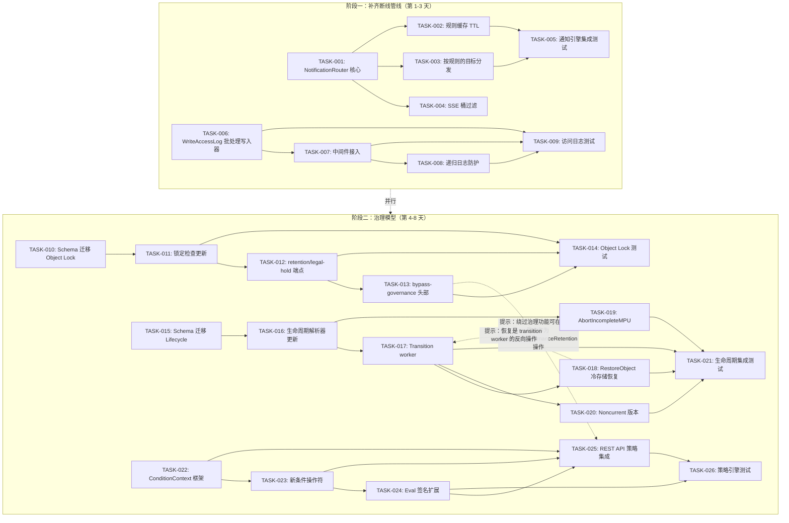

现在我对代码库有了全面的了解。以下是全面的技术负责人分析。

---

# 技术负责人分析：五个高价值扩展方向

## 1. 任务分解

每个方向都拆分为 2-4 小时可完成的任务。迁移文件（方向 #3 和 #4 涉及 schema 变更）与变更本身放在一起。所有任务包含前置依赖关系和验收标准。

### 方向一：桶级事件通知引擎

| 任务 ID | 标题 | 涉及文件 | 前置依赖 | 工时 | 验收标准 |
|---------|------|----------|---------|------|---------|
| TASK-001 | `NotificationRouter` — 规则加载与匹配核心 | `internal/events/router.go`（新建），`internal/events/bus.go`（修改） | 无 | 4h | 从 repository 加载规则、按 `event.Type` 和 `S3Key.Filter`（前缀/后缀）匹配、无匹配时优雅跳过；`noop` 分支覆盖率达 100% |
| TASK-002 | 规则缓存带 TTL 以避免每个事件都查 DB | `internal/events/router.go`（添加） | TASK-001 | 2h | `GetRules(tenant, bucket)` 缓存结果 30 秒；每次 `SetBucketNotifications` 后缓存失效；缓存未命中时回退到 DB；并发安全 |
| TASK-003 | 按规则的目标分发（Webhook + Job Queue） | `internal/events/router.go`（分发循环），`internal/events/webhook.go`（若有重用） | TASK-001 | 3h | 匹配到的每条规则将事件发送到其 `QueueARN`（当 URL 时视为 webhook）；失败的调用进入 `webhook_failures`；日志记录 `event_routed_total{matched,unmatched}` 指标 |
| TASK-004 | SSE 流中的桶过滤 | `internal/api/rest/sse.go`（修改 `liveStream` 和 `replayMissed`） | TASK-001 | 2h | SSE 客户端可传递 `?bucket=` 参数；流只发送匹配 bucket 的事件；无参数时保持不变（所有事件） |
| TASK-005 | 集成测试 — 通知管线 | `internal/events/router_test.go`（新建），`internal/integration/` | TASK-001–TASK-004 | 3h | `putBucketNotifications` → 触发匹配事件 → 目标 webhook 收到；触发不匹配事件 → webhook 未收到；规则被删除 → 事件不再发送；缓存过期按预期工作 |

**小计：14 小时（约 2 天）**

### 方向二：服务端访问日志

| 任务 ID | 标题 | 涉及文件 | 前置依赖 | 工时 | 验收标准 |
|---------|------|----------|---------|------|---------|
| TASK-006 | `WriteAccessLog` 批处理写入器 | `internal/repository/sql_buckets.go`（替换 `WriteAccessLog` 实现），`internal/repository/repository.go`（若需要则修改接口签名） | 无 | 4h | 实现缓冲写入（阈值：1,000 条或 5 秒，以先到者为准），将格式化日志行写入目标桶；`WriteAccessLog` 在缓冲区满之前返回 `nil`，且不阻塞调用者 |
| TASK-007 | 将 `AccessLog` 中间件接入数据库写入 | `internal/middleware/middleware.go`（将 `repo.WriteAccessLog` 调用添加到 `AccessLog` 处理程序） | TASK-006 | 2h | 每次 HTTP 请求后，中间件调用 `WriteAccessLog`，传入 method、path、status、latency、tenant；现有的 `slog.Info` 调用保持不变 |
| TASK-008 | 递归日志防护（阻止写日志到自身） | `internal/middleware/middleware.go`（上下文标记），`internal/repository/sql_buckets.go`（防护检查） | TASK-006–TASK-007 | 2h | 写日志对象到目标桶时，该写操作不触发另一条日志行；通过 `context.WithValue` 标记位实现 |
| TASK-009 | 访问日志集成测试 | `internal/middleware/middleware_test.go`（已有测试扩展），`internal/repository/sql_buckets_test.go`（新建） | TASK-006–TASK-008 | 2h | 配置 logging 后 → 发出请求 → 目标桶包含格式正确的日志对象；配置与测试 `TestAccessLog_WriteToRepo` 一致 |

**小计：10 小时（约 1.5 天）**

### 方向三：Object Lock 完整治理模型

| 任务 ID | 标题 | 涉及文件 | 前置依赖 | 工时 | 验收标准 |
|---------|------|----------|---------|------|---------|
| TASK-010 | Schema 迁移：`retention_mode` 和 `legal_hold` 列 | `migrations/{sqlite,postgres}/0025_object_lock_columns.{up,down}.sql`（新建），`internal/repository/repository.go`（更新 `Object` 和 `BucketConfig` 结构体） | 无 | 3h | 迁移新增 `retention_mode TEXT`、`legal_hold INTEGER` 到 `objects` 表，`object_lock_enabled INTEGER`、`retention_mode TEXT`、`retention_days INTEGER` 到 `buckets` 表；所有现有测试通过 |
| TASK-011 | 更新锁定检查：GOVERNANCE vs COMPLIANCE 模式 | `internal/service/file_crud.go`（修改 `checkLockBeforeOverwrite` 和 `hardDeleteObject`），`internal/repository/repository.go`（添加 `RetentionMode` 常量） | TASK-010 | 4h | COMPLIANCE 锁：硬删除和覆盖一律拒绝，无论权限如何；GOVERNANCE 锁：若有 bypass header 则允许覆盖/删除；Legal Hold 通过独立列检查，而非元数据 hack |
| TASK-012 | `PUT ?retention` 和 `PUT ?legal-hold` 端点 | `internal/api/s3compat/handler.go`（添加端点处理程序），`internal/service/file_features.go`（`SetObjectRetention` / `SetObjectLegalHold`） | TASK-010–TASK-011 | 4h | S3 SDK `put_object_retention()` 返回 200；`put_object_legal_hold()` 返回 200；REST API 在 `/v1/files/{key}/retention` 和 `.../legal-hold` 暴露相同功能 |
| TASK-013 | `x-amz-bypass-governance-retention` 头部支持 | `internal/api/s3compat/handler.go`（解析头部），`internal/auth/policy.go`（可选：添加 `s3:BypassGovernanceRetention` 操作） | TASK-012 | 2h | 设置 `x-amz-bypass-governance-retention: true` → 覆盖/删除 GOVERNANCE 锁对象成功；无头部 → 对 GOVERNANCE 锁对象返回 `AccessDenied` |
| TASK-014 | Object Lock 集成测试 | `internal/service/file_crud_test.go`（扩展），`internal/api/s3compat/handler_test.go`（新建端点测试） | TASK-010–TASK-013 | 3h | 验证：COMPLIANCE 对象不能被任何调用绕过程序删除；GOVERNANCE 对象可被绕过删除；Legal Hold 在对象覆盖后仍保留；桶锁配置影响新上传 |

**小计：16 小时（约 2 天）**

### 方向四：对象生命周期状态机

| 任务 ID | 标题 | 涉及文件 | 前置依赖 | 工时 | 验收标准 |
|---------|------|----------|---------|------|---------|
| TASK-015 | Schema 迁移：扩展的 LifecycleRule 模型 | `migrations/{sqlite,postgres}/0026_lifecycle_rules.{up,down}.sql`（新建），`internal/repository/repository.go`（更新 `LifecycleRule` 和 `BucketConfig`） | 无 | 4h | 迁移在 `buckets` 表上新增 `lifecycle_rules TEXT（JSON 列）`；Go 结构体支持 `Transitions[]`、`NoncurrentVersionExpiration`、`AbortIncompleteMultipartUpload`；现有 `ExpireAfterDays` + `ExpireAction` 字段仍可使用 |
| TASK-016 | 生命周期解析器更新（S3 XML → 扩展模型） | `internal/api/s3compat/bucketconfig.go`（修改 `putBucketLifecycle` 以解析 Transition 和 NoncurrentVersion 规则） | TASK-015 | 3h | S3 PutBucketLifecycle 请求中带有 `<Transition>` 元素 → 持久化到 `lifecycle_rules`；XML 反序列化覆盖所有 S3 生命周期动作；无效规则拒绝并返回 `MalformedXML` |
| TASK-017 | `Transition` worker（存储类间复制） | `internal/reconcile/transition.go`（新建），`internal/storage/`（若需要则扩展 storage 接口） | TASK-015 | 4h | Worker 扫描因 Transition 规则而过期的对象；从源后端读取 → 写入目标后端 → 验证 checksum → 更新 `storage_key` + `storage_class` → 删除源 blob；失败重试 3 次 |
| TASK-018 | `RestoreObject` 冷存储恢复 | `internal/service/file_features.go`（修改 `RestoreObject`），`internal/api/s3compat/handler.go`（修改 `?restore` 分派） | TASK-017 | 3h | `POST /v1/files/{key}/restore` 触发从 GLACIER 到 STANDARD 的异步恢复；返回 `202 Accepted` + job ID；恢复期间 GET 返回 `x-amz-restore: ongoing-request="true"`；恢复完成后 GET 返回 `x-amz-restore: ongoing-request="false", expiry-date="..."` |
| TASK-019 | `AbortIncompleteMultipartUpload` 清理 | `internal/reconcile/abort_mpu.go`（新建），`internal/repository/sql_objects.go`（`ListExpiredUploads` 查询） | TASK-015 | 2h | 生命周期规则中 `AbortIncompleteMultipartUpload.DaysAfterInitiation` 被遵守；超过时限的分片上传自动 abort；指标 `abort_mpu_total` 增加 |
| TASK-020 | `NoncurrentVersionTransition` / `Expiration` | `internal/reconcile/transition.go`（扩展），`internal/repository/sql_objects.go`（`ListNoncurrentVersions` 查询） | TASK-017 | 3h | Worker 识别非当前版本；对超过 `NoncurrentDays` 的版本应用 Transition/Expiration；桶配置的 `VersioningEnabled` 作为前置检查 |
| TASK-021 | 生命周期集成测试 | `internal/reconcile/transition_test.go`（新建），`internal/integration/lifecycle_test.go`（新建） | TASK-015–TASK-020 | 4h | 创建对象 + 设置 Transition 规则 → 等待 → 对象的 `storage_class` 更新；`?restore` + 后续 GET 返回原始数据；分片上传超时后 abort |

**小计：23 小时（约 3 天）**

### 方向五：桶策略条件引擎扩展

| 任务 ID | 标题 | 涉及文件 | 前置依赖 | 工时 | 验收标准 |
|---------|------|----------|---------|------|---------|
| TASK-022 | `ConditionContext` 和评估框架 | `internal/auth/policy.go`（添加 `ConditionContext` 结构体、`evaluateCondition` 函数、条件操作符枚举） | 无 | 4h | `ConditionContext` 包含 `SourceIP`、`Referer`、`SecureTransport`、`CurrentTime`、`UserAgent`；`evaluateCondition` switch 处理至少 6 个操作符（`IpAddress`、`NotIpAddress`、`StringEquals`、`StringLike`、`Bool`、`DateGreaterThan`） |
| TASK-023 | 实现：`aws:Referer`、`aws:SecureTransport`、`aws:CurrentTime`、`aws:UserAgent` | `internal/auth/policy.go`（具体条件匹配），`internal/middleware/middleware.go`（若需要则填充上下文） | TASK-022 | 3h | `aws:Referer` 通过 `StringLike` 匹配；`aws:SecureTransport` 通过 `Bool`（`r.TLS != nil`）匹配；`aws:CurrentTime` 通过 `DateGreaterThan`/`DateLessThan` 匹配；`aws:UserAgent` 通过 `StringLike` 匹配 |
| TASK-024 | 将 `Eval` 签名扩展为接受 `ConditionContext` | `internal/auth/policy.go`（修改 `Eval` 和 `Allowed`），`internal/api/s3compat/handler.go`（更新所有调用者） | TASK-022–TASK-023 | 2h | `Eval(action string, ctx ConditionContext) PolicyEffect`；现有 `Eval(action, sourceIP)` 签名维持向后兼容但标记为已弃用；S3 handler 从请求中构建 `ConditionContext` 并传入 |
| TASK-025 | REST API 桶策略集成 | `internal/api/rest/handler.go`（为受策略保护的端点添加策略检查中间件），`internal/auth/policy.go`（若需要则导出新函数） | TASK-024 | 3h | 桶策略同样在 REST 端点上生效：`PUT /v1/files/{bucket}/{key}` 检查 `s3:PutObject` + 条件；`GET /v1/files/{bucket}/{key}` 检查 `s3:GetObject`；未经策略允许返回 `403 Forbidden` |
| TASK-026 | 策略引擎集成测试 | `internal/auth/policy_test.go`（扩展），`internal/api/s3compat/handler_test.go`（添加基于策略的拒绝测试） | TASK-022–TASK-025 | 3h | 设置 `IpAddress` 条件 → 从允许的 IP 访问成功，从拒绝的 IP 访问则 403；设置 `aws:Referer` 条件 → 带匹配 Referer 的请求成功，其他则拒绝；设置 `aws:SecureTransport` Bool: false → HTTP 请求被拒绝；通过 REST API 的策略评估与 S3 行为一致 |

**小计：15 小时（约 2 天）**

### 总计

| 阶段 | 任务数 | 总工时 | 日历天数（1 人） |
|------|--------|--------|------------------|
| 方向一（通知引擎） | 5 | 14h | 2 |
| 方向二（访问日志） | 4 | 10h | 1.5 |
| 方向三（Object Lock） | 5 | 16h | 2 |
| 方向四（生命周期） | 7 | 23h | 3 |
| 方向五（策略引擎） | 5 | 15h | 2 |
| **总计** | **26** | **78h** | **~10 天** |

---

## 2. 执行顺序



**可并行执行的任务组：**

| 组 | 任务 | 并行理由 |
|----|------|---------|
| **组 A** | TASK-001 → TASK-005（通知引擎） | 无外部依赖；可独立完成 |
| **组 B** | TASK-006 → TASK-009（访问日志） | 可通过 1 人在 1.5 天内独立完成；与组 A 零交集 |
| **组 C** | TASK-010 → TASK-014（Object Lock） | 仅依赖 schema 迁移；可与其他 schema 变更并行 |
| **组 D** | TASK-015 → TASK-021（生命周期） | 最大工作量（23h/3 天）；推进此方向至少需要 1 人满负荷 |
| **组 E** | TASK-022 → TASK-026（策略引擎） | 纯本地逻辑；schema 无变更；与人无争 |

**建议：** 2 名开发人员并行开发时，分配 **组 A + 组 B** 给开发人员 1，**组 C + 组 E** 给开发人员 2（前 3 天）；之后开发人员 1 接 **组 D**（第 4-6 天），开发人员 2 辅助 **组 D** 中的 TASK-016/TASK-020 等独立任务。

---

## 3. 技术风险

### 3.1 高风险项

| # | 风险 | 方向 | 可能性 | 影响 | 缓解措施 |
|---|------|------|--------|------|---------|
| R1 | **通知路由器的性能：** 每个事件需要查 N 条规则 × M 个条件；高吞吐场景（>1K 事件/秒）下可能成为瓶颈 | 方向一 | 中 | 高 | 规则缓存 TTL；规则评估使用前缀树（trie）进行前缀/后缀匹配实现 O(k) 而非 O(N)；异步 dispatch 不阻塞事件总线 |
| R2 | **转换期间的不一致窗口：** Transition worker 复制对象到目标存储类时，若在复制过程中崩溃，对象可能存在于两个后端或都不存在 | 方向四 | 低 | 严重 | 先复制到临时 key → 验证 checksum → 原子性切换 `storage_key`/`storage_class` → 使用宽限期（例如 1 小时）再删除源 blob；使操作可重试 |
| R3 | **递归日志循环：** 由日志中间件触发的写操作触发另一条日志行，形成无限循环 | 方向二 | 中 | 高 | 通过 `context.Context` 值使用 goroutine 本地标记；日志句柄在写入前检查该标记；若标记已设置则跳过 `WriteAccessLog` |
| R4 | **COMPLIANCE 锁定数据无法删除：** COMPLIANCE 锁的对象即使在保留期到期前手动清理也无法删除；可能导致存储无限增长 | 方向三 | 低 | 中 | 设计上，这是预期行为。在 bucket 级 Object Lock 启用前应显示警告；提供 admin-only `force: true` 断路器（日志记录且仅通过 REST API 暴露，而非 S3） |
| R5 | **REST API 策略评估的性能影响：** 在 REST API 路径上对所有 403 个端点添加 `checkBucketPolicy` 可能为每个请求增加 ~50µs-200µs | 方向五 | 低 | 中 | 缓存已解析的 `Policy` 对象（不可变，解析后）；`bucketConfig.Policy` 变更时使缓存失效；若策略为空则快速返回 |

### 3.2 外部依赖

| 依赖 | 方向 | 类型 | 风险 |
|------|------|------|------|
| **无新外部依赖** | 全部 | — | 所有 5 个方向仅使用标准库 + 现有 go.mod 依赖（`modernc.org/sqlite`、`github.com/lib/pq`） |
| 但：Transition worker（TASK-017）需要一种后端到后端的复制方式 | 方向四 | 内部 | `storage.Storage` 接口当前只有 `Get`/`Put`/`Delete`，没有 `Copy`。新增 `Copy(ctx, srcKey, dstKey) error` 可将 S3 后端复制加速 2 倍（避免下载+上传）；本地 FS 的回退使用 `io.Copy` |

### 3.3 性能瓶颈与优化

| 场景 | 瓶颈 | 优化 |
|------|------|------|
| 高 QPS 下通知路由到 1000+ 条规则 | 规则匹配循环 O(N) | 前缀/后缀索引 → trie；规则条件缓存编译后的 IP CIDR/前缀匹配器 |
| 批量日志写入到 SQLite | SQLite 并发写入锁 | 使用预准备语句 + WAL 模式 + 独立写连接；SQLite 上最多 ~500 条/秒，Postgres 上最多 ~5000 条/秒 |
| Transition worker 大对象（1GB+） | `Get` + `Put` 的 IO 时间 | 实现 `storage.Storage.Copy` 以利用 S3 服务器端复制（零字节移动）；本地 FS 使用 `io.Copy` 和固定大小缓冲区 |

### 3.4 测试覆盖的难点

| 难点 | 受影响的任务 | 策略 |
|------|------------|------|
| 测试高 QPS 通知路由 | TASK-005 | 使用 `clockwork` 模拟时钟的单元测试；使用 `httptest` server 模拟目标的集成测试 |
| 测试 Transition worker 在后端之间复制 | TASK-021 | 内存中模拟后端（两个 `storage.NewLocal` 实例指向不同目录）；无需网络 |
| 测试 COMPLIANCE 锁行为（不可删除） | TASK-014 | 在单个 TestMain 中设置 bucket + 锁对象 → 尝试覆盖/删除 → 预期错误 |
| 测试 `aws:SecureTransport` 条件（HTTP vs HTTPS） | TASK-026 | 使用 `httptest.NewTLSServer` + `httptest.NewServer`；比较策略评估结果 |
| 测试 SSE bucket 过滤（流式行为） | TASK-005 | 使用 `httptest.NewRecorder` + 逐行读取 `text/event-stream` 响应；设置 deadline 防挂起 |

---

## 4. 资源评估

### 4.1 团队组成

| 角色 | 人数 | 关键技能 | 分配方向 |
|------|------|---------|---------|
| **高级 Go 工程师** | 1 | Go 并发、SQL、S3 API 语义 | 方向一（通知）、方向三（Object Lock） |
| **中级 Go 工程师** | 1 | Go、REST API 设计、Postgres/SQLite | 方向二（访问日志）、方向五（策略引擎） |
| **高级全栈工程师** | 1 | Go、存储系统、后台 Worker 模式 | 方向四（生命周期状态机） |

**最小配置：** 2 名 Go 工程师（1 名高级 + 1 名中级），10 个日历日。

### 4.2 关键里程碑

| 里程碑 | 预期时间 | 交付物 | 通过标准 |
|--------|---------|--------|---------|
| **M1：断线管线补齐** | 第 3 天结束时 | 通知路由 + 访问日志实现 + 测试 | 5 个方向任务通过；`make test && make check` 全绿 |
| **M2：Object Lock + 策略引擎** | 第 6 天结束时 | Object Lock 完整 + 策略引擎扩展 + 测试 | 10 个方向任务通过；S3 SDK `put_object_retention`、`put_object_legal_hold` 测试通过；策略 IP/Referer/HTTPS 条件测试通过 |
| **M3：生命周期状态机** | 第 9 天结束时 | Transition worker + Restore + 非当前版本/MPU abort + 测试 | 7 个方向任务通过；Transition 对象改变存储类；`?restore` + GET 返回原始数据；分片上传按时清理 |
| **M4：收尾与文档** | 第 10 天结束时 | 所有测试通过；代码审查完成；CHANGELOG 更新；`docs/` 更新 | 代码覆盖率达到 50%+ 基线；无一文件 >500 行；无一函数 >50 行；圈复杂度 <10 |

### 4.3 阻塞点与应对策略

| 阻塞点 | 影响的任务 | 应对策略 |
|--------|-----------|---------|
| **S3 XML 命名空间差异：** `putBucketLifecycle` 解析 `<Transition>` 元素时，不同 S3 客户端使用的 XML 略有不同 | TASK-016 | 添加宽松解析：兼容 `OneZoneIA` 和 `ONEZONE_IA`（标准化）；在解析器中添加 XML 模糊测试 |
| **`storage.Storage.Copy` 接口设计：** 若添加 `Copy` 给 Transition worker 使用，现有后端（local、s3、oss、cos）都必须实现它 | TASK-017 | 使用可选接口 `Copier`（类型断言 `if c, ok := store.(Copier); ok { ... }`）回退到 `Get` → `Put` → `Delete`；避免破坏性接口变更 |
| **SQLite 上的并发日志写入：** `WriteAccessLog` 缓冲写入器可能与其他写入冲突 | TASK-006 | 使用专用的写连接（`sql.Open` 第二个实例）；启用 `PRAGMA journal_mode=WAL` |

---

## 5. 质量保证

### 5.1 单元测试覆盖要求

| 包 | 当前覆盖率（估计） | 目标覆盖率 | 关键覆盖路径 |
|----|-------------------|-----------|-------------|
| `internal/events` | ~60% | ≥80% | 路由 dispatch、缓存命中/未命中、缓存失效、订阅者退出 |
| `internal/middleware` | ~45% | ≥75% | `AccessLog` 带 repo 写入、递归日志防护、上下文传播 |
| `internal/service` | ~70% | ≥85% | `checkLockBeforeOverwrite` 含 GOVERNANCE vs COMPLIANCE、`RestoreObject`、`SetObjectRetention` |
| `internal/auth` | ~50% | ≥85% | `Eval` 对所有条件操作符、`ConditionContext` 缺失键、Deny 优先级 |
| `internal/reconcile` | ~30% | ≥70% | Transition 成功/失败/重试、AbortMPU 时限、Noncurrent 版本 |
| `internal/api/s3compat` | ~65% | ≥80% | `putBucketNotifications` XML 解析、`putObjectLegalHold`、`putObjectRetention`、`putBucketLifecycle` 扩展 |
| `internal/api/rest` | ~60% | ≥75% | SSE 桶过滤、策略检查中间件、logging 端点 |

### 5.2 集成测试策略

| 测试套件 | 标签 | 需求 |
|----------|------|------|
| `internal/events/router_test.go` | 无（单元） | 内存 repository + httptest 服务器用于 webhook 目标；模拟 `EventBus.Publish` |
| `internal/reconcile/transition_test.go` | 无（单元） | 两个 LocalStorage 实例：源 → 目标；模拟 repository；测试复制+删除 |
| `internal/integration/lifecycle_test.go` | `integration` | Docker Compose Postgres；创建 bucket → 设置生命周期 → 创建对象 → 等待 → 验证 `storage_class` |
| `internal/integration/object_lock_test.go` | `integration` | Docker Compose Postgres；创建 bucket 并启用 Object Lock → 上传 + 锁 → 尝试绕过 → 等待保留期过期 → 删除 |

### 5.3 代码审查要点

| 领域 | 必须检查的内容 |
|------|--------------|
| **并发安全** 方向一 | `NotificationRouter.rulesCache` 的 `sync.RWMutex` 采用正确的读/写锁定；`ruleCache` 不通过返回指针泄漏可变状态 |
| **SQL 注入** 方向二 | `WriteAccessLog` 格式化的日志行使用 `fmt.Sprintf` 时，对 user-agent（用户可控）需转义；使用 `fmt.Sprintf("%q", userAgent)` 或类似方式 |
| **时间范围** 方向三 | `LockedUntil` 比较使用 `time.Now().UTC()`；保留期结束时使用 `0s` 宽限期——而非 1 秒——避免竞态 |
| **数据完整性** 方向四 | Transition 使用两阶段提交：复制 → 验证 checksum → 更新 metadata → 删除源；任何阶段失败必须回滚 |
| **授权正确性** 方向五 | `ConditionContext` 必须从请求中填充，而非从上下文中获取；`r.TLS != nil` 用于 `SecureTransport`；`r.Header.Get("Referer")` 保持原样 |

### 5.4 性能测试需求

| 测试场景 | 工具 | 指标 | 通过标准 |
|---------|------|------|---------|
| 通知路由：10K 事件/秒，500 条规则 | Go benchmark + test | 路由延迟 P50/P95/P99 | P50 < 500µs，P99 < 5ms |
| 访问日志：1K 请求/秒到 SQLite | `wrk` 或 `vegeta` | 请求延迟（有/无日志记录） | 5% 以内的延迟开销 |
| Transition worker：100MB 对象 | Go benchmark | 吞吐量（MB/s）+ 正确性 | >50 MB/s（本地 FS），>100MB/s（S3→S3 带 Copy） |
| 策略引擎：100K 调用/秒 | Go benchmark | `Eval()` 延迟 | P50 < 1µs（策略已缓存），P99 < 10µs |

---

## 6. 实施计划

### 阶段时间线（10 个日历日，2 人）

```
日 1  日 2  日 3  日 4  日 5  日 6  日 7  日 8  日 9  日 10
[──── 阶段一：补齐断线管线 ────]
  Dev1: T001 T002 T003  T004 T005              [方向一：通知引擎]
  Dev2: T006 T007 T008  T009                   [方向二：访问日志]
                 [M1]
                    ↓
           [──── 阶段二：治理模型 ────────────]  [── 阶段三 ──]
  Dev1:       T010 T011 T012 T013 T014         [方向三：Object Lock]
  Dev2:              T022 T023 T024 T025 T026  [方向五：策略引擎]
                                  [M2]
                                    ↓
                    Dev1:    T015 T016 T017 T018 T019 T020 T021
                             [──────────────── 方向四：生命周期 ────────────────]
                                                  [M3]   [M4]
                                                    ↓      ↓
                                                   收尾   文档 + 冻结
```

### 阶段详情

#### 阶段一：补齐断线管线（第 1-3 天）

| 天 | Dev1（高级） | Dev2（中级） |
|----|-------------|-------------|
| **第 1 天** | TASK-001：`NotificationRouter` 核心——加载规则、基本匹配、无匹配时跳过。编写路由单元测试。 | TASK-006：带缓冲区的 `WriteAccessLog`。为 SQLite 实现批处理写入器。 |
| **第 2 天** | TASK-002：30 秒 TTL 规则缓存 + `SetBucketNotifications` 时失效。TASK-003：dispatch 到 webhook URL；集成 `webhook_failures`。 | TASK-007：将 `repo.WriteAccessLog` 接入 `AccessLog` 中间件。TASK-008：递归防护标记。 |
| **第 3 天** | TASK-004：SSE `?bucket=` 过滤。TASK-005：通知集成测试。 | TASK-009：访问日志集成测试。验证递归防护。 |
| **M1（第 3 天结束时）** | `make test` 全绿。两个断线管线已修补。 | |

#### 阶段二：治理模型（第 4-6 天）

| 天 | Dev1（高级） | Dev2（中级） |
|----|-------------|-------------|
| **第 4 天** | TASK-010：迁移文件 0025 + Object/BucketConfig 模型更新。TASK-011：区分 GOVERNANCE/COMPLIANCE 的锁定检查。 | TASK-022：`ConditionContext` 结构体 + `evaluateCondition` 函数 + 操作符枚举。TASK-023：将 `IpAddress`、`StringEquals`、`Bool`、`DateGreaterThan` 实现为具体条件。 |
| **第 5 天** | TASK-012：`PUT ?retention` 和 `PUT ?legal-hold` 端点（S3 + REST）。TASK-013：`x-amz-bypass-governance-retention` 头部。 | TASK-024：`Eval(action, ctx ConditionContext)` 签名扩展 + 所有调用者更新。探索 `Eval` 和 `Allowed` 的弃用路径。 |
| **第 6 天** | TASK-014：Object Lock 集成测试。 | TASK-025：REST API 策略检查中间件。TASK-026：策略引擎测试。 |
| **M2（第 6 天结束时）** | Object Lock 和策略引擎均已完整实现。S3 SDK `put_object_retention`/`put_object_legal_hold` 通过测试。 | |

#### 阶段三：生命周期状态机（第 7-9 天）
*（Dev2 完成策略引擎后，与 Dev1 一起推进）*

| 天 | Dev1（高级） | Dev2（中级） |
|----|-------------|-------------|
| **第 7 天** | TASK-015：迁移文件 0026 + 扩展的 LifecycleRule 模型。TASK-016：`putBucketLifecycle` 解析器更新（Transition、Noncurrent、AbortMPU）。 | TASK-017 的准备：审查 `storage.Storage` 接口；实现 `Copy`（可选接口）；为 Transition worker 编写骨架。 |
| **第 8 天** | TASK-017：Transition worker——复制、验证、交换、删除。TASK-018：`RestoreObject` 冷存储。 | TASK-019：`AbortIncompleteMultipartUpload` 清理器。TASK-020：`NoncurrentVersionTransition` + `Expiration`。 |
| **第 9 天** | TASK-021：生命周期集成测试（Transition、Restore、AbortMPU、Noncurrent）。 | TASK-021 辅助：测试夹具和数据生成。 |
| **M3（第 9 天结束时）** | 生命周期状态机完整。Transition 验证通过。`?restore` 通过。分片上传清理通过。 | |

#### 阶段四：发布准备（第 10 天）

| 活动 | 负责方 | 验收标准 |
|------|--------|---------|
| 全局代码质量检查 | 两人 | `gofmt -l .` 为空；`go vet ./...` 无错误；`go build ./...` 通过 |
| 约束强制（`HARNESS.md`） | 两人 | 无一文件 >500 行；无一函数 >50 行；圈复杂度 <10 |
| 覆盖率报告 | Dev2 | `go test -coverprofile=coverage.out ./...` → 覆盖率 ≥50% |
| CHANGELOG 更新 | Dev1 | 5 个方向均在 `CHANGELOG.md` 中以用户可见术语记录 |
| 文档更新 | Dev2 | `docs/` 中更新配置参考、架构图（添加新组件） |
| 最终代码审查 | 两人交叉审查 | 所有 PR 获得批准；无未解决的意见 |
| **M4（第 10 天结束时）** | **发布就绪。** | `make check` 通过。 |

---

## 摘要：执行建议

| 维度 | 建议 |
|------|------|
| **优先级** | **方向一（通知引擎）+ 方向二（访问日志）应先进行**。它们是最明显的断线管线（API 层完整，运行时断裂），用户价值最高（S3 兼容信任 + 合规强制），且工作量最小（24h/3 天，2 人并行）。 |
| **团队规模** | **2 名 Go 工程师**是理想配置。1 人可在 10 天内完成所有 5 个方向，但存在切换成本。2 人可在 6 天内完成第 1-2 阶段（M1+M2）。 |
| **最大风险** | **Transition worker 的数据完整性（R2）**——这是唯一可能造成数据丢失的变更。需实施两阶段提交模式，并在合并前通过模糊测试 + 故障注入测试验证。 |
| **最大回报** | **方向一（通知引擎）**——每家企业用户询问 "我可以设置事件通知吗？" 都会立即察觉到断线。修补它直接影响销售/S3 兼容性感知。 |
| **技术债务预防** | 在开始 TASK-001 之前，先**编写验收测试**，证明当前通知规则被静默忽略。合并最佳方式：TDD。 |
