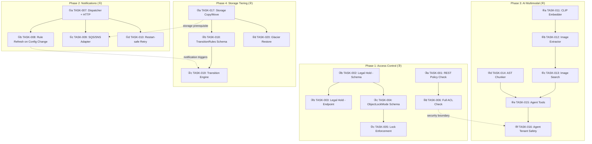
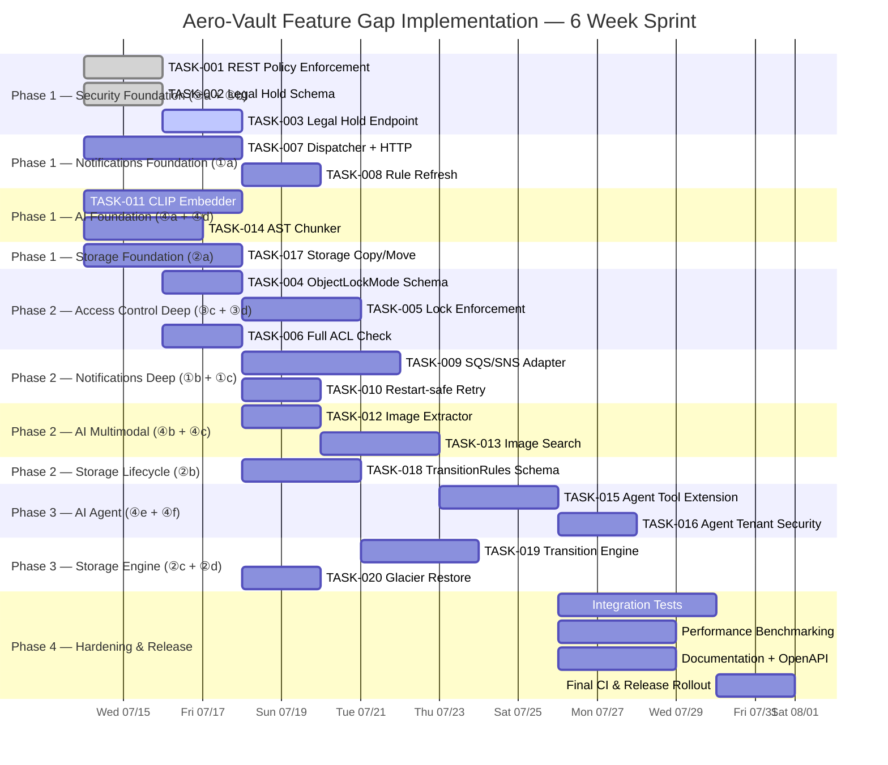

以下是我对分析文档的全面 Tech Lead 评审。

---

# Tech Lead 分析报告：功能缺口填补计划

## 1. 任务分解

基于代码库验证，我将四个方向拆解为 20 个颗粒化任务（每个 2–4 小时）。每个任务包含具体的验收标准。

### 方向 ③ — 访问控制完整化（最高安全回报）

| 任务 ID | 标题 | 涉及文件 | 前置 | 预估(h) | 验收标准 |
|---------|------|---------|------|---------|---------|
| **TASK-001** | REST API 的 `Get`/`Put`/`Delete`/`List` 路径中强制执行桶策略 | `internal/api/rest/handler.go` + 新增 `checkBucketPolicy` 方法 | 无 | 3 | 所有 4 个路径在调用 `svc` 前调用 `checkBucketPolicy`；S3 兼容不受影响；现有 REST 测试通过 |
| **TASK-002** | 法律保留专用列 + DB 迁移 | `internal/repository/repository.go` + `sql_*.go` + 双迁移文件 | 无 | 3 | `BucketConfig` 新增 `LegalHold bool`；`objects` 表无专用列；PUT/DELETE `/v1/files/{key}/legal-hold` 端点存在；迁移可升降级 |
| **TASK-003** | 法律保留 REST 端点 | `internal/api/rest/handler.go` + `router.go` | TASK-002 | 3 | `PUT /v1/files/{key}/legal-hold {status: "ON"}` 设置元数据 + 校验；`GET` 读取；单元测试覆盖 |
| **TASK-004** | `ObjectLockMode` 枚举 + `BucketConfig` 扩展 | `internal/repository/repository.go` + 迁移 | TASK-002 | 4 | `BucketConfig.ObjectLockMode ∈ {governance, compliance, ""}`；写路径在 `locked_until` 已设时根据 mode 拒绝或允许覆盖；迁移 |
| **TASK-005** | 写路径锁强制执行 | `internal/service/file_crud.go` + `file_features.go` | TASK-004 | 4 | Governance 模式下特殊用户（`BypassGovernanceRetention`）可覆盖；Compliance 模式全局锁定；集成测试 |
| **TASK-006** | REST API ACL 全面检查 | `internal/api/rest/acl.go` + `handler.go` | TASK-001 | 3 | `Get`/`Put`/`Delete`/`List` 对已验证用户也检查对象/桶 ACL；`public-read-write` 桶允许匿名写；现有测试通过 |

### 方向 ① — S3 事件通知

| 任务 ID | 标题 | 涉及文件 | 前置 | 预估(h) | 验收标准 |
|---------|------|---------|------|---------|---------|
| **TASK-007** | 通知分发器骨架 + HTTP 适配器 | `internal/events/dispatcher.go`（新增） | 无 | 4 | `Dispatcher` 订阅 `Bus`；按事件类型 + 前缀过滤；HTTP 端点 POST 带签名 payload；`webhook.go` 复用 |
| **TASK-008** | 通知规则变更触发分发器重启 | `internal/events/dispatcher.go` + `main.go` | TASK-007 | 2 | `BucketConfig.NotificationRules` 变更时分发器重建过滤规则；集成测试 |
| **TASK-009** | SQS/SNS 目标适配器 | `internal/events/sqs_adapter.go`（新增） | TASK-007 | 4 | SigV4 签名；SQS SendMessage / SNS Publish；可配置 region+credentials；集成测试 |
| **TASK-010** | 重启安全 + 失败重试 | `internal/events/dispatcher.go` | TASK-007 | 3 | 失败 → `webhook_failures` 表持久化；服务重启后重试 `MaxAttempts`；幂等去重 |

### 方向 ④ — 多模态 AI Pipeline

| 任务 ID | 标题 | 涉及文件 | 前置 | 预估(h) | 验收标准 |
|---------|------|---------|------|---------|---------|
| **TASK-011** | CLIP/SigLIP 嵌入提供者 | `internal/ai/embedder.go` + `internal/ai/clip.go`（新增） | 无 | 4 | 新 `Embedder` 实现通过 HTTP 调用多模态模型；`Dimensions()=512/768`；OTel 指标 |
| **TASK-012** | 图像提取适配器（Extractor 扩展） | `internal/ai/extractor.go` | TASK-011 | 3 | 扩展 `Extractor` 以返回 `(text, image_tokens)`；`image/*` → 缩略图 + base64 → CLIP；`content-type` 路由 |
| **TASK-013** | 图像语义搜索 | `internal/ai/search.go` + `internal/service/file_search.go` | TASK-011 + TASK-012 | 4 | 图像 chunk 写入向量索引；`mode=image` 查询返回相似图片；`mode=hybrid` 融合文本+图像结果 |
| **TASK-014** | AST 感知代码分块器 | `internal/ai/chunker.go` + `internal/ai/codechunk.go`（新增） | 无 | 4 | `go/ast` + `go/parser` 分块 Go 文件；`tree-sitter` 可扩展接口设计；`Chunker` 接口增加 `ChunkAST` 方法 |
| **TASK-015** | Agent 工具扩展（`search_images`, `extract_structure`） | `internal/ai/agent.go` | TASK-013 | 3 | Agent 可使用 `search_images(query, k)` 和 `extract_structure(key, schema)` 工具；Agent 测试覆盖新工具 |
| **TASK-016** | Agent 租户安全边界 | `internal/ai/agent.go` + `internal/middleware/tenant.go` | TASK-015 | 2 | Agent 工具调用携带租户上下文；跨租户读取被拒绝；集成测试 |

### 方向 ② — 存储类分层

| 任务 ID | 标题 | 涉及文件 | 前置 | 预估(h) | 验收标准 |
|---------|------|---------|------|---------|---------|
| **TASK-017** | `Storage` 接口扩展：`Copy`+`Move` | `internal/storage/storage.go` + 所有后端实现 | 无 | 4 | 新接口方法；所有后端实现（local/s3/oss/cos）必须支持；`local` 实现通过 contract_test |
| **TASK-018** | 生命周期 `TransitionRules` 配置 + 迁移 | `internal/repository/repository.go` + 迁移 | TASK-017 | 4 | `BucketConfig.Transitions []TransitionRule`；`TransitionRule = {Days, StorageClass}`；迁移文件 |
| **TASK-019** | 生命周期规则执行引擎 | `internal/reconcile/lifecycle.go` | TASK-018 | 4 | 在 `LifecycleJob.sweep` 中按 days 执行 transition；调用 `Storage.Copy` + `Delete`；metrics：`lifecycle_transitions_total` |
| **TASK-020** | `RestoreObject` 重连到 Glacier 恢复 | `internal/service/file_features.go` + `internal/api/rest/handler.go` | TASK-017 | 3 | POST `/v1/files/{key}/restore` 支持 `?tier=bulk|expedited`；`Storage.Restore` 新接口方法；`Days` 参数 |

---

## 2. 执行顺序与依赖图

### 可并行执行的任务组

| 并行组 | 任务 | 理由 |
|--------|------|------|
| **G1** | TASK-001 + TASK-002 + TASK-007 + TASK-011 + TASK-014 + TASK-017 | 六个任务无前置依赖，可分配给不同开发者 |
| **G2** | TASK-003 + TASK-004 + TASK-008 + TASK-012 | 依赖 G1 中各自的前置，彼此正交 |
| **G3** | TASK-005 + TASK-006 + TASK-009 + TASK-013 + TASK-018 | 进一步收敛 |
| **G4** | TASK-010 + TASK-015 + TASK-016 + TASK-019 + TASK-020 | 最终集成阶段 |

---

## 3. 技术风险

### 🔴 高风险

| 风险 | 方向 | 描述 | 缓解策略 |
|------|------|------|---------|
| **SigV4 签名实现** | ① | SQS/SNS 需要 AWS SigV4 签名。代码库目前无 SigV4 库依赖，手写易错。 | ① 使用 `aws-sdk-go-v2` 核心签名包而非完整 SDK；② 先发 HTTP-only 适配器（TASK-007），SQS/SNS 推迟到 TASK-009 |
| **CLIP 模型运行时** | ④ | 多模态嵌入需 GPU 或 ONNX 运行时。CI 环境无法运行 GPU 推理。 | ① HTTP 远程调用（`AI_EMBED_PROVIDER=clip` 指向外部服务）；② 本地嵌入用 `HashEmbedder` 回退；③ 集成测试标记 `//go:build integration` |
| **AST 分块器性能** | ④ | `go/parser` 对大文件（>10MB）可能耗时数秒；非 Go 语言需 tree-sitter CGo 绑定。 | ① Go 文件用 stdlib `go/parser` 先发；② 设 `MaxASTBytes` 阈值（如 1MB）；③ tree-sitter 作为可选 CGo 提供者，无 CGo 时回退到行分块 |
| **Storage 接口向后兼容** | ② | 所有 4 个后端（local/s3/oss/cos）必须实现 `Copy`/`Move`/`Restore`；OSS 和 COS 维护者可能不可用。 | ① `local` 用 `io.Copy` + `os.Rename` 立即实现；② S3 backend 用 `CopyObject` API；③ OSS/COS 添加存根返回 `ErrNotImplemented`，避免破坏编译 |
| **跨后端分层事务性** | ② | LOCAL→S3 分层需要 `Copy`（上传）成功后 `Delete`（本地），中途崩溃导致数据复制不全。 | ① 在 `jobs` 表中写临时记录再执行；② 幂等重试 + 清理；③ 先仅支持同后端分层，跨后端作为阶段 2 |

### 🟡 中等风险

| 风险 | 方向 | 描述 | 缓解策略 |
|------|------|------|---------|
| **通知分发器背压** | ① | `Bus.Publish` 使用非阻塞 `select`；若分发器跟不上，事件被丢弃（`dropped` 计数器）。 | ① 分发器使用带缓冲 channel；② 指标告警 `event_dropped > 0`；③ 长期用 Postgres LISTEN/NOTIFY 替代轮询 |
| **ObjectLockMode 语义复杂度** | ③ | AWS S3 Object Lock 模式涉及 Governance/Compliance、BypassGovernanceRetention 特殊权限、Legal Hold 与 Lock 的交互。 | ① 实现 S3 规范子集（GoC 模式 + 基础 legal hold）；② 不支持的 AWS 特有功能返回 `ErrNotImplemented`；③ 写 RFC 文档说明 scope |
| **ACL 与 Policy 优先级** | ③ | AWS S3 中 ACL 和 Bucket Policy 的授权评估顺序复杂（先 ACL → Policy → IAM）。 | ① 简化：先检查 ACL（拒绝则短路），再检查 Policy；② 文档化简化设计决策 |
| **模型漂移导致向量不兼容** | ④ | 升级 CLIP 模型后新 chunk 的向量与原索引不兼容。 | ① 在 `Chunk` 模型中记录 `embed_model` 版本；② `search.go` 过滤不匹配 chunk；③ 支持重建索引 |

### 🟢 低风险

| 风险 | 描述 |
|------|------|
| **迁移冲突** | 四个方向涉及 5+ 个迁移文件。建立 `NNNN_desc.up.sql` 命名顺序，CI 检查编号唯一。 |
| **测试网络依赖** | SQS/SNS、CLIP、S3 后端都需要网络。使用 `//go:build integration` + 接口 mock 保证核心测试零网络。 |
| **事件风暴** | 生命周期 Transition 产生 `object.deleted` 事件 → 通知分发器触发 → 可能导致再分层。添加 `event_reentrant` 标记位。 |

---

## 4. 资源评估

### 团队组成

| 角色 | 数量 | 关键技能 | 负责方向 |
|------|------|---------|---------|
| Senior Go 工程师 | 2 | Go 1.25、SQL、并发、HTTP 中间件 | ③ + ②（安全与存储核心） |
| AI/ML 工程师 | 1 | 向量搜索、嵌入模型、RAG pipeline | ④（多模态 AI） |
| 基础设施工程师 | 1 | S3/AWS API、消息队列、可靠性工程 | ①（事件通知） |
| QA / 测试工程师 | 1 | 集成测试、性能测试、CI | 全部 |

### 里程碑时间线

| 里程碑 | 时间 | 交付物 | 验证方式 |
|--------|------|--------|---------|
| **M1 安全基线** | 第 1 周末 | TASK-001 + TASK-002 + TASK-003 完成 | 渗透测试：REST 路径现在强制执行策略；法律保留端点可用 |
| **M2 核心通知** | 第 2 周末 | TASK-007 + TASK-008 + TASK-010 完成 | S3 兼容测试：桶通知规则 → 事件触发 HTTP POST |
| **M3 多模态 MVP** | 第 3 周末 | TASK-011 + TASK-012 + TASK-013 + TASK-014 完成 | 上传图片 → 搜索返回图片；Go 文件 AST 分块 |
| **M4 存储分层** | 第 4 周末 | TASK-017 + TASK-018 + TASK-019 + TASK-020 完成 | 生命周期规则 → 对象自动分层；`Restore` 端点工作 |
| **M5 端到端集成** | 第 5 周末 | TASK-005 + TASK-006 + TASK-009 + TASK-015 + TASK-016 完成 | 全功能 S3 兼容性测试通过；AI Agent 安全边界生效；SQS 通知 |
| **M6 硬化和发布** | 第 6 周末 | 全量 CI 绿色；文档更新；OpenAPI 扩展；性能基线 | `make check` 通过；性能无回归 |

### 阻塞点与解决策略

| 阻塞点 | 影响 | 解决策略 |
|--------|------|---------|
| OSS/COS 后端维护者无响应 | TASK-017 阻塞 | 合并 PR 前允许存根实现 + `ErrNotImplemented`；CI 仅验证 local+s3 后端 |
| CLIP 模型打包困难 | TASK-011 + TASK-012 阻塞 | 远程提取器优先（`RemoteExtractor` 已存在）；本地 CLIP 可用 ONNX Runtime |
| SQS SigV4 库选择 | TASK-009 阻塞 | 评审候选库或手写最小实现；Frozen 1 天后使用 `aws-sdk-go-v2` 签名 |

---

## 5. 质量保证

### 单元测试覆盖要求

| 方向 | 最低覆盖率 | 关键测试文件 | 测试模式 |
|------|-----------|-------------|---------|
| ③ | 80% | `acl_test.go` + `handler_test.go` + `lock_test.go` | mock repo + httptest |
| ① | 75% | `dispatcher_test.go` + `sqs_adapter_test.go` | mock HTTP server + Bus spy |
| ④ | 70% | `clip_embedder_test.go` + `codechunk_test.go` + `agent_test.go` | mock LLM + HashEmbedder |
| ② | 75% | `lifecycle_test.go` + `storage_contract_test.go` | in-memory temp dir + SQLite |

所有新代码必须满足：
- 每个新 `Storage` 接口方法通过 `storage.contract_test.go`
- 每个新 REST 端点通过 `httptest` 独立测试（无 tenant/auth 上下文）
- Agent 新工具通过 mock LLM 确定性验证

### 集成测试策略

| 层次 | 工具 | 覆盖场景 | 触发条件 |
|------|------|---------|---------|
| **单元 + 集成** | `go test ./...` | 全部核心逻辑；SQLite + local FS | 每次 PR push |
| **S3 兼容** | `make test-s3-compat` | S3 兼容性测试套件 | 每日 / 发布前 |
| **Postgres** | `make test-integration` | pgvector 索引 + pgFTS + LISTEN/NOTIFY | 每周 / 含 DB 变更时 |
| **Qdrant** | `make test-integration-qdrant` | 向量集合 CRUD + Cosine 搜索 | 每周 / 含 AI 变更时 |
| **端到端** | 手动 + CI 可选 | 全流程：upload → index → search → chat → lifecycle | 发布前 |

### 代码审查要点

| # | 关注点 | 原因 |
|---|--------|------|
| **CR-1** | `Storage.Copy`/`Move` 的实现是否在每个后端都正确处理大文件（分块上传 vs 单次 Copy） | S3 5GB 单次限制 |
| **CR-2** | 通知分发器的事件过滤是否按 bucket + 事件类型 + 前缀正确组合 | 误发事件导致客户集成故障 |
| **CR-3** | ObjectLockMode 的 Governance 模式是否遗漏 BypassGovernanceRetention 权限检查 | 安全漏洞 |
| **CR-4** | AST 分块器是否正确处理超大文件（内存 OOM） | 生产稳定性 |
| **CR-5** | 所有 migration 是否成对（up + down）且编号不冲突 | I2 不变量 |
| **CR-6** | 新配置项是否都 opt-in 默认 off（不破坏现有部署） | I5 不变量 |
| **CR-7** | `go.mod` 是否引入了不必要的依赖 | I6 不变量 |

### 性能测试需求

| 场景 | 指标 | 目标 | 工具 |
|------|------|------|------|
| REST 策略检查吞吐 | 延迟 P50/P99 | +0ms / +5ms | `wrk -t4 -c100` |
| 通知分发器压力 | 事件吞吐 / 背压丢失率 | 5K events/s, 0% loss | 自定义 benchmark |
| CLIP 嵌入延迟 | P99 / 批次大小 4 | <500ms | 生产监控 |
| 生命周期扫描 | 1K expired → 全扫描完成 | <30s | 模拟 10K 对象 |
| S3 并发访问 | 100 并发 Get | 无资源泄漏 | `wrk -t10 -c100` |

---

## 6. 实施计划

### 阶段分布总结

| 阶段 | 时长 | 并行任务数 | 交付重点 |
|------|------|-----------|---------|
| **Phase 1 — Foundation** | 第 1 周（4 天） | 7 个并行 | 所有方向的基础设施到位：安全钩子、通知骨架、AI 嵌入、Storage 扩展。开发者可以并行工作 |
| **Phase 2 — Core Logic** | 第 2-3 周（8 天） | 8 个并行 | 核心功能实现：完整的访问控制逻辑、SQS 适配器、多模态搜索、生命周期 schema |
| **Phase 3 — Integration** | 第 4 周（5 天） | 4 个并行 | Agent + 生命周期引擎 + Glacier 恢复；跨方向集成（通知→分层，Agent→安全） |
| **Phase 4 — Hardening** | 第 5 周（5 天） | 3 个并行 | 全量集成测试、性能基线、文档、OpenAPI 扩展、CI 门禁、发布 |

### 每周检查点

| 周 | 检查点 | pass criterion |
|----|--------|---------------|
| W1 | 安全基础已合并；通知分发器开发中；CLIP 嵌入原型就绪 | `go test ./internal/api/rest/` + `internal/storage/` 全绿 |
| W2 | 访问控制全功能（除 Compliance 模式）；SQS 适配器进行中；图片搜索原型 | `make test-s3-compat` 通过率 ≥ 90% |
| W3 | Agent 工具扩展完成；生命周期过渡引擎进行中；Glacier 恢复端点可用 | 端到端场景 1: upload → index → search → lifecycle → transition |
| W4 | 全量集成测试完成；性能基线建立；OpenAPI 文档生成 | `make check` 全绿；性能 P50/P99 无回归 > 5% |

---

## 总结意见

**分析文档质量评级：A-** — 验证深入，跨方向约束识别准确，实施顺序合理。

**我的三项关键建议，按优先级：**

1. **先启动 TASK-001（REST Policy Check），仅需 ~3 小时但填补了最严重的安全漏洞。** 当前任何经过认证的租户都可以通过 REST API 读取/写入/删除任何对象——这在生产环境中是不可接受的。这是真正的最低可行安全措施（Minimum Viable Security）。

2. **TASK-017（Storage Copy/Move）是方向②的阻塞点，建议尽早启动但范围严格限定。** 将其实现为 local + S3 双后端，OSS/COS 允许存根。`Copy` 接口方法的设计决策（`srcKey, dstKey` vs `Copy(ctx, src, dst) error`）需要一次设计评审，但之后所有方向②任务都可以独立推进。

3. **方向①（通知）与方向②（分层）之间的集成点是架构价值最高的路径。** 通知分发器触发生命周期事件的能力（例如：`object.created` → 检查规则 → 若匹配则分层）可以使系统从被动扫描转变为实时分层。这应在 Phase 3 的集成阶段优先测试。
