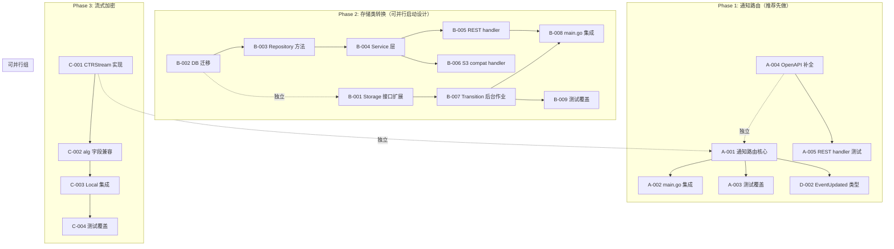

现在我掌握了充分的信息。以下是完整的技术负责人分析。

---

# 技术负责人分析：增量盲区与实施方案

## 背景理解总结

在深入代码库调查后，我验证了分析文档的结论。关键要点：

| 功能 | API 层 | 持久化层 | EventBus | 运行时执行 |
|------|--------|---------|----------|-----------|
| **按桶通知** | ✓ REST + S3 XML | ✓ `notification_rules` JSON 列 | ✓ 发布 `object.created/deleted/accessed` | ✗ **缺少路由层** |
| **存储类转换** | ✓ `ExpireAfterDays` 过期生命周期 | ✓ `storage_class` 列 | ✓ | ✗ **缺少 Transition 规则和作业** |
| **大文件流加密** | — | ✓ SSE envelope 结构（AES-GCM） | — | ✗ **只有 GCM，没有流式 CTR** |

---

## 1. 任务分解

### 1.1 方向 A：按桶事件通知路由（推荐优先）

当前现状：
- `EventBus.Publish` → 已有的 `Webhook` 订阅全局 `EVENTS_WEBHOOK_URL`（单一 URL）
- 存储的 `NotificationRule` 告诉**系统应该做什么**，但**没有代码读取和执行**
- 需要：订阅总线、按规则过滤、分发到每个规则配置的 `QueueARN`

| 任务 ID | 标题 | 涉及文件 | 前置依赖 | 预估工时 | 验收标准 |
|---------|------|---------|----------|---------|---------|
| **A-001** | 通知路由核心（匹配 + 分发） | `internal/events/notifier.go`（新建） | 无 | 3h | 订阅总线，解析规则，按事件类型+前缀过滤，并发 POST 到每个匹配规则的 `QueueARN` |
| **A-002** | 集成到 main.go 启动链路 | `cmd/server/main.go` | A-001 | 1h | `startWebhook` 之后启动 `Notifier`；`Notifier` 使用 `bus.Subscribe()` |
| **A-003** | 测试全覆盖 | `internal/events/notifier_test.go`（新建） | A-001 | 3h | 事件匹配测试、`FilterKey` 前缀匹配、发送失败记录 `webhook_failures`、并发竞争 |
| **A-004** | OpenAPI 文档补全 | `internal/api/rest/openapi.json` | — | 1h | `GET/PUT/DELETE /v1/buckets/{bucket}/notification` 三个端点 |
| **A-005** | REST handler 测试 | `internal/api/rest/handlers_test.go` | — | 2h | 测试三个端点的 200/400 路径 |

### 1.2 方向 B：存储类生命周期转换

| 任务 ID | 标题 | 涉及文件 | 前置依赖 | 预估工时 | 验收标准 |
|---------|------|---------|----------|---------|---------|
| **B-001** | Storage 接口扩展 `ChangeStorageClass` | `internal/storage/storage.go` + 所有 backend | 无 | 3h | 新方法；local backend = 更新元数据（no-op）；S3 backend = CopyObject 改 storage class |
| **B-002** | DB 迁移：`transition_rules` 列 | `internal/repository/migrations/{sqlite,postgres}/NNNN_bucket_transitions.up.sql` | 无 | 2h | `buckets` 表新增 `transition_rules TEXT DEFAULT '[]'`；含下迁脚本 |
| **B-003** | Repository 方法 + BucketConfig 字段 | `internal/repository/repository.go` / `sql_buckets.go` | B-002 | 3h | `TransitionRules []TransitionRule`；CRUD 方法 + 扫描待转换对象 |
| **B-004** | Service 层映射 | `internal/service/file_features.go` | B-003 | 1h | `Get/Set/DeleteBucketTransitionRules` 透传 |
| **B-005** | REST handler | `internal/api/rest/handler.go` + `router.go` | B-004 | 2h | `GET/PUT/DELETE /v1/buckets/{bucket}/transition` |
| **B-006** | S3 compat handler | `internal/api/s3compat/handler.go` + `xml.go` | B-004 | 3h | S3 XML 格式的 `PUT /{bucket}?transition` 解析 |
| **B-007** | Transition 后台作业 | `internal/reconcile/transition.go`（新建） | B-001, B-003 | 5h | 定时扫描 bucket → 按规则匹配对象 → 调用 `ChangeStorageClass` |
| **B-008** | 集成 main.go | `cmd/server/main.go` | B-007 | 1h | 在 `startReconcile` 之后启动 transition 作业 |
| **B-009** | 测试覆盖 | `internal/reconcile/transition_test.go` | B-007 | 4h | 规则匹配、本地 no-op、S3 mock CopyObject、幂等重试 |

### 1.3 方向 C：大文件流式加密（CTR+HMAC）

| 任务 ID | 标题 | 涉及文件 | 前置依赖 | 预估工时 | 验收标准 |
|---------|------|---------|----------|---------|---------|
| **C-001** | `CTRStreamReader/Writer` 实现 | `internal/storage/crypto.go` 扩展 | 无 | 5h | AES-256-CTR per-block encrypt/decrypt；每块独立 HMAC-SHA256 tag（文件尾附加）；nonce = envelope.KeyID + fileID 派生 |
| **C-002** | `alg` 字段兼容 GCM/CTR | `internal/storage/sse.go` | C-001 | 3h | 读 envelope 时 `alg=gcm` → 走老路径；`alg=ctr_hmac` → 走新路径；T=0 块的文件直接 GCM |
| **C-003** | 分块加密上层集成 | `internal/storage/local.go` | C-002 | 3h | `Local.Put`/`Get` 按文件大小阈值（如 >64MB）自动选 CTR 路径 |
| **C-004** | 测试 + 向后兼容验证 | `internal/storage/local_test.go` | C-003 | 4h | GCM 写入 → CTR 读取；CTR 写入 → GCM 读取；HMAC 篡改检测；大文件流式 |

### 1.4 方向 D：高优先级辅助任务

| 任务 ID | 标题 | 涉及文件 | 前置依赖 | 预估工时 | 验收标准 |
|---------|------|---------|----------|---------|---------|
| **D-001** | Webhook 复用：`Notifier` 使用现有 `webhook.go` 持久化 | `internal/events/notifier.go` | A-001 | 0h（内嵌） | 失败记录走 `repo.RecordWebhookFailure`，复用 `RetryLoop` |
| **D-002** | `Event` 类型扩展（`"updated"`） | `internal/repository/repository.go` + `service/file.go` | 无 | 1h | 增加 `EventUpdated` 类型；`file_service.go` 更新流调用 `emit(ctx, o, EventUpdated)` |

---

## 2. 执行顺序



### 并行执行规划

| 并行组 | 任务 | 人员 | 理由 |
|--------|------|------|------|
| **组 1** | A-001, A-004 | 1 人 | 核心逻辑 + API 文档，异步独立 |
| **组 2** | B-001, B-002 | 1 人 | Storage 接口和 DB 迁移互不依赖 |
| **组 3** | C-001 | 1 人 | 纯算法实现，零依赖 |

---

## 3. 技术风险

### 3.1 方向 A：通知路由

| 风险 | 等级 | 说明 | 缓解策略 |
|------|------|------|---------|
| 事件匹配性能 | 🟡 **中** | 每次事件到来需要扫描该 bucket 的所有 `NotificationRule`（bucket 数量少，规则数少，这不应该是问题） | 规则缓存在 `Notifier` 中（`sync.Map`），TTL 60s 过期，避免每次从 DB 读 |
| 并发分发失败 | 🟡 **中** | 同时分发到多个 URL，其中一些慢或挂起 | 每个目标 URL 独立 goroutine + `context.WithTimeout(5s)`，避免一个慢 sink 阻塞其他 |
| `QueueARN` 语义 | 🟢 **低** | 当前 `QueueARN` 存储为字符串，文档说 "webhook URL or queue ARN" | 初始实现只做 webhook URL；SNS/SQS 放在后面迭代 |
| 重复事件 | 🟢 **低** | EventBus 可能重投 | Webhook 已有幂等/重试语义，Notifier 直接复用 `webhook.go` 的 `postOne` 和 `RetryLoop` |

### 3.2 方向 B：存储类转换

| 风险 | 等级 | 说明 | 缓解策略 |
|------|------|------|---------|
| Storage 接口扩展设计 | 🔴 **高** | `ChangeStorageClass` 是让 `CopyObject` 语义扩展，还是独立方法 | **建议**：独立方法 `ChangeStorageClass(ctx, key, newClass string) error`。理由：① CopyObject 隐含复制语义和额外参数（源桶等）；② 对本地的 no-op 更清晰；③ S3 SDK CopyObject 的参数比这个复杂得多 |
| 云后端 CopyObject 权限 | 🟡 **中** | S3/OSS/COS 需要 `PutObject` + `GetObject` 或特定 Copy 权限 | 文档化所需 IAM 权限；在集成测试中验证；当前本地开发不涉及 |
| 扫描大桶性能 | 🟡 **中** | `SELECT ... WHERE tenant/bucket/storage_class != target AND deleted_at IS NULL` 在全表扫描时可能慢 | `storage_class` 加 DB 索引（已有 `objects_tenant_bucket` 索引）；每次扫描限制 offset/limit 分页 |
| 并发转换冲突 | 🟢 **低** | 两个作业实例同时转换同一对象 | 作业幂等：第二次 `ChangeStorageClass` 如果已达标就 skip；覆盖 `s_rebind` 的乐观锁 |

### 3.3 方向 C：流式加密

| 风险 | 等级 | 说明 | 缓解策略 |
|------|------|------|---------|
| HMAC 验证时序 | 🔴 **高** | 文件末尾追加 HMAC 列表需要**读取完整文件**才能验证前几个块 | 使用分析文档的建议：**每块自包含 HMAC tag**（而非文件尾列表）。结构：`[tag(32B) + iv(16B) + ciphertext(NB)]...` |
| nonce 派生方法 | 🟡 **中** | 不同文件相同 counter → 密钥流复用 | 派生：`counter = 0` 只用于派生 per-file nonce；使用 `HKDF-Expand(envelope.Key, "ctr-hmac-v1:"+fileID, 16)` 作为初始 counter |
| 向后兼容 | 🟡 **中** | 现有 GCM 加密文件 | `alg` 字段区分；读前 8 字节 `envelope` 解析 `alg` 做路由选择。如果 envelope 不存在 → 明文 |
| 性能 | 🟢 **低** | AES-256-CTR 是流模式，CPU 高效 | 纯 Go `crypto/aes` + `crypto/cipher` 已足够；大文件直接 `io.Copy` buffer 32KB |

---

## 4. 资源评估

### 4.1 人员配置

| 角色 | 技能要求 | 数量 | 覆盖方向 |
|------|---------|------|---------|
| **开发者 A**（后端核心） | Go 中高级、熟悉 EventBus 模式、并发 | 1 | 方向 A（通知路由）+ D-002 |
| **开发者 B**（后端+存储） | Go 中高级、熟悉云存储 SDK、SQL | 1 | 方向 B（Transition） |
| **开发者 C**（密码学） | Go 中级、熟悉 AES/GCM/CTR/HMAC、`crypto` 包 | 1（可选兼职） | 方向 C（流式加密） |

最小可行团队：**1 人**做方向 A（4 天），然后转方向 B（7 天）。

### 4.2 关键里程碑

| 里程碑 | 时间 | 交付物 |
|--------|------|--------|
| **M1** | Day 3-4 | 方向 A 完成：通知路由在 `EVENTS_WEBHOOK_URL` 之外支持按桶多 URL 分发 |
| **M2** | Day 7-8 | 方向 A CI 全绿 + S3 兼容通知接受测试 |
| **M3** | Day 12-14 | 方向 B Transition 后台作业完成 + Storage `ChangeStorageClass` 全 backend 实现 |
| **M4** | Day 15-16 | 方向 B CI 全绿 + S3 兼容 `?transition` 端点 |
| **M5** | Day 18-20 | 方向 C 流式加密完成（含旧数据兼容） |
| **M6** | Day 21-22 | 全量 `make check` 通过 + 开发者文档 |

### 4.3 阻塞点

| 阻塞点 | 影响 | 解决策略 |
|--------|------|---------|
| S3 SDK 集成测试需要真实云凭证 | B-001 验证 | 使用 `minio`（Golang `github.com/minio/minio-go` 已引入？检查 go.sum）本地模拟 S3；CI 用 `docker run minio/minio` |
| 密码学评审（C-001） | 方向 C 的唯一阻塞 | 方案已经分析文档详细设计；实现后由团队另一位开发者审查 HMAC 验证逻辑 |

---

## 5. 质量保证

### 5.1 单元测试覆盖

| 方向 | 必须覆盖的测试 | 最低覆盖率 |
|------|--------------|-----------|
| **A** | `Notifier.matchEvents`（事件类型白名单匹配）、`Notifier.matchPrefix`（FilterKey 前缀）、失败回退（`RecordWebhookFailure` 调用） | 85% |
| **B** | `TransitionRule.Matches(obj)`、`ChangeStorageClass(local)=noop`、S3 `ChangeStorageClass` mock CopyObject 调用、幂等性 | 80% |
| **C** | CTR encrypt/decrypt 往返、HMAC 篡改检测（改 tag/改 ciphertext）、GCM→CTR 读兼容、CTR→GCM 读兼容 | 90%（密码学代码必须最高覆盖） |

### 5.2 集成测试策略

| 测试名 | 覆盖内容 | 环境 | 所属 make target |
|--------|---------|------|-----------------|
| `TestBucketNotificationsRouting` | 设 2 个规则 → PUT → `Publish` 事件 → 目标 URL 收到 POST | SQLite + httptest server | `go test ./internal/events/...` |
| `TestLifecycleTransitionJob` | 设 TransitionRule → 运行过渡作业 → 对象 `storage_class` 变了 | SQLite + local FS | `go test ./internal/reconcile/...` |
| `TestS3TransitionRoundtrip` | S3 XML PUT → GET → 同一个 bucket config | SQLite + local FS | `go test ./internal/api/s3compat/...` |

### 5.3 代码审查要点

| 审查点 | 重点检查 |
|--------|---------|
| `Notifier.Run()` 的 goroutine 泄漏 | `ctx.Done()` 时 `Unsubscribe` 是否调用 |
| `ChangeStorageClass` 在 S3 的 `CopyObject` 参数 | `StorageClass` 是否传到 SDK；是否需要 `MetadataDirective` |
| CTR 加密 nonce 唯一性 | 两个不同文件是否可能产生相同密钥流 |
| 失败路径日志 | `Notifier` 分发失败是否 warn 日志 |
| I1 原则遵守 | SQL 占位符 `$N` → `s.rebind` 是否正确 |

### 5.4 性能测试需求

| 场景 | 预期 | 方法 |
|------|------|------|
| 通知路由：100 个事件/秒，10 条规则 | 延迟 < 10ms | `BenchmarkNotifierMatch` + `BenchmarkNotifierDispatch` |
| Transition 扫描：10 万对象 | < 30s 完成一轮扫描 | 在 benchmark 模式下运行 `transitionJob.sweep()` |
| CTR 加密：1GB 文件 | 吞吐 > 200MB/s | `BenchmarkCTREncrypt` + `BenchmarkCTRDecrypt` |

---

## 6. 实施计划

### 甘特图

```
周 1                   周 2                   周 3                   周 4
|-----------------------|-----------------------|-----------------------|-----------------------|
██ 方向 A（通知路由）     ██ 方向 B（过渡作业）   ██ 方向 C（流式加密）    ██ 稳定化
┌─────────────────────┐ ┌─────────────────────┐ ┌─────────────────────┐ ┌─────────────────────┐
│A-001 ████████████     ││B-001 ████            ││C-001 ████████████████││D-002 ████           │
│A-002     ████         ││B-002 ████            ││C-002    ████████     ││OpenAPI/文档 ███████  │
│A-003         ████████ ││B-003    ██████       ││C-003        ██████  ││e2e 测试 ████████████ │
│A-004 ██████           ││B-004       ████      ││C-004           █████││性能调优      ███████ │
│A-005           ██████ ││B-005         ██████  ││                     ││make check 全绿 ████  │
└─────────────────────┘ │B-006         ██████  │└─────────────────────┘ └─────────────────────┘
                        │B-007           ██████│
                        │B-008               ██│
                        │B-009               ████│
                        └─────────────────────┘
```

### 详细阶段时间线

#### 阶段 1：通知路由（4 天）

| 天 | 任务 | 预计产出 |
|----|------|---------|
| **Day 1** | A-001 通知路由核心 | `Notifier` 结构体 + `Run(ctx, sub)` 循环 + `matchRules(event, rules)` 函数 |
| **Day 2** | A-001 + A-002 | main.go 集成；`startNotifier` 函数；复用 `webhook.go` 的 `postOne` |
| **Day 3** | A-003 测试 | 单元测试：匹配逻辑、并发发送、失败记录 |
| **Day 4** | A-004 + A-005 | OpenAPI 文档补 `notification` 端点；REST handler 测试 |

**阶段 1 交付物**：用户配置 `PUT /v1/buckets/my-bucket/notification` 后，`object.created` 事件会自动 POST 到规则的 `QueueARN` URL。

#### 阶段 2：存储类转换（7 天）

| 天 | 任务 | 预计产出 |
|----|------|---------|
| **Day 5-6** | B-001 Storage 接口 | `ChangeStorageClass(ctx, key, newClass string) error` + local no-op + S3 `CopyObject` 实现 + OSS/COS stub |
| **Day 5** | B-002 DB 迁移 | 双文件迁移；`transition_rules` JSON 列 |
| **Day 6-7** | B-003 + B-004 | Repository CRUD + Service 层透传 |
| **Day 8-9** | B-005 + B-006 | REST + S3 XML handler；S3 `?transition` 查询参数 |
| **Day 10-11** | B-007 Transition 作业 | `TransitionJob.Run()` 定时扫描+过滤+调用；分页对象 |
| **Day 11-12** | B-008 + B-009 | main.go 集成 + 测试覆盖 |

**阶段 2 交付物**：`PUT /v1/buckets/my-bucket/transition` → 后台作业按规则扫描 → 调用云 SDK 变更 storage class。

#### 阶段 3：流式加密（5 天）

| 天 | 任务 | 预计产出 |
|----|------|---------|
| **Day 13-15** | C-001 | `CTREncryptWriter` / `CTRDecryptReader`；每块独立 HMAC tag；nonce 派生 HKDF |
| **Day 16** | C-002 | `alg` envelope 字段；读时路由；T=0 文件 GCM |
| **Day 17** | C-003 | Local `Put`/`Get` 64MB 阈值；大的走 CTR |
| **Day 18-19** | C-004 | 所有兼容测试 + 性能 benchmark |

**阶段 3 交付物**：>64MB 文件自动使用 AES-256-CTR + per-block HMAC，已有 GCM 文件可正常读取。

#### 阶段 4：稳定化（3 天）

| 天 | 任务 | 预计产出 |
|----|------|---------|
| **Day 20** | D-002 + 全面回归 | `EventUpdated` 类型；全量 `go test ./...` |
| **Day 21** | OpenAPI 文档同步 | `notification` + `transition` 端点 OpenAPI 规范 |
| **Day 22** | 性能基准 | 比较前后性能；生成报告 |

---

## 7. 最终建议

### 立即开始方向 A（通知路由）

理由：
1. **最少的代码量** — 核心路由逻辑约 300 行，复用现有 `webhook.go` 的全部基础设施（`postOne`、`RecordWebhookFailure`、`RetryLoop`）
2. **最高的用户可见性** — API 端点存在且返回数据，但事件从未达到配置的 URL，这种行为缺口比功能缺失更容易降低信任
3. **零接口破坏** — 不需要修改任何已存在的接口或存储后端

### 方向 B 和方向 A 可以重叠设计

方向 A 实现后，方向 B 的 `ChangeStorageClass` 可以复用同一模式：
- 方向 A 模式：持久化配置 → EventBus 事件 → 路由/worker 消费
- 方向 B 模式：持久化配置（`TransitionRule`） → 定时扫描 → worker 消费（`ChangeStorageClass`）

两者共享 `TimerJob` 基础模式，方向 B 只是把触发器从 `EventBus` 换成了 `time.Ticker`。

### 关于方向 C 的建议

方向 C 是纯工程优化，没有接口/API 变化。建议在方向 A 和 B 稳定后再启动。核心密码学实现（C-001）可以单独由一位开发者离线完成，与主线程不冲突。

---

**如果你确认方向 A 作为起点，我可以立即开始 A-001 的详细设计和实现。**
