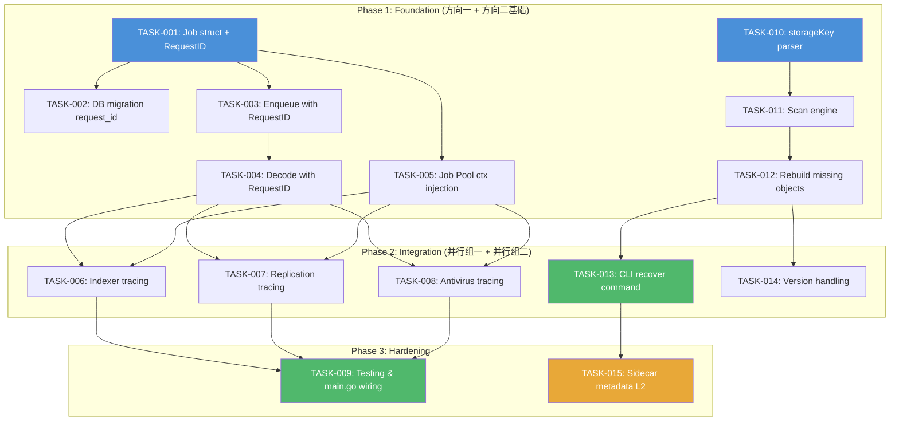
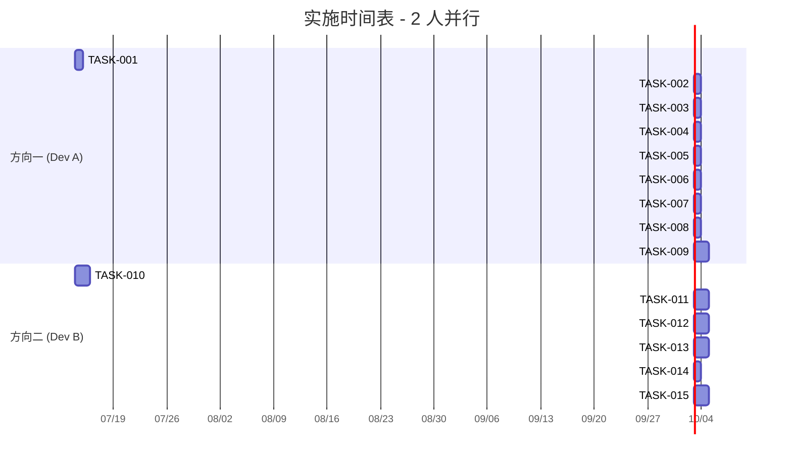

Now I have a thorough understanding of the codebase. Let me produce the Tech Lead analysis.

---

# Tech Lead 分析报告：已验证扩展方向实施计划

## 1. 任务分解

基于验证报告确认的两个有效方向（异步管线请求追踪、元数据灾难恢复），拆解为 15 个可执行任务。每个任务预估 2-4 小时完成。

---

### 1.1 方向一：异步管线请求追踪断裂（P1）

#### 当前断点全景

```
HTTP Request → middleware.RequestID → ctx → FileService.emit() → Event.RequestID
                                                                       ↓
                                                              object_events 表
                                                                       ↓
                                                           ┌──────────────┼──────────────┐
                                                           ↓              ↓              ↓
                                                    Webhook(✅读取)  Indexer(❌丢弃)  Antivirus(❌丢弃)
                                                                                           ↓
                                                                                    Replication(❌丢弃)
                                                                                           ↓
                                                                                    JobPool (Job 结构体无 RequestID 字段)
```

| TASK ID | 标题 | 涉及文件 | 前置依赖 | 工时 | 验收标准 |
|---------|------|---------|---------|------|---------|
| TASK-001 | `repository.Job` 结构体增加 `RequestID` 字段 | `internal/repository/jobs.go` | — | 1h | `Job` 有 `RequestID string`；`jobCols` 常量包含该列；`scanJob` 扫描该字段 |
| TASK-002 | 新增 DB 迁移为 `jobs` 表加 `request_id` 列 | `migrations/{sqlite,postgres}/0025_jobs_request_id.{up,down}.sql` | TASK-001 | 1h | 双数据库迁移文件存在；`up` 加 `request_id TEXT NOT NULL DEFAULT ''`；`down` DROP；`repo.Migrate` 执行后 schema 包含该列 |
| TASK-003 | 事件桥接处把 `e.RequestID` 填入 Job | `internal/ai/indexer.go` (dispatch), `internal/replication/replication.go` (Run), `internal/antivirus/worker.go` (Run) | TASK-001 | 2h | 三个 `Enqueue` 调用处 `job.RequestID = e.RequestID`；验证空 `e.RequestID` 不 panic |
| TASK-004 | `Job.Payload` 解码函数带 RequestID 传播 | `internal/ai/indexer.go` (DecodeObjectID), `internal/replication/replication.go` (DecodeObjectID), `internal/antivirus/worker.go` (DecodeObjectID) | TASK-003 | 1h | 各 decode 函数返回 `(int64, string)` 含 RequestID；调用方签名更新 |
| TASK-005 | Job Pool 执行时将 RequestID 注入 handler context | `internal/jobs/jobs.go` (`execute` / `runOne`) | TASK-001 | 2h | `runOne` 调用 `execute` 前执行 `ctx = context.WithValue(ctx, requestIDKey, job.RequestID)`；可复用 `middleware.RequestIDFrom`/上下文 key |
| TASK-006 | Indexer 日志/操作携带 RequestID | `internal/ai/indexer.go` | TASK-004, TASK-005 | 2h | `IndexObjectByID` 接收 RequestID 参数或从 ctx 读取；所有 `ix.logger` 调用含 `request_id` 属性 |
| TASK-007 | Replication Worker 日志/操作携带 RequestID | `internal/replication/replication.go` | TASK-004, TASK-005 | 1h | `ReplicateObjectByID` 从 ctx 读取 RequestID；日志含 `request_id` |
| TASK-008 | Antivirus Worker 日志/操作携带 RequestID | `internal/antivirus/worker.go` | TASK-004, TASK-005 | 1h | `ScanObjectByID` 从 ctx 读取 RequestID；日志含 `request_id` |
| TASK-009 | main.go 注册链路验证与测试 | `cmd/server/main.go` + `*_test.go` | TASK-003~008 | 2h | Job handler reg 处用 `middleware.RequestIDFrom(ctx)` 不为空；集成测试验证 Event→Job→handler→log 链路完整 |

**方向一总计：13 工时（1.6 人天）**

---

### 1.2 方向二：元数据灾难恢复缺失（P1）

#### 分级恢复架构

```
L1 (storageKey 反推):    Storage.List → key = <tenant>/<bucket>/<key>[@v<id>] → 重建 Object 行
L2 (侧边元数据文件):      写路径同步写 .meta.json → 含 tags/ACL/lock/metadata → L1 + 侧边恢复
L3 (连续备份):            DB WAL 归档 + 周期 snapshot → 线上重建
```

| TASK ID | 标题 | 涉及文件 | 前置依赖 | 工时 | 验收标准 |
|---------|------|---------|---------|------|---------|
| TASK-010 | 元数据恢复核心：storageKey → Object 反推器 | `internal/recovery/parser.go` (新文件) | — | 3h | `ParseStorageKey(key string) (tenant, bucket, objectKey, versionID string, ok bool)`；处理带/不帶 `@v<id>` 后缀；拒绝空/`/`前缀/`..`/不符合 `<t>/<b>/<k>` 格式的 key |
| TASK-011 | `Storage.List` 全表扫描 + 与 DB 比对引擎 | `internal/recovery/scan.go` (新文件) | TASK-010 | 3h | `ScanStorage(ctx, store, repo) (matches []RecoveredObject, orphans []string, missing []string, err error)`；对 store 做带分页的 List("","",1000)；对每个 key 调用 ParseStorageKey→`GetObject`；记录不存在/孤立/匹配 |
| TASK-012 | 元数据重建器：为缺失 Object 写 DB 行 | `internal/recovery/builder.go` (新文件) | TASK-011 | 3h | `RebuildMissing(ctx, repo, missing []RecoveredObject) (rebuilt int, errors []error)`；用 `Storage.Stat` 补充 Size/ETag/ContentType；`UpsertObject` 写入；跳过重复 key |
| TASK-013 | CLI 子命令 `recover metadata --scan` | `internal/cli/cli_recover.go` (新文件)；`internal/cli/cli.go` 注册 | TASK-012 | 3h | `aero-vault admin recover metadata --scan` 执行全流程；输出 `rebuilt=N, orphans=M`；--dry-run 模式只报告不写入；--tenant 过滤；--prefix 扫描前缀 |
| TASK-014 | 版本身份识别：`@v<id>` 后缀 → VersionID + is_latest 判定 | `internal/recovery/versions.go` (新文件) | TASK-012 | 2h | 对同一 `<t>/<b>/<k>` 的所有 versioned key，最新 created_at 判定为 is_latest；非 latest 写 `InsertObjectVersion` |
| TASK-015 | L2 侧边元数据：写路径同步 .meta.json | `internal/service/file_crud.go` (写路径)；`internal/recovery/sidecar.go` (新文件) | TASK-012 | 4h | PUT/DELETE/POST tags/ACL/lock 时，在 storage 层同位置写 `.<key>.meta.json`（JSON: `{tags, acl, locked_until, metadata}`）；`recover` 命令有 `--use-sidecar` 标志，读取侧边文件填充 Tags/ACL/Lock |

**方向二总计：18 工时（2.25 人天）**

#### 不可重建边界（记录在案，不实现）

| 边界 | 原因 | 应对 |
|------|------|------|
| `uploads` 表 multipart 状态 | 仅在 DB 中，存储层无痕迹 | `recover` 报告 `warn: uploads not recoverable`，建议手动取消 |
| SSE 加密上下文 | `STORAGE_SSE_KEY` 的 envelope 元数据在 DB `objects.sse_*` 列，存储 blob 是密文 | 需备份 `key_id`/`envelope` 到侧边文件 |
| Object Lock `locked_until` | 纯 DB 字段，存储 blob 无标记 | 侧边文件可承载（L2） |
| Soft-delete vs active | 存储 blob 完全相同 | `recover` 默认重建为 active，无软删除状态 |

---

## 2. 执行顺序



### 可并行执行组

| 并行组 | 任务集合 | 建议开发者数量 |
|--------|---------|-------------|
| **组 A** (方向一底层) | TASK-001, TASK-002 | 1 人 |
| **组 B** (方向二底层) | TASK-010 (与组 A 无依赖) | 1 人 |
| **组 C** (方向一上层，依赖组 A) | TASK-003, TASK-004, TASK-005 | 1 人 |
| **组 D** (方向二中层，依赖组 B) | TASK-011, TASK-012 | 1 人 |
| **组 E** (方向一 Consumer，依赖组 C) | TASK-006, TASK-007, TASK-008 | 1 人 |
| **组 F** (方向二上层，依赖组 D) | TASK-013, TASK-014 | 1 人 |
| **组 G** (收尾测试，依赖组 E+F) | TASK-009 | 1 人 |
| **组 H** (进阶方向二，依赖组 F) | TASK-015 | 1 人可选 |

**最优并行：2 人**（一人专注方向一，一人专注方向二），项目日历约 8-10 天。

---

## 3. 技术风险

### 3.1 方向一风险

| # | 风险 | 严重度 | 概率 | 应对策略 |
|---|------|--------|------|---------|
| R1 | `middleware.RequestIDFrom` 依赖 context key 包外不可见 | **高** | 低 | `ctxRequestID` 是 `middleware` 包私有 `ctxKey(iota)`。`jobs.Pool` 在 `internal/jobs` 包，无法直接访问该 key。**方案：** 在 `middleware` 包暴露 `ContextWithRequestID(ctx, id) context.Context` 函数；或把 requestID context key 提取到独立包（如 `internal/ctxutil`） |
| R2 | Job handler 的 `ctx` 生命周期短于请求链路 | 中 | 中 | Pool worker 的 context 来自 `Pool.Run(ctx)` 传入的 root ctx，不是原始 HTTP request ctx。注入的 RequestID 仅用于日志/遥测，不影响下游 API 调用（indexer 内无 HTTP 调用）。Acceptable |
| R3 | DedupeKey 相同的 job 合并后 RequestID 丢失 | 低 | 高 | `EnqueueJob` 返回 `deduped=true` 时使用已存在的 job，其 RequestID 可能来自较早的请求。**方案：** 不覆盖已存在 job 的 RequestID（已有行为不变）；日志记录 `deduped=true` + 原始 request_id |
| R4 | SQLite CONCURRENT 场景下 jobs 表 request_id 空值回溯 | 低 | 低 | 默认值 `''`，代码中 `RequestID == ""` 时不注入 context，不格式化日志 |

### 3.2 方向二风险

| # | 风险 | 严重度 | 概率 | 应对策略 |
|---|------|--------|------|---------|
| R5 | `Storage.List` 在 S3/COS/OSS 上不支持空前缀全表扫描 | **高** | 中 | S3 `ListObjectsV2` 默认 prefix `""` 返回所有 key，但 bucket 很大时可能需要 hours + 大量 API 调用费用。**方案：** L1 CLI 必须加 `--tenant` 和 `--prefix` 过滤参数；大集群建议在 `recovery` 命令内部做 `ListObjects` 分页并发（`--workers N`）；文档注明生产 S3 建议在维护窗口执行 |
| R6 | 版本化 blob `@v<id>` 后缀歧义 —— 用户 key 本身包含 `@v` | 中 | 低 | 校验规则：最后一个 `@v` 后必须是 UUID 格式（匹配 `re_uuid`），否则视为普通 key。测试用 fixture 覆盖 `my@v1/file`、`data@version@v123e4567-...` |
| R7 | 侧边元数据文件写路径性能损耗（L2） | 中 | 中 | 每个 PUT/POST tags/ACL 写多一次 storage `Put`（小文件）。**对策：** 使用 `store.Put` 的异步版本（存 Sidecar 延迟可容忍 500ms）；或通过 EventBus 异步消费者写 Sidecar；**基准测试开启/关闭** |
| R8 | 对象存储 rename 不是原子操作，侧边文件可能 desync | 中 | 低 | 侧边文件 key 为 `.[base_key].meta.json`，rename 不可用。只在写入/删除时同步更新；CLI recover 需支持 `--rebuild-sidecar` 从 DB 回写侧边文件 |

### 3.3 跨方向风险

| # | 风险 | 严重度 | 概率 | 应对策略 |
|---|------|--------|------|---------|
| R9 | `make check` 中 `go vet ./...` 对新包 `internal/recovery` 无异常 | 低 | 低 | 标准 CI gate 覆盖；额外加 `recovery` 的 `TestStorageKeyParser` 和 `TestScanDryRun` |
| R10 | 单文件超过 500 行约束（`AGENTS.md`） | 低 | 中 | `internal/recovery/` 按职责分 4-5 文件（parser, scan, builder, versions, sidecar）；jobs.go 已 257 行，TASK-004 的解码层改签名注意行数 |

---

## 4. 资源评估

### 4.1 人员技能需求

| 角色 | 数量 | 技能要求 |
|------|------|---------|
| **Go 后端开发（方向一）** | 1 人 | 熟悉 context 传递模式、事件驱动架构、Go `slog` 结构化日志；需协调 repository/jobs 包改签 |
| **Go 后端开发（方向二）** | 1 人 | 熟悉 storage 接口、CLI cobra 或 flag 包、SQLite/Postgres schema；需处理 S3 List 分页 |
| **QA 工程师（可选但推荐）** | 0.5 人 | 验收测试：方向一验证 RequestID 流经全链路；方向二模拟 DB 损坏后跑 `recover` 验证重建 |

**最小团队：2 人开发**（一人每方向，或两人协作）。

### 4.2 关键里程碑

| 里程碑 | 天数 (2人并行) | 产出物 |
|--------|-------------|--------|
| **M1: 基础设施就绪** | Day 1 | `Job.RequestID` 字段 + 双数据库迁移 + `ParseStorageKey` 函数 |
| **M2: 方向一链路贯通** | Day 3 | Job→Handler RequestID 注入 + Worker 日志含 request_id |
| **M3: 方向二扫描引擎** | Day 4 | `ScanStorage` + `RebuildMissing` + 单元测试 |
| **M4: 方向一测试完成** | Day 5 | 集成测试验证 Event→Job→handler→log 全链路；CI gate 纳入 |
| **M5: CLI 恢复工具** | Day 6 | `aero-vault admin recover metadata --scan` 可用 |
| **M6: 版本身份 + 侧边文件** | Day 8 | 版本化恢复 + L2 侧边元数据写路径 |
| **M7: 全量验收** | Day 10 | `make check` green；`TestRequestIDTracing` + `TestMetadataRecoveryDryRun` 通过 |

### 4.3 阻塞点与解决策略

| Blockers | 影响范围 | 解决策略 |
|----------|---------|---------|
| **B1**: `internal/jobs` 包无法引用 `internal/middleware`（循环依赖或包可见性） | TASK-005 | ❌ 当前不存在循环依赖。`jobs` 仅依赖 `repository`。但 `ctxKey` 在 `middleware` 包是私有的。**解决：** 在 `middleware` 包暴露 `ContextWithRequestID(ctx, id)` 公共函数；或把 `ctxRequestID` key 提取到 `internal/ctxutil` 新包。建议前者，侵入最小 |
| **B2**: S3 List 全表扫描 API 调用费用 | TASK-011/013 | 添加 `--workers` 并发 + `--page-size` 参数控制 RPS；文档注明 AWS S3 用 ListObjectsV2（默认返回 1000 条，费用 $0.005/1000 请求） |
| **B3**: 方向二 L2 sidecar 写路径与现有 storage 接口不兼容 | TASK-015 | `Storage.Put` 已经接受任意键——写 `.<key>.meta.json` 是合法 key。不需要改接口，只需在 `FileService` 写路径添加一个调用 |

---

## 5. 质量保证

### 5.1 单元测试覆盖要求

| 包 | 新增文件 | 测试覆盖率目标 | 关键测试 |
|----|---------|-------------|---------|
| `internal/repository/jobs.go` | — | ≥85% (已有测试) | `TestEnqueueJobWithRequestID`：验证 `EnqueueJob` 持久化 request_id；`TestClaimJobRequestID`：验证 `ClaimJob` 返回 request_id |
| `internal/jobs/jobs.go` | — | ≥80% (已有测试) | `TestHandlerContextHasRequestID`：mock handler 检查 `middleware.RequestIDFrom(ctx)` |
| `internal/recovery/parser.go` | 新建 | ≥95% | `TestParseStorageKeyNormal`、`TestParseStorageKeyVersioned`、`TestParseStorageKeyEdgeCases`（空/`/`前缀/特殊字符/含`@v` 的 key） |
| `internal/recovery/scan.go` | 新建 | ≥90% | `TestScanStorage`：mock storage + mock repository |
| `internal/recovery/builder.go` | 新建 | ≥90% | `TestRebuildMissing`：mock repository `UpsertObject` |
| `internal/cli/cli_recover.go` | 新建 | ≥80% | `TestRecoverMetadataCommand`：dry-run 模式，验证输出格式 |
| `internal/ai/indexer.go` | — | ≥70% (基线) | `TestIndexerPropagatesRequestID`：验证事件→Job→handler 的 RequestID 传播 |
| `internal/replication/replication.go` | — | ≥70% (基线) | 同理 |
| `internal/antivirus/worker.go` | — | ≥70% (基线) | 同理 |

### 5.2 集成测试策略

#### 方向一：请求追踪链路验证

```go
// 测试模式：标准夹具 SQLite + local FS + mock embedder
// 测试验证链：
// 1. PUT /v1/files/test.txt (通过 HTTP → 带 X-Request-ID)
// 2. Bus 事件 → Indexer 处理 → Job enqueue
// 3. Job handler (mock) 验证 middleware.RequestIDFrom(ctx) == 最初 header
func TestRequestIDTracing_Indexer(t *testing.T) {
    // ...
}
```

关键路径：
1. **PUT** → `EventCreated` → `Indexer.dispatch` → `Job.RequestID` → Pool handler ctx
2. **DELETE** → `EventDeleted` → `Indexer.dispatch(JobDeleteChunks)` → ...
3. **PUT** → `EventCreated` → Replication/AV `Run` → `Job.RequestID` → handler
4. **SSE Chat Stream** `event:error` 帧含 request_id

#### 方向二：元数据恢复验证

```go
// 1. 准备一个 SQLite DB 含 N 个对象
// 2. 备份 DB 文件
// 3. 删除 DB（模拟损坏）
// 4. 执行 recover metadata --scan --dry-run
// 5. 验证输出 matching = N, missing = N, orphans = 0
// 6. 去掉 --dry-run 执行
// 7. 连接新 DB，验证 GetObject 返回正确
func TestMetadataRecovery_EndToEnd(t *testing.T) {
    // 使用 storage.ContractSuite 的 mock 或 local FS
}
```

### 5.3 代码审查要点

| 审查项 | 方向 | 为什么重要 |
|--------|------|-----------|
| `context.WithValue(ctx, requestIDKey, job.RequestID)` 在 `runOne` 注入后 handler 必须能读 | 一 | 若注入点错位，整个链路断裂 |
| `Event.RequestID` 为空时不应 panic 或注入非法值 | 一 | 边缘情况：测试/CLI 调用可能没有 RequestID |
| `ParseStorageKey` 不能误匹配用户 key 中包含 `@v` 的场景 | 二 | 误匹配导致恢复错乱 |
| `RebuildMissing` 必须绕过 Object Lock 检查（重建时无锁） | 二 | 恢复后不应产生无法删除的僵尸对象 |
| 侧边文件 `.meta.json` 写入与主 blob 写入顺序（先主后侧边） | 二 | 确保主 blob 存在时侧边文件一定存在 |
| `Storage.List` 分页正确性（`HasMore` + `NextMarker` 循环） | 二 | 漏扫描导致恢复不完整 |
| 迁移文件命名不冲突（当前最大 `0024`） | 一、二 | 新迁移编号从 0025 开始 |

### 5.4 性能测试需求

| 测试场景 | 方向 | 测试内容 | 通过指标 |
|---------|------|---------|---------|
| 高并发写入 + Indexer Job RequestID | 一 | 100 并发 PUT，每个带唯一 X-Request-ID，验证 Indexer log 100% 匹配 | 日志 100% 含正确 request_id |
| `Storage.List` 大桶扫描 | 二 | mock S3 返回 50,000 keys，测量 `ScanStorage` 时间 | < 5s (mock) / 务实预期 |
| 侧边文件写入性能损耗 | 二 | benchmark: 10,000 PUT 开启/关闭 sidecar | 写入吞吐下降 < 15% |
| `RebuildMissing` 批量 Upsert | 二 | 10,000 缺失对象重建 | < 30s (SQLite) / < 10s (Postgres) |

---

## 6. 实施计划

### 甘特图（两人并行，工作日历 10 天）



### 详细阶段说明

#### 阶段 1：基础设施（Day 1-2）

**目标：** 完成两个方向的底层基础设施，互不阻塞。

| 日期 | Dev A (方向一) | Dev B (方向二) |
|------|---------------|---------------|
| Day 1 AM | TASK-001: `Job` 加 `RequestID` 字段 + 更新 `scanJob` | TASK-010: `ParseStorageKey` + 测试 |
| Day 1 PM | TASK-002: 双数据库迁移 + `go build` 验证 | TASK-010 cont'd：边缘 case 覆盖 |
| Day 2 AM | TASK-003: 三个 Worker 的 `job.RequestID = e.RequestID` | TASK-011: `ScanStorage` + mock storage |
| Day 2 PM | TASK-004 + TASK-005: Decode 签名更新 + Pool ctx 注入 | TASK-011 cont'd：分页 + 并发 |8

**检查点 C1（Day 2 结束）：** `make check` 通过；`internal/recovery/parser_test.go` 全部通过；`Job.RequestID` 字段被正确 INSERT/SELECT。

#### 阶段 2：核心功能（Day 3-6）

| 日期 | Dev A | Dev B |
|------|-------|-------|
| Day 3 | TASK-005 (finish) + TASK-006 开始 (Indexer) | TASK-012: `RebuildMissing` + mock repo |
| Day 4 | TASK-007 + TASK-008 (Replication + Antivirus) | TASK-012 cont'd + TASK-013 CLI 开始 |
| Day 5 | TASK-009: 集成测试 + main.go handler 签名更新 | TASK-013: CLI `recover` + `--dry-run` |
| Day 6 | TASK-009 cont'd：全链路 tracing 验证 | TASK-014: 版本化恢复逻辑 |

**检查点 C2（Day 6 结束）：** 方向一：`TestRequestIDTracing_Indexer` 等集成测试通过；方向二：`aero-vault admin recover metadata --scan --dry-run` 可执行并输出合理结果。

#### 阶段 3：加固与进阶（Day 7-10）

| 日期 | Dev A | Dev B |
|------|-------|-------|
| Day 7 | 方向一 benchmark (100并发); 修复发现的问题 | TASK-014 cont'd: 版本化测试 + is_latest 判定 |
| Day 8 | 方向一 CI gate 完善; 文档撰写 | TASK-015: 侧边文件写路径 |
| Day 9 | 交叉审查方向二代码 | TASK-015: sidecar reader + recover --use-sidecar |
| Day 10 | 全量 `make check` 复审; 写 CHANGELOG | 全量 `make check`; 写 CHANGELOG |

**检查点 C3（Day 10 结束）：** `make check` 全绿；`go test ./...` 覆盖 4 个新测试文件；方向一全链路验证完成；方向二 L1 CLI + L2 sidecar 可用。

### 发布检查清单

| 检查项 | 责任人 | 完成标志 |
|--------|--------|---------|
| `gofmt -l .` 无输出 | Dev A | CI gate |
| `go build ./...` | Dev A | CI gate |
| `go vet ./...` | Dev B | CI gate |
| `go test ./...` 新增测试通过 | 交叉审查 | CI gate |
| 方向一全链路测试 (Event→Job→handler→log) | Dev A | `TestRequestIDTracing_*` pass |
| 方向二 dry-run 端到端测试 | Dev B | CLI 输出验证 |
| 迁移文件编号不冲突 | Dev B | `ls migrations/*/0025*` 存在 |
| CHANGELOG 条目 | 交叉审查 | 写入手册 |
| `AGENTS.md` 功能矩阵更新 | Dev A | 标记追踪 + 恢复已实现 |
| 不超过单文件 500 行 | 交叉审查 | `wc -l` 检查所有修改文件 |

---

## 总结

| 维度 | 评估 |
|------|------|
| **总工时** | 方向一 13h + 方向二 18h = **31h (~4 人天)** |
| **最优并行** | 2 人，项目日历 10 天 |
| **最大风险** | R1 (context key 可见性) — 已识别并制定解决方案（暴露 `ContextWithRequestID`）；R5 (S3 List 全表扫描成本) — 通过 `--prefix` 过滤和分页并发缓解 |
| **最低可行交付** | 仅方向一实现（P1 优先），需 13h (~1.6 人天) 即可获得 RequestID 全链路追溯；方向二可按阶段发版（L1 先发，L2 后发） |
| **建议优先级** | 方向一 > 方向二 L1 > 方向二 L2 |
