现在我已充分理解代码库。以下是我的全面技术领导分析。

---

# v21 高价值扩展方向 — 技术主管分析报告

**日期：** 2026-07-12  **分析基准：** `docs/requirements/high-value-extensions-v21.md` + 代码锚点验证报告 v21

---

## 1. 任务分解

将推荐方向拆分为 2-4 小时的可执行任务。共 33 个任务，跨越 5 个方向加 1 个即时修复。

### 方向一：存储分层与生命周期转换

| 任务 ID | 标题 | 涉及文件 | 前置依赖 | 预估工时 | 验收标准 |
|---------|------|----------|----------|---------|---------|
| TASK-001 | 向 `storage.Storage` 添加 `SetTier` 接口方法 | `internal/storage/storage.go` | — | 2 小时 | 接口定义通过编译；godoc 记录语义（幂等、中间状态可重试） |
| TASK-002 | 在 `LifecycleConfiguration` 中添加 `Transition` 规则模型 | `internal/repository/sql_buckets.go` | — | 2 小时 | `BucketConfig.LifecycleRules` JSON 字段支持 `Transitions []Transition`，包含 `Days`、`StorageClass` 字段 |
| TASK-003 | repo 方法：按 StorageClass + 最后访问时间查询 | `internal/repository/sql_objects.go` | TASK-002 | 3 小时 | `ListTierEligible(ctx, tenant, bucket, fromClass, olderThan time.Time, limit int) ([]Object, error)` 带索引扫描 |
| TASK-004 | `LocalStorage.SetTier` 实现 | `internal/storage/local_write.go` | TASK-001 | 3 小时 | 同一 bucket 内跨目录移动 blob + 更新 `.meta` 记录 |
| TASK-005 | S3 后端 `SetTier` 实现（调用 CopyObject 更改存储类） | `internal/storage/s3.go` | TASK-001 | 3 小时 | 对 S3 调用 `CopyObject` + `StorageClass` 参数；返回新的 ETag |
| TASK-006 | 扩展 `lifecycle.go`：扫描 → 转换 → 记录新 tier | `internal/reconcile/lifecycle.go` | TASK-003, TASK-004, TASK-005 | 4 小时 | `sweepTransitions()` 在 `sweepExpired` 之前运行；调用 `SetTier` + `repo.UpdateObjectStorageClass`，跳过 `LockedUntil` 对象 |
| TASK-007 | Tier-to-backend 映射配置 | `internal/config/config.go` | — | 2 小时 | 新增 `TIER_STANDARD_BACKEND`、`TIER_IA_BACKEND`、`TIER_GLACIER_BACKEND` 配置键；验证默认值合理性 |
| TASK-008 | `GLACIER` restore 前置检查 + 防过度读取 | `internal/service/file_features.go` | TASK-006 | 4 小时 | GET `/restore` 端点恢复被冻结对象；透明读取时检查 `StorageClass` 并返回 `ErrObjectFrozen` |

**方向一小计：23 小时（约 3 人天）**

### 方向二：搁置分片上传 GC

| 任务 ID | 标题 | 涉及文件 | 前置依赖 | 预估工时 | 验收标准 |
|---------|------|----------|----------|---------|---------|
| TASK-020 | repo: `ListExpiredUploads` 方法 | `internal/repository/sql_uploads.go` | — | 2 小时 | `ListExpiredUploads(ctx, deadline time.Time) ([]Upload, error)` 返回 `created_at < deadline` 的上传记录，含分区表扫描 |
| TASK-021 | repo: `DeleteUploadCascade` 方法（级联删除 parts + upload） | `internal/repository/sql_uploads.go` | TASK-020 | 2 小时 | 开启事务：`DELETE FROM multipart_parts WHERE upload_id=$1` + `DELETE FROM multipart_uploads WHERE upload_id=$1` |
| TASK-022 | `storage.Storage` 接口添加 `CleanupParts(uploadID)` 方法 | `internal/storage/storage.go` | — | 2 小时 | 接口签名：`CleanupParts(ctx, key, uploadID string) error`，文档说明清理存储层残留 |
| TASK-023 | `LocalStorage.CleanupParts` 实现 | `internal/storage/local_multipart.go` | TASK-022 | 2 小时 | 删除 `.multipart/<uploadID>/` 目录；如果目录不存在则静默成功 |
| TASK-024 | S3 后端 `CleanupParts` 实现 | `internal/storage/s3.go` | TASK-022 | 2 小时 | 调用 `AbortMultipartUpload` S3 API（超时/跳过错误）；如果上传已不存在则静默成功 |
| TASK-025 | 新 `uploadGC` reconcile 模块 | `internal/reconcile/upload_gc.go` | TASK-020, TASK-021, TASK-022 | 4 小时 | 遵循 `LifecycleJob` 模式：`interval` + `cluster.Singleton`；扫描 → 并行清理 → 指标 |
| TASK-026 | Upload GC 配置项 | `internal/config/config.go` | TASK-025 | 1 小时 | `UPLOAD_GC_TTL_HOURS`（默认 168 = 7 天）、`UPLOAD_GC_INTERVAL`（默认 1 小时） |
| TASK-027 | 僵尸检测强化：`parts_uploaded == total_parts` 但未完成的上传 | `internal/repository/sql_uploads.go` + `internal/reconcile/upload_gc.go` | TASK-025 | 3 小时 | 新增 SQL 查询：`SELECT upload_id FROM multipart_uploads u WHERE (SELECT COUNT(*) FROM multipart_parts WHERE upload_id=u.upload_id) = u.total_parts AND NOT completed`；这是比仅基于时间的判定更精确的额外扫描路径 |

**方向二小计：18 小时（约 2.5 人天）**

### 方向三：访问日志投递 + 通知调度（Webhook 复用策略）

| 任务 ID | 标题 | 涉及文件 | 前置依赖 | 预估工时 | 验收标准 |
|---------|------|----------|----------|---------|---------|
| TASK-030 | 扩展 `events.Bus` 或新建 `routing.Subscriber`：按 bucket + 事件类型路由 | `internal/events/router.go`（新建） | — | 3 小时 | 新增 `Router` 结构体：订阅 Bus，读取 `NotificationRule`，将事件分发到对应 sink（webhook、log writer、blackhole） |
| TASK-031 | 通知匹配引擎：`NotificationRule` 中的模式匹配（前缀 + 后缀 + 事件类型） | `internal/events/router.go` | TASK-030 | 4 小时 | 通配符匹配 `ObjectCreated:*`、`ObjectCreated:Put`、`ObjectRemoved:*`；输出匹配目标 URL 列表 |
| TASK-032 | 将 `WriteAccessLog` 接入 REST + S3 处理器的 middleware | `internal/middleware/accesslog.go`（新建）+ `internal/api/rest/router.go` + `internal/api/s3compat/handler.go` | — | 4 小时 | 在 `Recoverer` 之前、`AccessLog` 之后注入 middleware；自动记录 `method`、`path`、`status`、`latency`、`user-agent`；每 1k 行或 10s 批量写入 |
| TASK-033 | 通知投递：复用 webhook 的分发层（URL + HMAC + 重试），增加 per-bucket 目标 | `internal/events/router.go` + `internal/events/webhook.go` | TASK-030, TASK-031 | 4 小时 | 将 `EVENTS_WEBHOOK_URL` 重构为能够接受多个目标（包括每个 bucket 的 `NotificationRule.QueueARN`）；保持 HMAC 签名和重试/死信队列机制 |
| TASK-034 | 递归防护：系统标记防循环 | `internal/events/router.go` | TASK-033 | 2 小时 | 事件携带 `_aero_source` 元数据；`Router` 在匹配规则时跳过来源为 `accesslog` 的事件；通过 `sourceBucket != targetBucket` 过滤 |
| TASK-035 | 轮转日志写入器：按小时/天/大小分桶 | `internal/accesslog/writer.go`（新建） | TASK-032 | 3 小时 | 可配置的轮转策略：`ACCESS_LOG_ROTATION=hourly|daily|size:100MB`；写入目标 bucket + 前缀 |

**方向三小计：20 小时（约 3 人天）**

### 方向四：多活复制 + 故障切换

| 任务 ID | 标题 | 涉及文件 | 前置依赖 | 预估工时 | 验收标准 |
|---------|------|----------|----------|---------|---------|
| TASK-040 | 复制一致性校验：对比 etag + size | `internal/replication/replication.go` | — | 3 小时 | `ReplicateObjectByID` 在 `replica.Put` 后校验 `info.ETag == obj.ETag && info.Size == obj.Size`；失败时发出告警指标并重试 |
| TASK-041 | 反向同步路径（replica → primary 事件消费者） | `internal/replication/replication.go` | TASK-040 | 4 小时 | 新增 `active-active` 模式：同时在 primary 和 replica 上启动 `Worker.Run`，使用 `replica.Events` 作为反向事件源；结合复制的 `EventType` 去重 |
| TASK-042 | 健康检测：ping primary 和 replica | `internal/cluster/health.go`（新建） | — | 3 小时 | `HealthChecker` 定期调用 `Storage.Backend()` + 特定探针路径；通过 gauge `cluster_replica_health{backend="s3|oss|local"}` 暴露状态 |
| TASK-043 | Replication 管理员 API | `internal/api/rest/admin.go` + `router.go` | TASK-041 | 3 小时 | `POST /admin/replication/promote`（触发故障转移）、`GET /admin/replication/status`（health + lag + lastVerify） |
| TASK-044 | Fencing：基于租约的故障转移 + 令牌机制 | `internal/cluster/fencing.go`（新建）+ `internal/config/config.go` | TASK-042 | 4 小时 | 每次写入携带 `replicaIdentity` 令牌；如果检测到 split-brain，拒绝来自已降级租约持有者的写入 |
| TASK-045 | 复制状态表 + 迁移 | `internal/repository/sql_objects.go` + `migrations/{sqlite,postgres}/NNNN_replication_status.up.sql` | TASK-041 | 3 小时 | `replication_status` 表记录 last_verified_at、lag_bytes、lag_objects；Grafana 面板可用 |
| TASK-046 | 故障切换后的读取一致性 | `internal/service/file_crud.go` | TASK-044 | 4 小时 | `READ_AFTER_WRITE_CONSISTENCY` 配置：写操作后标记租户/桶为"脏"，所有读取指向 primary，直到复制完成 |

**方向四小计：24 小时（约 3 人天）**

### 方向五：版本生命周期 + 合规保留（P0——最高优先级的自动修复）

| 任务 ID | 标题 | 涉及文件 | 前置依赖 | 预估工时 | 验收标准 |
|---------|------|----------|----------|---------|---------|
| TASK-100 | **关键修复**：阻止 Retention GC 清除旧版本 | `internal/reconcile/retention.go` | — | **2 小时** | `purgeSoftDeleted` 添加 `AND version_id IS NULL` 过滤条件；`ListSoftDeletedBefore` 排除 `version_id IS NOT NULL` 的行 |
| TASK-101 | 新增 `legal_holds` 表 + 迁移 | `migrations/{sqlite,postgres}/NNNN_legal_holds.up.sql` + `internal/repository/sql_objects.go` | — | 2 小时 | 表结构：`object_id, tenant_id, version_id (nullable), hold_reason, created_at, created_by`；唯一约束 `(object_id, version_id)` |
| TASK-102 | repo: `PutLegalHold` / `GetLegalHold` / `ListLegalHolds` / `RemoveLegalHold` | `internal/repository/sql_objects.go` | TASK-101 | 3 小时 | `PutLegalHold` 在 legal_holds 表插入/更新；`HardDeleteObject` 增加 `NOT EXISTS (SELECT 1 FROM legal_holds WHERE object_id = $1)` 检查 |
| TASK-103 | `FileService.PutLegalHold` / `GetLegalHold` | `internal/service/file_features.go` | TASK-102 | 2 小时 | 如果 legal hold 存在，`DeleteObject` 返回 `ErrLegalHoldActive`；`GetLegalHold` 返回 hold 原因 + 创建者 |
| TASK-104 | REST API /v1/files/*/legal-hold + S3 `x-amz-object-lock-legal-hold` | `internal/api/rest/router.go` + `internal/api/s3compat/handler.go` | TASK-103 | 3 小时 | PUT/DELETE/GET legal-hold 端点；S3 端的 get 完美支持 header 解析（当前只处理 put） |
| TASK-105 | Bucket 配置中的 `NoncurrentDays` 和 `NoncurrentCount` | `internal/repository/sql_buckets.go` | — | 2 小时 | `BucketConfig` 新增字段；S3 `LifecycleConfiguration` XML 反序列化支持这两个字段 |
| TASK-106 | Lifecycle 扫描：非当前版本过期 | `internal/reconcile/lifecycle.go` | TASK-105 | 4 小时 | `sweepNonCurrentVersions()` 扫描符合 `NoncurrentDays` 的旧版本；跳过有 legal hold 的版本；软删除后调用 `HardDeleteObject` |
| TASK-107 | Legal hold 覆盖删除防护 | `internal/reconcile/retention.go` + `internal/service/file_crud.go` | TASK-102 | 2 小时 | `HardDeleteObject` 增加 `left JOIN legal_holds WHERE legal_holds.object_id IS NULL` 前置检查；所有删除路径共享同一个检查函数 |

**方向五小计：20 小时（约 3 人天）**

### 边界修复（快速修复）

| 任务 ID | 标题 | 涉及文件 | 前置依赖 | 预估工时 | 验收标准 |
|---------|------|----------|----------|---------|---------|
| TASK-200 | 修复 Presign URL 方法约束（验证报告指出 | `internal/api/rest/handler.go` 中 `signLocal` 的调用者验证已有方法约束，但验证报告误报了这一点——状态：**不需修复** | — | 0 小时 | 已确认：HMAC 签名正确包含 HTTP 方法 |
| TASK-201 | `StorageClassGauge` 支持多租户 | `main.go:registerGauges` | — | 2 小时 | 对每个活跃租户（而不是仅 `default`）生成 `storage_class_objects` gauge |
| TASK-202 | Webhook 速率限制器 | `internal/events/webhook.go` | — | 3 小时 | 可配置的 `WEBHOOK_RATE_LIMIT` / `WEBHOOK_RATE_BURST`；token bucket 限制投递速率 |

---

## 2. 执行顺序

```mermaid
graph TD
    %% === 方向五：P0 ===
    subgraph Sprint1["Sprint 1 — P0 Critical Fixes (Week 1)"]
        T100[TASK-100<br/>修复 Retention GC 清除旧版本] --> T101[TASK-101<br/>legal_holds 表]
        T100 --> T105[TASK-105<br/>NoncurrentDays/Count 配置]
        T101 --> T102[TASK-102<br/>Legal Hold repo 方法]
        T102 --> T103[TASK-103<br/>FileService Legal Hold]
        T103 --> T104[TASK-104<br/>REST + S3 Legal Hold API]
        T102 --> T107[TASK-107<br/>Legal Hold 覆盖删除防护]
        T105 --> T106[TASK-106<br/>非当前版本过期扫描]
        T100 --> T201[TASK-201<br/>StorageClassGauge 多租户]
        T106 -.-> T006
    end

    %% === 方向二：P0 ===
    subgraph Sprint1b["Sprint 1 — P0 GC (Week 1-2)"]
        T020[TASK-020<br/>ListExpiredUploads] --> T021[TASK-021<br/>DeleteUploadCascade]
        T022[TASK-022<br/>Storage.CleanupParts 接口] --> T023[TASK-023<br/>Local CleanupParts]
        T022 --> T024[TASK-024<br/>S3 CleanupParts]
        T020 & T021 & T023 & T024 --> T025[TASK-025<br/>uploadGC 模块]
        T025 --> T026[TASK-026<br/>Upload GC 配置]
        T025 --> T027[TASK-027<br/>僵尸上传检测强化]
    end

    %% === 方向一 ===
    subgraph Sprint2["Sprint 2 — Storage Tiering (Week 2-3)"]
        T001[TASK-001<br/>SetTier 接口] --> T002[TASK-002<br/>Transition 规则模型]
        T002 --> T003[TASK-003<br/>Tier 查询方法]
        T001 --> T004[TASK-004<br/>Local SetTier]
        T001 --> T005[TASK-005<br/>S3 SetTier]
        T003 & T004 & T005 --> T006[TASK-006<br/>Lifecycle 转换扫描]
        T006 --> T007[TASK-007<br/>Tier 配置]
        T006 --> T008[TASK-008<br/>GLACIER Restore]
    end

    %% === 方向三 ===
    subgraph Sprint3["Sprint 3 — Logging & Notifications (Week 3-4)"]
        T030[TASK-030<br/>Events Router] --> T031[TASK-031<br/>通知匹配引擎]
        T030 --> T032[TASK-032<br/>Access Log Middleware]
        T031 --> T033[TASK-033<br/>通知投递复用 Webhook]
        T033 --> T034[TASK-034<br/>递归防护]
        T032 --> T035[TASK-035<br/>轮转日志写入器]
        T033 --> T202[TASK-202<br/>Webhook 速率限制]
    end

    %% === 方向四 ===
    subgraph Sprint4["Sprint 4 — Active-Active Replication (Week 4-6)"]
        T040[TASK-040<br/>一致性校验] --> T041[TASK-041<br/>反向同步]
        T042[TASK-042<br/>健康检测] --> T044[TASK-044<br/>Fencing 机制]
        T041 & T042 & T044 --> T043[TASK-043<br/>Replication Admin API]
        T041 --> T045[TASK-045<br/>复制状态表]
        T043 & T044 --> T046[TASK-046<br/>读取一致性]
    end
```



### 并行组

| 并行组 | 任务 | 原因 |
|--------|------|------|
| **组 A** | TASK-100, TASK-105, TASK-101 | 方向五的三个根节点无数据依赖 |
| **组 B** | TASK-020, TASK-022 | 方向二：repo 层和存储层接口可以同时开发 |
| **组 C** | TASK-001, TASK-002, TASK-007 | 方向一：接口、模型、配置可以并行 |
| **组 D** | TASK-030, TASK-032 | 方向三：事件路由器和 middleware 可独立开发 |
| **组 E** | TASK-040, TASK-042 | 方向四：一致性校验和健康检测可并行 |
| **组 F** | TASK-023, TASK-024 | 方向二：两个存储后端实现可并行 |

---

## 3. 技术风险

### 风险矩阵

| # | 风险 | 影响 | 概率 | 影响等级 | 应对策略 |
|---|------|------|------|---------|---------|
| R1 | **方向五：版本号冲突** — 当前 `ListSoftDeletedBefore` SQL 未感知 `version_id`；修复 PR 可能与并发写入产生竞态 | 数据丢失 | 中 | **极高** | 先部署表锁 + 事务隔离；在`purgeSoftDeleted` 中增加带 `FOR UPDATE` 的 `SELECT` |
| R2 | **方向四：裂脑（Split-brain）** — 网络分区导致两个 region 同时接受写入，数据发散 | 永久数据不一致 | 低 | **高** | 基于 `leases` 表的 fencing 机制 + 单调递增的 `replicaIdentity` 令牌；需要完整的故障转移手册 |
| R3 | **方向一：跨后端转换 re-encrypt** — 如果 SSE key 在不同后端间不同，过渡期对象可能不可读 | 数据不可读 | 中 | **高** | 转换期间使用零拷贝 re-encrypt；`SetTier` 接口要求后端返回新的 `envelope` |
| R4 | **方向三：访问日志递归写入** — logging 目标桶的写入触发 `ObjectCreated`，进一步触发 notification，形成无限循环 | 无限放大 | 中 | **高** | `_aero_source` 系统标记 + middleware 层抑制（`sourceBucket == targetBucket` 跳过） |
| R5 | **方向三：日志写入器批处理瓶颈** — 高吞吐场景下（1000+ req/s），批量写入器可能成为单点瓶颈 | 请求延迟增加 | 低-中 | **中** | 使用无锁环形缓冲区 + 独立 goroutine；可观测性：`access_log_batch_size`、`access_log_dropped` |
| R6 | **方向二：云 S3 `CleanupParts` 并发安全** — 两个 GC 任务同时清理同一个 uploadID 在 S3/OOS 端的竞态 | 无影响（幂等） | 低 | **低** | `CleanupParts` 本身是幂等操作；`DeleteUploadCascade` 是删除 `multipart_uploads` 行，受 DB 约束 |
| R7 | **方向四：复制延迟监控** — 异步 active-active 中，没有精确的"lag"测量（不像 MySQL binlog 有明确的 position） | 切换决策困难 | 中 | **高** | 通过 `replication_status` 表记录 last_verified_at + last_primary_write_at 计算近似延迟 |
| R8 | **所有方向：Migration 版本冲突** — 多人同时编辑 migration 文件导致的编号冲突 | 构建失败 | 低 | **低** | CI 在 PR 合并前检查 migration 编号唯一性（`ls migrations/*/ | sort | uniq -d`） |

### 主要不确定性

1. **方向一 `GLACIER` Restore 语义**：AWS Glacier Deep Archive 需要 12 小时恢复时间。本地模拟应该支持即时恢复，但跨后端时应匹配真实 S3 延迟。需要可配置的 `RESTORE_GRACE_PERIOD`。

2. **方向四 fencing 令牌**：需要设计一个 `replicaIdentity` 分配方案（UUID + epoch），确保任一 region 在另一 region 故障后不会误写。简单实现：启动时从 env 读取 `REPLICA_IDENTITY`，每次写入前检查租约时间戳。

3. **方向三 SQS/Lambda 目标**：`QueueARN` 和 `LambdaARN` 投递需要支持 AWS SQS/SNS API 调用，这引入了对 AWS SDK 的新依赖。**第一阶段**可以采用 HTTP 桥接模式（将通知作为 HTTP POST 发送到 SQS HTTP API），完全避免 SQS SDK 依赖。

---

## 4. 资源评估

### 人员需求

| 技能 | 人数 | 负责方向 |
|------|------|---------|
| Go 中高级后端工程师 | 2-3 人 | 所有方向；核心偏重构和 SQL 优化 |
| SRE / 运维 | 0.5 人（兼职） | 方向四故障转移、方向三访问日志配置、Grafana 告警 |
| QA / 测试 | 1 人 | 自动集成测试、性能基准测试、混沌测试 |

### 里程碑

| 里程碑 | 交付物 | 预计日期（从 Sprint 1 开始） |
|--------|--------|------------------------------|
| **M0** | 方向五：Retention GC 与旧版本冲突修复上线 | **第 1 天**（TASK-100 单独热修复） |
| **M1** | 方向五：Legal Hold + 非当前版本过期完成 | **第 5 天** |
| **M2** | 方向二：Upload GC 完成 | **第 7 天** |
| **M3** | 方向一：存储分层（基础 tier 转换）完成 | **第 12 天** |
| **M4** | 方向三：访问日志 + 通知引擎完成 | **第 16 天** |
| **M5** | 方向四：Active-Active 复制（基础模式）完成 | **第 22 天** |
| **M6** | 全量集成测试 + `make check` 通过 | **第 25 天** |

### 阻塞点与解决策略

| 阻塞点 | 描述 | 策略 |
|--------|------|------|
| **B1** | 方向四的 fencing 机制需要跨 region 的"第三方仲裁"——对等健康检测不够安全 | 使用 Postgres 作为仲裁者（`leases` 表已有）；所有写入必须检查租约；如果 Postgres 不可用，两个 region 都拒绝写入（fail-stop） |
| **B2** | 方向三的 SQS/Lambda 目标可能泄露 AWS 凭据 | 通过现有的 `secret.go` 机制管理凭据；在文档中标注"第一阶段仅支持 HTTP 目标，SQS/Lambda 使用 HTTP 桥接" |
| **B3** | 方向一的 Tier 映射需要重启服务器才能生效 | 第一阶段发版使用静态配置 + 重启变更；第二阶段添加运行时重载（`SIGHUP` + `config.Reload()`） |

---

## 5. 质量保证

### 单元测试覆盖

| 组件 | 最低覆盖率 | 关键测试用例 |
|------|-----------|-------------|
| `internal/reconcile/retention.go` | 90% | 旧版本被跳过、legal hold 阻止删除、无锁对象被清除、空扫 |
| `internal/reconcile/lifecycle.go` | 90% | STANDARD→STANDARD_IA 转换、GLACIER跳过、LockedUntil 跳过、LegalHold 跳过 |
| `internal/reconcile/upload_gc.go` | 90% | 过期上传清除、parts_uploaded==total_parts 僵尸检测、集群单例门控、幂等清理 |
| `internal/service/file_features.go` | 85% | PutLegalHold/GetLegalHold/RemoveLegalHold、LegalHold 阻止硬删除、覆盖防护 |
| `internal/replication/replication.go` | 80% | 一致性校验成功/失败、反向同步去重、健康状态转换 |
| `internal/events/router.go` | 90% | 模式匹配（精确/前缀/后缀/通配符）、递归跳过、空规则 |
| `internal/storage/local.go` | 85% | `SetTier` 跨目录移动、`CleanupParts` 幂等、遗留文件 |
| `internal/storage/s3.go` | 70%（需要 mock S3 API） | `SetTier`（CopyObject + StorageClass）、`CleanupParts`（AbortMultipartUpload） |

### 集成测试策略

| 测试套件 | 范围 | 触发器 | 环境 |
|----------|------|--------|------|
| `make test` | 所有单元测试 | 每次提交 | 无 Docker、无网络 |
| `make test-integration` | 方向二 + 方向五 + 方向一：使用 real SQLite + local FS 的端到端路径 | 每次 PR | Docker（Postgres） |
| `make test-storage-contract` | 所有 `storage.Storage` 实现（`contract_test.go`） | 新增后端时 | mock S3 + local |
| 方向四集成 | active-active 复制 + 故障转移 | 里程碑 M5 | Docker Compose（2× Postgres + 2× minio + 2× server） |
| 方向三集成 | 访问日志 → 目标桶 → notification 投递 → webhook | 里程碑 M4 | Docker Compose（server + webhook mock） |

**关键集成测试场景：**

1. **方向五·数据安全回归**（最高优先级）：
   - 创建 versioning bucket，写入 3 个版本，为版本 2 设置 legal hold
   - 运行 retention GC → 仅版本 1 被清除，版本 2（legal hold）和版本 3（当前版本）保留
   - 尝试 `HardDeleteObject` 版本 2 → 返回 `ErrLegalHoldActive`

2. **方向二·Upload GC 端到端**：
   - InitMultipart → UploadPart 3 个 parts → 不调用 CompleteMultipart
   - 运行 Upload GC → 存储层的部分文件被清理 + 数据库 upload 记录被删除
   - 僵尸检测：上传 5 个 parts，等待 TTL，确认 GC 扫描找到所有

3. **方向三·递归抑制**：
   - 创建 bucket-A 配置 logging 到 bucket-B
   - 写入 bucket-A → access log 写入 bucket-B → notification 引擎不因 bucket-B 的写入触发事件

### 代码审查要点

| 关注点 | 检查方法 |
|--------|---------|
| **SQL `$N` 编号（I1）** | 每个 `s.rebind(...)` 内的 `$N` 序列必须连续且不重复索引相同的 bind |
| **迁移双文件（I2）** | PR 包含 `{sqlite,postgres}/NNNN_*_{up,down}.sql` |
| **守护对象：`nil` 安全检查** | `embedder`/`llm`/`reranker` 为 `nil` 时不影响 CRUD |
| **循环复杂度 ≤ 10** | `gocyclo -over 10 .` |
| **文件 ≤ 500 行** | 如果文件超出边界 → 必须拆分 |
| **无 `utils/` `common/` `helper/` 包** | 新包必须按领域命名 |

### 性能测试需求

| 场景 | 目标 | 基准线 |
|------|------|--------|
| **方向二：并行 upload GC 清理** | 10k 过期上传在 < 5s 内清理 | 不阻塞用户请求 |
| **方向三：access log 写入** | 2000 req/s 持续 5 分钟，日志写入器无背压 | P99 延迟增加 < 5ms |
| **方向三：通知投递** | 100 个通知/秒，投递失败率 < 0.1% | 不阻塞 events.Bus 消费者 |
| **方向一：`SetTier` 转换** | 1000 个对象从 STANDARD→STANDARD_IA 在 < 60s 内完成 | 不阻塞 reconcile tick |
| **方向四：复制延迟** | 10MB 对象复制延迟 < 5s（跨 region 场景） | P99 延迟 < 30s |

---

## 6. 实施计划

### 总时间线：~25 个工作日（5 周，2 位开发者全职）

```
Week 1     | Week 2     | Week 3     | Week 4     | Week 5
M0──────────M1──────────M2──────────M3──────────M4──────────M5──────────M6
```

### 阶段 1：基础设施搭建（第 0-1 天）

| 日期 | 任务 | 负责人 |
|------|------|--------|
| 第 0 天 上午 | **TASK-100：** 修复 Retention GC 与旧版本冲突 — **热修复，立即合并** | Dev 1 |
| 第 0 天 下午 | **TASK-101 + TASK-105：** `legal_holds` 表迁移 + BucketConfig `NoncurrentDays` | Dev 2 |
| 第 1 天 上午 | **TASK-020 + TASK-022：** `ListExpiredUploads` + `Storage.CleanupParts` 接口 | Dev 1 |
| 第 1 天 下午 | **TASK-201 + TASK-202：** 多租户 gauge + webhook 速率限制 | Dev 2 |

**产出：** M0 热修复合并 + legal_holds 表就绪 + 上传 GC 接口已定义

### 阶段 2：核心功能实现（第 2-12 天）

**第 2-5 天：方向五完成**

| 日期 | Dev 1 | Dev 2 |
|------|-------|-------|
| 第 2 天 | TASK-102: Legal Hold repo 方法 | TASK-106: 非当前版本过期扫描 |
| 第 3 天 | TASK-103: FileService Legal Hold | TASK-106 继续 + 单元测试 |
| 第 4 天 | TASK-104: REST + S3 Legal Hold API | TASK-107: Legal Hold 覆盖删除防护 |
| 第 5 天 | 方向五集成测试 + 回归 | 方向五集成测试 + 回归 |

**产出：** M1 — Legal Hold 完整可用，版本冲突已修复

**第 6-7 天：方向二完成**

| 日期 | Dev 1 | Dev 2 |
|------|-------|-------|
| 第 6 天 | TASK-021: DeleteUploadCascade + TASK-023: Local CleanupParts | TASK-024: S3 CleanupParts |
| 第 7 天 | TASK-025: uploadGC 模块 + TASK-026 配置 | TASK-027: 僵尸检测强化 |

**产出：** M2 — Upload GC 运行正常

**第 8-12 天：方向一完成**

| 日期 | Dev 1 | Dev 2 |
|------|-------|-------|
| 第 8 天 | TASK-001: SetTier 接口 + TASK-004: Local 实现 | TASK-002: Transition 规则模型 + TASK-007: 配置 |
| 第 9 天 | TASK-005: S3 SetTier | TASK-003: Tier 查询 repo 方法 |
| 第 10 天 | TASK-006: Lifecycle 转换扫描 | TASK-008: GLACIER Restore |
| 第 11 天 | 方向一集成测试 | 方向一集成测试 |
| 第 12 天 | 跨方向回归测试 | 跨方向回归测试 |

**产出：** M3 — 基础存储分层可用

### 阶段 3：集成与优化（第 13-20 天）

**第 13-16 天：方向三完成**

| 日期 | Dev 1 | Dev 2 |
|------|-------|-------|
| 第 13 天 | TASK-030: Events Router | TASK-032: Access Log middleware |
| 第 14 天 | TASK-031: 通知匹配引擎 | TASK-035: 轮转日志写入器 |
| 第 15 天 | TASK-033: 通知投递复用 Webhook + TASK-034 递归防护 | TASK-033 协助 + 测试 |
| 第 16 天 | 方向三集成测试 | 方向三集成测试 |

**产出：** M4 — 访问日志 + 通知引擎可用

**第 17-20 天：方向四完成**

| 日期 | Dev 1 | Dev 2 |
|------|-------|-------|
| 第 17 天 | TASK-040: 一致性校验 + TASK-042: 健康检测 | TASK-041: 反向同步路径 |
| 第 18 天 | TASK-044: Fencing 机制 | TASK-045: 复制状态表 |
| 第 19 天 | TASK-043: 复制管理 API | TASK-046: 读取一致性 |
| 第 20 天 | 方向四集成测试（Docker Compose） | 方向四集成测试 |

**产出：** M5 — Active-active 复制基础可用

### 阶段 4：发布准备（第 21-25 天）

| 日期 | 活动 | 负责人 |
|------|------|--------|
| 第 21 天 | 全量集成测试 + `make check` | 双方 |
| 第 22 天 | 性能基准测试（对比基线） | Dev 1 |
| 第 23 天 | 文档更新：新配置项、管理员 API、迁移说明 | Dev 2 |
| 第 24 天 | 代码审查回合 2 + 修复 | 双方 |
| 第 25 天 | 最终回归 + 标记 v21.1 发布 | 双方 |

**产出：** M6 — 发布候选就绪

---

## 7. 总结与建议

### 立即行动（第 0 天）

1. **合并 TASK-100**：`purgeSoftDeleted` 增加 `AND version_id IS NULL`。这个单行修复解决的是**数据丢失 bug**，不应与完整的 Legal Hold 实现绑定。可以立即合并到主分支。

2. **启动 TASK-020/TASK-022**：上传 GC 接口定义是低风险、高回报的。定义接口后可以并行开发所有存储后端实现。

### 注意事项

- **方向四应保持简单**：第一阶段支持 `manual promote`（人工触发故障切换）+ `async` 复制。Active-active 同步复制的强一致性是一个更复杂的问题，建议推到 v22。
- **方向三的 SQS/SNS 集成留到第二阶段**：第一阶段使用 HTTP 桥接 + 现有的 webhook 重试架构。等有用户需求再投入 AWS SDK 集成。
- **方向一的 GLACIER Restore 需要与前端团队确认 UX**：REST API 的 `/restore` 端点和 S3 兼容的 `POST restore` 应该统一行为，不要在 S3 和 REST 适配器间有语义差异。

### 如果只能交付一项

选择**方向五（版本生命周期 + Legal Hold）** 中的 TASK-100 + TASK-101 + TASK-102。这是数据安全漏洞修复与合规基石的组合，为所有其他方向提供了安全的基础。没有它，方向一（生命周期转换）和方向二（GC）可能会在 versioning bucket 上造成数据丢失。
