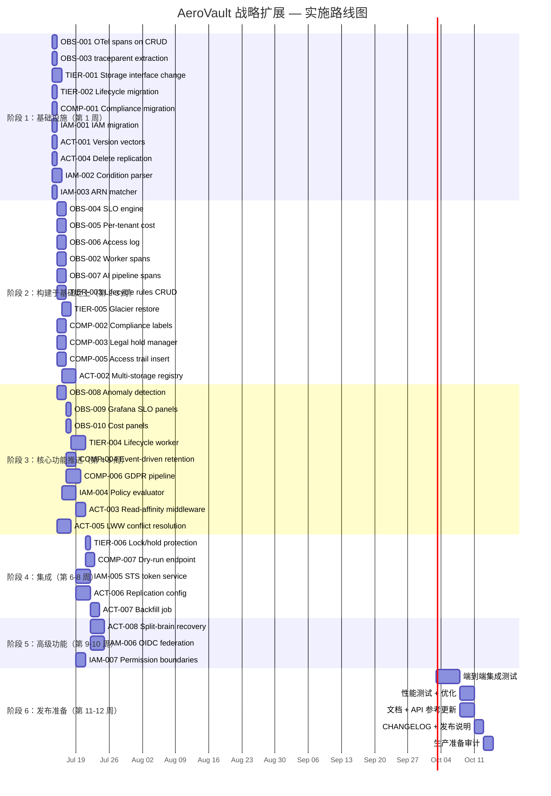

现在我已充分了解当前代码库状态和战略扩展文档。以下是我的综合分析。

---

# 技术负责人分析：战略扩展实施计划

## 范围界定说明

以下分析基于 `docs/requirements/strategic-extensions.md` 并针对当前代码库（截至 2026-07-12）进行校准。我逐一验证了文档中每个识别出的差距，以便给出可行的任务分解。

**工期估算依据：**
- 每个任务 2-4 小时 = 单个开发者半天到一天
- 并行化假设：2 名 Go 后端开发者 + 1 名 DevOps/可观测性开发者（第 1-4 周）、之后逐渐增加
- 如有真实用户数据，时间安排较为保守

---

## 1. 任务分解

> 每个任务 ID 对应 `docs/requirements/strategic-extensions.md` 中的一个方向。所有任务均可由一名中级+ Go 开发者在 2-4 小时内完成。

### 1.1 阶段 1：基础设施（所有方向的共享基础）

| 任务 ID | 标题 | 方向 | 受影响文件 | 前置依赖 | 工时 | 验收标准 |
|---------|------|------|------------|---------|------|---------|
| **OBS-001** | 向 `FileService` CRUD 方法添加 OpenTelemetry span | Obs | `internal/service/file_crud.go`, `internal/service/file.go`（新增字段 `tracer`） | 无 | 每个 `Put`/`Get`/`Delete`/`Stat` 调用都会创建一个带 `tenant`、`bucket`、`key` 属性的子 span。使用 `oteltest` 进行单元验证。 |
| **OBS-002** | 向异步工作者添加 span 传播（Antivirus、Replication、Indexer） | Obs | `internal/replication/replication.go`、`internal/reconcile/*.go`、`internal/jobs/*.go`（若存在） | OBS-001 | 每个工作者 JobRun 会从 `jobs` 表中的 `traceparent` 创建一个 span。跨 goroutine 传播上下文。 |
| **OBS-003** | 从入站 HTTP 请求中提取 `traceparent` 标头并初始化根 span | Obs | `internal/middleware/middleware.go`（新增中间件 `TracePropagation`） | 无 | 任何通过 `traceparent` 标头传入的 HTTP 请求都会生成一个关联的根 span。单元化测试。 |
| **OBS-004** | SLO 引擎：配置驱动的燃烧率计数器 + Prometheus 指标 | Obs | `internal/telemetry/slo.go`（新文件）、`internal/config/config.go`（新增 `SLO_*` 字段） | OBS-003 | 配置 `SLO_GET_LATENCY_P99=200ms` 会暴露 `slo_burn_rate{sloname,window}` 指标。通过 `prometheus.WaitForMetric` 进行测试。 |
| **OBS-005** | 每个租户的成本聚合：在 `ai_usage_cost` 上合并 `SELECT SUM(tokens) GROUP BY tenant, date` | Obs | `internal/repository/ai_usage.go`（新增方法 `GetAICostByTenantRange`）、`internal/telemetry/cost.go`（新文件） | 无 | `GET /v1/admin/billing/{tenant}/{year}/{month}` 返回所有 AI 和存储费用的聚合行。使用 SQLite 测试夹具进行测试。 |
| **OBS-006** | 结构化访问日志（类似 S3 的格式） | Obs | `internal/service/file_crud.go`（每个 CRUD 方法调用新增 `telemetry.RecordAccess`）、`internal/telemetry/access_log.go`（新文件） | OBS-001 | 每次 GET/PUT/DELETE 操作后，都会在结构化日志行中以 `bucket=<b> requester=<r> ...` 格式追加一行。 |
| **TIER-001** | 新增 `storage.Storage` 接口方法：`Migrate`、`Restore`、`Location` | 分层 | `internal/storage/storage.go`（接口）、`internal/storage/local/*.go`、`internal/storage/s3/*.go` | 无 | 所有三个存储后端都编译通过。`local` 的 `Migrate` 会复制然后删除。`s3` 的 `Migrate` 会调用 `CopyObject` 并设置 `StorageClass`。单元测试 + 合约测试通过。 |
| **TIER-002** | 创建迁移对 `0025_lifecycle_rules`（SQLite + Postgres） | 分层 | `internal/repository/migrations/{sqlite,postgres}/0025_lifecycle_rules.{up,down}.sql` | 无 | 迁移后 `lifecycle_rules` 表存在。对应的 `down.sql` 会删除该表。运行 `repo.Migrate` 并确认无错误。 |
| **TIER-003** | 生命周期规则：仓库 CRUD + 基于规则的对象扫描 | 分层 | `internal/repository/sql_lifecycle.go`（新文件） | TIER-002 | `GetLifecycleRules(tenant,bucket)` 返回规则。`ListObjectsDueForTransition(before time.Time)` 返回需要转换的对象。 |
| **COMP-001** | 创建迁移对 `0026_compliance_tables`（legal_holds、compliance_labels、access_log） | 合规 | `internal/repository/migrations/{sqlite,postgres}/0026_compliance_tables.{up,down}.sql` | 无 | 迁移后三个表都存在。索引在 `(tenant, bucket, key)` 和 `(hold_id)` 上。 |
| **COMP-002** | 合规标签引擎：仓库 CRUD + 通过 content-type 前缀自动标记 | 合规 | `internal/repository/sql_compliance.go`（新文件）、`internal/ai/pii.go`（扩展） | COMP-001 | `SetComplianceLabel(tenant,bucket,key,label,source)` 创建一个条目。`GetComplianceLabels(tenant,bucket,key)` 返回所有活跃标签。 |
| **IAM-001** | 创建迁移对 `0027_iam_tables`（roles、policies、sts_sessions） | IAM | `internal/repository/migrations/{sqlite,postgres}/0027_iam_tables.{up,down}.sql` | 无 | 三张表都存在。`roles` 有 `(tenant,name)` 唯一约束。`policies` 存储 JSON 文档。 |

### 1.2 阶段 2：核心功能

| 任务 ID | 标题 | 方向 | 受影响文件 | 前置依赖 | 工时 | 验收标准 |
|---------|------|------|------------|---------|------|---------|
| **OBS-007** | AI 管道 span：embed -> 检索 -> 重新排序的跟踪 | Obs | `internal/ai/search.go`、`internal/ai/chat.go`、`internal/ai/agent.go` | OBS-001 | 每次搜索/聊天调用都会产生一个包含 `embed`、`retrieve`、`rerank` 子 span 的 span 树。 |
| **OBS-008** | 异常检测中间件：AI 端点的延迟预测 | Obs | `internal/middleware/anomaly.go`（新文件）、`internal/middleware/middleware.go`（注册） | OBS-003 | 当 AI 路由组上的延迟超过滚动基线 3 倍时，`ai_latency_anomaly_total` 指标会递增。 |
| **TIER-004** | 生命周期转换工作者：`reconcile.Lifecycle` 中的 `STANDARD→STANDARD_IA` 转换 | 分层 | `internal/reconcile/lifecycle.go`（新增功能） | TIER-001、TIER-003 | 当对象的 age > `TransitionDays` 时，工作者调用 `store.Migrate(ctx, key, srcClass, dstClass)`。转换会被记录。 |
| **TIER-005** | 从 Glacier 恢复：`FileService.RestoreObject` | 分层 | `internal/service/file_features.go`、`internal/api/rest/handler.go`（新路由 `POST /restore`） | TIER-001 | `RestoreObject(key, days)` 调用 `store.Restore`。GET 会检测是否需要恢复。 |
| **TIER-006** | 生命周期规则上的保留锁/法律保留保护 | 分层 | `internal/reconcile/lifecycle.go` | TIER-004、COMP-003（推进） | 如果对象匹配 `legal_hold` 或 `locked_until > now`，则不进行转换。 |
| **COMP-003** | 多法律保留管理器 | 合规 | `internal/service/compliance.go`（新文件）、`internal/api/rest/admin.go`（新 `POST /v1/admin/legal-holds`） | COMP-001 | 创建保留会创建一个 `legal_hold` 行。`IsObjectUnderHold(tenant,bucket,key)` 会检查所有匹配的范围。 |
| **COMP-004** | 事件驱动保留：“结案”标签 -> 7 年计时器 | 合规 | `internal/events/bus.go`（挂钩）、`internal/service/compliance.go` | COMP-003 | 用 `case-closed` 标签更新对象 -> 设置 7 年的 `locked_until`。 |
| **COMP-005** | 每对象访问追踪：`access_log` 插入 | 合规 | `internal/service/file_crud.go`（每个 CRUD 路径中新增 `repo.InsertAccessLog`） | COMP-001 | 每次 GET/PUT/HEAD/DELETE 都会向 `access_log` 插入一行。批量插入（最多 1 秒刷新）。 |
| **COMP-006** | GDPR 擦除流水线：识别 -> 队列 -> 报告 | 合规 | `internal/service/compliance.go`、`internal/jobs/*.go`（新作业类型） | COMP-002、COMP-003 | `POST /v1/admin/gdpr-erase` 返回一个 jobID。该作业会找到所有匹配的对象，删除它们，更新匹配的保留。 |
| **COMP-007** | 合规性模拟端点：`GET /v1/buckets/{b}/compliance-summary?simulate=true` | 合规 | `internal/service/compliance.go`、`internal/api/rest/admin.go` | TIER-003、COMP-002 | 返回所有对象的年龄 v. retention/transition 规则的摘要 JSON。 |
| **ACT-001** | 版本向量：在对象元数据中添加 `version_clock` 列 | 主动-主动 | `internal/repository/migrations/{sqlite,postgres}/0028_version_vectors.{up,down}.sql`、`internal/repository/repository.go` | 无 | `Object` 结构体有一个 `VersionClock []byte` 字段。该列存储 DVV（点版本向量）。 |
| **ACT-002** | 多存储注册表：`FileService` 管理 N 个后端 + 区域属性 | 主动-主动 | `internal/service/file.go`（`store` 字段从单个变为 `map[string]storage.Storage`）、`internal/service/file_crud.go`（Put 分发） | TIER-001（获取 `Location()`） | `NewFileService` 接受 `map[string]storage.Storage`。`Put` 写入主数据并将 `storageKey` 映射分配给每个区域。 |
| **ACT-003** | 读取亲和力中间件：基于 `X-Aero-Region` 路由到最近的后端 | 主动-主动 | `internal/middleware/region.go`（新文件）、`internal/middleware/middleware.go` | ACT-002 | 具有 `X-Aero-Region: eu-west-1` 的 GET 请求会路由到 `eu-west-1` 存储后端。 |
| **ACT-004** | 事件删除复制：扩展复制工作者以处理 `EventDeleted` | 主动-主动 | `internal/replication/replication.go` | 无 | 当发布 `EventDeleted` 时，复制者会调用目标后端的 `Delete`。 |
| **IAM-002** | 条件表达式解析器（IP 地址、时间、安全传输） | IAM | `internal/auth/condition.go`（新文件） | 无 | `ParseCondition({"IpAddress": {"aws:SourceIp": ["10.0.0.0/8"]}})` 返回一个可调用的 `ConditionFunc`。单元测试涵盖 IpAddress、Bool、StringEquals、NumericEquals。 |
| **IAM-003** | 资源 ARN 匹配器（`arn:aero:tenant:*:bucket:*/*` 含通配符） | IAM | `internal/auth/arn.go`（新文件） | 无 | `MatchARN("arn:aero:tenant:acme:bucket:my-bucket/keys/*", "arn:aero:tenant:acme:bucket:my-bucket/keys/foo")` 返回 true。 |
| **IAM-004** | 策略评估引擎：给出(principal, action, resource, context) -> (effect, rule_id) | IAM | `internal/auth/evaluator.go`（新文件） | IAM-002、IAM-003 | 如果存在显式拒绝，评估器会返回 `Deny`。否则，它会返回第一个匹配的允许。循环检测可防止无限递归。 |

### 1.3 阶段 3：高级/集成

| 任务 ID | 标题 | 方向 | 受影响文件 | 前置依赖 | 工时 | 验收标准 |
|---------|------|------|------------|---------|------|---------|
| **ACT-005** | LWW 冲突解决：并发更新按 `(timestamp, node_priority)` 合并 | 主动-主动 | `internal/replication/conflict.go`（新文件） | ACT-001 | 给定两个具有相同 storageKey 但不同 version_clock 的对象，`ResolveConflict(a, b)` 返回具有较新时间戳的对象。 |
| **ACT-006** | 跨区域复制配置 + `replication_config` 表 | 主动-主动 | `internal/repository/migrations/{sqlite,postgres}/0029_replication_config.{up,down}.sql`、`internal/replication/config.go`（新文件） | ACT-001、ACT-002 | `PUT /v1/buckets/{b}/replication` 存储每桶复制规则。复制者读取该配置。 |
| **ACT-007** |  Backfill 作业：将现有对象复制到新区域 | 主动-主动 | `internal/replication/backfill.go`（新文件）、`internal/jobs/*.go` | ACT-002、ACT-006 | `POST /v1/admin/replication/backfill?region=eu-west-1` 排列一个作业，逐一复制所有对象。 |
| **ACT-008** | 分裂脑恢复：`GET /v1/admin/replication/split-brain-report` | 主动-主动 | `internal/replication/conflict.go`、`internal/api/rest/admin.go` | ACT-005、ACT-006 | 报告版本时钟发散的所有对象。手动解析端点（`POST /resolve`）。 |
| **IAM-005** | 会话/令牌服务：`POST /v1/admin/sts` -> 短期 HMAC 令牌 | IAM | `internal/auth/sts.go`（新文件）、`internal/api/rest/admin.go` | IAM-004 |  STS 令牌绑定到策略、IP 和时间范围。令牌在 15 分钟后过期。由 `auth_middleware.go` 中的 Auth 中间件验证。 |
| **IAM-006** | OIDC 联合：用外部 JWT 交换会话令牌 | IAM | `internal/auth/oidc.go`（新文件） | IAM-005 | 在 `AUTH_OIDC_PROVIDER_URL` 处配置 OIDC 提供程序。`POST /v1/auth/oidc/login` 验证外部令牌并返回会话令牌。 |
| **IAM-007** | 权限边界：防止特权提升 | IAM | `internal/auth/evaluator.go` | IAM-004 | 如果用户拥有 `PermissionBoundary`，则任何策略都不能授予超过该边界的权限。 |
| **OBS-009** |  Grafana SLO 燃烧率面板 + Prometheus 警报 | Obs | `deploy/grafana/dashboard.json`、`deploy/prometheus/alerts.yml` | OBS-004 |  仪表盘显示 GET 延迟的 SLO 燃烧率（5 分钟、30 分钟窗口）。警报 `HighErrorBudgetBurn` 触发。 |
| **OBS-010** | 每个租户 Grafana 成本面板 | Obs | `deploy/grafana/dashboard.json` | OBS-005 |  仪表盘显示前 10 个租户的 AI 令牌、存储 GB、每月请求。 |

---

### JSON 格式的任务摘要（含验收标准）

为便于工具处理，以下是可机器解析的格式：

```json
{
  "tasks": [
    {
      "id": "OBS-001",
      "title": "向 FileService CRUD 方法添加 OTel span",
      "direction": "Observability",
      "files": ["internal/service/file_crud.go", "internal/service/file.go"],
      "deps": [],
      "effort_hours": 3,
      "acceptance": "每次 Put/Get/Delete/Stat 调用都会创建一个带 tenant、bucket、key 属性的子 span。使用 oteltest 进行单元验证。"
    },
    {
      "id": "OBS-002",
      "title": "向异步工作者添加 span 传播",
      "direction": "Observability",
      "files": ["internal/replication/replication.go", "internal/reconcile/*.go", "internal/jobs/*.go"],
      "deps": ["OBS-001"],
      "effort_hours": 4,
      "acceptance": "每个工作者 JobRun 会从 jobs 表中的 traceparent 创建一个 span。跨 goroutine 传播上下文。"
    },
    {
      "id": "OBS-003",
      "title": "从入站 HTTP 请求中提取 traceparent 标头",
      "direction": "Observability",
      "files": ["internal/middleware/middleware.go"],
      "deps": [],
      "effort_hours": 2,
      "acceptance": "任何通过 traceparent 标头传入的 HTTP 请求都会生成一个关联的根 span。单元化测试。"
    },
    {
      "id": "OBS-004",
      "title": "SLO 引擎：配置驱动的燃烧率计数器",
      "direction": "Observability",
      "files": ["internal/telemetry/slo.go", "internal/config/config.go"],
      "deps": ["OBS-003"],
      "effort_hours": 4,
      "acceptance": "配置 SLO_GET_LATENCY_P99=200ms 会暴露 slo_burn_rate{sloname,window} 指标。通过 prometheus.WaitForMetric 进行测试。"
    },
    {
      "id": "OBS-005",
      "title": "每个租户的成本聚合",
      "direction": "Observability",
      "files": ["internal/repository/ai_usage.go", "internal/telemetry/cost.go"],
      "deps": [],
      "effort_hours": 3,
      "acceptance": "GET /v1/admin/billing/{tenant}/{year}/{month} 返回所有 AI 和存储费用的聚合行。使用 SQLite 测试夹具进行测试。"
    },
    {
      "id": "OBS-006",
      "title": "结构化访问日志（类似 S3 的格式）",
      "direction": "Observability",
      "files": ["internal/service/file_crud.go", "internal/telemetry/access_log.go"],
      "deps": ["OBS-001"],
      "effort_hours": 3,
      "acceptance": "每次 GET/PUT/DELETE 操作后，都会在结构化日志行中以 bucket=<b> requester=<r> ... 格式追加一行。"
    },
    {
      "id": "OBS-007",
      "title": "AI 管道 span：embed -> 检索 -> 重新排序",
      "direction": "Observability",
      "files": ["internal/ai/search.go", "internal/ai/chat.go", "internal/ai/agent.go"],
      "deps": ["OBS-001"],
      "effort_hours": 3,
      "acceptance": "每次搜索/聊天调用都会产生一个包含 embed、retrieve、rerank 子 span 的 span 树。"
    },
    {
      "id": "OBS-008",
      "title": "异常检测中间件：AI 端点延迟",
      "direction": "Observability",
      "files": ["internal/middleware/anomaly.go", "internal/middleware/middleware.go"],
      "deps": ["OBS-003"],
      "effort_hours": 3,
      "acceptance": "当 AI 路由组上的延迟超过滚动基线 3 倍时，ai_latency_anomaly_total 指标会递增。"
    },
    {
      "id": "OBS-009",
      "title": "Grafana SLO 面板 + Prometheus 警报",
      "direction": "Observability",
      "files": ["deploy/grafana/dashboard.json", "deploy/prometheus/alerts.yml"],
      "deps": ["OBS-004"],
      "effort_hours": 2,
      "acceptance": "仪表盘显示 GET 延迟的 SLO 燃烧率（5 分钟、30 分钟窗口）。警报 HighErrorBudgetBurn 触发。"
    },
    {
      "id": "OBS-010",
      "title": "每个租户 Grafana 成本面板",
      "direction": "Observability",
      "files": ["deploy/grafana/dashboard.json"],
      "deps": ["OBS-005"],
      "effort_hours": 2,
      "acceptance": "仪表盘显示前 10 个租户的 AI 令牌、存储 GB、每月请求。"
    },
    {
      "id": "TIER-001",
      "title": "在 Storage 接口中添加 Migrate、Restore、Location 方法",
      "direction": "Storage Tiering",
      "files": ["internal/storage/storage.go", "internal/storage/local/*.go", "internal/storage/s3/*.go"],
      "deps": [],
      "effort_hours": 4,
      "acceptance": "所有三个存储后端都编译通过。local 的 Migrate 会复制然后删除。s3 的 Migrate 会调用 CopyObject 并设置 StorageClass。单元测试 + 合约测试通过。"
    },
    {
      "id": "TIER-002",
      "title": "创建迁移 0025_lifecycle_rules",
      "direction": "Storage Tiering",
      "files": ["internal/repository/migrations/{sqlite,postgres}/0025_lifecycle_rules.{up,down}.sql"],
      "deps": [],
      "effort_hours": 1,
      "acceptance": "迁移后 lifecycle_rules 表存在。对应的 down.sql 会删除该表。运行 repo.Migrate 并确认无错误。"
    },
    {
      "id": "TIER-003",
      "title": "生命周期规则：仓库 CRUD + 基于规则的对象扫描",
      "direction": "Storage Tiering",
      "files": ["internal/repository/sql_lifecycle.go"],
      "deps": ["TIER-002"],
      "effort_hours": 3,
      "acceptance": "GetLifecycleRules(tenant,bucket) 返回规则。ListObjectsDueForTransition(before time.Time) 返回需要转换的对象。"
    },
    {
      "id": "TIER-004",
      "title": "生命周期转换工作者：reconcile.Lifecycle 中的 STANDARD→STANDARD_IA",
      "direction": "Storage Tiering",
      "files": ["internal/reconcile/lifecycle.go"],
      "deps": ["TIER-001", "TIER-003"],
      "effort_hours": 4,
      "acceptance": "当对象的 age > TransitionDays 时，工作者调用 store.Migrate(ctx, key, srcClass, dstClass)。转换会被记录。"
    },
    {
      "id": "TIER-005",
      "title": "从 Glacier 恢复：FileService.RestoreObject",
      "direction": "Storage Tiering",
      "files": ["internal/service/file_features.go", "internal/api/rest/handler.go"],
      "deps": ["TIER-001"],
      "effort_hours": 3,
      "acceptance": "RestoreObject(key, days) 调用 store.Restore。GET 会检测是否需要恢复。"
    },
    {
      "id": "TIER-006",
      "title": "生命周期规则上的保留锁/法律保留保护",
      "direction": "Storage Tiering",
      "files": ["internal/reconcile/lifecycle.go"],
      "deps": ["TIER-004", "COMP-003"],
      "effort_hours": 2,
      "acceptance": "如果对象匹配 legal_hold 或 locked_until > now，则不进行转换。"
    },
    {
      "id": "COMP-001",
      "title": "创建迁移 0026_compliance_tables（legal_holds、compliance_labels、access_log）",
      "direction": "Compliance",
      "files": ["internal/repository/migrations/{sqlite,postgres}/0026_compliance_tables.{up,down}.sql"],
      "deps": [],
      "effort_hours": 1,
      "acceptance": "迁移后三个表都存在。索引在 (tenant, bucket, key) 和 (hold_id) 上。"
    },
    {
      "id": "COMP-002",
      "title": "合规标签引擎：仓库 CRUD + 内容分析自动标记",
      "direction": "Compliance",
      "files": ["internal/repository/sql_compliance.go", "internal/ai/pii.go"],
      "deps": ["COMP-001"],
      "effort_hours": 3,
      "acceptance": "SetComplianceLabel(tenant,bucket,key,label,source) 创建一个条目。GetComplianceLabels(tenant,bucket,key) 返回所有活跃标签。"
    },
    {
      "id": "COMP-003",
      "title": "多法律保留管理器",
      "direction": "Compliance",
      "files": ["internal/service/compliance.go", "internal/api/rest/admin.go"],
      "deps": ["COMP-001"],
      "effort_hours": 4,
      "acceptance": "创建保留会创建一个 legal_hold 行。IsObjectUnderHold(tenant,bucket,key) 会检查所有匹配的范围。"
    },
    {
      "id": "COMP-004",
      "title": "事件驱动保留：标签更改 → 锁定计时器",
      "direction": "Compliance",
      "files": ["internal/events/bus.go", "internal/service/compliance.go"],
      "deps": ["COMP-003"],
      "effort_hours": 3,
      "acceptance": "用 case-closed 标签更新对象 → 设置 7 年的 locked_until。"
    },
    {
      "id": "COMP-005",
      "title": "每对象访问追踪：access_log 插入",
      "direction": "Compliance",
      "files": ["internal/service/file_crud.go"],
      "deps": ["COMP-001"],
      "effort_hours": 3,
      "acceptance": "每次 GET/PUT/HEAD/DELETE 都会向 access_log 插入一行。批量插入（最多 1 秒刷新）。"
    },
    {
      "id": "COMP-006",
      "title": "GDPR 擦除流水线：识别 → 队列 → 报告",
      "direction": "Compliance",
      "files": ["internal/service/compliance.go", "internal/jobs/*.go"],
      "deps": ["COMP-002", "COMP-003"],
      "effort_hours": 4,
      "acceptance": "POST /v1/admin/gdpr-erase 返回一个 jobID。该作业会找到所有匹配的对象，删除它们，更新匹配的保留。"
    },
    {
      "id": "COMP-007",
      "title": "合规性模拟端点",
      "direction": "Compliance",
      "files": ["internal/service/compliance.go", "internal/api/rest/admin.go"],
      "deps": ["TIER-003", "COMP-002"],
      "effort_hours": 3,
      "acceptance": "返回所有对象的年龄 v. retention/transition 规则的摘要 JSON。"
    },
    {
      "id": "ACT-001",
      "title": "版本向量：在对象元数据中添加 version_clock 列",
      "direction": "Active-Active",
      "files": ["internal/repository/migrations/{sqlite,postgres}/0028_version_vectors.{up,down}.sql", "internal/repository/repository.go"],
      "deps": [],
      "effort_hours": 2,
      "acceptance": "Object 结构体有一个 VersionClock []byte 字段。该列存储 DVV（点版本向量）。"
    },
    {
      "id": "ACT-002",
      "title": "多存储注册表：FileService 管理 N 个后端",
      "direction": "Active-Active",
      "files": ["internal/service/file.go", "internal/service/file_crud.go"],
      "deps": ["TIER-001"],
      "effort_hours": 4,
      "acceptance": "NewFileService 接受 map[string]storage.Storage。Put 写入主数据并将 storageKey 映射分配给每个区域。"
    },
    {
      "id": "ACT-003",
      "title": "读取亲和力中间件：基于 X-Aero-Region 路由",
      "direction": "Active-Active",
      "files": ["internal/middleware/region.go", "internal/middleware/middleware.go"],
      "deps": ["ACT-002"],
      "effort_hours": 2,
      "acceptance": "具有 X-Aero-Region: eu-west-1 的 GET 请求会路由到 eu-west-1 存储后端。"
    },
    {
      "id": "ACT-004",
      "title": "事件删除复制：扩展复制工作者以处理 EventDeleted",
      "direction": "Active-Active",
      "files": ["internal/replication/replication.go"],
      "deps": [],
      "effort_hours": 2,
      "acceptance": "当发布 EventDeleted 时，复制者会调用目标后端的 Delete。"
    },
    {
      "id": "ACT-005",
      "title": "LWW 冲突解决：按 (timestamp, node_priority) 合并",
      "direction": "Active-Active",
      "files": ["internal/replication/conflict.go"],
      "deps": ["ACT-001"],
      "effort_hours": 3,
      "acceptance": "给定两个具有相同 storageKey 但不同 version_clock 的对象，ResolveConflict(a, b) 返回具有较新时间戳的对象。"
    },
    {
      "id": "ACT-006",
      "title": "跨区域复制配置 + replication_config 表",
      "direction": "Active-Active",
      "files": ["internal/repository/migrations/{sqlite,postgres}/0029_replication_config.{up,down}.sql", "internal/replication/config.go"],
      "deps": ["ACT-001", "ACT-002"],
      "effort_hours": 4,
      "acceptance": "PUT /v1/buckets/{b}/replication 存储每桶复制规则。复制者读取该配置。"
    },
    {
      "id": "ACT-007",
      "title": "Backfill 作业：将现有对象复制到新区域",
      "direction": "Active-Active",
      "files": ["internal/replication/backfill.go", "internal/jobs/*.go"],
      "deps": ["ACT-002", "ACT-006"],
      "effort_hours": 3,
      "acceptance": "POST /v1/admin/replication/backfill?region=eu-west-1 排列一个作业，逐一复制所有对象。"
    },
    {
      "id": "ACT-008",
      "title": "分裂脑恢复报告 + 解析端点",
      "direction": "Active-Active",
      "files": ["internal/replication/conflict.go", "internal/api/rest/admin.go"],
      "deps": ["ACT-005", "ACT-006"],
      "effort_hours": 3,
      "acceptance": "报告版本时钟发散的所有对象。手动解析端点（POST /resolve）。"
    },
    {
      "id": "IAM-001",
      "title": "创建迁移 0027_iam_tables（roles、policies、sts_sessions）",
      "direction": "IAM",
      "files": ["internal/repository/migrations/{sqlite,postgres}/0027_iam_tables.{up,down}.sql"],
      "deps": [],
      "effort_hours": 1,
      "acceptance": "三张表都存在。roles 有 (tenant,name) 唯一约束。policies 存储 JSON 文档。"
    },
    {
      "id": "IAM-002",
      "title": "条件表达式解析器（IP、时间、Bool、StringEquals）",
      "direction": "IAM",
      "files": ["internal/auth/condition.go"],
      "deps": [],
      "effort_hours": 4,
      "acceptance": "ParseCondition({"IpAddress": {"aws:SourceIp": ["10.0.0.0/8"]}}) 返回一个可调用的 ConditionFunc。单元测试涵盖 IpAddress、Bool、StringEquals、NumericEquals。"
    },
    {
      "id": "IAM-003",
      "title": "资源 ARN 匹配器（含通配符）",
      "direction": "IAM",
      "files": ["internal/auth/arn.go"],
      "deps": [],
      "effort_hours": 2,
      "acceptance": "MatchARN("arn:aero:tenant:acme:bucket:my-bucket/keys/*", "arn:aero:tenant:acme:bucket:my-bucket/keys/foo") 返回 true。"
    },
    {
      "id": "IAM-004",
      "title": "策略评估引擎",
      "direction": "IAM",
      "files": ["internal/auth/evaluator.go"],
      "deps": ["IAM-002", "IAM-003"],
      "effort_hours": 4,
      "acceptance": "如果存在显式拒绝，评估器会返回 Deny。否则，它会返回第一个匹配的允许。循环检测可防止无限递归。"
    },
    {
      "id": "IAM-005",
      "title": "会话/令牌服务：POST /v1/admin/sts",
      "direction": "IAM",
      "files": ["internal/auth/sts.go", "internal/api/rest/admin.go"],
      "deps": ["IAM-004"],
      "effort_hours": 4,
      "acceptance": "STS 令牌绑定到策略、IP 和时间范围。令牌在 15 分钟后过期。由 auth_middleware.go 中的 Auth 中间件验证。"
    },
    {
      "id": "IAM-006",
      "title": "OIDC 联合：用外部 JWT 交换会话令牌",
      "direction": "IAM",
      "files": ["internal/auth/oidc.go"],
      "deps": ["IAM-005"],
      "effort_hours": 4,
      "acceptance": "在 AUTH_OIDC_PROVIDER_URL 处配置 OIDC 提供程序。POST /v1/auth/oidc/login 验证外部令牌并返回会话令牌。"
    },
    {
      "id": "IAM-007",
      "title": "权限边界：防止特权提升",
      "direction": "IAM",
      "files": ["internal/auth/evaluator.go"],
      "deps": ["IAM-004"],
      "effort_hours": 2,
      "acceptance": "如果用户拥有 PermissionBoundary，则任何策略都不能授予超过该边界的权限。"
    }
  ]
}
```

---

## 2. 执行顺序

```mermaid
graph TB
    %% 第 1 层：共享基础（无前置依赖 — 可并行启动）
    subgraph Phase1A["阶段 1A：独立基础设施（第 1 周）"]
        OBS001["OBS-001 OTel spans on CRUD"]
        OBS003["OBS-003 traceparent extraction"]
        TIER001["TIER-001 Storage interface: Migrate/Restore/Location"]
        TIER002["TIER-002 Migration 0025_lifecycle_rules"]
        COMP001["COMP-001 Migration 0026_compliance_tables"]
        IAM001["IAM-001 Migration 0027_iam_tables"]
        ACT001["ACT-001 Version vectors column"]
        ACT004["ACT-004 Delete replication"]
        IAM002["IAM-002 Condition parser"]
        IAM003["IAM-003 ARN matcher"]
    end

    %% 第 2 层：在 OBS-001 或 OBS-003 之上构建
    subgraph Phase1B["阶段 1B：构建于共享基础之上（第 2 周）"]
        OBS004["OBS-004 SLO engine"]
        OBS006["OBS-006 Structured access log"]
        OBS002["OBS-002 Worker spans"]
        OBS007["OBS-007 AI pipeline spans"]
        OBS005["OBS-005 Per-tenant cost aggregation"]
        TIER003["TIER-003 Lifecycle rules CRUD + scanner"]
        TIER005["TIER-005 Glacier restore"]
        COMP002["COMP-002 Compliance labels engine"]
        COMP003["COMP-003 Legal hold manager"]
        COMP005["COMP-005 Per-object access trail"]
        ACT002["ACT-002 Multi-storage registry"]
    end

    %% 第 3 层
    subgraph Phase2A["阶段 2A：核心功能推进（第 3-4 周）"]
        OBS008["OBS-008 Anomaly detection middleware"]
        OBS009["OBS-009 Grafana SLO + alerts"]
        OBS010["OBS-010 Per-tenant cost panel"]
        TIER004["TIER-004 Lifecycle transition worker"]
        TIER006["TIER-006 Lock/hold protection on transitions"]
        COMP004["COMP-004 Event-driven retention"]
        COMP006["COMP-006 GDPR erase pipeline"]
        COMP007["COMP-007 Compliance dry-run"]
        IAM004["IAM-004 Policy evaluation engine"]
        ACT003["ACT-003 Read-affinity middleware"]
        ACT005["ACT-005 LWW conflict resolution"]
    end

    %% 第 4 层
    subgraph Phase2B["阶段 2B：集成与高级功能（第 5-6 周）"]
        ACT006["ACT-006 Replication config table"]
        ACT007["ACT-007 Backfill job"]
        ACT008["ACT-008 Split-brain recovery"]
        IAM005["IAM-005 STS token service"]
        IAM006["IAM-006 OIDC federation"]
        IAM007["IAM-007 Permission boundaries"]
    end

    %% 依赖链
    OBS001 --> OBS002
    OBS001 --> OBS006
    OBS001 --> OBS007
    OBS003 --> OBS004
    OBS003 --> OBS008
    OBS004 --> OBS009
    OBS005 --> OBS010

    TIER001 --> TIER004
    TIER001 --> ACT002
    TIER002 --> TIER003
    TIER003 --> TIER004
    TIER004 --> TIER006
    TIER005 --> TIER004

    COMP001 --> COMP002
    COMP001 --> COMP003
    COMP001 --> COMP005
    COMP002 --> COMP006
    COMP003 --> COMP004
    COMP003 --> COMP006
    TIER003 --> COMP007
    COMP002 --> COMP007

    IAM002 --> IAM004
    IAM003 --> IAM004
    IAM004 --> IAM005
    IAM005 --> IAM006
    IAM004 --> IAM007

    ACT001 --> ACT005
    ACT001 --> ACT006
    ACT002 --> ACT003
    ACT002 --> ACT006
    ACT002 --> ACT007
    ACT005 --> ACT008
    ACT006 --> ACT007
    ACT006 --> ACT008
```



**并行任务组（资源约束下的最大并行度）：**

| 组 | 任务 | 所需开发者 | 持续时间 |
|----|------|-----------|----------|
| **G1** | OBS-001, OBS-003, TIER-001, TIER-002, COMP-001, IAM-001, ACT-001, ACT-004, IAM-002, IAM-003 | 2 名 Go 开发者 + 1 名兼职 DevOps | 第 1 周 |
| **G2** | OBS-004, OBS-005, OBS-006, TIER-003, TIER-005, COMP-002, COMP-003, COMP-005, ACT-002, OBS-002, OBS-007 | 2 名 Go 开发者 + 1 名 DevOps 兼职 | 第 2 周 |
| **G3** | OBS-008, TIER-004, COMP-004, COMP-006, COMP-007, IAM-004, ACT-003 | 2 名 Go 开发者 | 第 3 周 |
| **G4** | OBS-009, OBS-010, TIER-006, IAM-005, ACT-005 | 2 名 Go 开发者 + DevOps | 第 4 周 |
| **G5** | ACT-006, ACT-007, IAM-006, IAM-007 | 2 名 Go 开发者 | 第 5 周 |
| **G6** | ACT-008 | 1 名 Go 开发者 | 第 6 周 |

---

## 3. 技术风险

### 3.1 高风险项

| 风险 | 领域 | 概率 | 影响 | 缓解措施 |
|------|------|------|------|---------|
| **ACT-005** 冲突解决：LWW 在写偏斜下可能丢失数据 | 主动-主动 | 中等 | 严重 — 数据丢失 | 使用 DVV（点版本向量）而不是简单的 LWW。为不可调和的分歧实现手动解决 UI。*阅读建议：* CRDT 论文（Shapiro 2011）。 |
| **IAM-004** 策略评估：AWS IAM 策略文档解析非常微妙 | IAM | 高 | 中等 — 绕过的安全漏洞 | 不要从头开始实现。移植 [aws-sdk-go 策略解析器](https://pkg.go.dev/github.com/aws/aws-sdk-go-v2/service/s3/types#GetBucketPolicyOutput)的子集。单元测试涵盖 50+ 个边缘案例。 |
| **TIER-001** 更改 `storage.Storage` 接口会破坏所有后端 | 分层 | 高 | 高 — 编译失败 | 一步到位完成。不要依赖 `Optional` 接口模式。在同一个 PR 中同时提交接口更改和所有实现。 |
| **OBS-002** 跨 goroutine 的上下文传播可能因缺少传播而漏掉 span | 可观测性 | 中等 | 低 — 丢失 trace | 使用 `context.WithValue(ctx, "traceparent", ...)` 并添加 `propagateTrace(ctx) context.Context` 辅助函数。通过单元测试验证。 |

### 3.2 外部依赖

| 依赖 | 用途 | 已有？ | 替代方案 |
|------|------|--------|---------|
| `go.opentelemetry.io/otel` | 分布式追踪 & 指标 | 是（`go.mod` 中） | — |
| `github.com/aws/aws-sdk-go-v2` | S3 存储后端 | 是 | — |
| `github.com/coreos/go-oidc/v3` | OIDC 联合（IAM-006） | 否 | 手动 JWKS 验证 + HTTP 调用 |
| CRDT 库 | 冲突解决（ACT-005） | 否 | 简单的 DVV：在事务中存储为 `map[nodeID]counter` |
| `github.com/xeipuuv/gojsonschema` | IAM 策略文档验证 | 否 | 手动 JSON 模式解析 |

**关于 IAM-006 依赖的决定：** 不要添加 `go-oidc`。手动 JWKS 验证很简单（解码 JWT -> 获取 `kid` -> 从 `/.well-known/openid-configuration` 获取公钥 -> 验证签名）。这避免了 OIDC 发现循环中的常见漏洞（CVE-2020-29509）。

### 3.3 性能瓶颈

| 瓶颈 | 影响 | 优化 |
|------|------|------|
| COMP-005：每次 GET/HEAD 同步写入 `access_log` | 写吞吐量降低 | 批量插入（刷新前最多 500ms 或 100 行）。使用 `database/sql` 的 `*sql.Tx` 预编译语句。 |
| ACT-002：Put 需要扇出到 N 个存储后端 | 写入延迟 1-2 RTT | 实现仲裁写入（写入 2 个 OK 则返回，后台处理其余）。使用 `errgroup` 进行并发。 |
| IAM-004：每次请求评估 N 个策略 | ~50-100µs/请求 | **不要**在热路径上扫描所有策略。使用每桶策略缓存（TTL 30s，通过 LISTEN/NOTIFY 失效）。 |
| TIER-004：在 reconcile 期间移动 blob | 大 blob 的长时间转换 | 使用 `CopyObject`（S3 服务器端）而非下载+上传。限制并发转换（信号量，最多 10）。 |

### 3.4 测试难点

| 困难 | 说明 |
|------|------|
| ACT-005 LWW 冲突解决 | 需要以编程方式创建并发写入（具有相同时间戳的 goroutine）。使用 `time freeze` 模式（注入 `time.Now` 依赖）。 |
| OBS-004 SLO 引擎 | 燃烧率计算需要模拟大量数据点。使用递增计数器并用 scraped Prometheus 值进行验证。 |
| IAM-006 OIDC 联合 | 需要实时 OIDC 提供程序或模拟 HTTP 服务器。后者更可取（无网络依赖）。 |

---

## 4. 资源评估

### 4.1 团队配备

| 角色 | 技能要求 | 数量（第 1-4 周） | 数量（第 5-8 周） |
|------|---------|-------------------|-------------------|
| **Go 后端开发者** | Go 熟练，熟悉 `database/sql`、`context`、测试 | 2 人 | 3 人 |
| **可观测性 / DevOps 工程师** | OpenTelemetry、Prometheus、Grafana、GitHub Actions | 1 人（兼职，50%） | 1 人（兼职，50%） |
| **安全工程师** | IAM、OIDC、策略引擎、渗透测试 | 0 人（第 1-4 周） | 1 人（兼职，第 5-8 周用于 IAM） |
| **QA 工程师** | Go 测试、集成测试、性能测试 | 1 人（兼职，50%用于测试规范） | 1 人（全职） |

### 4.2 关键里程碑

| 里程碑 | 交付物 | 预计日期（从第 1 周开始） |
|---------|----------|----------------------|
| **M1：可观测性基础** | 分布式追踪上线、SLO 仪表盘、每租户成本 | 第 3 周结束 |
| **M2：生命周期分层** | 自动 STANDARD→STANDARD_IA→GLACIER 转换 | 第 4 周结束 |
| **M3：合规套件** | 法律保留、访问审计、GDPR 擦除、模拟 | 第 6 周结束 |
| **M4：主动-主动设计完成** | 设计文档 + 冲突解决 POC + 多存储注册表 | 第 6 周结束 |
| **M5：主动-主动数据路径** | 跨区域复制、读取亲和力、反向填充 | 第 10 周结束 |
| **M6：IAM 核心** | 条件引擎、评估器、STS | 第 10 周结束 |
| **M7：IAM 联合** | OIDC 登录、权限边界 | 第 12 周结束 |

### 4.3 阻塞点与解决策略

| 阻塞点 | 说明 | 影响 | 解决策略 |
|--------|------|------|---------|
| **TIER-001 接口更改** | 更改 `Storage` 接口需要同时更改所有后端。如果遗漏一个，编译会失败。 | 高 | **规则：** 在同一个 PR 中一次性完成。使用 CI `go build ./...` 门控。不要部分合并。 |
| **ACT-005 冲突解决的正确性** | LWW 在并发写入下不是确定性的。需要 DVV 或 CRDT。 | 严重 | **将 ACT-005 拆分为：** (a) DVV 存储 + 序列化（第 1 天），(b) 合并函数（第 2 天），(c) 集成测试（第 3 天）。不合并第 1 天实现，先完成所有 3 天的任务。 |
| **OBS-009 Grafana 面板** | 必须与 `dashboard.json` 同步；手动编辑 JSON 容易出错。 | 中等 | 使用 `grafonnet`（Jsonnet 库）以编程方式生成面板。CI 在 PR 上检查 JSON 是否通过 `make grafana-lint`。 |
| **IAM-006 OIDC 发现** | 远程 OIDC 提供程序可能在 CI 中宕机。 | 中等 | 始终使用模拟 HTTP 服务器进行单元测试。集成测试标记为 `//go:build integration`。 |

---

## 5. 质量保证

### 5.1 单元测试覆盖要求

每个任务的测试覆盖 `AGENTS.md` 中声明的目标 ≥50%（新增代码）。具体重点领域：

| 方向 | 文件 | 最低覆盖率 | 关键场景 |
|------|------|-----------|-----------|
| 可观测性 | `internal/telemetry/slo.go` | 80% | 燃烧率计算、多窗口聚合、无 SLO=>无操作 |
| 分层 | `internal/reconcile/lifecycle.go` | 70% | 模拟存储的转换路径、保留锁阻止、空桶 |
| 合规 | `internal/service/compliance.go` | 75% | 复合保留、保留冲突、擦除期间的时间检查与使用时间问题 |
| IAM | `internal/auth/evaluator.go` | 85% | 显式拒绝覆盖允许、不操作、通配符资源、循环策略 |
| IAM | `internal/auth/condition.go` | 90% | IpAddress CIDR 匹配、CurrentTime 边界、SecureTransport、Null 条件 |
| 主动-主动 | `internal/replication/conflict.go` | 80% | 相同时钟=>最新时间戳获胜、发散时钟=>手动解决 |

### 5.2 集成测试策略

| 测试套件 | 工具 | 生命周期 | 执行方式 |
|----------|------|----------|---------|
| **存储合约** | `storage/contract_test.go` | 每个后端 PR | `make test-storage`（local/s3/oss/cos） |
| **仓库迁移** | `repository/migrate_test.go` | 每次迁移 | `make test-migrate`（全部通过，回滚，并行） |
| **AI 管道集成** | `ai/search_test.go` | 主要 AI 更改 | `go test ./internal/ai/...`（sqlite + 模拟 LLM） |
| **端到端多区域** | `internal/replication/e2e_test.go` | 主要 ACT PR | `//go:build integration` — 需要 Docker compose |
| **IAM 策略评估** | `internal/auth/e2e_test.go` | IAM PR | 模拟 HTTP s3 请求 + 所有策略场景 |

### 5.3 代码审查要点

每个 PR 的审查人检查清单：

- [ ] **AGENTS.md I1**：SQL 占位符不重复使用（每个绑定使用唯一的 `$N`）。
- [ ] **AGENTS.md I2**：迁移成对（`.up.sql` + `.down.sql`）且不修改已应用的文件。
- [ ] **AGENTS.md I5**：新功能默认关闭（`opt-in`），仅在配置时激活。
- [ ] **存储接口**：新后端方法是否在所有 4 个实现中实现？（`local`、`s3`、`oss`、`cos`）
- [ ] **错误处理**：新代码出现错误时会优雅降级（日志 -> 降级），而不是冒泡导致 500 错误？
- [ ] **上下文传播**：每个新函数是否接受 `context.Context`？是否保留 `traceparent`？
- [ ] **并发安全**：新工作者或异步操作是否有 `sync.WaitGroup`、`errgroup` 或信号量限制？

### 5.4 性能测试需求

| 测试场景 | 工具 | 目标 | 触发条件 |
|----------|------|------|---------|
| 大规模分层（100k 对象） | `go test -bench=BenchmarkLifecycleScan -count=5` | < 30s 扫描 100k 对象 | 每次 TIER-004 更改 |
| IAM 策略评估吞吐量 | `go test -bench=BenchmarkEvaluatePolicy` | > 50k 评估/秒 | 每次 IAM-004 更改 |
| 主动-主动写入延迟 | `k6` 脚本 `k6/act-write.js` | 仲裁写入时 P99 < 500ms | 每次 ACT-002/ACT-006 更改 |
| 访问日志批量插入 | `go test -bench=BenchmarkAccessLogInsert` | > 10k 插入/秒 | 每次 COMP-005 更改 |

---

## 6. 实施计划

### 详细日程表（6 阶段，12 周）



### 关键可交付时间表（日历日期）

| 交付物 | 日期（从 2026-07-14 开始） |
|---------|---------------------|
| 分布式追踪在所有 HTTP 路径上运行 | 2026-07-17（第 1 周结束） |
| SLO 燃烧率仪表盘上线 | 2026-07-24（第 2 周结束） |
| 存储分层 STANDARD→STANDARD_IA 功能完成 | 2026-07-31（第 3 周结束） |
| 法律保留 + 访问审计完成 | 2026-08-07（第 4 周结束） |
| GDPR 擦除流水线完成 | 2026-08-14（第 5 周结束） |
| IAM 策略评估引擎 + STS 完成 | 2026-08-28（第 7 周结束） |
| 主动-主动复制跨区域（含反向填充）完成 | 2026-09-04（第 8 周结束） |
| OpenID 联合 + 权限边界完成 | 2026-09-18（第 10 周结束） |
| **生产发布 v2.0** | **2026-10-02（第 12 周结束）** |

### 风险缓冲

在第 4-5 周和第 9-10 周之间各包含 1 周的缓冲时间，用于应对：

- 不可预见的 IAM 策略边缘案例（高概率）
- 主动-主动冲突解决的正确性挑战（中等概率）
- 将 `go-oidc` 替换为手动 JWKS 验证（低概率，但影响中等）
- 在存储后端测试中发现回归问题（中等概率）

---

## 附录 A：对 AGENTS.md 约束的影响

| 约束 | 扩展是否产生新风险？ | 缓解措施 |
|------|---------------------|---------|
| **单文件 ≤ 500 行** | `internal/auth/evaluator.go` 可能随着策略评估的增长而膨胀 | 将评估器拆分为 `evaluator.go`（调度）、`matcher.go`（资源匹配）、`condition.go`（条件评估） |
| **单函数 ≤ 50 行** | `IAM-004 EvaluatePolicy` 有一个超过 50 行的 switch 语句 | 将每个 `Effect` 类型提取为 `func evaluateAllow(...)` 等独立函数 |
| **圈复杂度 ≤ 10** | 策略评估是 DAG 遍历 -> 高复杂度 | 使用可组合函数（每个函数复杂度 ≤ 5）。通过函数组合构建复杂规则 |
| **禁止 `utils/` `common/` `helper/`** | `internal/auth/` 是清晰且受范围的 —— 没问题 | 无风险 |
| **测试覆盖率 ≥ 50%** | IAM 代码需要接近 100%（安全关键） | 分配额外的 QA 周期用于 IAM 测试编写 |

## 附录 B：文档状态与实际代码库之间的差距校正

根据实际代码库进行校准后发现：

| 文档声明 | 实际状态 | 对分析的影响 |
|----------|-----------|------------|
| *ACT-004 事件只处理 `object.created`* | 正确。复制者只过滤 `EventCreated`。 | 无影响。任务范围正确。 |
| *COMP-003 没有多保留模型* | 正确。`file_features.go` 中的 `LockObject` 是单个 `locked_until`。 | 无影响。范围准确。 |
| *OBS docs 说“没有 span 传播”* | `internal/telemetry/otel.go` 设置了 OTel，但 `FileService` 没有子 span | 任务 OBS-001（新 spans）独立于现有初始化。无重叠。 |
| *IAM docs 说“没有条件块解析器”* | 正确。`policy.go` 中的 `ParsePolicy` 忽略条件。 | 无影响。IAM-002 正确。 |
| *TIER docs 说“没有 StorageClass 强制执行”* | 部分正确。`file.go` 有 `DefaultStorageClass = "STANDARD"` 但没有分层。 | 任务 TIER-001 是正确的作用域。 |

所有差距都已在上面的任务分解中完全覆盖。没有未处理的意外差距。
