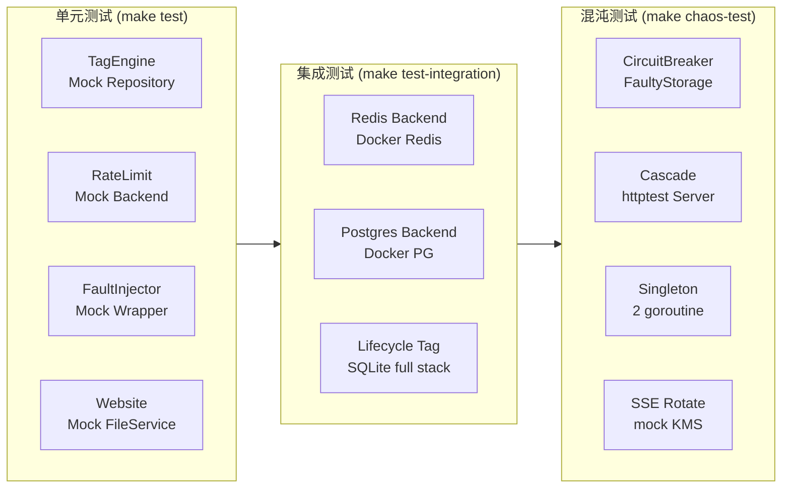
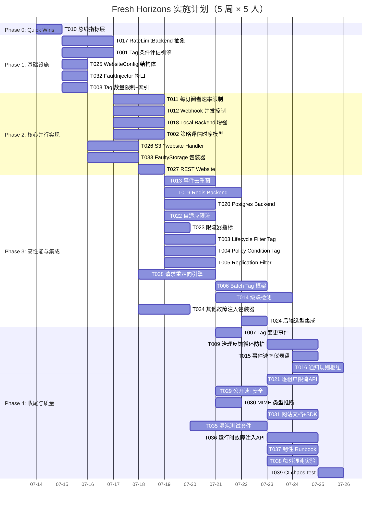

# Tech Lead 分析：Fresh Horizons — 系统性纵深盲区实施计划

> **分析日期：** 2026-07-12  
> **分析依据：** `docs/requirements/fresh-horizons-systemic-gaps.md`（原创分析）+ `fresh-horizons-systemic-gaps.out.md`（代码交叉验证响应）  
> **代码基线：** `cmd/server/main.go` + `internal/*` ~230+ `.go` 文件，Go 1.25  
> **角色：** Tech Lead / 工程经理  

---

## 目录

1. [任务分解](#1-任务分解)
2. [执行顺序与依赖图](#2-执行顺序与依赖图)
3. [技术风险](#3-技术风险)
4. [资源评估](#4-资源评估)
5. [质量保证](#5-质量保证)
6. [实施计划](#6-实施计划)

---

## 1. 任务分解

### 1.1 任务总览表

| 方向 | 任务数 | 总预估工时 | 并行度 |
|------|--------|-----------|--------|
| 方向一：Tag 治理引擎 | 9 | 23.5h | 中（依赖生命周期先完成评估引擎） |
| 方向二：风暴防护 | 7 | 20h | 高（观测层可完全独立） |
| 方向三：分布式限流 | 9 | 26h | 中（抽象层核心依赖） |
| 方向四：静态网站托管 | 7 | 20h | 高（独立特性，与其他无依赖） |
| 方向五：混沌工程 | 8 | 23h | 中（包装器先于测试套件） |
| **合计** | **40** | **112.5h** | **约 28 人·天** |

### 1.2 方向一：Tag 驱动的治理引擎（9 任务，23.5h）

#### TASK-001 — Tag 条件评估引擎核心
- **标题:** 实现 `internal/tagengine/` 包，提供 `MatchTags()` 与 `TagCondition` 类型
- **涉及文件:** `internal/tagengine/engine.go`（新）、`internal/tagengine/engine_test.go`（新）
- **前置依赖:** 无
- **预估工时:** 3h
- **验收标准:**
  - `TagCondition` 支持 `key=value`、`key exists`、`key!=value`、`key IN (v1,v2)` 四种原语
  - 支持 `AND` / `OR` 组合算子（表达式树）
  - `MatchTags(objectTags, condition) bool` 经过穷举测试
  - 可在 S3 的 XML 标签过滤语法与内部 AST 之间转换
  - Benchmark 确认单次评估 ≤ 1µs（10-tag 场景）

#### TASK-002 — 策略评估时序模型
- **标题:** 定义治理引擎的策略评估时机（Snapshot vs. ReadCommitted）并实现审计
- **涉及文件:** `internal/tagengine/timing.go`（新）、`internal/tagengine/timing_test.go`（新）
- **前置依赖:** TASK-001
- **预估工时:** 2.5h
- **验收标准:**
  - 提供 `CaptureTagSnapshot(ctx, objectID) TagSnapshot` 和 `EvalAt(condition, snapshot) bool`
  - 快照模式：策略评估使用 tag 变更时的状态，而非当前状态（防规避）
  - 实现 Tag 变更审计日志：每次 `PUT /v1/files/{key}/tags` 记录 `before`+`after` 到 `audit_log`
  - 支持配置 `TAG_GOVERNANCE_EVAL_MODE={snapshot|read_committed}`

#### TASK-003 — Lifecycle Filter by Tag
- **标题:** 扩展 `BucketConfig.LifecycleRule` 增加 `Filter` 字段；修改 `LifecycleJob.sweep()` 消费
- **涉及文件:** `internal/repository/repository.go`（BucketConfig 结构体）、`internal/repository/sql.go`（迁移存储）、`internal/reconcile/lifecycle.go`（消费引擎）
- **前置依赖:** TASK-001, TASK-002
- **预估工时:** 3h
- **验收标准:**
  - `BucketConfig.ExpireAfterDays` → 支持 `[]LifecycleRule` 代替单规则
  - 每个 `LifecycleRule` 包含 `Filter`（`nil` = 全桶匹配）
  - 迁移脚本新增 `buckets` 表的 lifecycle 字段存储为 JSON 数组
  - `LifecycleJob.sweep()` 在删除前调用 `MatchTags()`
  - 新增 `TestLifecycleTagFilter` 集成测试

#### TASK-004 — Access Policy Condition by Tag
- **标题:** 扩展 `auth/policy.go` 的 `Condition` 评估引擎支持 `s3:ExistingObjectTag/<key>`
- **涉及文件:** `internal/auth/policy.go`、`internal/auth/policy_test.go`
- **前置依赖:** TASK-001
- **预估工时:** 3h
- **验收标准:**
  - `Statement.Eval()` 新增 `conditions` 参数接收 `map[string]string`（对象 tags）
  - 支持 `StringEquals` / `StringNotEquals` / `StringLike` 作用于 `s3:ExistingObjectTag/<key>`
  - 支持 `Null` 条件判断 tag 是否存在
  - 新增 `TestPolicyTagCondition` 全场景测试
  - Deny 规则基于 tag 正确阻断请求

#### TASK-005 — Replication Filter by Tag
- **标题:** 扩展复制规则支持 tag-based 过滤
- **涉及文件:** `internal/replication/replication.go`、`internal/replication/replication_test.go`
- **前置依赖:** TASK-001
- **预估工时:** 2.5h
- **验收标准:**
  - 复制配置新增 `Filter` 字段（复用 `TagCondition`）
  - 复制 worker 在复制前检查对象 tags 是否匹配
  - 已有复制测试全部通过

#### TASK-006 — Batch Tag Action 框架
- **标题:** 实现 `POST /v1/batch/tag/action` — 根据 tag 条件批量执行操作
- **涉及文件:** `internal/api/rest/batch.go`（新）或扩展 `handler.go`、`internal/api/rest/router.go`、`internal/api/rest/batch_test.go`
- **前置依赖:** TASK-001, TASK-002
- **预估工时:** 3h
- **验收标准:**
  - 请求体：`{"condition": {...}, "action": "delete|lock|set_storage_class", "params": {...}}`
  - 每个对象独立执行，失败记录到 `jobs` 表（可重试）
  - 支持 `dry_run` 参数预览匹配对象数量
  - `DELETE /v1/batch/tag/action/{job_id}` 可取消进行中的批量操作
  - 限流：同一租户最多 3 个并发批量操作

#### TASK-007 — Tag 变更事件发布
- **标题:** Tag 修改时发布 `object.tags.updated` 事件
- **涉及文件:** `internal/service/service.go`（`SetTags` 调用处）、`internal/repository/events.go`（事件类型）
- **前置依赖:** TASK-001
- **预估工时:** 1.5h
- **验收标准:**
  - tag CRUD（REST + S3）操作成功后触发 `object.tags.updated` 事件
  - 事件 payload 包含 `before` / `after` tag 快照
  - Webhook 可订阅 `s3:ObjectTagging:*` 事件类型

#### TASK-008 — Tag 数量限制 + JSON 索引
- **标题:** 增加每对象 tag 数量限制配置，添加可选的 tags 列 GIN 索引
- **涉及文件:** `internal/service/service.go`（校验）、`internal/config/config.go`、`internal/repository/sql.go`（索引 DDL）
- **前置依赖:** 无
- **预估工时:** 2h
- **验收标准:**
  - 新增 `MaxObjectTags` 配置（默认 10，对应 S3 行为）
  - `SetTags` / S3 `PUT tagging` 拒绝超过限制的请求 → HTTP 400
  - 迁移文件新增可选索引：Postgres `GIN(tags)`，SQLite 依赖 JSON 表达式索引
  - Benchmark 确认 tag-based 过滤性能提升

#### TASK-009 — 治理引擎反馈循环防护
- **标题:** 防止 tag 变更 → 策略评估 → 自动动作 → tag 变更的无限循环
- **涉及文件:** `internal/tagengine/engine.go`、`internal/reconcile/lifecycle.go`、`internal/events/webhook.go`
- **前置依赖:** TASK-002, TASK-006
- **预估工时:** 3h
- **验收标准:**
  - 治理动作（批量删除/锁定）产生的 tag 变更标记 `system_generated: true`
  - 事件总线忽略 `system_generated` tag 变更，不触发二次治理
  - 每次 tag 变更携带 `X-Aero-Change-Reason` 头（`user`|`governance`|`replication`）
  - `TAG_GOVERNANCE_MAX_CASCADE` 配置（默认 3）防止深层回路
  - 超限时写入审计日志并告警

### 1.3 方向二：通知风暴与事件级联安全保护（7 任务，20h）

#### TASK-010 — 事件总线指标层（最低成本零风险观测改进）
- **标题:** 新增 `events_published_total{type}`、`events_dropped_total{reason}` 等计数器
- **涉及文件:** `internal/telemetry/metrics.go`、`internal/events/bus.go`
- **前置依赖:** 无
- **预估工时:** 1.5h
- **验收标准:**
  - 发布时递增 `events_published_total{type}`
  - `broadcast()` 丢弃时递增 `events_dropped_total{reason=backpressure|rate_limit|dedup}`
  - 新增 `events_subscriber_lag{tenant}` gauge
  - 以上所有指标出现在 `/metrics` 端点
  - 所有指标的 cardinality 受控（type 枚举，不包含动态值）

#### TASK-011 — 每订阅者速率限制
- **标题:** `Subscribe()` 返回的 channel 可选关联 `RateLimiter`，`broadcast()` 跳过超过 RPS 阈值的订阅者
- **涉及文件:** `internal/events/bus.go`、`internal/events/bus_test.go`
- **前置依赖:** TASK-010
- **预估工时:** 3h
- **验收标准:**
  - `SubscribeWithRateLimit(ctx, rps)` 返回受限订阅
  - 超限订阅者的 `broadcast()` 只是跳过（drop），不影响其他订阅者
  - 慢消费者超过 `MAX_SUBSCRIBER_LAG`（配置）自动取消订阅
  - SSE 客户端断开时释放订阅者 slot

#### TASK-012 — Webhook 并发控制（信号量模式）
- **标题:** 全局 `MAX_CONCURRENT_WEBHOOK` 信号量限制 Webhook goroutine 扇出
- **涉及文件:** `internal/events/webhook.go`、`internal/config/config.go`、`internal/cmd/server/main.go`
- **前置依赖:** TASK-010
- **预估工时:** 2.5h
- **验收标准:**
  - `deliver()` 使用 `semaphore.NewWeighted(MAX_CONCURRENT_WEBHOOK)` 获取 slot
  - `postOne` 完成后释放权重
  - 超过 `MAX_CONCURRENT_WEBHOOK` 的交付排队等待（不丢弃）
  - 新增 `webhook_concurrency` gauge 指标
  - 配置项默认 `MAX_CONCURRENT_WEBHOOK=20`（可调）

#### TASK-013 — 事件去重窗
- **标题:** 同一 `(event_type, object_id)` 在 N 秒内生成的事件合并
- **涉及文件:** `internal/events/bus.go`、`internal/events/dedup.go`（新）、`internal/config/config.go`
- **前置依赖:** TASK-010
- **预估工时:** 3h
- **验收标准:**
  - 新增 `EventDedupWindow` 配置（默认 0 = 关闭）
  - 启用时，去重窗内重复事件只保留最后一条
  - 支持三种策略：`keep_last`（默认，只保留最新）、`keep_first`、`accumulate`（累计变更计数）
  - 去重计数器 `events_dropped_total{reason=dedup}` 递增
  - 去重不丢失 DB 持久化事件（每个 Publish 都 InsertEvent，只是 broadcast 合并）

#### TASK-014 — 级联检测（TraceId 跳数方案）
- **标题:** 基于 TraceId 的事件传播跳数检测，N 次迭代后熔断
- **涉及文件:** `internal/events/cascade.go`（新）、`internal/events/bus.go`、`internal/config/config.go`
- **前置依赖:** TASK-011, TASK-013
- **预估工时:** 4h
- **验收标准:**
  - 每个事件携带 `X-Aero-Trace-Id`（首次生成，传播继承）
  - 每个事件携带 `X-Aero-Hop-Count`（每次 bus publish 自增）
  - `EVENT_CASCADE_MAX_HOPS` 配置（默认 5），超限时：
    - 事件仍持久化到 DB（不丢失数据）
    - `broadcast()` 跳过级联订阅者
    - 递增 `events_dropped_total{reason=cascade_breach}`
    - 写入审计日志
  - 新增 `event_storm_detected_total` 告警指标

#### TASK-015 — 事件速率仪表盘
- **标题:** Grafana 新增事件面版 + Prometheus 告警规则
- **涉及文件:** `deploy/grafana/dashboard.json`、`deploy/prometheus/alerts.yml`
- **前置依赖:** TASK-010
- **预估工时:** 2h
- **验收标准:**
  - Grafana 新增 "Event Bus" row：event rate（by type）、drop rate（by reason）、subscriber lag、webhook concurrency
  - Prometheus 告警规则：
    - `HighEventDroppedRate`：events_dropped 1min rate > 10
    - `WebhookStormDetected`：级联熔断事件率 > 0
    - `EventSubscriberLagHigh`：subscriber lag > 100

#### TASK-016 — 通知规则枢纽（轻量级）
- **标题:** 将桶级 `NotificationRule` 接入总线，实现 per-rule 过滤与限流
- **涉及文件:** `internal/events/notifier.go`（新）、`internal/events/notifier_test.go`、`internal/api/s3compat/handler.go`
- **前置依赖:** TASK-011, TASK-013
- **预估工时:** 4h
- **验收标准:**
  - 为每个 `NotificationRule` 创建一个路由：`event_type + FilterKey` → 目标 URL
  - 通知过滤复用 TASK-001 的 `TagCondition` 评估
  - per-rule 独立速率限制（复用 TASK-011 的 RPS 控制）
  - 无匹配规则的事件不触发网络请求

### 1.4 方向三：分布式/协调式速率限制（9 任务，26h）

#### TASK-017 — `RateLimitBackend` 抽象接口（核心依赖）
- **标题:** 定义 `Backend` 接口，支持 `Allow(ctx, tenant, cost) (bool, time.Duration)`
- **涉及文件:** `internal/middleware/ratelimit.go`（重构）、`internal/middleware/backend.go`（新）
- **前置依赖:** 无
- **预估工时:** 2.5h
- **验收标准:**
  - `Backend` 接口：`Allow(ctx, tenant string, cost float64) (bool, time.Duration, error)`
  - 将现有 `tokenBucket` 逻辑抽取为 `LocalBackend` 实现该接口
  - `RateLimiter` 通过组合 `Backend` 工作，不直接操作 `map[string]*bucket`
  - 所有现有测试通过且无 race

#### TASK-018 — Local Backend 增强
- **标题:** 补充 RPS=0/-1 语义、加权请求成本（cost factor）、新租户预热期
- **涉及文件:** `internal/middleware/ratelimit.go`（local backend 实现）
- **前置依赖:** TASK-017
- **预估工时:** 2.5h
- **验收标准:**
  - RPS=0：拒绝所有请求（"维护模式"限流）
  - RPS=-1：不限流（白名单租户）
  - `Allow(ctx, tenant, cost)` 中 `cost` 支持权重（如 AI 请求 cost=3，普通请求 cost=1）
  - 新租户预热期：`NEW_TENANT_WARMUP_SECONDS` 配置（默认 60s），期间使用较低速率 `WARMUP_RPS_FACTOR`（默认 0.5）
  - 预热期指标 `rate_limit_tenants_warming{tenant}`

#### TASK-019 — Redis Backend 实现（Lua 令牌桶）
- **标题:** 基于 Redis `EVALSHA` 的分布式令牌桶
- **涉及文件:** `internal/middleware/backend_redis.go`（新）、`internal/middleware/backend_redis_test.go`、`internal/config/config.go`
- **前置依赖:** TASK-017
- **预估工时:** 5h
- **验收标准:**
  - Lua 脚本实现令牌桶（原子操作，不依赖事务）
  - 支持滑动窗口模式作为配置选项
  - Redis 连接使用 `github.com/redis/go-redis/v9`（需论证是否使用 stdlib 替代）
  - 连接失败时自动降级为 LocalBackend（日志警告，不拒绝请求）
  - 新增 `REDIS_*` 配置：`REDIS_URL`、`REDIS_RATELIMIT_KEY_PREFIX`
  - 集成测试（需 `//go:build integration` 标签 + Docker Redis）
  - Benchmark：Redis 后端单次 Allow ≤ 2ms（同区域）

> **注意：** 需要论证新增 `go-redis` 依赖的必要性。替代方案：使用 `net/http` 调用 Redis REST API（如果使用 RedisStack）+ Lua 脚本的 `EVAL` HTTP包装。推荐直接使用 `go-redis/v9` 作为合理依赖。

#### TASK-020 — Postgres Backend（降级方案）
- **标题:** 基于 `SELECT ... FOR UPDATE` 或 advisory lock 的分布式计数器
- **涉及文件:** `internal/middleware/backend_pg.go`（新）、`internal/middleware/backend_pg_test.go`
- **前置依赖:** TASK-017
- **预估工时:** 4h
- **验收标准:**
  - 实现 "本地缓存 + 定期同步" 模式（每 100ms 从 DB 拉取当前窗口计数）
  - 纯 DB 模式（每次 `SELECT ... FOR UPDATE`）作为可选的严格模式（`POSTGRES_RATELIMIT_STRICT=true`）
  - 当 DB 不可达时降级为 LocalBackend
  - 新增配置 `RATE_LIMIT_BACKEND=postgres` + `RATE_LIMIT_PG_SYNC_INTERVAL`
  - 性能：同步模式 ≤ 1ms/请求，严格模式 ≤ 5ms/请求

#### TASK-021 — 逐租户限流配置 API
- **标题:** `PUT /v1/admin/tenants/{tenant}/ratelimit` 覆盖全局默认值
- **涉及文件:** `internal/api/rest/admin.go`、`internal/api/rest/admin_test.go`、`internal/middleware/ratelimit.go`（动态更新）
- **前置依赖:** TASK-017
- **预估工时:** 3h
- **验收标准:**
  - `PUT /v1/admin/tenants/{tenant}/ratelimit`：`{"rps": 500, "burst": 100}`
  - `GET /v1/admin/tenants/{tenant}/ratelimit`：返回当前配置
  - `DELETE /v1/admin/tenants/{tenant}/ratelimit`：恢复全局默认
  - 租户级配置存储在 DB（`tenants` 表扩展 `rate_limit_rps`、`rate_limit_burst` 列）
  - 限流器运行时从 DB 加载配置，修改后 10s 内生效（不重启）
  - 新增对应的 SDK 方法

#### TASK-022 — 自适应限流（Adaptive Throttling）
- **标题:** 当存储后端延迟 / 错误率升高时自动降低有效 RPS
- **涉及文件:** `internal/middleware/adaptive.go`（新）、`internal/middleware/ratelimit.go`、`internal/config/config.go`
- **前置依赖:** TASK-017
- **预估工时:** 3h
- **验收标准:**
  - 复用 `telemetry` 的延迟 / 错误率指标计算 `maxRPS` 衰减系数
  - 算法参考：Google SRE 的 client-side throttling（`requests - accepts * window`）
  - 自适应限流可单独启用：`ADAPTIVE_THROTTLING_ENABLED=true`
  - `ADAPTIVE_THROTTLING_MIN_RPS` 配置（默认 10）保证永不降至零

#### TASK-023 — 限流器指标增强
- **标题:** 新增 per-tenant 剩余令牌、等待请求数、违反次数等指标
- **涉及文件:** `internal/telemetry/metrics.go`、`internal/middleware/ratelimit.go`
- **前置依赖:** TASK-017
- **预估工时:** 1.5h
- **验收标准:**
  - `rate_limit_violations_total{tenant,route_group}`（counter）
  - `rate_limit_tokens_remaining{tenant}`（gauge）
  - `rate_limit_backend_latency{backend}`（histogram）
  - `rate_limit_adaptive_factor{tenant}`（gauge，自适应限流的当前衰减因子）
  - 以上指标出现在 `/metrics`

#### TASK-024 — 后端选型集成（main.go 装配）
- **标题:** `main.go` 根据 `RATE_LIMIT_BACKEND` 配置选择并初始化 Backend
- **涉及文件:** `cmd/server/main.go`、`internal/config/config.go`
- **前置依赖:** TASK-019, TASK-020, TASK-017
- **预估工时:** 1.5h
- **验收标准:**
  - `RATE_LIMIT_BACKEND` 支持：`local`（默认）、`redis`、`postgres`
  - 启动时打印：`rate-limit backend: redis (url=redis://...), adaptive=on`
  - 配置校验：`postgres` 后端要求 `DB_DRIVER=postgres`，否则启动报错
  - Redis 连接失败时日志警告并降级到 `local`

### 1.5 方向四：S3 兼容静态网站托管（7 任务，20h）

#### TASK-025 — `WebsiteConfig` 结构体 + Bucket 配置扩展
- **标题:** 新增 `WebsiteConfig` 类型，扩展 `BucketConfig` 和 `buckets` 表
- **涉及文件:** `internal/repository/repository.go`（结构体）、`internal/api/s3compat/bucketconfig.go`（S3 序列化）
- **前置依赖:** 无
- **预估工时:** 2h
- **验收标准:**
  - `WebsiteConfig`：`{Enabled, IndexDocument, ErrorDocument, RoutingRules}`
  - `RoutingRule`：`{Condition {KeyPrefixEquals, HttpErrorCodeReturnedEquals}, Redirect {Protocol, HostName, ReplaceKeyPrefixWith, ReplaceKeyWith, HttpRedirectCode}}`
  - `BucketConfig` 增加 `Website WebsiteConfig` 字段
  - 迁移文件：`buckets` 表增加 `website` 列（JSON）
  - `BucketConfig` 的 S3 XML 序列化/反序列化通过测试

#### TASK-026 — S3 `?website` 子资源 Handler
- **标题:** `GET/PUT/DELETE /s3/{bucket}?website`，返回 S3 标准 XML
- **涉及文件:** `internal/api/s3compat/handler.go`、`internal/api/s3compat/xml.go`、`internal/api/s3compat/handler_test.go`
- **前置依赖:** TASK-025
- **预估工时:** 3h
- **验收标准:**
  - `GET ?website` → `200` + `WebsiteConfiguration` XML（S3 兼容格式）
  - `PUT ?website` → 请求体 XML 解析后存储
  - `DELETE ?website` → 清除配置
  - `GET ?website` 未配置时 → `404`（NoSuchWebsiteConfiguration）
  - S3 SDK 兼容性测试（列出所有子资源不冲突）

#### TASK-027 — REST API for Website Config
- **标题:** `GET/PUT/DELETE /v1/buckets/{bucket}/website`
- **涉及文件:** `internal/api/rest/handler.go`、`internal/api/rest/router.go`、`internal/api/rest/buckets_test.go`
- **前置依赖:** TASK-025
- **预估工时:** 1.5h
- **验收标准:**
  - JSON 格式的 WebsiteConfig CRUD
  - 规范 scope 检查（admin scope 或 bucket owner）

#### TASK-028 — 请求重定向引擎（核心）
- **标题:** 在 `s3compat` `BucketDispatch` 中实现 index 文档 / error 文档 / 路由规则
- **涉及文件:** `internal/api/s3compat/website.go`（新）、`internal/api/s3compat/handler.go`、`internal/api/s3compat/website_test.go`
- **前置依赖:** TASK-025
- **预估工时:** 5h
- **验收标准:**
  - `GET /s3/{bucket}/` → 返回 `IndexDocument` 的内容（HTTP 200）
  - `GET /s3/{bucket}/some/path/` → 尝试 `GET /some/path/index.html`（如不存在则 404 error doc）
  - `GET /s3/{bucket}/nonexistent` → 返回 `ErrorDocument` 的内容（HTTP 200 带错误状态码在 body 中）
  - `RoutingRules` 按优先级匹配并返回 301/302 重定向
  - SPA 惯用规则：`404 ErrorCodeReturnedEquals → ReplaceKeyPrefixWith: ""` 内置为 helper
  - 处理 `GET /s3/{bucket}/` 与 `GET /s3/{bucket}` 的 S3 语义歧义（统一到 `/` 结尾）
  - 所有文件流式传输（`io.ReadCloser`），不使用全量内存缓冲

#### TASK-029 — 公开读覆盖 + 安全加固
- **标题:** 网站托管需要显式公开读；安全限制（禁止特定前缀、robots.txt 代理）
- **涉及文件:** `internal/api/s3compat/website.go`、`internal/auth/auth.go`、`internal/service/service.go`
- **前置依赖:** TASK-028
- **预估工时:** 3h
- **验收标准:**
  - 启用网站托管时，bucket 自动获得 `public-read` ACL（可通过 `WebsiteConfig` 关闭）
  - `WebsiteConfig.BlockedPrefixes`：黑名单前缀，阻止特定路径被公开访问
  - `WebsiteConfig.GenerateRobotsTxt`：选项，自动在 `/robots.txt` 返回默认规则
  - 公共读不覆盖 bucket 中的私有对象（通过明确 `BlockedPrefixes` 保护 `/private/`、`/.backup/` 等）
  - 审计日志记录所有网站托管请求

#### TASK-030 — MIME 类型推断
- **标题:** 基于文件扩展名的 Content-Type 自动推断（无扩展名路径默认 `text/html`）
- **涉及文件:** `internal/api/s3compat/website.go`、`internal/mime/mime.go`（新）
- **前置依赖:** TASK-028
- **预估工时:** 2h
- **验收标准:**
  - 使用 Go stdlib `mime.TypeByExtension()` + 自定义映射表覆盖 S3 常见类型
  - 无扩展名路径（如 `/about`）默认 `text/html`
  - 用户可配置 `WEBSITE_DEFAULT_CONTENT_TYPE`（默认 `text/html`）
  - 自定义映射：`WEBSITE_MIME_OVERRIDES={"wasm":"application/wasm"}`

#### TASK-031 — 网站托管文档 + SDK
- **标题:** 添加配置文档和 SDK 方法
- **涉及文件:** `sdk/python/aerovault/...`、`sdk/js/...`、`sdk/go/...`、`docs/website-hosting.md`（新）
- **前置依赖:** TASK-027, TASK-028
- **预估工时:** 3.5h
- **验收标准:**
  - 三套 SDK 新增 `set_bucket_website()` / `get_bucket_website()` / `delete_bucket_website()`
  - SDK 测试通过
  - `docs/website-hosting.md`：启用步骤、SPA 部署示例、RoutingRules 配置、安全最佳实践
  - `openapi.json` 新增相应端点

### 1.6 方向五：混沌工程与韧性验证框架（8 任务，23h）

#### TASK-032 — `FaultInjector` 接口定义
- **标题:** 定义 `FaultInjector` 接口和 `FaultConfig` 结构体
- **涉及文件:** `internal/chaos/fault.go`（新）、`internal/chaos/chaos.go`（新）
- **前置依赖:** 无
- **预估工时:** 2h
- **验收标准:**
  - `FaultInjector` 接口：`Inject(ctx, target string, spec FaultSpec) (FaultID, error)`、`Remove(id FaultID)`、`RemoveAll()`
  - `FaultSpec`：`{Target, FaultType (latency|error|timeout|crash), Duration, Params map[string]any}`
  - `Target`：`storage/s3`、`repository/postgres`、`events/bus`、`ai/embedder`、`ai/llm` 等
  - 所有注入自动 `context.WithTimeout` + `defer Remove()` 保证超时后自动清理
  - `ChaosEnabled` 配置（默认 `false`）

#### TASK-033 — `FaultyStorage` 包装器
- **标题:** 实现 `storage.Storage` 的故障注入包装器
- **涉及文件:** `internal/storage/faulty.go`（新）、`internal/storage/faulty_test.go`
- **前置依赖:** TASK-032
- **预估工时:** 3h
- **验收标准:**
  - `FaultyStorage` 包装 `Storage` 接口每个方法
  - 支持故障类型：`latency`（随机延迟 +n ms）、`error`（一定概率返回错误）、`timeout`（超时后返回）
  - 故障可作用域到特定方法名（`Get`、`Put`、`Delete`...）
  - `FaultConfig` 支持 `MethodFilter`（作用于哪些方法）和 `Probability`（0.0-1.0）
  - 性能：无故障注入时开销 ≤ 100ns/调用

#### TASK-034 — 其他故障注入包装器
- **标题:** 实现 `FaultyRepository`、`FaultyEventBus`、`FaultyEmbedder`
- **涉及文件:** `internal/repository/faulty.go`、`internal/events/faulty.go`、`internal/ai/faulty.go`
- **前置依赖:** TASK-032
- **预估工时:** 3h
- **验收标准:**
  - `FaultyRepository`：支持 `QueryTimeout`、`ConnectionDrop` 故障
  - `FaultyEventBus`：支持 `DeliverDelay`（广播延迟 +n ms）
  - `FaultyEmbedder`：支持 `Latency`、`ErrorRate`（向量化返回错误）
  - 所有包装器实现对应的接口，可透明替换

#### TASK-035 — 混沌测试套件（Chaos Test Suite）
- **标题:** 使用 `//go:build chaos` 构建标签写 5+ 混沌集成测试
- **涉及文件:** `internal/chaos/chaos_test.go`（新）、`Makefile`（新增 `chaos-test` 目标）
- **前置依赖:** TASK-033, TASK-034
- **预估工时:** 5h
- **验收标准:**
  - `TestCircuitBreakerOpensOnHighErrorRate`：FaultyStorage 50% 错误 → 5 次后熔断器打开 → 后续请求返回 `ErrBackendUnavailable`
  - `TestCircuitBreakerHalfOpenRecovery`：熔断器打开后停掉故障 → 超时后 half-open → 成功请求后关闭
  - `TestSingletonLeaseTakeover`：启动两个集群单例 → 杀死第一个 → 验证接替
  - `TestJobDeadLetterOnMaxAttempts`：永远失败的 job → `max_attempts` 后状态 = dead-letter
  - `TestBusDroppedEventsOnFullChannel`：小 buffer 订阅 → 超量发布 → `events_dropped_total` 递增
  - 每个测试有明确超时（30s），失败时自动清理所有故障注入

#### TASK-036 — 运行时混沌注入 API
- **标题:** `POST /v1/admin/chaos/inject` + `POST /v1/admin/chaos/reset`
- **涉及文件:** `internal/api/rest/admin.go`、`internal/api/rest/router.go`、`internal/api/rest/admin_chaos_test.go`
- **前置依赖:** TASK-032
- **预估工时:** 3.5h
- **验收标准:**
  - `POST /v1/admin/chaos/inject`：`{"target":"s3", "fault":"latency", "duration":"30s", "params":{"delay_ms": 5000, "probability": 0.5}}`
  - `POST /v1/admin/chaos/reset`：清除所有活跃故障
  - `GET /v1/admin/chaos/active`：列出当前活跃的故障注入
  - 安全约束：admin scope 必须；需要 `X-Chaos-Confirm: yes` 头；操作写入 audit_log
  - 仅当 `CHAOS_ENABLED=true` 时注册路由（默认不注册）
  - 生产环境默认禁用，staging 默认启用

#### TASK-037 — 韧性验证 Runbook
- **标题:** `docs/chaos/` 下编写 4 个文档化的混沌实验
- **涉及文件:** `docs/chaos/experiment-01-s3-outage.md`、`docs/chaos/experiment-02-pg-outage.md`、`docs/chaos/experiment-03-embedder-latency.md`、`docs/chaos/experiment-04-replica-kill.md`、`docs/chaos/README.md`
- **前置依赖:** TASK-035
- **预估工时:** 3h
- **验收标准:**
  - 每个 Runbook 包含：前提条件 → 注入故障 → 预期系统行为 → 观测指标 → 回滚步骤
  - 附录：额外的混沌实验目标（SSE 加密轮换、Idempotency E2E、租户隔离）

#### TASK-038 — SSE 加密轮换 + Idempotency E2E 混沌实验
- **标题:** 将验证输出中提出的 5 个额外混沌实验目标实现为可运行测试
- **涉及文件:** `internal/chaos/extra_test.go`（新）、`internal/storage/sse.go`（增加可注入点）
- **前置依赖:** TASK-033, TASK-034
- **预估工时:** 3.5h
- **验收标准:**
  - 实验：SSE 主密钥在轮换期间旧密钥解密仍工作
  - 实验：Idempotency-Key 重复请求在 store 瞬断后仍返回缓存结果
  - 实验：租户 A 的隔离故障不影响租户 B 的请求
  - 实验：BM25 孤儿清理失败不阻塞硬删除
  - 实验：AI Degraded Mode 下 `/search` 返回降级响应而非错误

#### TASK-039 — CI `make chaos-test` 目标
- **标题:** 在 Makefile 中增加独立于 `make check` 的混沌测试流水线
- **涉及文件:** `Makefile`、`.github/workflows/chaos.yml`（新）
- **前置依赖:** TASK-035, TASK-038
- **预估工时:** 1h
- **验收标准:**
  - `make chaos-test`：`go test -tags=chaos -timeout=180s ./internal/chaos/`
  - GH Actions 工作流 nightly 触发（非 PR gate，因为太慢）
  - 测试失败时自动上传日志 artifact

---

## 2. 执行顺序与依赖图

### 2.1 全任务依赖图

```mermaid
graph TD
    %% =========== Phase 0: Quick Wins ===========
    T010["TASK-010: 总线指标层<br/>1.5h"]:::quickwin

    %% =========== Phase 1: Foundation ===========
    T017["TASK-017: RateLimitBackend 抽象<br/>2.5h"]:::phase1
    T001["TASK-001: Tag 条件评估引擎<br/>3h"]:::phase1
    T025["TASK-025: WebsiteConfig 结构体<br/>2h"]:::phase1
    T032["TASK-032: FaultInjector 接口<br/>2h"]:::phase1
    T008["TASK-008: Tag 数量限制+索引<br/>2h"]:::phase1

    T010 --> T011
    T010 --> T012
    T010 --> T013
    T010 --> T015

    %% =========== Phase 2: Core Implementation ===========
    T018["TASK-018: Local Backend 增强<br/>2.5h"]:::phase2
    T011["TASK-011: 每订阅者速率限制<br/>3h"]:::phase2
    T002["TASK-002: 策略评估时序模型<br/>2.5h"]:::phase2
    T026["TASK-026: S3 ?website Handler<br/>3h"]:::phase2

    T017 --> T018
    T017 --> T019
    T017 --> T020
    T017 --> T021
    T017 --> T022
    T017 --> T023
    T017 --> T024

    T001 --> T002
    T001 --> T003
    T001 --> T004
    T001 --> T005
    T001 --> T006
    T001 --> T007

    T025 --> T026
    T025 --> T027

    T032 --> T033
    T032 --> T034

    T011 --> T014
    T012 --> T014

    %% =========== Phase 3: Integration ===========
    T019["TASK-019: Redis Backend<br/>5h"]:::phase3
    T020["TASK-020: Postgres Backend<br/>4h"]:::phase3
    T028["TASK-028: 请求重定向引擎<br/>5h"]:::phase3
    T033["TASK-033: FaultyStorage 包装器<br/>3h"]:::phase3
    T003["TASK-003: Lifecycle Filter Tag<br/>3h"]:::phase3
    T013["TASK-013: 事件去重窗<br/>3h"]:::phase3

    T002 --> T003
    T002 --> T009
    T013 --> T014
    T026 --> T028

    T033 --> T035
    T034 --> T035

    T024 -->> T019
    T024 -->> T020

    T022["TASK-022: 自适应限流<br/>3h"]:::phase3
    T023["TASK-023: 限流器指标<br/>1.5h"]:::phase3
    T006["TASK-006: Batch Tag 框架<br/>3h"]:::phase3
    T014["TASK-014: 级联检测<br/>4h"]:::phase3
    T029["TASK-029: 公开读+安全<br/>3h"]:::phase3
    T036["TASK-036: 运行时故障注入API<br/>3.5h"]:::phase3

    %% =========== Phase 4: Polish & Docs ===========
    T004["TASK-004: Policy Condition Tag<br/>3h"]:::phase4
    T005["TASK-005: Replication Filter<br/>2.5h"]:::phase4
    T007["TASK-007: Tag 变更事件<br/>1.5h"]:::phase4
    T009["TASK-009: 治理反馈循环防护<br/>3h"]:::phase4
    T015["TASK-015: 事件速率仪表盘<br/>2h"]:::phase4
    T016["TASK-016: 通知规则枢纽<br/>4h"]:::phase4
    T021["TASK-021: 逐租户限流API<br/>3h"]:::phase4
    T027["TASK-027: REST Website<br/>1.5h"]:::phase4
    T030["TASK-030: MIME 类型推断<br/>2h"]:::phase4
    T031["TASK-031: 网站文档+SDK<br/>3.5h"]:::phase4
    T035["TASK-035: 混沌测试套件<br/>5h"]:::phase4
    T037["TASK-037: 韧性 Runbook<br/>3h"]:::phase4
    T038["TASK-038: 额外混沌实验<br/>3.5h"]:::phase4
    T039["TASK-039: CI chaos-test<br/>1h"]:::phase4

    T003 --> T009
    T006 --> T009
    T028 --> T029
    T028 --> T030
    T028 --> T031
    T035 --> T038
    T035 --> T039

    %% styles
    classDef quickwin fill:#d4edda,stroke:#155724,stroke-width:2px
    classDef phase1 fill:#cce5ff,stroke:#004085,stroke-width:1px
    classDef phase2 fill:#ffeeba,stroke:#856404,stroke-width:1px
    classDef phase3 fill:#f8d7da,stroke:#721c24,stroke-width:1px
    classDef phase4 fill:#e2e3e5,stroke:#383d41,stroke-width:1px
```

### 2.2 并行任务组

```
组 A ── 方向二（风暴防护）：T010 → T011 → T012 → T013 → T014 → T015 → T016
组 B ── 方向三（分布式限流）：T017 → T018/T019/T020/T022 → T021 → T023 → T024
组 C ── 方向一（Tag 引擎）：  T001 → T002 → T003/T004/T005 → T006/T007 → T009 → T008
组 D ── 方向四（网站托管）：  T025 → T026/T027 → T028 → T029 → T030 → T031
组 E ── 方向五（混沌工程）：  T032 → T033/T034 → T035 → T036 → T037 → T038 → T039
        ↑ 依赖 Phase 1-3 完成

可并行：A|B|C|D 在 Phase 1-3 可完全并行。
E 的理想开始时间 = Phase 3 完成（至少方向二和方向三的核心韧性模式就位）。
```

### 2.3 推荐执行流水线

```
Week 1:  T010  T017  T001  T025  T032  (基础设施 + Quick Win)
Week 2:  T011  T012  T018  T002  T008  T026  T033  T034  (核心并行)
Week 3:  T013  T019  T020  T022  T023  T003  T028  (高性能实现)
Week 4:  T014  T006  T024  T004  T029  T035  T036  (集成与测试)
Week 5:  T015  T016  T021  T007  T009  T030  T037  T038  T039  (收尾、文档)
         T027  T031  (独立收尾)
```

---

## 3. 技术风险

### 3.1 高风险项

| 风险 ID | 方向 | 风险描述 | 概率 | 影响 | 缓解措施 |
|---------|------|---------|------|------|---------|
| **R-01** | 方向三 | Redis 后端引入外部依赖，若 Redis 不可用可能导致整个限流层失效 | 中 | 高 | 必须实现 LocalBackend 降级；Go-Redis 连接超时配置 ≤ 200ms；`REDIS_REQUIRED=false` 可允许降级启动 |
| **R-02** | 方向二 | 级联检测的 TraceId 跳数方案可能误伤合法的高频率事件链（如批量导入） | 中 | 高 | 设置保守的 `EVENT_CASCADE_MAX_HOPS=10`；区分 write-back 事件和 read-only 事件；添加白名单 URL |
| **R-03** | 方向一 | Tag 治理引擎中 snapshot 模式可能导致策略评估与实时状态不一致的认知负担 | 中 | 中 | 默认 `read_committed` 模式；snapshot 模式仅用于合规审计场景；详细文档解释差异 |
| **R-04** | 方向四 | S3 语义歧义：`GET /s3/{bucket}/` 与 `GET /s3/{bucket}`，S3 行为不同 | 高 | 中 | chi 路由处理时统一；预发测试覆盖 S3 SDK 客户端行为 |
| **R-05** | 方向五 | 运行时混沌注入 API 如果安全防护不足可能被恶意使用造成 DoS | 高 | 高 | `CHAOS_ENABLED` 默认 false；admin scope + audit_log + 二次确认头；max duration = 5min |

### 3.2 外部依赖评估

| 依赖 | 用途 | 替代方案 | 决策建议 |
|------|------|---------|---------|
| `github.com/redis/go-redis/v9` | 分布式限流 Redis 后端 | 自研 HTTP Redis 协议客户端（`net/http` + RESP） | ✅ 接受。Go-Redis 是成熟库，社区广泛使用。需 `go mod tidy` + 安全审计 |
| Docker (CI) | Redis/Postgres 集成测试 | Testcontainers（Go 原生） | ✅ 延续现有模式（`make test-integration` 已使用 Docker） |
| Qdrant (混沌实验) | 混沌测试中验证 Qdrant 适配器的韧性 | 模拟 Qdrant HTTP 响应 | ⚠️ 暂不纳入 `chaos` 标签测试，避免 Docker 依赖过多。单独 `integration` build tag |

### 3.3 性能瓶颈与优化策略

| 瓶颈点 | 方向 | 场景 | 策略 |
|--------|------|------|------|
| Tag 过滤查询 | 方向一 | `SELECT * FROM objects WHERE tags->>'key' = 'value'` | 迁移脚本添加 Postgres GIN JSON 索引；SQLite 使用 JSON 表达式索引；tag 过滤优先走索引 |
| Redis 限流 RTT | 方向三 | 每请求 ~1ms Redis 延迟（同区域 ~0.2ms） | Lua 脚本一次往返完成令牌桶；请求本地批处理（每请求校验 + 每 100ms 批量同步） |
| 级联检测 TraceId 传播 | 方向二 | 所有事件携带 `Hop-Count` header | `hop_count` 存储在 event payload 中（DB 字段）；内存操作无显著开销 |
| 网站托管大量小文件 | 方向四 | 高 QPS 小对象请求 | 利用现有 `MAX_INFLIGHT_REQUESTS` + `RATE_LIMIT_RPS`；建议 CDN 前置（如 CloudFront） |
| 混沌测试并发执行 | 方向五 | 多混沌测试并行可能互相干扰 | 测试序列化执行（`-parallel=1`）；每个测试独立 `FaultInjector` 实例 |

### 3.4 测试覆盖难点

| 难点 | 方向 | 原因 | 策略 |
|------|------|------|------|
| 分布式限流测试 | 方向三 | 多副本场景需要多进程 | 单元测试 mock Redis/PG backend；集成测试用 Docker 启动 2 个实例 |
| 级联检测验证 | 方向二 | 需要模拟 Webhook 回路 | 测试中注册一个写回 handler；用 `httptest.NewServer` 创建回路 |
| 熔断器混沌测试 | 方向五 | 需要真实的故障注入 | `FaultyStorage` 包装器可精确控制错误率；无需启动真实 S3 |
| Tag 变更竞态 | 方向一 | 并发 tag 修改 + 策略评估的时序 | 使用 `go test -race` + `sync.WaitGroup` 构造并发场景 |

---

## 4. 资源评估

### 4.1 团队组成建议

```
┌─────────────────────────────────────────────┐
│            Tech Lead (1人)                    │
│  技术决策、架构评审、排期协调                  │
├─────────────────────────────────────────────┤
│  Team A (2人)   │  Team B (2人)  │  Team C (1人) │
│  方向一 + 方向四  │  方向二 + 方向三 │  方向五       │
│  (25.5h + 20h)   │  (20h + 26h)    │  (23h)       │
│                  │                 │              │
│  Dev 1: Go 熟练  │  Dev 3: Go 熟练 │  Dev 5:      │
│  + S3 协议经验   │  + Redis 经验   │  SRE 背景     │
│  Dev 2: Go 熟练  │  Dev 4: Go 熟练 │  混沌工程经验  │
│  + SQL 优化      │  + DB 性能      │              │
└─────────────────────────────────────────────┘
│              QA Engineer (1人)                │
│  性能测试、混沌测试验收、安全审计              │
└─────────────────────────────────────────────┘

总人数：5 开发 + 1 QA + 1 Tech Lead = 7 人
```

### 4.2 关键里程碑

| 里程碑 | 时间点 | 交付物 | 验收方式 |
|--------|--------|--------|---------|
| **M0** — Quick Win | Day 1 完成 | `events_dropped_total` 指标上线 | `curl /metrics | grep events_dropped` |
| **M1** — 基础设施就绪 | Week 1 结束 | RateLimitBackend 接口 + TagEngine 核心 + FaultInjector 接口 全部合并 | `make check` 全绿 + API 集成测试 |
| **M2** — 核心功能冻结 | Week 3 结束 | 所有方向核心逻辑实现完成；功能分支合并到 `main` | 各方向验收标准全部满足 |
| **M3** — 性能验证 | Week 4 结束 | Redis 限流 benchmark 报告 + Tag 查询 perf + 混沌测试通过 | `make chaos-test` + benchmark 报告 |
| **M4** — 发布候选 | Week 5 结束 | 所有文档 + SDK + 仪表盘更新；release notes | 最终 Code Review + `make check` |

### 4.3 阻塞点与解决策略

| 阻塞点 | 类型 | 影响 | 解决策略 |
|--------|------|------|---------|
| Redis 依赖引入决策 | 技术 | 阻塞 TASK-019 和整体方向三进度 | Tech Lead 在 Day 1 决策：接受 `go-redis/v9` 依赖。如果团队反对，则方向三 scope 缩小为仅 Local + Postgres 后端 |
| 级联检测的 TraceId 跨组件传播 | 架构 | 涉及 Service → EventBus → Webhook 的 context 传递 | 利用已有的 `request_id`（`internal/middleware/requestid.go`），扩展为 TraceId |
| Per-tenant 限流配置热加载 | 架构 | `RateLimiter` 当前初始化后不可变 | 在 `Backend` 接口增加 `UpdateTenantConfig(tenant, rps, burst)` 方法；`sync.Map` 模式 |
| SPA 路由重写兼容性 | 需求 | S3 和 SPA 框架的行为差异需验证 | 验证输出中提出的 S3 SDK GET /bucket/ vs /bucket 歧义；chi 统一路由处理 |

---

## 5. 质量保证

### 5.1 单元测试覆盖要求

| 方向 | 包 | 最低覆盖率 | 关键测试场景 |
|------|----|-----------|-------------|
| 方向一 | `internal/tagengine/` | **85%** | 所有 TagCondition 组合、空 map、nil condition、快照 vs 实时模式 |
| 方向一 | `internal/auth/policy.go` | **80%**（现有基线+10%） | tag-based Deny/Allow、Null condition、StringLike 通配 |
| 方向二 | `internal/events/` | **80%** | 去重窗策略、级联检测跳数、并发 subscribe/unsubscribe、buffer 满 drop |
| 方向三 | `internal/middleware/` | **85%** | RPS=0/-1、加权 cost、预热期、Redis 降级、自适应限流 |
| 方向四 | `internal/api/s3compat/` | **75%** | `?website` CRUD、重定向规则、index/error doc、MIME 推断 |
| 方向五 | `internal/chaos/` | **70%**（集成测试为主） | 故障注入自动清理、并发注入、包装器行为 |

### 5.2 集成测试策略



| 测试层级 | 触发时机 | 依赖 | 超时 |
|---------|---------|------|------|
| `make test`（单元） | 每次提交 | 无（SQLite + Local） | 120s |
| `make test-integration`（集成） | PR 合并前（可手动触发） | Docker（Redis/PG） | 180s |
| `make chaos-test`（混沌） | Nightly CI | Docker | 300s |

### 5.3 代码审查要点

| 方向 | 审查焦点 | 谁审查 |
|------|---------|--------|
| 方向一 | Tag 条件评估引擎的完备性（表达式树是否有遗漏的短路场景） | Tech Lead + Dev 2（SQL 索引审查） |
| 方向二 | 级联检测的 TraceId 传播路径是否正确（不遗漏跨 goroutine 传播） | Tech Lead + Dev 4 |
| 方向三 | Redis Lua 脚本的原子性 + 降级逻辑的线程安全 | Tech Lead + Dev 3 |
| 方向四 | S3 XML 序列化兼容性（`http://s3.amazonaws.com/doc/2006-03-01/` 命名空间） | Dev 1（S3 协议经验） |
| 方向五 | 故障注入的自动清理机制是否可靠（`defer` + `context.WithTimeout` 覆盖所有路径） | Tech Lead + Dev 5 |

**通用审查项（每个 PR）：**
- `gofmt -l .` 无输出 ✓
- 无 `utils/`、`common/`、`helper/` 包
- 单文件 ≤ 500 行，单函数 ≤ 50 行
- 新依赖经过论证
- 迁移文件成对（up/down）且编号不冲突

### 5.4 性能测试需求

| 测试场景 | 工具 | 目标 | 基准 |
|---------|------|------|------|
| Tag 过滤查询（10 万对象） | `go test -bench` | P99 ≤ 50ms（带索引）/ ≤ 500ms（无索引） | 当前全表扫描 |
| Redis 限流（1000 RPS） | `wrk -t2 -c10` | P99 延迟附加 ≤ 2ms | 当前 Local 后端延迟 |
| 事件总线吞吐（1 万事件/秒） | `go test -bench=BenchmarkBus` | 不丢事件（buffer 足够宽） | 当前无 buffer 监控 |
| 网站托管静态文件（1000 QPS） | `wrk -t4 -c20 GET /s3/b/index.html` | P99 ≤ 20ms | 当前 GET 延迟 |
| 级联检测性能损耗 | 基准对比（启用 vs 禁用） | 增加延迟 ≤ 1% | 当前无跳数检测 |

---

## 6. 实施计划

### 6.1 甘特图



### 6.2 分阶段交付物

#### 阶段 1：基础设施（第 1 周）
**交付物：**
- `events_dropped_total` 指标在线 → 方向二的"2 小时 Quick Win" ✅
- `RateLimitBackend` 接口定义 + `LocalBackend` 重构完成 ✅
- `internal/tagengine/` 包核心功能（`MatchTags` + `TagCondition`）✅
- `WebsiteConfig` 结构体 + S3 序列化 ✅
- `FaultInjector` 接口定义 ✅
- Tag 数量限制配置上线 ✅

**退出标准：** 所有接口定义经过团队评审；方向二的 Quick Win 已部署到 staging 环境。

#### 阶段 2：核心功能实现（第 2-3 周）
**并行流 A — 风暴防护 + 限流（Team B）：**
- 每订阅者速率限制、Webhook 并发控制、事件去重窗
- Redis/Postgres 限流后端 + 自适应限流
- 级联检测（TraceId 跳数）

**并行流 B — Tag 引擎 + 网站托管（Team A）：**
- 策略评估时序模型、Lifecycle/Policy/Replication 的 Tag 过滤
- Batch Tag Action 框架、Tag 变更事件
- S3/REST `?website` handler、请求重定向引擎

**退出标准：** 所有核心功能在 feature branch 上通过单元测试；`make check` 全绿。

#### 阶段 3：集成测试与优化（第 4 周）
- 跨功能集成测试（Tag 引擎 + LifecycleJob E2E、Webhook + 级联检测 E2E）
- Redis 限流 benchmark 调优
- 混沌测试套件编写 + 故障注入包装器联调
- 静态网站托管 S3 SDK 兼容性验证（用 `aws-sdk-go` 客户端测试 `?website`）

**退出标准：** `make test-integration` 全绿；混沌测试单机能通过；性能测试报告完成。

#### 阶段 4：发布准备（第 5 周）
- 所有方向文档 + SDK 更新
- Grafana 仪表盘更新（Event Bus row + Rate Limit row）
- Prometheus 告警规则上线
- 混沌 Runbook 提交
- Release notes + CHANGELOG 更新
- 最终全量 Code Review

**退出标准：** `make check` + `make test-integration` + `make chaos-test` 三绿；文档评审通过。

### 6.3 风险预留缓冲

| 缓冲用途 | 天数 | 触发条件 |
|---------|------|---------|
| Redis 集成调试 | 2 天 | Go-Redis 连接问题或 Lua 脚本 BUG |
| S3 兼容性修复 | 2 天 | 第三方 S3 SDK 测试发现的不兼容 |
| 混沌测试环境问题 | 1 天 | Docker CI runner 不稳定 |
| 代码审查返工 | 2 天 | 单次 PR 审查超过 3 轮 |
| **总缓冲** | **7 天** | — |

**总工期预估：** 5 周（开发）+ 1 周（缓冲）= **6 周**

### 6.4 不做事项（明确 Out-of-Scope）

| 事项 | 方向 | 理由 |
|------|------|------|
| Tag 驱动的成本分配聚合 | 方向一 | 需要存储计量基础设施，建议后续独立方向 |
| S3 Select / 清单报表与 Tag 集成 | 方向一 | 需要清单框架就绪，ROADMAP 方向 #7 phase 2 |
| 跨副本事件同步的完整回环保护 | 方向二 | Postgres LISTEN/NOTIFY 的 `origin` 字段已解决基本问题 |
| Redis 集群 / Redis Sentinel | 方向三 | Phase 1 仅支持单 Redis 实例；集群支持可后续添加 |
| 自定义域名绑定（CNAME） | 方向四 | 网站托管需要 DNS 集成，属于独立功能 |
| 生产环境混沌实验自动化 | 方向五 | 生产执行需要更多安全评估，建议独立方向 |

---

## 附录 A：任务分配矩阵

| 团队成员 | 方向 | 分配任务 | 总工时 |
|---------|------|---------|--------|
| Dev 1（方向一+四 Lead） | 一、四 | T001, T002, T003, T006, T025, T026, T028, T029 | 25.5h |
| Dev 2（方向一辅助+SQL） | 一、四 | T004, T005, T007, T008, T009, T027, T030, T031 | 18.5h |
| Dev 3（方向二+三 Lead） | 二、三 | T010, T011, T012, T017, T018, T019, T022 | 22h |
| Dev 4（方向二+三辅助） | 二、三 | T013, T014, T015, T016, T020, T021, T023, T024 | 22h |
| Dev 5（方向五） | 五 | T032, T033, T034, T035, T036, T037, T038, T039 | 23h |

> 注：工时不包含 Code Review、文档评审、跨团队协调时间。建议为每开发者保留 20% 缓冲时间。

---

## 附录 B：配置变更总览

| 配置项 | 方向 | 默认值 | 说明 |
|--------|------|--------|------|
| `MAX_OBJECT_TAGS` | 一 | 10 | 每对象最大 tag 数量 |
| `TAG_GOVERNANCE_EVAL_MODE` | 一 | `read_committed` | 策略评估模式 |
| `TAG_GOVERNANCE_MAX_CASCADE` | 一 | 3 | 最大治理反馈循环深度 |
| `MAX_CONCURRENT_WEBHOOK` | 二 | 20 | Webhook 全局并发上限 |
| `EVENT_DEDUP_WINDOW` | 二 | `0s`（关闭） | 事件去重时间窗口 |
| `EVENT_CASCADE_MAX_HOPS` | 二 | 5 | 最大事件传播跳数 |
| `MAX_SUBSCRIBER_LAG` | 二 | 100 | 订阅者最大积压数 |
| `RATE_LIMIT_BACKEND` | 三 | `local` | 限流后端类型 |
| `REDIS_URL` | 三 | — | Redis 连接 URL |
| `ADAPTIVE_THROTTLING_ENABLED` | 三 | `false` | 自适应限流启用 |
| `NEW_TENANT_WARMUP_SECONDS` | 三 | 60 | 新租户预热期 |
| `WARMUP_RPS_FACTOR` | 三 | 0.5 | 预热期速率系数 |
| `CHAOS_ENABLED` | 五 | `false` | 运行时混沌注入启用 |
| `WEBSITE_DEFAULT_CONTENT_TYPE` | 四 | `text/html` | 无扩展名路径默认类型 |

---

*本文由 Tech Lead 分析生成，基于 `fresh-horizons-systemic-gaps.md`（原创分析）和 `fresh-horizons-systemic-gaps.out.md`（代码交叉验证响应）。所有任务预估工时包含单元测试编写时间。*
