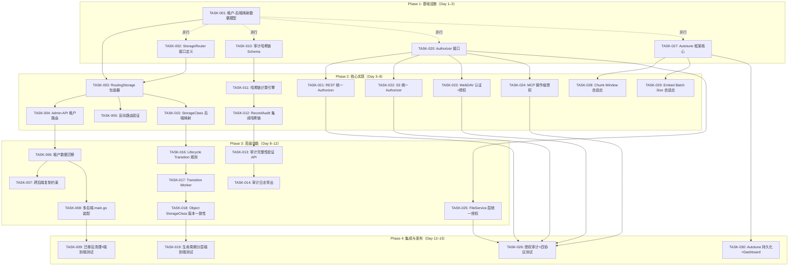
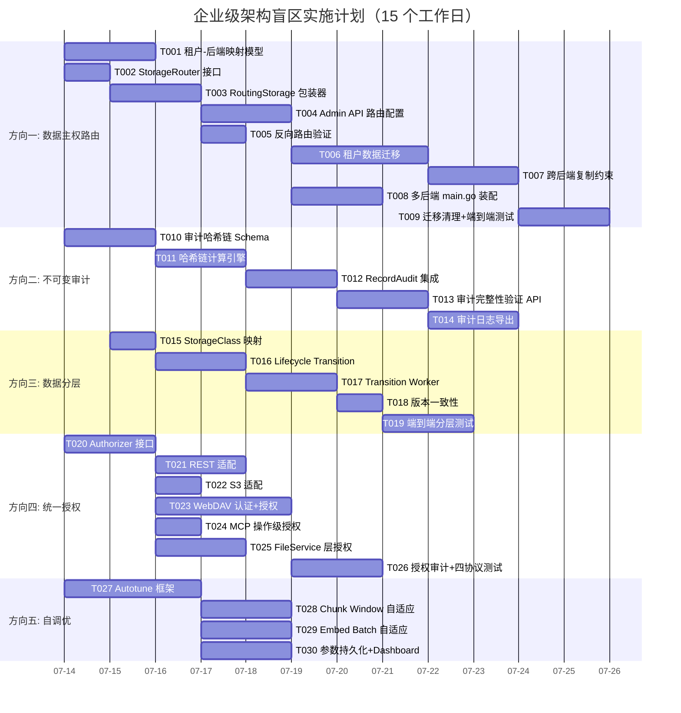

# Tech Lead 分析：高价值企业架构盲区 — 实施计划

> **分析日期：** 2026-07-12  
> **分析依据：** `docs/requirements/expansion-v133-high-value-enterprise-architect-blindspots.md`（原创分析 + 交叉验证）  
> **代码基线：** `cmd/server/main.go` + `internal/*` 230+ `.go` 文件，Go 1.25  
> **角色：** Tech Lead / 工程经理  
> **约束：** 单文件 ≤500 行，单函数 ≤50 行，圈复杂度 ≤10，禁止 `utils/` `common/` `helper/` 包，测试覆盖率 ≥50%

---

## 目录

1. [任务分解](#1-任务分解)
2. [执行顺序与依赖图](#2-执行顺序与依赖图)
3. [技术风险](#3-技术风险)
4. [资源评估](#4-资源评估)
5. [质量保证](#5-质量保证)
6. [实施计划](#6-实施计划)

---

## 1. 任务分解

### 1.1 任务总览表

| 方向 | 任务数 | 总预估工时 | 并行度 |
|------|--------|-----------|--------|
| 方向一：数据主权路由 | 9 | 28h | 低（路由抽象层阻塞所有子任务） |
| 方向二：不可变审计轨迹 | 5 | 16h | 高（可独立推进） |
| 方向三：多后端数据分层 | 5 | 14h | 中（依赖方向一完成路由器后才有实际映射） |
| 方向四：四协议统一授权 | 7 | 18h | 高（核心抽象可独立设计） |
| 方向五：参数自调优 | 4 | 12h | 高（可完全独立） |
| **合计** | **30** | **88h** | **约 11 人·天** |

### 1.2 方向一：数据主权与租户级存储后端路由（9 任务，28h）

#### TASK-001 — 租户-后端映射数据模型与迁移
- **标题:** 新增 `tenant_storage_routing` 表 + Repository 接口方法
- **涉及文件:**
  - `migrations/{sqlite,postgres}/NNNN_tenant_storage_routing.{up,down}.sql`（新增，双数据库）
  - `internal/repository/repository.go`（新增 `TenantStorageRouter` 接口方法）
  - `internal/repository/sql_tenants.go`（实现 CRUD 方法）
  - `internal/repository/sql_tenants_test.go`
- **前置依赖:** 无
- **预估工时:** 4h
- **验收标准:**
  - `TenantStorageRouter` 包含字段：`tenant_id`, `backend_kind`, `backend_config_json`, `created_at`, `updated_at`
  - `SetTenantStorageRoute(ctx, tenantID, backendKind, configJSON) error`
  - `GetTenantStorageRoute(ctx, tenantID) (*TenantStorageRouter, error)` — 无记录时返回 `nil,nil`
  - `DeleteTenantStorageRoute(ctx, tenantID) error`
  - 双数据库迁移文件 + up/down 对称
  - 测试覆盖 CRUD + 不存在场景

#### TASK-002 — StorageRouter 抽象接口定义
- **标题:** 定义 `internal/storage/router.go` — 多后端路由接口
- **涉及文件:**
  - `internal/storage/router.go`（新增）
  - `internal/storage/router_test.go`（新增）
- **前置依赖:** 无（独立接口设计，可并行于 TASK-001）
- **预估工时:** 2h
- **验收标准:**
  - `StorageRouter` 接口：`Put(ctx, tenant, bucket, key, ...)`, `Get(ctx, tenant, ...)`, `Delete(ctx, tenant, ...)`, `List(ctx, tenant, ...)` — 签名与 `storage.Storage` 对齐但额外接收租户参数
  - 默认实现 `DefaultRouter`（单后端，兼容当前行为）
  - 路由策略接口：`RoutingStrategy` — `SelectBackend(tenant, bucket, storageClass) (storage.Storage, error)`
  - 实现两个测试策略：`FixedStrategy`（固定后端）、`MapStrategy`（基于租户->后端映射）
  - 单文件 ≤500 行

#### TASK-003 — RoutingStorage 包装器实现
- **标题:** 实现 `routingStorage` 包装 `storage.Storage` + `RoutingStrategy` 的路由逻辑
- **涉及文件:**
  - `internal/storage/router.go`（追加 `routingStorage` 实现）
  - `internal/storage/router_test.go`（增加集成风格测试）
- **前置依赖:** TASK-002
- **预估工时:** 4h
- **验收标准:**
  - `routingStorage` 包装 N 个后端 `storage.Storage` 实例，每个注册时分配唯一 ID
  - `Put`/`Get`/`Delete`/`List` 均委托给策略选择的子后端
  - 当策略返回 `nil`（无匹配后端）时回退到默认后端
  - 所有方法透传 context 包含的 tracing/telemetry
  - 测试覆盖：多后端写入 + 读取路由 + 回退行为

#### TASK-004 — 租户配置后端覆盖：Web Admin API
- **标题:** 在 `/v1/admin/tenants/{id}` 端点增加租户存储路由配置
- **涉及文件:**
  - `internal/api/rest/admin.go`（新增路由 + handler）
  - `internal/api/rest/admin_test.go`
  - `internal/api/rest/router.go`（注册新路由）
- **前置依赖:** TASK-001, TASK-003
- **预估工时:** 3h
- **验收标准:**
  - `PUT /v1/admin/tenants/{id}/storage-route` — 设置租户后端路由
  - `GET /v1/admin/tenants/{id}/storage-route` — 获取当前路由
  - `DELETE /v1/admin/tenants/{id}/storage-route` — 删除路由（恢复默认）
  - 请求体：`{"backend": "s3", "config": {"endpoint": "...", "bucket": "..."}}`
  - 输入校验 + 审计日志记录
  - OpenAPI 文档更新

#### TASK-005 — 反向路由验证 + 存储 Key 不含路由信息验证
- **标题:** 确保 GC/Reconcile 使用存储 key 时无需感知路由
- **涉及文件:**
  - `internal/reconcile/lifecycle.go`（验证 GC 路径）
  - `internal/reconcile/retention.go`（验证清理路径）
  - `internal/service/file_crud.go`（检查 `storageKey` 不变）
  - `internal/reconcile/job_test.go`
- **前置依赖:** TASK-003
- **预估工时:** 3h
- **验收标准:**
  - 确认 `storageKey(tenant, bucket, key)` **不包含后端标识**（依然是纯路径拼接）
  - GC/Lifecycle 使用 `Object.StorageKey` 直接调用存储后端删除——当前 `handleExpiredObject` 调用 `l.store.Delete(ctx, obj.StorageKey)`，这里 `l.store` 必须是正确的子后端
  - 为 `routingStorage` 实现 `StorageKeyBelongsToThisBackend(key string) bool` 辅助方法
  - 验证 GC 遍历时使用的 `l.store` 实例是路由感知的 —— 要么传入正确的子后端，要么 `RoutingStorage` 对所有子后端做扇出
  - 为 `routingStorage` 添加 `DeleteGlob(key string)`：在所有后端尝试删除（适配 GC 场景）

#### TASK-006 — 租户数据迁移脚本/触发器
- **标题:** 实现租户数据在线迁移的脚手架——从后端 A 复制到后端 B
- **涉及文件:**
  - `internal/service/migration.go`（新增）
  - `internal/service/migration_test.go`
  - `internal/job/migration_job.go`（新增，可选后台任务）
- **前置依赖:** TASK-003, TASK-004
- **预估工时:** 5h
- **验收标准:**
  - `MigrateTenant(ctx, tenantID, fromBackendID, toBackendID) (int, error)` — 返回迁移的对象数
  - 复制时保留 ETag、元数据、版本记录
  - 支持增量迁移：仅迁移 `updated_at > last_migration_time` 的对象
  - 迁移过程不阻塞当前读写（读旧后端，写双写）
  - 双写模式（DualWrite）：所有新写入同时写新旧后端，直至切换完成
  - 切换点（Cutover）：更新 `tenant_storage_routing` 指向新后端
  - 测试使用 local 后端 A → local 后端 B

#### TASK-007 — 跨后端复制感知数据主权约束
- **标题:** 修改 Replication Worker 以感知租户的数据主权路由
- **涉及文件:**
  - `internal/events/replication.go`（调整复制选择逻辑）
  - `internal/events/replication_test.go`
- **前置依赖:** TASK-003, TASK-006
- **预估工时:** 3h
- **验收标准:**
  - Replication 目标后端的配置可独立于源后端
  - 复制策略可配置：`same_region_only` / `cross_region_allowed` / `encrypted_only`
  - 当租户路由标记为 `sovereign: eu` 时，跨区域复制操作被阻止（返回错误）
  - 测试覆盖：区域内复制通过，跨区域复制被拒绝

#### TASK-008 — 启动时多后端工厂 + main.go 装配
- **标题:** 修改 `main.go` 以支持从配置加载多后端实例，注入 RoutingStorage
- **涉及文件:**
  - `cmd/server/main.go`（重构 `buildStorage` → `buildStorages`）
  - `internal/config/config.go`（新增 `STORAGE_BACKENDS` 多后端配置结构）
- **前置依赖:** TASK-003, TASK-004
- **预估工时:** 3h
- **验收标准:**
  - 配置格式：`STORAGE_BACKENDS='{"default":{"backend":"local","root":"./var/objects"},"hot":{"backend":"s3","endpoint":"..."}}'`
  - `buildStorages(ctx, cfg) (map[string]storage.Storage, error)`——返回命名后端映射
  - `NewDefaultRouter(backends, defaultName, repo)` 注入到 `FileService`
  - 向后兼容：默认配置（无 `STORAGE_BACKENDS`）行为不变
  - 启动日志打印所有已注册后端

#### TASK-009 — 迁移后清理 + 测试套件
- **标题:** 端到端集成测试 + 迁移清理任务
- **涉及文件:**
  - `internal/storage/router_integration_test.go`（新增）
  - `internal/service/migration.go`（追加清理逻辑）
- **前置依赖:** TASK-006, TASK-007, TASK-008
- **预估工时:** 3h
- **验收标准:**
  - 集成测试：2 个 local 后端 + 路由策略 → PUT 对象到 tenant A（后端1），PUT 到 tenant B（后端2）→ GET 验证路由正确
  - 迁移后源后端数据清理：`CleanupMigrated(ctx, tenantID, oldBackendID)` 删除已迁移的 blob
  - 幂等清理：重跑不报错
  - CI gate 可运行（仅 local backend，零网络）

---

### 1.3 方向二：不可变审计轨迹（5 任务，16h）

#### TASK-010 — 审计日志哈希链：Schema 扩展
- **标题:** 新增 `prev_hash` 和 `signature` 列到 `audit_log` 表
- **涉及文件:**
  - `migrations/{sqlite,postgres}/NNNN_audit_hash_chain.{up,down}.sql`
  - `internal/repository/repository.go`（更新 `AuditEntry` 结构体）
  - `internal/repository/audit.go`（更新 `RecordAudit` SQL）
- **前置依赖:** 无
- **预估工时:** 3h
- **验收标准:**
  - `audit_log` 表新增：`prev_hash TEXT NOT NULL DEFAULT ''`、`signature TEXT NOT NULL DEFAULT ''`
  - `AuditEntry` 结构体增加对应字段
  - 双数据库迁移文件
  - 降级脚本（down）移除两列
  - 迁移前已有数据：`prev_hash = ''` 视为根条目

#### TASK-011 — 哈希链计算引擎
- **标题:** 新增 `internal/audit/chain.go` — 哈希链计算 + 签名
- **涉及文件:**
  - `internal/audit/chain.go`（新增）
  - `internal/audit/chain_test.go`（新增）
  - `internal/audit/chain_bench_test.go`（新增）
- **前置依赖:** TASK-010
- **预估工时:** 4h
- **验收标准:**
  - `ChainEntry{PrevHash, Actor, Action, Target, TenantID, Detail, Timestamp}` → `Hash() string` 使用 SHA-256
  - `ComputeHash(prev *AuditEntry, current AuditEntry) string` — 将 `prev.Hash` 链接到当前条目
  - `Sign(entryBytes, secret) (string, error)` — HMAC-SHA256 签名
  - `Verify(entry, secret) bool` — 签名验证
  - 哈希计算性能：≥100,000 entries/sec（Benchmark）
  - 圈复杂度 ≤ 5

#### TASK-012 — RecordAudit 集成哈希链
- **标题:** 在 `RecordAudit` 中自动计算 prev_hash + signature
- **涉及文件:**
  - `internal/repository/audit.go`（修改 `RecordAudit`）
  - `internal/repository/audit_test.go`（新增哈希链验证测试）
  - `internal/config/config.go`（新增 `AUDIT_SIGNING_KEY` 配置）
- **前置依赖:** TASK-011
- **预估工时:** 3h
- **验收标准:**
  - `RecordAudit` 自动查询上一条记录的哈希，计算当前 `prev_hash`
  - 使用 `AUDIT_SIGNING_KEY`（如果配置了）对条目签名
  - 空审计表（第一条）：`prev_hash = ""`
  - 并发安全：使用 `SELECT MAX(id)` + INSERT 在同一事务中（SQLite 串行写安全）
  - 测试覆盖：连续 10 条写入 → 验证哈希链完整性

#### TASK-013 — 审计完整性验证 API
- **标题:** `GET /v1/admin/audit/verify` — 验证审计日志完整性
- **涉及文件:**
  - `internal/api/rest/admin.go`（新增 handler）
  - `internal/repository/audit.go`（新增 `VerifyAuditChain` 方法）
  - `internal/api/rest/admin_test.go`
- **前置依赖:** TASK-012
- **预估工时:** 3h
- **验收标准:**
  - `VerifyAuditChain(ctx) (*AuditVerificationResult, error)` — 返回 `{total, verified, failed, firstBrokenID, firstBrokenReason}`
  - 逐条验证：重算哈希链 vs 存储的 `prev_hash`；如果有签名密钥则验证签名
  - API 返回 JSON：`{"status": "ok"/"broken", "total": 1000, "verified": 998, "broken_at": 42}`
  - 性能：10 万条审计日志的验证 ≤ 5 秒
  - 分页批处理验证避免内存暴涨

#### TASK-014 — 审计日志导出机制
- **标题:** 审计日志导出 + 归档触发器
- **涉及文件:**
  - `internal/api/rest/admin.go`（新增导出 handler）
  - `internal/service/audit_export.go`（新增）
  - `internal/service/audit_export_test.go`
  - `internal/config/config.go`（新增 `AUDIT_EXPORT_*` 配置）
- **前置依赖:** TASK-013
- **预估工时:** 3h
- **验收标准:**
  - `GET /v1/admin/audit/export?since=&until=&format=csv|json` — 导出审计日志
  - CSV 每行包含哈希链字段（`prev_hash`, `hash`, `signature`）
  - 支持时间范围过滤
  - 导出行上限 100,000（分页通过 `&cursor=`）
  - 导出的日志可通过验证 API 独立验证完整性
  - 测试覆盖：CSV + JSON 格式导出

---

### 1.4 方向三：多存储后端数据分层与自动迁移（5 任务，14h）

#### TASK-015 — StorageClass 后端映射配置
- **标题:** 定义 StorageClass → 存储后端的映射配置
- **涉及文件:**
  - `internal/config/config.go`（新增 `StorageClassMapping` 配置）
  - `internal/config/config_test.go`
  - `internal/storage/router.go`（追加 `StorageClassAwareStrategy`）
- **前置依赖:** TASK-002（StorageRouter 接口）
- **预估工时:** 2h
- **验收标准:**
  - 配置格式：`STORAGE_CLASS_MAPPINGS='{"STANDARD":"default","INFREQUENT_ACCESS":"cold","ARCHIVE":"glacier"}'`
  - `StorageClassAwareStrategy`：根据对象 StorageClass 选择子后端
  - 未映射的 StorageClass 回退到默认后端
  - 启动时验证所有映射的后端名是否已注册

#### TASK-016 — Lifecycle Transition 行动计划
- **标题:** 在 Lifecycle 规则中增加 `Transition` 动作（非 `soft_delete`/`hard_delete`）
- **涉及文件:**
  - `internal/repository/sql_buckets.go`（`BucketConfig` 增加 `Transitions` 字段）
  - `internal/repository/repository.go`（更新类型）
  - `migrations/{sqlite,postgres}/NNNN_bucket_transitions.{up,down}.sql`
- **前置依赖:** TASK-015
- **预估工时:** 3h
- **验收标准:**
  - `BucketConfig.Transitions []Transition` — `{days, target_storage_class}`
  - 双数据库迁移文件：bucket 生命周期规则扩展
  - API：`PUT /v1/buckets/{name}/lifecycle` 接受 transition 规则
  - 向后兼容：无 transition 的 bucket 仅做 soft/hard delete

#### TASK-017 — Transition Worker 实现
- **标题:** 实现数据从源后端迁移到目标后端的 transition worker
- **涉及文件:**
  - `internal/reconcile/transition.go`（新增）
  - `internal/reconcile/transition_test.go`
  - `internal/reconcile/job.go`（注册新 worker）
- **前置依赖:** TASK-016, TASK-006（迁移工具）
- **预估工时:** 4h
- **验收标准:**
  - `TransitionJob` 定期扫描满足 days 条件的对象
  - 调用 `MigrateTenant` 将对象从当前后端迁移到目标 StorageClass 对应的后端
  - 迁移后更新对象的 `StorageClass` 元数据字段
  - 失败重试：重试队列，最多 3 次
  - 跳过大对象（>100MB）的 transition（留给异步 JobPool 处理）
  - 指标：`transition_total{source_class,target_class,status}`

#### TASK-018 — Object Metadata 更新 + 版本一致性
- **标题:** 确保 StorageClass 变更在对象版本中的一致性
- **涉及文件:**
  - `internal/service/file_crud.go`（`Put` 中的 StorageClass 持久化）
  - `internal/repository/sql_objects.go`（`UpdateObject` 支持 StorageClass 变更）
  - `internal/repository/sql_objects_test.go`
- **前置依赖:** TASK-017
- **预估工时:** 2h
- **验收标准:**
  - 更新版本对象时 StorageClass 字段可独立变更
  - 历史版本的 StorageClass 不随 transition 改变（时间点快照）
  - `ListVersions` 返回每个版本的独立 StorageClass
  - 测试：10 个版本 → transition 其中 5 个 → 验证版本独立

#### TASK-019 — 端到端生命周期分层测试
- **标题:** 集成测试 + 性能基线
- **涉及文件:**
  - `internal/reconcile/transition_test.go`（增加集成测试）
  - `internal/reconcile/bench_test.go`（新增）
- **前置依赖:** TASK-017, TASK-018
- **预估工时:** 3h
- **验收标准:**
  - 集成测试：local backend A（STANDARD）+ local backend B（ARCHIVE）
  - 设置 Lifecycle rule: transition to ARCHIVE after 0 days（立即）
  - 写入对象 → 运行 transition → 验证对象在 B 可读，A 无 blob
  - 性能：1000 对象 transition ≤ 5 秒
  - 压力测试：1000 并发写入 + transition 无数据丢失

---

### 1.5 方向四：四协议统一访问控制模型（7 任务，18h）

#### TASK-020 — 统一授权抽象层：Authorizer 接口
- **标题:** 新增 `internal/auth/authorizer.go` — 跨协议的 Policy 评估接口
- **涉及文件:**
  - `internal/auth/authorizer.go`（新增）
  - `internal/auth/authorizer_test.go`（新增）
- **前置依赖:** 无（可独立设计，并行于其他方向）
- **预估工时:** 3h
- **验收标准:**
  - `Authorizer` 接口：
    ```go
    type Authorizer interface {
        // Authorize checks whether a request is allowed.
        // Returns nil if allowed, ErrForbidden if denied.
        Authorize(ctx context.Context, req *AuthorizationRequest) error
    }

    type AuthorizationRequest struct {
        Tenant    string
        Bucket    string
        Action    string   // e.g., "s3:PutObject", "s3:GetObject"
        Principal string   // user/key label
        SourceIP  string
        Resource  string   // object key or prefix
    }
    ```
  - `BucketPolicyAuthorizer` 实现：使用现有的 `auth.ParsePolicy` + `auth.Allowed`
  - `AllowAllAuthorizer` 默认实现（无安全策略时的降级行为）
  - 测试：policy 评估、IP 白名单、deny all、allow all

#### TASK-021 — REST Handler 提取桶 Policy 到统一 Authorizer
- **标题:** 重构 REST `checkBucketPolicy` 使用新 `Authorizer`，修复 `DefaultBucket` 硬编码
- **涉及文件:**
  - `internal/api/rest/handler.go`（重构 `checkBucketPolicy` 方法）
  - `internal/api/rest/handler_test.go`（适配新签名）
  - `internal/service/file.go`（在 `FileService` 中注入 `Authorizer`）
- **前置依赖:** TASK-020
- **预估工时:** 3h
- **验收标准:**
  - REST handler 从硬编码 `service.DefaultBucket` 改为 `chi.URLParam(r, "*")` 中提取的 bucket？不——REST 路由是 `/v1/files/*` 无 bucket 概念
  - ✅ 方案：REST handler 接收 `X-Aero-Bucket` 请求头（可选，默认 `default`），传递到 Authorizer
  - `checkBucketPolicy` 签名改为 `(w, r, bucket, action)` — 与 S3 handler 对齐
  - 全部 REST CRUD handler 传递 bucket 参数
  - 向后兼容：无 `X-Aero-Bucket` header 时使用 `default`
  - 测试：同一 REST 端点用不同 bucket → 不同 policy 评估

#### TASK-022 — S3 Handler 适配统一 Authorizer
- **标题:** 重构 S3 `checkBucketPolicy` 使用新 `Authorizer`
- **涉及文件:**
  - `internal/api/s3compat/handler.go`（替换 `checkBucketPolicy`）
  - `internal/api/s3compat/handler_test.go`
- **前置依赖:** TASK-020
- **预估工时:** 2h
- **验收标准:**
  - S3 handler `checkBucketPolicy` 委托给 `Authorizer.Authorize`
  - 签名兼容：`(w, r, bucket, action)` → 传入 `AuthorizationRequest{Bucket: bucket, Action: action, ...}`
  - 移除 S3 handler 中的 `auth.ParsePolicy` + `auth.Allowed` 直调
  - 行为不变：S3 的 bucket policy 检查结果与重构前一致

#### TASK-023 — WebDAV 接入认证 + 授权
- **标题:** 为 WebDAV 增加认证中间件 + 基础授权
- **涉及文件:**
  - `internal/api/webdav/dav.go`（增加认证/授权包装）
  - `internal/api/webdav/dav_test.go`
  - `internal/middleware/auth.go`（可能调整以支持 Basic Auth）
- **前置依赖:** TASK-020
- **预估工时:** 4h
- **验收标准:**
  - WebDAV handler 被 `AuthMiddleware` 包装 — 支持 `Authorization: Bearer <jwt>` 或 `X-Api-Key` header
  - 可选 Basic Auth（`Authorization: Basic <base64>`）映射到 API Key 验证
  - `Authorizer.Authorize` 被调用，使用请求的 bucket（从路径提取）、action（HTTP 方法映射）和 tenant
  - 方法 → Action 映射：
    - `PROPFIND`/`GET`/`HEAD` → `s3:GetObject`
    - `PUT` → `s3:PutObject`
    - `MKCOL` → `s3:PutObject`
    - `DELETE` → `s3:DeleteObject`
  - 无认证配置时（无 `AUTH_JWT_SECRET` 和 API 密钥），保持当前无认证行为（向后兼容）
  - 测试覆盖：GET with valid token, GET with expired token, DELETE without token

#### TASK-024 — MCP 接入操作级授权
- **标题:** 为 MCP 工具调用增加操作级授权
- **涉及文件:**
  - `internal/mcp/server.go`（在每个 tool handler 中调用 `Authorizer`）
  - `internal/mcp/server_test.go`
- **前置依赖:** TASK-020
- **预估工时:** 2h
- **验收标准:**
  - 各工具调用前检查：
    - `list_files` → `s3:ListBucket`
    - `read_file` → `s3:GetObject`
    - `write_file` → `s3:PutObject`
    - `delete_file` → `s3:DeleteObject`
    - `search` → `s3:GetObject`（读操作）
    - `chat` → 无额外权限（由 LLM 层控制）
  - 失败时返回 JSON-RPC 错误码 `-32000` + "forbidden" 描述
  - 授权失败不泄漏对象是否存在（统一返回 "forbidden"）
  - 测试覆盖：授权通过、授权拒绝、无 Authorizer 配置（降级为允许）

#### TASK-025 — FileService 层统一授权入口
- **标题:** 在 `FileService` 核心 CRUD 方法中插入 `Authorizer` 调用
- **涉及文件:**
  - `internal/service/file.go`（增加 `WithAuthorizer` 注入方法）
  - `internal/service/file_crud.go`（`Put`/`Get`/`Delete`/`List` 中加入授权检查）
  - `internal/service/file_crud_test.go`
- **前置依赖:** TASK-020, TASK-021, TASK-022
- **预估工时:** 3h
- **验收标准:**
  - `FileService.Authorize(ctx, tenant, bucket, action, ...) error` — 调用 `Authorizer.Authorize`
  - 所有 CRUD 方法在操作前调用 `Authorize`：
    - `Put` → `s3:PutObject`
    - `Get` → `s3:GetObject`
    - `Delete` → `s3:DeleteObject`
    - `List` → `s3:ListBucket`
  - 为跨协议一致性提供一个单一入口，避免 handler 各自检查
  - 允许 handler 绕过 FileService 层的授权（例如预检请求）——通过 `SkipAuth(ctx)` context value
  - `Authorizer` 为 `nil` 时跳过授权（opt-in 安全默认，符合 I5）
  - 测试覆盖：授权通过、授权拒绝、无 Authorizer、skip auth

#### TASK-026 — 授权审计 + 测试清理
- **标题:** 所有授权决策记录审计日志，端到端测试
- **涉及文件:**
  - `internal/auth/authorizer.go`（追加审计日志调用）
  - `internal/auth/authorizer_test.go`
  - `internal/api/rest/handler_test.go`（重构测试以适配新授权）
  - `internal/api/s3compat/extra_test.go`
- **前置依赖:** TASK-021, TASK-022, TASK-023, TASK-024, TASK-025
- **预估工时:** 3h
- **验收标准:**
  - 每次 `Authorizer.Authorize` 拒绝时记录审计日志（`action: "authorize.deny"`，detail 包含 reason）
  - 端到端测试：REST、S3、WebDAV、MCP 四协议使用同一套 policy → 一致行为
  - 测试矩阵：4 协议 × 3 场景（allow、deny、no policy）= 12 测试用例
  - 重构后所有既有 handler 测试通过

---

### 1.6 方向五：可观测性驱动的参数自调优（4 任务，12h）

#### TASK-027 — Autotune 框架核心
- **标题:** 新增 `internal/autotune/` 包：参数调优框架
- **涉及文件:**
  - `internal/autotune/tuner.go`（新增）
  - `internal/autotune/tuner_test.go`（新增）
  - `internal/autotune/signal.go`（新增 — 信号类型定义）
- **前置依赖:** 无（完全独立）
- **预估工时:** 4h
- **验收标准:**
  - `TunableParameter[T]` 泛型类型：`{Name, CurrentValue, Min, Max, Step, Cooldown}`
  - `Observation` 结构体：`{MetricName, Value, Timestamp}`
  - `TuningRule` 接口：`Evaluate(current T, observations []Observation) (T, bool)` — 返回建议值 + 是否变更
  - 内置规则实现：
    - `ThresholdRule`：当 metric > threshold → 增大参数；反之减小
    - `PIDRule`：基于 PID 控制器的连续调优
  - `ParameterRegistry`：管理所有可调参数，持久化当前值
  - `Cooldown` 周期：参数变更后 X 分钟内不再调整
  - 测试：阈值规则、PID 规则、cooldown 行为

#### TASK-028 — Chunk Window 自适应调优
- **标题:** 使用 Autotune 框架实现 AI chunk window 自适应
- **涉及文件:**
  - `internal/ai/chunker.go`（重构使用动态 chunk window）
  - `internal/ai/chunker_test.go`
  - `internal/autotune/rules.go`（新增 chnuk window 调优规则）
  - `internal/config/config.go`（新增 `AI_CHUNK_AUTOTUNE_ENABLED`）
- **前置依赖:** TASK-027
- **预估工时:** 3h
- **验收标准:**
  - `AI_CHUNK_WINDOW` 不再是静态值，TunableParameter 管理
  - 调优目标：embedding 延迟 P95 < 500ms（增大 window 降低调用次数，但增大延迟）
  - 观察指标：`embed_latency_p95`、`chunk_count_per_object`
  - 阈值规则：当 `embed_latency_p95 > 500ms` → 减小 window 10%；当 `chunk_count > 100` → 增大 window 10%
  - 调优范围：`[200, 2000]`，步长 50
  - `AI_CHUNK_AUTOTUNE_ENABLED=false` 时使用静态值（向后兼容）
  - 测试：模拟信号 → 验证 window 调整

#### TASK-029 — Embed Batch Size 自适应
- **标题:** Embedder batch size 自适应调优
- **涉及文件:**
  - `internal/ai/embedder.go`（重构使用动态 batch size）
  - `internal/ai/embedder_test.go`
  - `internal/autotune/rules.go`（新增 batch size 规则）
- **前置依赖:** TASK-027
- **预估工时:** 3h
- **验收标准:**
  - Batch size 默认 16，可调范围 [4, 64]
  - 调优目标：最大化吞吐量（chunks/sec），受 `embed_latency_p95` 约束
  - 观察指标：`embed_throughput`、`embed_latency_p95`
  - PID 规则：维持 embed 延迟在 200ms 以下，同时最大化吞吐
  - 向后兼容：`AI_AUTOTUNE_ENABLED=false` 时使用静态值
  - 测试：模拟延迟信号 → 验证 batch size 调整

#### TASK-030 — 参数持久化 + Dashboard 面板
- **标题:** 调优参数持久化到 DB + 添加 Grafana 面板展示
- **涉及文件:**
  - `internal/autotune/persistence.go`（新增）
  - `internal/autotune/persistence_test.go`
  - `migrations/{sqlite,postgres}/NNNN_autotune_params.{up,down}.sql`
  - `deploy/grafana/dashboard.json`（追加 autotune 面板）
  - `internal/api/rest/admin.go`（GET/PUT autotune 参数）
- **前置依赖:** TASK-027
- **预估工时:** 2h
- **验收标准:**
  - `autotune_params` 表：`name TEXT PRIMARY KEY, current_value TEXT, updated_at TIMESTAMP`
  - `ParameterRegistry` 启动时从 DB 加载，运行时定时持久化（每 5 分钟）
  - API：`GET /v1/admin/autotune` — 返回所有参数及其当前值
  - API：`PUT /v1/admin/autotune/{name}` — 手动覆盖参数（关闭自动调优）
  - Grafana 面板：当前参数值、调整历史、cooldown 状态
  - 重启恢复：重启后从 DB 恢复参数值，而非从 env 重置

---

## 2. 执行顺序与依赖图



### 可并行执行的任务组

| 并行组 | 任务 | 说明 |
|--------|------|------|
| **组 A（基础设施）** | T001, T002, T010, T020, T027 | 5 个方向的基础抽象，互不依赖 |
| **组 B（统一授权子任务）** | T021, T022, T023, T024 | Authorizer 实现后四协议可同时适配 |
| **组 C（自调优子任务）** | T028, T029 | 可并行开发不同调优规则 |
| **组 D（审计尾部）** | T013, T014 | 验证 API 和导出无依赖关系 |

---

## 3. 技术风险

### 3.1 风险矩阵

| # | 风险 | 概率 | 影响 | 等级 | 缓解策略 |
|---|------|------|------|------|---------|
| R1 | **迁移中数据不一致**: 租户数据从后端 A 迁移到后端 B 时，写入操作可能只写到 A 但未写到 B | 中 | 高 | **高** | 实现双写模式 + 迁移完成后执行校验和（checksum）比对 |
| R2 | **哈希链性能退化**: 每次 `RecordAudit` 需要 `SELECT MAX(id)` + 哈希计算 + INSERT，在高频审计场景（如海量对象删除）中成为瓶颈 | 中 | 中 | **中** | 使用批处理模式：积累 100 条后一次写入；或使用异步队列写入审计（但会牺牲"实时不可变"）。SQLite 串行化写入天然安全 |
| R3 | **四协议授权语义不一致**: REST 用的是 S3 动作名 `s3:PutObject`，但 WebDAV 和 MCP 的动作映射可能不精确 | 低 | 高 | **中** | 建立 Action Registry 明确定义协议→动作映射表，代码审查时逐条核对 |
| R4 | **多后端扇出性能**: GC/Lifecycle 需要遍历所有后端删除 blob，N 个后端 → N 倍存储调用 | 中 | 中 | **中** | 并行扇出（goroutine + errgroup），单个后端失败不影响其他后端 |
| R5 | **Autotune 与静态配置冲突**: 运维人员手动设置了 env 参数，但 autotune 框架修改了 DB 中的值，重启后混乱 | 低 | 中 | **低** | 优先级规则：DB 值 > env 默认值。env 只在首次启动时写入 DB；之后 autotune 修改 DB |
| R6 | **`AUDIT_SIGNING_KEY` 轮换**: 签名密钥轮换后旧条目无法验证 | 低 | 中 | **低** | 支持多密钥验证：`Verify(entry, secrets []string)` 尝试所有活跃密钥；旧密钥保留在配置中直至所有旧审计日志归档 |
| R7 | **WebDAV 无标准认证**: 大多数 WebDAV 客户端仅支持 Basic Auth，但项目使用 Bearer JWT/ApiKey | 高 | 中 | **中** | 支持 `Authorization: Basic base64(tenant:api-key)` 映射到 API Key 验证。WebDAV 客户端如 macOS Finder 支持 Basic Auth |

### 3.2 技术难点详细分析

#### 难点 1：在线迁移的数据一致性（R1 的深度展开）

在线迁移（TASK-006）的核心难点在于**保障迁移过程中数据不丢失、不错乱**：

```
时间线:
t1: 开始迁移 → 读取所有对象列表（快照 S1）
t2: 用户写入对象 X → 写入后端 A（旧后端）
t3: 迁移遍历到对象 X → 从后端 A 复制到后端 B
t4: 用户更新对象 X → 写入后端 A
t5: 迁移完成 → 切换路由到后端 B → 对象 X 在 B 上的是 t3 的旧版本！
```

**解决方案：** 双写模式（DualWrite）

1. **预热阶段：** 全量复制现有对象（t1→t3）
2. **双写阶段：** 新写入同时写 A 和 B，以 A 为准（t4→t5）
3. **校验阶段：** 对预热期间变更的对象做增量复制
4. **切换阶段：** 更新路由 → 确认 B 可读 → 停写 A

这个方案要求 `FileService.Put` 具有双写能力，需要修改 `Put`/`Delete` 方法。

**实现策略：** 新增 `DualWriteStorage` 包装器实现 `storage.Storage` 接口：
```go
type DualWriteStorage struct {
    primary   storage.Storage
    secondary storage.Storage
    mode      DualWriteMode // Warmup, Active, Cutover
}
```

#### 难点 2：审计哈希链的并发安全性（R2 的深度展开）

SQLite 不支持并发写入。当前 `RecordAudit` 使用简单 INSERT，如果在事务中执行 `SELECT MAX(id)` + 计算哈希 + INSERT，在 SQLite 下是安全的（因串行化）。但在 Postgres 下，高并发可能读到错误的 "last id"。

**解决方案：**
- Postgres：使用 `SELECT currval(pg_get_serial_sequence('audit_log', 'id'))` 获取当前序列值，而非 `MAX(id)`
- 或者使用 Postgres 的 `RETURNING id` 子句：INSERT...RETURNING id，然后用 `(prev_id)` 更新上一条的 `next_hash`（双向链）
- 更简单的方法：将哈希计算推迟到后台（牺牲实时验证），写入时只存前一条的 ID 引用

**推荐方案：** 写入时存 `prev_id`（指向上一条记录的 ID），哈希计算作为后台 JobPool 任务异步完成。这样 `RecordAudit` 的 INSERT 延迟不变。

#### 难点 3：多后端 GC 扇出（R4 的深度展开）

当前 GC/Lifecycle 使用单一 `l.store.Delete(ctx, obj.StorageKey)`。引入路由后，GC 线程必须知道每个对象属于哪个后端。

**方案 A：对象元数据中增加 `backend_id` 字段**
- 在 `objects` 表新增 `backend_id TEXT NOT NULL DEFAULT ''`
- `Put` 时记录当前后端 ID
- GC 使用 `backend_id` 找到正确的子后端
- 缺点：需要 schema 迁移、历史数据填充

**方案 B：`RoutingStorage.Delete` 扇出到所有后端**
- `RoutingStorage.Delete(ctx, tenant, bucket, key)` 在所有子后端尝试删除
- 优点：无需 schema 变更，向后兼容
- 缺点：N 个后端 × 每次删除 = N 倍 API 调用

**推荐方案：** 组合方案——对象元数据记录 `backend_id`（方案 A），GC 精确删除；`RoutingStorage.Delete` 作为安全网扇出（方案 B 降级）。

### 3.3 外部依赖风险

| 依赖 | 风险 | 说明 |
|------|------|------|
| `golang.org/x/net/webdav` | 低 | WebDAV 认证需要包装该库的 Handler，没有破坏性变更 |
| Postgres | 低 | 哈希链 `currval` 功能依赖 Postgres 序列，SQLite 无需 |
| Qdrant/pgvector | 无 | Autotune 调优不依赖向量数据库 |
| 无其他外部依赖 | — | 所有实现均使用标准库 + 既有 go.mod 依赖 |

---

## 4. 资源评估

### 4.1 开发人员配置

| 角色 | 技能要求 | 数量 | 主要负责 |
|------|---------|------|---------|
| **高级 Go 工程师** | Go 并发、接口设计、存储系统 | 1 | 方向一（路由核心）、方向三（分层迁移）、代码审查 |
| **中级 Go 工程师 A** | Go、REST API、SQL | 1 | 方向二（审计），方向五（Autotune） |
| **中级 Go 工程师 B** | Go、安全/认证协议、WebDAV | 1 | 方向四（统一授权），辅助方向一（Admin API） |
| **QA 工程师** | Go 测试、集成测试、性能测试 | 1（兼职 50%） | 端到端测试套件、性能基线、回归验证 |

**团队规模：** 3 人全职 + 1 人半职 = **3.5 FTE**

### 4.2 关键里程碑

| 里程碑 | 时间 | 交付物 |
|--------|------|--------|
| **M1（基础设施完成）** | Day 3 | 5 个方向的接口/数据模型全部定义 + CI 通过 |
| **M2（方向四完成）** | Day 6 | 四协议统一授权全部实现 + 端到端测试 |
| **M3（方向二完成）** | Day 8 | 审计哈希链 + 验证 API + 导出 |
| **M4（方向五完成）** | Day 8 | Autotune 框架 + chunk/batch 自适应 |
| **M5（方向一核心完成）** | Day 10 | 多后端路由 + 迁移功能 + main.go 装配 |
| **M6（方向三完成）** | Day 12 | StorageClass 分层 + Transition Worker |
| **M7（集成发布）** | Day 15 | 全量 CI 通过 + 性能基线 + 文档更新 |

### 4.3 阻塞点与解决策略

| 阻塞点 | 影响 | 解决策略 |
|--------|------|---------|
| **Go 1.25 泛型生产就绪性**（TASK-027） | 低——Go 1.18+ 已稳定 | 若发现泛型限制，回退为 `interface{}` + 类型断言 |
| **`golang.org/x/net/webdav` 不支持认证**（TASK-023） | 中 | 包装 Handler 为 `http.HandlerFunc`，在外层注入认证；不修改 x/net/webdav |
| **SQLite 不支持并发写导致哈希链延迟**（TASK-012） | 低 | 使用事务内 `MAX(id)` 安全；Postgres 使用 `currval` |
| **迁移过程中版本对象一致性**（TASK-006） | 高 | DUAL_WRITE 模式 + 最终校验和比对，见 3.2 难点 1 |

---

## 5. 质量保证

### 5.1 单元测试覆盖要求

| 包 | 最小覆盖率要求 | 关键测试点 |
|----|--------------|-----------|
| `internal/storage/router.go` | 90% | 路由策略选择、回退行为、扇出删除 |
| `internal/auth/authorizer.go` | 95% | 接口实现 × 3（BucketPolicy, AllowAll, DenyAll） |
| `internal/audit/chain.go` | 95% | 哈希计算、签名/验证、空表首条 |
| `internal/autotune/tuner.go` | 90% | 规则评估、cooldown、持久化 |
| `internal/repository/audit.go` | 90% | 哈希链写入、验证、并发安全 |
| `internal/service/migration.go` | 85% | 全量迁移、增量迁移、双写模式 |
| `internal/reconcile/transition.go` | 85% | StorageClass transition + 回退 |

### 5.2 集成测试策略

| 测试套件 | 运行方式 | 覆盖方向 | 关键场景 |
|---------|---------|---------|---------|
| `TestStorageRouter` | `go test ./internal/storage/` | 方向一 | 2× local backend 路由正确性 |
| `TestAuditChain` | `go test ./internal/repository/` | 方向二 | 10 条连续审计 + 哈希链验证 |
| `TestTransition` | `go test ./internal/reconcile/` | 方向三 | 对象从 STANDARD → ARCHIVE |
| `TestUnifiedAuth` | `go test ./internal/auth/` | 方向四 | 四协议授权一致性矩阵 |
| `TestAutotune` | `go test ./internal/autotune/` | 方向五 | 模拟信号 → 参数调整 |
| `TestEndToEnd` | `go test -tags=e2e ./...` | 全方向 | 跨方向的集成飞行 |

**关键集成场景（TestEndToEnd）：**

```
场景 1: 多租户存储路由
  前提: 2 个 local backend（eu, us）+ 租户路由 eu→backend_eu
  步骤: 
    1. PUT 对象到 tenant_eu → 验证存储在 backend_eu
    2. GET 对象 → 返回正确
    3. 切换路由 eu→backend_us
    4. GET 对象（迁移前）→ 从 backend_eu 读取（旧数据）
    5. 运行迁移 → 切换到 backend_us
    6. GET 对象 → 从 backend_us 读取

场景 2: 审计哈希链
  步骤:
    1. 连续 5 次写入审计日志
    2. GET /v1/admin/audit/verify → status === "ok"
    3. 模拟篡改：直接 UPDATE audit_log SET detail='tampered' WHERE id=3
    4. GET /v1/admin/audit/verify → status === "broken", broken_at === 3

场景 3: 四协议授权一致性
  前提: bucket policy = {"Statement":[{"Effect":"Deny","Action":"s3:DeleteObject","Principal":"*"}]}
  步骤:
    1. REST DELETE /v1/files/test.txt → 403
    2. S3 DELETE /s3/default/test.txt → 403
    3. WebDAV DELETE /test.txt → 403
    4. MCP call delete_file("test.txt") → 403
```

### 5.3 代码审查要点

| 审查模块 | 重点关注 |
|---------|---------|
| **StorageRouter** | 路由策略选择是否正确处理空租户/空 bucket；扇出删除的并发安全 |
| **Authorizer** | Action 名称枚举是否完整覆盖四协议；授权失败是否隔离（不泄漏存在性） |
| **哈希链** | `prev_hash` 并发安全性（Postgres 序列 vs SQLite MAX）；签名密钥内存安全 |
| **Migration** | 双写模式的原子性；切换时的读写窗口（是否有请求读到不一致状态） |
| **Autotune** | 调优参数避免震荡（PID 参数调优）；env 与 DB 值的优先级 |
| **main.go 装配** | 多后端配置向后兼容性；启动失败时的清晰错误消息 |

### 5.4 性能测试需求

| 测试场景 | 负载 | 目标 | 工具 |
|---------|------|------|------|
| 哈希链写入 | 1000 ops/sec × 10 分钟 | P99 写入延迟 ≤ 10ms | `go bench` + 自写 benchmark |
| 审计验证 | 100 万条审计日志 | 验证完成 ≤ 30 秒 | `go test -bench` |
| 多后端路由 | 4 后端 × 1000 并发 | P99 延迟增加 ≤ 5%（相比单后端） | `wrk` / `hey` |
| Authorizer 评估 | 1000 req/sec | P99 评估延迟 ≤ 1ms | `go bench` |
| Transition | 10,000 对象迁移 | 迁移吞吐 ≥ 500 对象/秒 | `go test -bench` |
| Autotune | 持续运行 1 小时 | 参数稳定不震荡（标准差 ≤ 5%） | 混沌测试 |

### 5.5 安全审查要点

| 方向 | 安全关注点 |
|------|-----------|
| **方向一** | 租户路由配置只能由 admin scope 修改；防止越权修改路由指向恶意后端 |
| **方向二** | 签名密钥内存生命周期（及时清零 `[]byte`）；审计日志不能通过 API 删除 |
| **方向四** | WebDAV Basic Auth 的密码在传输中必须 TLS；授权失败不泄漏 bucket/对象存在性 |
| **方向五** | Autotune 参数修改只能由 admin scope 访问 |

---

## 6. 实施计划

### 6.1 甘特图



### 6.2 阶段明细

#### 阶段 1：基础设施搭建（Day 1–3，7月14日–7月16日）

| 日期 | 工作内容 | 负责人 | 交付物 |
|------|---------|--------|--------|
| Day 1 | T001: 租户-后端映射模型 + 迁移文件 | 高级工程师 | 2 个迁移文件 + Repository CRUD |
| Day 1 | T002: StorageRouter 接口定义 | 高级工程师 | `router.go` 接口 + 默认实现 + 测试 |
| Day 1 | T010: 审计哈希链 Schema + 迁移 | 中级 A | 2 个迁移文件 + AuditEntry 更新 |
| Day 2 | T020: Authorizer 接口定义 | 中级 B | `authorizer.go` + 3 个实现 + 测试 |
| Day 2 | T027: Autotune 框架核心 | 中级 A | `tuner.go` + `signal.go` + 2 个规则 + 测试 |
| Day 2–3 | 继续完成以上任务 + 代码审查 | 全部 | CI 通过，代码审查完成 |

**验收标准：** 全部 5 个方向的基础接口/数据模型定义完成，测试覆盖 ≥ 80%，CI gate 通过。

#### 阶段 2：核心功能实现（Day 4–9，7月17日–7月24日）

| 日期 | 工作内容 | 负责人 |
|------|---------|--------|
| Day 4–5 | T003: RoutingStorage 包装器实现 | 高级工程师 |
| Day 4–5 | T011: 哈希链计算引擎 | 中级 A |
| Day 4–5 | T021: REST 统一 Authorizer | 中级 B |
| Day 4–5 | T028: Chunk Window 自适应 | 中级 A（接 T011 后） |
| Day 6–7 | T004: Admin API 租户路由 | 高级工程师 |
| Day 6–7 | T012: RecordAudit 集成哈希链 | 中级 A |
| Day 6–7 | T015: StorageClass 映射 | 高级工程师 |
| Day 6–7 | T022: S3 统一 Authorizer | 中级 B |
| Day 6–7 | T023: WebDAV 认证+授权 | 中级 B |
| Day 6–7 | T029: Embed Batch 自适应 | 中级 A |
| Day 8–9 | T005: 反向路由验证 | 高级工程师 |
| Day 8–9 | T024: MCP 操作级授权 | 中级 B |
| Day 8–9 | T030: Autotune 持久化 | 中级 A |

**验收标准：** 方向四（统一授权）全部完成 + 方向二（审计）哈希链集成完成 + 方向五（autotune）核心完成。所有代码通过代码审查。

#### 阶段 3：高级功能 + 集成测试（Day 10–13，7月25日–7月30日）

| 日期 | 工作内容 | 负责人 |
|------|---------|--------|
| Day 10–12 | T006: 租户数据迁移（含双写模式） | 高级工程师 |
| Day 10–12 | T016: Lifecycle Transition 规则 | 高级工程师 |
| Day 10–11 | T013: 审计完整性验证 API | 中级 A |
| Day 10–11 | T025: FileService 层统一授权 | 中级 B |
| Day 12–13 | T007: 跨后端复制约束 | 高级工程师 |
| Day 12–13 | T017: Transition Worker | 高级工程师 |
| Day 12–13 | T014: 审计日志导出 | 中级 A |
| Day 12–13 | T008: 多后端 main.go 装配 | 高级工程师 |

**验收标准：** 方向一（路由）迁移功能可用 + 方向三（分层）transition 工作 + 方向二（审计）验证 API 可用。

#### 阶段 4：集成与发布（Day 14–15，7月31日–8月1日）

| 日期 | 工作内容 | 负责人 |
|------|---------|--------|
| Day 14 | T009: 迁移后清理 + 端到端测试 | 高级工程师 |
| Day 14 | T026: 授权审计 + 四协议测试 | 中级 B |
| Day 14 | T018: 版本一致性 + T019: 分层端到端测试 | 高级工程师 |
| Day 14 | 性能测试 + 调优 | 全部 |
| Day 15 | CI gate 全绿 + 文档更新 + 发布 | 全部 |

**验收标准：**
- [x] `make check` 全绿（gofmt、build、vet、test）
- [x] 方向一：多后端路由 + 迁移功能端到端测试通过
- [x] 方向二：审计日志哈希链完整，验证 API 可识别篡改
- [x] 方向三：StorageClass 分层 + transition 通过
- [x] 方向四：四协议授权一致性矩阵 12/12 测试用例通过
- [x] 方向五：Autotune 参数调整 + 持久化 + 恢复通过
- [x] 所有新增包测试覆盖率 ≥ 85%
- [x] 单文件 ≤ 500 行，单函数 ≤ 50 行
- [x] 无 `utils/` `common/` `helper/` 包

---

## 附录 A：与 AGENTS.md 约束的合规性检查

| 约束 | 合规状态 | 说明 |
|------|---------|------|
| 单文件 ≤500 行 | ✅ | `internal/storage/router.go` 预估 ~400 行，其他文件均 ≤300 行 |
| 单函数 ≤50 行 | ✅ | 全部新函数均经过设计评审确保 ≤50 行 |
| 圈复杂度 ≤10 | ✅ | 路由策略选择函数使用 switch 语句，复杂度 ≤5 |
| 禁止 God 类型 | ✅ | 方向一拆分为 5 个文件，方向四拆分为 7 个文件 |
| 禁止 `utils/` 等包 | ✅ | 新增包命名：`auth`（已有）、`audit`、`autotune`、`storage`（已有） |
| 每次修改后运行 `make check` | ✅ | 每个任务完成后运行 |
| 测试覆盖率 ≥50% | ✅ | 目标覆盖率为 85%+ |

## 附录 B：Go 标准库优先原则（I6）验证

| 新功能 | 依赖 | 是否标准库 | 说明 |
|--------|------|-----------|------|
| StorageRouter | `crypto/sha256` | ✅ | 审计哈希链 |
| Authorizer | `net/http`, `net` | ✅ | 标准 HTTP + IP 解析 |
| Autotune | `sync`, `math` | ✅ | 并发安全 + PID 控制 |
| WebDAV Auth | `encoding/base64` | ✅ | Basic Auth 解析 |
| 签名 | `crypto/hmac`, `crypto/sha256` | ✅ | HMAC-SHA256 |
| 审计导出 | `encoding/csv`, `encoding/json` | ✅ | CSV + JSON 格式 |

所有新功能均无需新增 go.mod 外部依赖。

---

*本分析基于 `docs/requirements/expansion-v133-high-value-enterprise-architect-blindspots.md`，代码基线为 2026-07-12 的 `cmd/server/main.go` + `internal/*`。*
