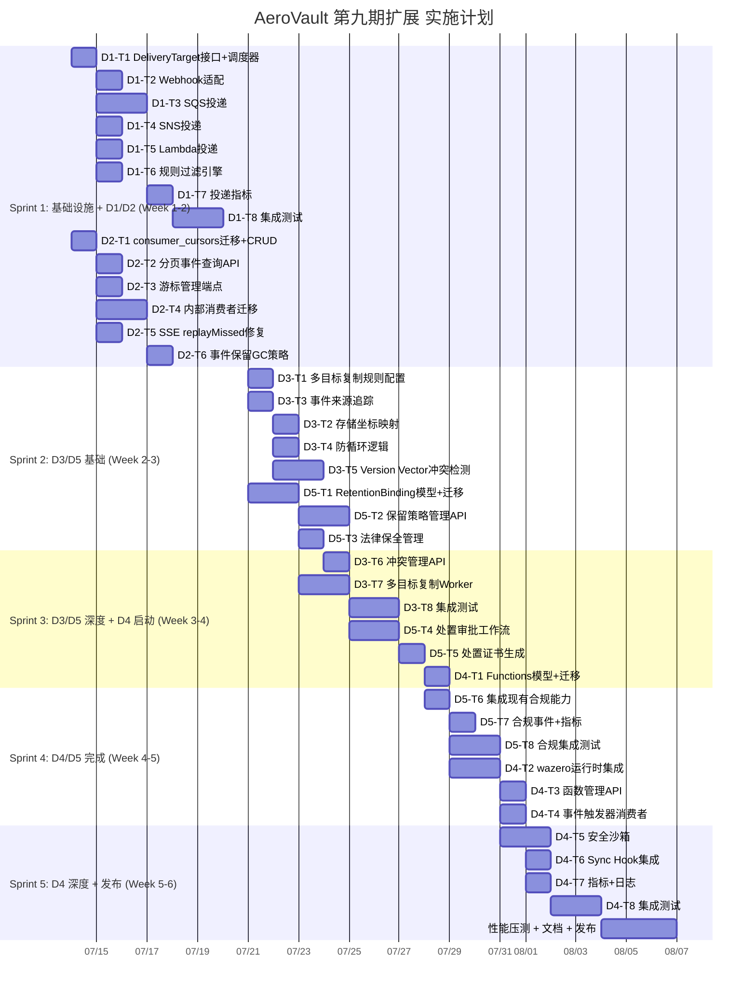

# Tech Lead 分析报告：AeroVault 高价值扩展方向（第九期）

> **基于文档：** `docs/requirements/expansion-v139-high-value-expansion-directions-v9.md`
> **日期：** 2026-07-12
> **作者：** Tech Lead
> **分析视角：** 任务分解 → 执行优先级 → 技术风险 → 资源评估 → 质量保证 → 实施计划

---

## 目录

1. [总体评估](#1-总体评估)
2. [任务分解](#2-任务分解)
3. [执行顺序与依赖图](#3-执行顺序与依赖图)
4. [技术风险](#4-技术风险)
5. [资源评估](#5-资源评估)
6. [质量保证](#6-质量保证)
7. [实施计划](#7-实施计划)
8. [建议与备注](#8-建议与备注)

---

## 1. 总体评估

### 1.1 方向排序确认

基于文档的优先级矩阵，结合工程可实现性，确认以下排序：

| 排序 | 方向 | 业务价值 | 工程成本 | 资产复用率 | 风险等级 | 推荐批次 |
|------|------|---------|---------|-----------|---------|---------|
| **P0** | S3 Event Notifications (SQS/SNS/Lambda) | ★★★★★ | 3人周 | 70% | 🟢 低 | **Sprint 1** |
| **P1** | 对象 CDC 流 | ★★★★ | 2人周 | 85% | 🟢 极低 | **Sprint 1** |
| **P2** | 生命周期治理与合规 | ★★★★ | 5人周 | 50% | 🟡 中 | **Sprint 2-3** |
| **P3** | Active-Active 多区域复制 | ★★★★ | 8人周 | 30% | 🔴 高 | **Sprint 3-4** |
| **P4** | WASM 沙箱化事件触发器 | ★★★★★ | 6人周 | 20% | 🔴 高 | **Sprint 5-6** |

**核心判断：** 文档的排序逻辑扎实，建议照此执行。但实施节奏上，**方向 1 和 2 应并行开工**（无资源竞争），方向 3 和 5 需注意增量交付避免单体发布。

### 1.2 跨方向依赖检查

| 依赖关系 | 说明 | 影响 |
|---------|------|------|
| CDC 游标 → SSE replayMissed 修复 | S2-5 依赖 S2-1 cursor 表就绪 | 无阻塞，S2-1 完工后即可 |
| 事件 OriginRegion → Active-Active 防循环 | S3-3 是 S3-4 的前置 | 同一 Sprint 内完成 |
| 合规事件 → EventBus 集成 | S5-7 依赖现有 bus 基础设施 | 零阻塞，已有完善基础设施 |
| WASM 函数 → 通知引擎 | LambdaARN 在方向 1 中同时使用 | 方向 1 仅做 API 调用，WASM 是内嵌替换 |

**结论：** 5 个方向之间无硬阻塞依赖，可以并行推进基础设施层。

---

## 2. 任务分解

### 2.1 图例

| 符号 | 含义 |
|------|------|
| `[Dn-Tn]` | Direction n, Task n |
| `⏱ 2h` | 预估工时 |
| `🧩 文件路径` | 涉及文件 |
| `✅ 验收标准` | 完成条件 |

---

### 2.2 Direction 1: S3 Event Notifications (SQS/SNS/Lambda)

#### D1-T1: DeliveryTarget 接口定义 + 调度器骨架

| 属性 | 值 |
|------|----|
| **标题** | 定义 `DeliveryTarget` 接口与通知调度器骨架 |
| **涉及文件** | `internal/events/delivery/delivery.go` (新文件), `internal/events/delivery/dispatcher.go` (新文件) |
| **前置依赖** | 无（新包，零依赖） |
| **预估工时** | 3h |
| **验收标准** | ✅ `DeliveryTarget` 接口含 `Deliver(ctx, Event, NotificationRule) error` 和 `Name() string` |
| | ✅ `Dispatcher` 订阅 event bus，收到事件后调用 `repo.GetBucketNotifications` 遍历规则 |
| | ✅ 规则匹配逻辑（Events 列表 prefix 匹配 + Filter 检查）独立可测试 |
| | ✅ 异步投递（每个 target 独立 goroutine），不阻塞 event bus |

```go
// 接口定义
type DeliveryTarget interface {
    Deliver(ctx context.Context, event repository.Event, rule repository.NotificationRule) error
    Name() string
}
```

#### D1-T2: Webhook delivery 适配（重构现有）

| 属性 | 值 |
|------|----|
| **标题** | 将现有 Webhook HTTP POST 逻辑适配为 DeliveryTarget 实现 |
| **涉及文件** | `internal/events/delivery/webhook.go` (新), `internal/events/webhook.go` (重构) |
| **前置依赖** | D1-T1 |
| **预估工时** | 2h |
| **验收标准** | ✅ 现有 webhook 功能零回归（与 bus 的集成方式不变） |
| | ✅ `Webhook` 结构实现 `DeliveryTarget` 接口 |
| | ✅ HMAC 签名逻辑保持兼容 |

#### D1-T3: SQS queue 投递实现

| 属性 | 值 |
|------|----|
| **标题** | 实现 SQS SendMessage 投递通道 |
| **涉及文件** | `internal/events/delivery/sqs.go` (新), `internal/auth/sigv4.go` (复用) |
| **前置依赖** | D1-T1 |
| **预估工时** | 4h |
| **验收标准** | ✅ 向 SQS 队列发送消息（通过 HTTP API + SigV4 签名） |
| | ✅ 支持 `QueueARN` 解析（region, accountID, queueName） |
| | ✅ 错误重试策略（指数退避 3 次） |
| | ✅ 单元测试覆盖：签名构造、请求发送、错误处理 |

**技术要点：** 复用 `internal/auth/sigv4.go` 中已有的 SigV4 签名引擎。SQS API 路径为 `https://sqs.{region}.amazonaws.com/{accountId}/{queueName}`。

#### D1-T4: SNS topic 投递实现

| 属性 | 值 |
|------|----|
| **标题** | 实现 SNS Publish 投递通道 |
| **涉及文件** | `internal/events/delivery/sns.go` (新) |
| **前置依赖** | D1-T1 |
| **预估工时** | 3h |
| **验收标准** | ✅ 向 SNS Topic 发布消息（HTTP API + SigV4） |
| | ✅ 支持 `TopicARN` 解析 |
| | ✅ 与 webhook 复用退避重试基础设施 |
| | ✅ 单元测试：请求构造、响应解析 |

#### D1-T5: Lambda 函数投递实现

| 属性 | 值 |
|------|----|
| **标题** | 实现 Lambda Invoke 投递通道 |
| **涉及文件** | `internal/events/delivery/lambda.go` (新) |
| **前置依赖** | D1-T1 |
| **预估工时** | 3h |
| **验收标准** | ✅ 调用 Lambda 函数（HTTP API `Invoke` + SigV4） |
| | ✅ 支持同步（`RequestResponse`）和异步（`Event`）调用模式 |
| | ✅ 异步模式不阻塞 dispatcher |
| | ✅ 单元测试：请求构造、错误处理（函数不存在、权限不足） |

#### D1-T6: 规则过滤引擎

| 属性 | 值 |
|------|----|
| **标题** | 事件类型匹配 + Filter 过滤逻辑 |
| **涉及文件** | `internal/events/delivery/filter.go` (新), `internal/repository/repository.go` (NotificationRule 结构复用) |
| **前置依赖** | D1-T1 |
| **预估工时** | 2h |
| **验收标准** | ✅ 事件类型匹配：`s3:ObjectCreated:*` 通配，`s3:ObjectCreated:Put` 精确 |
| | ✅ Filter 过滤：`S3Key.Prefix` + `S3Key.Suffix` 规则 |
| | ✅ 多规则匹配：同一事件匹配 N 条规则 → N 次独立投递 |
| | ✅ 100% 函数级单元测试覆盖 |

#### D1-T7: 通知投递指标

| 属性 | 值 |
|------|----|
| **标题** | 投递可观测性：Prometheus 指标 |
| **涉及文件** | `internal/events/delivery/metrics.go` (新), `internal/telemetry/metrics.go` (注册新指标) |
| **前置依赖** | D1-T3, D1-T4, D1-T5 |
| **预估工时** | 2h |
| **验收标准** | ✅ `notification_delivery_total{target_type, bucket, status}` counter |
| | ✅ `notification_delivery_duration_ms{target_type}` histogram |
| | ✅ `notification_delivery_retries_total{target_type}` counter |
| | ✅ 指标在 `/metrics` 端点可见 |

#### D1-T8: 集成测试

| 属性 | 值 |
|------|----|
| **标题** | SQS/SNS/Lambda 投递集成测试 |
| **涉及文件** | `internal/events/delivery/delivery_test.go` (新) |
| **前置依赖** | D1-T3, D1-T4, D1-T5, D1-T6 |
| **预估工时** | 4h |
| **验收标准** | ✅ 本地 mock HTTP 服务器模拟 AWS API 响应 |
| | ✅ 测试 SQS 正常/失败/重试路径 |
| | ✅ 测试 SNS 正常/失败/重试路径 |
| | ✅ 测试 Lambda 同步/异步调用 |
| | ✅ 测试 filter 匹配/不匹配 |
| | ✅ 测试多规则匹配→多次投递 |

---

### 2.3 Direction 2: 对象 CDC 流

#### D2-T1: consumer_cursors 迁移 + CRUD

| 属性 | 值 |
|------|----|
| **标题** | 消费者游标表迁移 + Repository CRUD |
| **涉及文件** | `internal/repository/migrations/{sqlite,postgres}/0025_consumer_cursors.{up,down}.sql` (新), `internal/repository/repository.go` (新增接口方法) |
| **前置依赖** | 无 |
| **预估工时** | 3h |
| **验收标准** | ✅ 双文件迁移（sqlite + postgres） |
| | ✅ `consumer_cursors` 表结构：`consumer_name TEXT, topic TEXT, cursor_id INT8, updated_at TEXT, metadata TEXT, PRIMARY KEY (consumer_name, topic)` |
| | ✅ `GetCursor`, `AdvanceCursor`, `RegisterConsumer` Repository 方法 |
| | ✅ `s.rebind` 兼容（$1 占位符规则 I1） |

#### D2-T2: 分页事件查询 API

| 属性 | 值 |
|------|----|
| **标题** | `GET /v1/events?after=&limit=&tenant=` 端点 |
| **涉及文件** | `internal/api/rest/events.go` (新), `internal/api/rest/router.go` (注册路由) |
| **前置依赖** | D2-T1 |
| **预估工时** | 3h |
| **验收标准** | ✅ 端点返回 `{"events": [...], "next_cursor": 10000, "has_more": true}` |
| | ✅ 支持 `after`（event ID 偏移）、`limit`（最大 1000）、tenant 自动从上下文提取 |
| | ✅ 按 `id ASC` 排序 |
| | ✅ OpenAPI 文档更新 |
| | ✅ handler 单元测试（httptest） |

#### D2-T3: 游标管理端点

| 属性 | 值 |
|------|----|
| **标题** | 消费者游标的 CRUD REST 端点 |
| **涉及文件** | `internal/api/rest/events_cursor.go` (新), `internal/api/rest/router.go` (注册) |
| **前置依赖** | D2-T1 |
| **预估工时** | 3h |
| **验收标准** | ✅ `POST /v1/events/cursors` — 注册消费者 |
| | ✅ `GET /v1/events/cursors/{name}` — 查询游标 |
| | ✅ `PUT /v1/events/cursors/{name}` — 推进游标 |
| | ✅ 全部 handler 单元测试 |
| | ✅ OpenAPI 文档更新 |

#### D2-T4: 内部消费者迁移到独立游标

| 属性 | 值 |
|------|----|
| **标题** | 将 indexer/webhook/AV 内部消费者从共享 `NextUnconsumedEvents` 迁移到独立游标 |
| **涉及文件** | `internal/repository/sql_events.go` (新增分页查询), `internal/events/webhook.go` (消费逻辑), `internal/service/indexer*` (如适用), `internal/antivirus/*` (如适用) |
| **前置依赖** | D2-T1 |
| **预估工时** | 4h |
| **验收标准** | ✅ indexer 使用独立游标 "indexer" → "object-events" |
| | ✅ webhook 使用独立游标 "webhook" → "object-events" |
| | ✅ AV scanner 使用独立游标 "av-scanner" → "object-events" |
| | ✅ 各消费者独立推进进度，互不干扰 |
| | ✅ 现有功能零回归 |

#### D2-T5: SSE replayMissed 修复

| 属性 | 值 |
|------|----|
| **标题** | SSE 端点从 `NextUnconsumedEvents` 改为基于游标的可靠回放 |
| **涉及文件** | `internal/api/rest/sse.go` (重构 `replayMissed`) |
| **前置依赖** | D2-T4 (cursor 表可用后) |
| **预估工时** | 2h |
| **验收标准** | ✅ SSE 连接支持 `Last-Event-ID` → 从该 ID 之后查询 |
| | ✅ 不再依赖 `NextUnconsumedEvents`（避免被其他消费者干扰） |
| | ✅ 断线重连可恢复所有丢失事件 |
| | ✅ 单元测试覆盖：正常重连、空重连、无效 ID 场景 |

#### D2-T6: 事件保留/GC 策略

| 属性 | 值 |
|------|----|
| **标题** | CDC 事件保留策略（可配置保留期） |
| **涉及文件** | `internal/config/config_app.go` (新增 `CDCRetentionDays`), `internal/reconcile/retention.go` (新增 CDC 清理), `internal/repository/sql_events.go` (批量删除) |
| **前置依赖** | D2-T4 |
| **预估工时** | 2h |
| **验收标准** | ✅ 配置项 `CDC_RETENTION_DAYS`（默认 7 天） |
| | ✅ 定时 GC 清理超过保留期的事件（通过 reconcile sweep） |
| | ✅ 保留期不影响 active cursor 所在位置（不删除 cursor > 事件） |
| | ✅ 单元测试：清理逻辑、cursor 保护 |

---

### 2.4 Direction 3: Active-Active 多区域复制与冲突检测

#### D3-T1: 多目标复制规则配置模型

| 属性 | 值 |
|------|----|
| **标题** | 复制规则配置：支持多目标 + 过滤 + 方向 |
| **涉及文件** | `internal/config/config_app.go` (重构 `ReplicationCfg`), `internal/replication/config.go` (新) |
| **前置依赖** | 无 |
| **预估工时** | 3h |
| **验收标准** | ✅ `ReplicationRule` 结构：`ID, Priority, TargetRegions, FilterPrefix, FilterTags, DeleteMarker, SyncDirection` |
| | ✅ 配置支持多目标（不再限于单个 `Storage`） |
| | ✅ 启动时验证规则合法性（region 唯一、无自引用） |
| | ✅ 单元测试：规则解析、验证、冲突检测 |

#### D3-T2: 存储坐标映射

| 属性 | 值 |
|------|----|
| **标题** | Region → Storage 后端映射 |
| **涉及文件** | `internal/replication/storage_map.go` (新), `internal/config/config_app.go` (扩展) |
| **前置依赖** | D3-T1 |
| **预估工时** | 3h |
| **验收标准** | ✅ 每个 region 独立配置 storage 后端（local/S3/OSS/COS） |
| | ✅ 启动时初始化所有 region 的 storage 连接 |
| | ✅ 错误处理：region 配置缺失、storage 连接失败 |
| | ✅ 单元测试：映射初始化、region 查找 |

#### D3-T3: 事件来源追踪

| 属性 | 值 |
|------|----|
| **标题** | Event 结构新增 `OriginRegion` 和 `ReplicaOf` 字段 |
| **涉及文件** | `internal/repository/repository.go` (Event 结构), `internal/repository/migrations/{sqlite,postgres}/0026_event_origin.up.sql` (新) |
| **前置依赖** | 无（仅数据结构变更） |
| **预估工时** | 2h |
| **验收标准** | ✅ `Event` 新增 `OriginRegion string` 和 `ReplicaOf *int64` |
| | ✅ migration 双文件 |
| | ✅ 写入事件时自动填充当前 region |
| | ✅ 复制事件时携带 `ReplicaOf` 指向原事件 ID |
| | ✅ 向后兼容：旧事件两字段为空 |

#### D3-T4: 防循环逻辑

| 属性 | 值 |
|------|----|
| **标题** | 复制防循环：跳过自身来源事件 |
| **涉及文件** | `internal/replication/replication.go` (重构消费逻辑) |
| **前置依赖** | D3-T3 |
| **预估工时** | 3h |
| **验收标准** | ✅ 复制 worker 检查 `event.OriginRegion == localRegion` → 跳过 |
| | ✅ 检查 `event.ReplicaOf != nil` → 跳过（已复制事件不再传播） |
| | ✅ 删除标记携带 `origin_region` |
| | ✅ 单元测试：环形复制不产生无限循环 |

#### D3-T5: Version Vector 冲突检测

| 属性 | 值 |
|------|----|
| **标题** | 基于版本向量的冲突检测框架 |
| **涉及文件** | `internal/replication/conflict.go` (新), `internal/repository/repository.go` (Object 扩展 `VersionVector`), `internal/repository/migrations/0027_version_vector.up.sql` (新) |
| **前置依赖** | D3-T1 |
| **预估工时** | 6h |
| **验收标准** | ✅ `VersionVector` 结构：`map[string]uint64`（region → counter） |
| | ✅ 写入时递增本地 region 的 counter |
| | ✅ 复制时合并 version vector（取各 region max） |
| | ✅ 冲突检测算法：两个 vector 不可比（`A⪯B == false && B⪯A == false`）→ 标记 `CONFLICT` |
| | ✅ 冲突对象标记 `status=CONFLICT`，保留两个版本 |
| | ✅ 单元测试：vector 合并、冲突检测、有序更新 |

#### D3-T6: 冲突管理 REST API

| 属性 | 值 |
|------|----|
| **标题** | 冲突查询与解决端点 |
| **涉及文件** | `internal/api/rest/replication_conflict.go` (新), `internal/api/rest/router.go` |
| **前置依赖** | D3-T5 |
| **预估工时** | 3h |
| **验收标准** | ✅ `GET /v1/admin/conflicts` — 列出所有冲突对象 |
| | ✅ `GET /v1/admin/conflicts/{tenant}/{bucket}/{key}` — 冲突详情（两个版本） |
| | ✅ `POST /v1/admin/conflicts/resolve` — 选择保留版本 |
| | ✅ 解决后对象 `status` 恢复为正常 |
| | ✅ handler 单元测试 |

#### D3-T7: 多目标复制 Worker

| 属性 | 值 |
|------|----|
| **标题** | 扩展复制 worker 支持多目标路由 |
| **涉及文件** | `internal/replication/replication.go` (重构 `Worker`), `internal/jobs/jobs.go` (扩展 job handler) |
| **前置依赖** | D3-T2, D3-T4 |
| **预估工时** | 4h |
| **验收标准** | ✅ 一个复制事件遍历所有匹配规则 → 多目标写入 |
| | ✅ 每个目标独立 goroutine（并行复制） |
| | ✅ 失败隔离：一个目标失败不影响其他目标 |
| | ✅ 指标：`replication_total{target_region, status}` |
| | ✅ 单元测试：多目标、部分失败、空规则 |

#### D3-T8: 集成测试

| 属性 | 值 |
|------|----|
| **标题** | 多区域模拟集成测试 |
| **涉及文件** | `internal/replication/replication_test.go` (扩展) |
| **前置依赖** | D3-T5, D3-T7 |
| **预估工时** | 6h |
| **验收标准** | ✅ 内存模拟 3 个 region + 3 个 localFS storage |
| | ✅ 测试：双向复制、环形复制、网络分区恢复 |
| | ✅ 测试：冲突检测 + 解决 |
| | ✅ 测试：防循环（写入 A → B → C → A 不产生死循环） |
| | ✅ 测试：删除标记传播 |

---

### 2.5 Direction 4: WASM 沙箱化事件触发器

#### D4-T1: Functions 数据模型 + 迁移

| 属性 | 值 |
|------|----|
| **标题** | 函数管理表 + Repository CRUD |
| **涉及文件** | `internal/repository/repository.go` (新增 `Function` 结构), `internal/repository/migrations/{sqlite,postgres}/0028_functions.up.sql` (新), `internal/repository/sql_functions.go` (新) |
| **前置依赖** | 无 |
| **预估工时** | 3h |
| **验收标准** | ✅ `Function` 结构：`ID, Name, Tenant, Code []byte, Trigger, Timeout, MemoryKB, EnvVars, Version, Active, CreatedAt` |
| | ✅ `TriggerDef` 结构：`EventTypes, Bucket, Prefix, Filter` |
| | ✅ migration 双文件 |
| | ✅ Repository CRUD：CreateFunction, GetFunction, ListFunctions, UpdateFunction, DeleteFunction |
| | ✅ 单元测试：CRUD 操作 |

#### D4-T2: wazero 运行时集成

| 属性 | 值 |
|------|----|
| **标题** | WASM 运行时引擎（wazero 集成） |
| **涉及文件** | `internal/functions/runtime.go` (新), `internal/functions/runtime_test.go` (新), `go.mod` (添加 `github.com/tetratelabs/wazero`) |
| **前置依赖** | D4-T1 |
| **预估工时** | 5h |
| **验收标准** | ✅ wazero 实例化 + 模块编译 |
| | ✅ 注入 Event JSON 到 WASM 内存 |
| | ✅ 调用 `handle(event)` 导出函数 |
| | ✅ 函数返回 JSON result 解析 |
| | ✅ 超时控制（context deadline） |
| | ✅ 单元测试：Hello World WASM、参数传递、返回值 |
| | ✅ `go mod tidy` 无多余依赖 |

#### D4-T3: 函数管理 REST API

| 属性 | 值 |
|------|----|
| **标题** | 函数 CRUD 管理端点 |
| **涉及文件** | `internal/api/rest/functions.go` (新), `internal/api/rest/router.go`, `internal/mcp/server.go` (可选 MCP 集成) |
| **前置依赖** | D4-T2 |
| **预估工时** | 3h |
| **验收标准** | ✅ 端点：`POST/GET/PUT/DELETE /v1/admin/functions[/{id}]` |
| | ✅ `POST /v1/admin/functions/{id}/activate` / `deactivate` |
| | ✅ `POST /v1/admin/functions/{id}/test` — 模拟事件测试执行 |
| | ✅ 上传 WASM 字节码验证（魔术前缀 `\0asm`） |
| | ✅ handler 单元测试 |

#### D4-T4: 事件触发器消费者

| 属性 | 值 |
|------|----|
| **标题** | 事件 → 函数触发管道 |
| **涉及文件** | `internal/functions/trigger.go` (新), `internal/events/bus.go` (注册函数订阅者) |
| **前置依赖** | D4-T2, D4-T3 |
| **预估工时** | 3h |
| **验收标准** | ✅ 消费者订阅 event bus，按 TriggerDef 匹配事件 |
| | ✅ 匹配后异步调用函数（通过 job 池） |
| | ✅ 函数返回的 Action 被执行（如 tag 添加、写入阻止等） |
| | ✅ 单元测试：触发匹配、异步执行 |

#### D4-T5: 安全沙箱

| 属性 | 值 |
|------|----|
| **标题** | 函数沙箱：内存/时间/网络限制 |
| **涉及文件** | `internal/functions/sandbox.go` (新) |
| **前置依赖** | D4-T2 |
| **预估工时** | 5h |
| **验收标准** | ✅ 内存上限（`Function.MemoryKB`，超限 kill） |
| | ✅ CPU 时间片限制（通过 context deadline） |
| | ✅ 无网络访问（wazero socket 禁用） |
| | ✅ 无文件系统访问（仅 proc 只读） |
| | ✅ 每次调用新模块实例（无全局状态泄漏） |
| | ✅ 多租户隔离：函数只能访问自身 tenant 的 bucket |
| | ✅ 单元测试：内存超限、超时、隔离性 |

#### D4-T6: Sync Hook 集成

| 属性 | 值 |
|------|----|
| **标题** | 文件写入前/后同步钩子 |
| **涉及文件** | `internal/service/file_crud.go` (新增 pre/post hooks), `internal/functions/sync_hook.go` (新) |
| **前置依赖** | D4-T4 |
| **预估工时** | 3h |
| **验收标准** | ✅ PUT 请求前调用同步函数（验证/转换） |
| | ✅ 函数返回 `deny` → 请求被拒绝（403） |
| | ✅ 函数返回修改后的内容 → 写入修改后内容 |
| | ✅ 不影响无函数配置的 bucket |
| | ✅ 单元测试：允许、拒绝、修改三种场景 |

#### D4-T7: 指标 + 日志

| 属性 | 值 |
|------|----|
| **标题** | 函数调用可观测性 |
| **涉及文件** | `internal/functions/metrics.go` (新), `internal/functions/logs.go` (新) |
| **前置依赖** | D4-T4 |
| **预估工时** | 2h |
| **验收标准** | ✅ `function_invocations_total{function_id, status}` |
| | ✅ `function_duration_ms{function_id}` |
| | ✅ `function_errors_total{function_id, error_type}` |
| | ✅ 执行日志持久化（`function_logs` 表或文件） |
| | ✅ 日志可通过 API 查询 |

#### D4-T8: 集成测试

| 属性 | 值 |
|------|----|
| **标题** | WASM 执行流程集成测试 |
| **涉及文件** | `internal/functions/integration_test.go` (新) |
| **前置依赖** | D4-T5, D4-T6 |
| **预估工时** | 4h |
| **验收标准** | ✅ 编译小型测试 WASM 模块（`handle` 导出函数） |
| | ✅ 测试：正常执行、拒绝执行、修改内容 |
| | ✅ 测试：超时终止、内存超限 |
| | ✅ 测试：多租户隔离（互不可见） |
| | ✅ 测试：函数更新后新调用用新版本 |

---

### 2.6 Direction 5: 生命周期治理与合规框架

#### D5-T1: RetentionBinding 模型 + 迁移

| 属性 | 值 |
|------|----|
| **标题** | 保留绑定的数据模型与持久化 |
| **涉及文件** | `internal/repository/repository.go` (新增结构), `internal/repository/migrations/{sqlite,postgres}/0029_retention_bindings.up.sql` (新), `internal/repository/sql_compliance.go` (新) |
| **前置依赖** | 无 |
| **预估工时** | 4h |
| **验收标准** | ✅ `RetentionBinding` 结构：`ID, PolicyID, ObjectID, AppliedBy, AppliedAt, Reason, CaseID, ExpiresAt, Status, DisposedBy, DisposedAt, DisposalCert` |
| | ✅ `RetentionPolicy` 结构：`ID, Name, Scope, Duration, Action, Mode, RequiresApproval, ApprovalChain, LegalHold` |
| | ✅ migration 双文件 |
| | ✅ Repository CRUD：绑定查询、过期扫描、状态更新 |

#### D5-T2: 保留策略管理 API

| 属性 | 值 |
|------|----|
| **标题** | 保留策略 CRUD + 自动应用 |
| **涉及文件** | `internal/api/rest/compliance.go` (新), `internal/api/rest/router.go`, `internal/compliance/policy_engine.go` (新) |
| **前置依赖** | D5-T1 |
| **预估工时** | 4h |
| **验收标准** | ✅ `POST/GET/PUT/DELETE /v1/admin/compliance/policies` |
| | ✅ 桶级默认策略 → 新写入对象自动应用 |
| | ✅ 策略变更不影响已有绑定 |
| | ✅ 单元测试：策略 CRUD、自动应用 |

#### D5-T3: 法律保全管理

| 属性 | 值 |
|------|----|
| **标题** | Litigation Hold 管理（支持多个独立案号） |
| **涉及文件** | `internal/api/rest/compliance_legal.go` (新), `internal/repository/migrations/0030_legal_holds.up.sql` (新), `internal/service/file_crud.go` (硬删除路径增加 legal hold 检查) |
| **前置依赖** | D5-T1 |
| **预估工时** | 3h |
| **验收标准** | ✅ `legal_holds` 表：`ID, ObjectID, CaseID, AppliedBy, AppliedAt, ExpectedReleaseAt` |
| | ✅ API：`POST/GET/DELETE /v1/admin/compliance/legal-holds` |
| | ✅ 支持对象多个 legal hold（多个诉讼） |
| | ✅ `hardDeleteObject` 检查：有 legal hold 则拒绝删除（即使 LockedUntil 已过期） |
| | ✅ 单元测试：增删查、删除保护 |

#### D5-T4: 处置审批工作流

| 属性 | 值 |
|------|----|
| **标题** | 处置审批链引擎 |
| **涉及文件** | `internal/compliance/disposition.go` (新), `internal/reconcile/retention.go` (扩展到期扫描) |
| **前置依赖** | D5-T2 |
| **预估工时** | 5h |
| **验收标准** | ✅ 保留期满 → 标记 `pending_disposal` |
| | ✅ 需要审批的策略 → 发送审批通知（通过 event bus） |
| | ✅ 审批链：顺序批准，全部通过后执行处置 |
| | ✅ 审批超时 → 升级到上级审批人 |
| | ✅ 审批拒绝 → 延长保留期 |
| | ✅ 无需审批的策略 → 直接进入处置阶段 |
| | ✅ 单元测试：审批流程、超时升级、拒绝延期 |

#### D5-T5: 处置证书生成

| 属性 | 值 |
|------|----|
| **标题** | 安全处置证书生成与存储 |
| **涉及文件** | `internal/compliance/certificate.go` (新) |
| **前置依赖** | D5-T4 |
| **预估工时** | 3h |
| **验收标准** | ✅ 证书 JSON：`object_id, key, storage_key, size, etag, retention_policy_id, retained_from, retained_until, destroyed_at, method, witness, certificate_hash` |
| | ✅ HMAC-SHA256(system_secret, cert_json) 签名 |
| | ✅ 证书存储为不可变记录（`disposal_certificates` 表） |
| | ✅ 证书不可删除（仅追加） |
| | ✅ 单元测试：证书生成、签名验证、不可变性 |

#### D5-T6: 集成现有合规能力

| 属性 | 值 |
|------|----|
| **标题** | 统一现有 LockedUntil/legal_hold/lifecycle 到合规框架 |
| **涉及文件** | `internal/service/file_features.go` (LockObject), `internal/service/file_crud.go` (硬删除), `internal/reconcile/lifecycle.go` (过期处理) |
| **前置依赖** | D5-T3, D5-T5 |
| **预估工时** | 3h |
| **验收标准** | ✅ `LockObject` 写入 RetentionBinding（保留原因自动填充） |
| | ✅ 现有 `_aero_legal_hold` metadata → 自动创建 legal hold |
| | ✅ lifecycle 过期检查 → 先查 RetentionBinding，再查 LockedUntil，再查 legal hold |
| | ✅ 三个保护层优先级：legal hold > LockedUntil > lifecycle rule |
| | ✅ 回归测试：现有 lock/legal hold 功能不受影响 |

#### D5-T7: 合规事件 + 指标

| 属性 | 值 |
|------|----|
| **标题** | 合规生命周期事件发布 + 审计指标 |
| **涉及文件** | `internal/compliance/events.go` (新), `internal/telemetry/metrics.go` (扩展) |
| **前置依赖** | D5-T6 |
| **预估工时** | 2h |
| **验收标准** | ✅ 合规事件发布到 event bus：`compliance.retention_applied`, `compliance.disposition_completed`, `compliance.legal_hold_applied` 等 |
| | ✅ 事件可触发 webhook（集成外部 GRC 系统） |
| | ✅ 指标：`retention_bindings_active{policy}`, `dispositions_total{status}` |
| | ✅ 所有合规操作写入 audit_log |

#### D5-T8: 合规集成测试

| 属性 | 值 |
|------|----|
| **标题** | 全链路合规场景集成测试 |
| **涉及文件** | `internal/compliance/compliance_test.go` (新) |
| **前置依赖** | D5-T6 |
| **预估工时** | 5h |
| **验收标准** | ✅ 场景：创建对象 → 应用保留策略 → 到期 → 审批 → 处置 → 证书 |
| | ✅ 场景：对象有 legal hold → 阻止删除 |
| | ✅ 场景：legal hold 解除 → 正常处置 |
| | ✅ 场景：多 legal hold → 全部解除后才能处置 |
| | ✅ 场景：审批超时升级 |
| | ✅ 场景：合规事件被 webhook 接收 |

---

## 3. 执行顺序与依赖图

### 3.1 完整任务依赖图

```mermaid
graph TD
    %% ========== Direction 1: S3 Notifications ==========
    D1T1["D1-T1: DeliveryTarget接口+调度器<br/>⏱3h"] --> D1T2["D1-T2: Webhook适配<br/>⏱2h"]
    D1T1 --> D1T3["D1-T3: SQS投递<br/>⏱4h"]
    D1T1 --> D1T4["D1-T4: SNS投递<br/>⏱3h"]
    D1T1 --> D1T5["D1-T5: Lambda投递<br/>⏱3h"]
    D1T1 --> D1T6["D1-T6: 规则过滤引擎<br/>⏱2h"]
    D1T3 & D1T4 & D1T5 & D1T6 --> D1T7["D1-T7: 投递指标<br/>⏱2h"]
    D1T3 & D1T4 & D1T5 & D1T6 --> D1T8["D1-T8: 集成测试<br/>⏱4h"]

    %% ========== Direction 2: CDC Stream ==========
    D2T1["D2-T1: consumer_cursors迁移+CRUD<br/>⏱3h"] --> D2T2["D2-T2: 分页事件查询API<br/>⏱3h"]
    D2T1 --> D2T3["D2-T3: 游标管理端点<br/>⏱3h"]
    D2T1 --> D2T4["D2-T4: 内部消费者迁移<br/>⏱4h"]
    D2T1 --> D2T5["D2-T5: SSE replayMissed修复<br/>⏱2h"]
    D2T4 --> D2T6["D2-T6: 事件保留GC策略<br/>⏱2h"]

    %% ========== Direction 3: Active-Active ==========
    D3T1["D3-T1: 多目标复制规则配置<br/>⏱3h"] --> D3T2["D3-T2: 存储坐标映射<br/>⏱3h"]
    D3T3["D3-T3: 事件来源追踪(OriginRegion)<br/>⏱2h"] --> D3T4["D3-T4: 防循环逻辑<br/>⏱3h"]
    D3T1 --> D3T5["D3-T5: Version Vector冲突检测<br/>⏱6h"]
    D3T5 --> D3T6["D3-T6: 冲突管理API<br/>⏱3h"]
    D3T2 & D3T4 --> D3T7["D3-T7: 多目标复制Worker<br/>⏱4h"]
    D3T5 & D3T7 --> D3T8["D3-T8: 集成测试<br/>⏱6h"]

    %% ========== Direction 4: WASM ==========
    D4T1["D4-T1: Functions模型+迁移<br/>⏱3h"] --> D4T2["D4-T2: wazero运行时集成<br/>⏱5h"]
    D4T2 --> D4T3["D4-T3: 函数管理API<br/>⏱3h"]
    D4T2 --> D4T4["D4-T4: 事件触发器消费者<br/>⏱3h"]
    D4T2 --> D4T5["D4-T5: 安全沙箱<br/>⏱5h"]
    D4T4 --> D4T6["D4-T6: Sync Hook集成<br/>⏱3h"]
    D4T4 --> D4T7["D4-T7: 指标+日志<br/>⏱2h"]
    D4T5 & D4T6 --> D4T8["D4-T8: 集成测试<br/>⏱4h"]

    %% ========== Direction 5: Compliance ==========
    D5T1["D5-T1: RetentionBinding模型+迁移<br/>⏱4h"] --> D5T2["D5-T2: 保留策略管理API<br/>⏱4h"]
    D5T1 --> D5T3["D5-T3: 法律保全管理<br/>⏱3h"]
    D5T2 --> D5T4["D5-T4: 处置审批工作流<br/>⏱5h"]
    D5T4 --> D5T5["D5-T5: 处置证书生成<br/>⏱3h"]
    D5T3 & D5T5 --> D5T6["D5-T6: 集成现有合规能力<br/>⏱3h"]
    D5T6 --> D5T7["D5-T7: 合规事件+指标<br/>⏱2h"]
    D5T6 --> D5T8["D5-T8: 合规集成测试<br/>⏱5h"]

    %% ========== Sprint Boundaries ==========
    classDef sprint1 fill:#e1f5fe,stroke:#01579b
    classDef sprint2 fill:#fff3e0,stroke:#e65100
    classDef sprint3 fill:#e8f5e9,stroke:#1b5e20

    class D1T1,D1T2,D1T3,D1T4,D1T5,D1T6,D1T7,D1T8 sprint1
    class D2T1,D2T2,D2T3,D2T4,D2T5,D2T6 sprint1
    class D3T1,D3T2,D3T3,D3T4,D5T1,D5T2 sprint2
    class D3T5,D3T6,D3T7,D3T8,D5T3,D5T4 sprint3
    class D4T1,D4T2,D5T5,D5T6,D5T7,D5T8 sprint3
    class D4T3,D4T4,D4T5,D4T6,D4T7,D4T8 sprint3
```



### 3.2 并行执行组

| 并行组 | 任务 | 说明 |
|--------|------|------|
| **Group A** 🟦 | D1-T1, D2-T1, D3-T1, D4-T1, D5-T1 | 5 个方向的**基础设施层**完全独立，5 人并行 |
| **Group B** 🟩 | D1-T2~T6, D2-T2~T3, D3-T3 | Direction 1/2 核心实现，互不冲突 |
| **Group C** 🟨 | D3-T2, D3-T5, D5-T2, D5-T3 | Direction 3/5 核心实现，注意 D3-T5 工时最长 |
| **Group D** 🟧 | D3-T4~T7, D4-T3~T6, D5-T4~T5 | 深度实现层，有跨方向协调点 |
| **Group E** 🟥 | D1-T8, D2-T6, D3-T8, D4-T8, D5-T8 | 集成测试，各方向独立 |

---

## 4. 技术风险

### 4.1 风险矩阵

| # | 风险 | 方向 | 概率 | 影响 | 等级 | 缓解策略 |
|---|------|------|------|------|------|---------|
| R1 | **SigV4 签名兼容性** | D1 | 中 | 高 | 🟡 | 已有 `internal/auth/sigv4.go` 实现，但需验证对 SQS/SNS/Lambda 服务的签名合规性。建议先做 SQS `SendMessage` 签名构造的端到端验证 |
| R2 | **AWS 端点可达性** | D1 | 中 | 中 | 🟡 | 用户可能在内网/私有云环境无法访问 AWS 端点。方案：配置层支持可选的 HTTP proxy |
| R3 | **Version Vector 算法复杂性** | D3 | 高 | 高 | 🔴 | 这是全局最多争议点的方向。简化策略：先做 LWW（兼容当前行为）→ 再增量添加 Version Vector。**建议 P3 批次，先 LWW 再 VV** |
| R4 | **环形复制 + 无限循环** | D3 | 中 | 极高 | 🔴 | 防循环逻辑必须严格验证。需在每个事件中嵌入 `origin_region` 和 hop count。集成测试必须模拟 3+ region 环 |
| R5 | **WASM 函数安全逃逸** | D4 | 低 | 极高 | 🔴 | wazero 是纯 Go 运行时、无 CGO、沙箱化，但仍需确认：无 `unsafe` 包逃逸、无 `wasm:go` 特殊导入。建议安全审计 |
| R6 | **WASM 函数内容修改一致性** | D4 | 中 | 中 | 🟡 | 同步钩子允许函数修改上传内容——修改后的 content-length 可能与原始不一致，影响 ETag 计算 |
| R7 | **合规保留期跨时区** | D5 | 低 | 中 | 🟢 | 保留期统一 UTC，但在法规场景中可能有本地时区要求。配置项明确 `RETENTION_TIMEZONE` |
| R8 | **CDC 事件表性能瓶颈** | D2 | 中 | 中 | 🟡 | events 表使用自增 ID + tenant 索引。高写入场景（>5000 events/sec）可能需要分表或接入 Kafka。Postgres 场景下可考虑 BRIN 索引 |

### 4.2 性能瓶颈分析

| 方向 | 潜在瓶颈 | 估算阈值 | 优化策略 |
|------|---------|---------|---------|
| D1 通知投递 | 高频事件 → 多次规则遍历 + HTTP 调用 | 1000 events/sec | 规则缓存（`repo.GetBucketNotifications` 结果缓存 TTL 5s）；批量压缩（合并 100ms 窗口内事件） |
| D2 CDC 流 | events 表大偏移量查询 | `id > 1000000` | 复合索引 `(tenant_id, id)`；Postgres 场景 BRIN 索引 |
| D3 Active-Active | 跨 region storage 传输延迟 | 取决于 storage 后端延迟 | 每个 target 独立 goroutine 池；可配置并发度 |
| D4 WASM | 函数冷编译 | 首次编译 ~50ms | 函数缓存池（预编译实例）；LRU 淘汰 |
| D5 合规 | 大规模对象过期扫描 | >100万 binding | 分页扫描 + 增量处理；reconcile 周期可动态调整 |

### 4.3 外部依赖风险

| 依赖 | 用途 | 风险类型 | 备选方案 |
|------|------|---------|---------|
| AWS SQS/SNS/Lambda API | D1 投递目标 | 可达性（网络隔离） | HTTP proxy 配置；社区实现的替代队列（如 NATS） |
| `github.com/tetratelabs/wazero` | D4 WASM 运行时 | 版本兼容/API 稳定性 | wazero 1.x 已稳定，Go 1.25 兼容性好 |
| AWS SigV4 签名 | D1/D3 | 签名算法合标性 | 已有实现，但有 `X-Amz-Date` 和 `host` 头等细微差异需验证 |

---

## 5. 资源评估

### 5.1 团队技能要求

| 角色 | 人数 | 所需技能 | 负责方向 |
|------|------|---------|---------|
| **Senior Go 工程师** | 1 | 系统架构、Go 并发、HTTP API 设计 | D3 (Active-Active) — 最高复杂度 |
| **Go 工程师** | 2 | REST API、database/sql、测试 | D1 (通知引擎) + D5 (合规) |
| **Go 工程师** | 1 | Go 并发、事件驱动、性能优化 | D2 (CDC) + 辅助 D4 |
| **Go + WASM 工程师** | 1 | wazero/WASM 运行时、安全沙箱 | D4 (WASM 触发器) — 最专业化 |

**最小可行团队：** 3 名 Go 工程师（1 Senior + 2 Mid-level），周期可并行。

### 5.2 工时汇总

| 方向 | 总工时 | 人周（1人×40h） | 并行后最小周数 |
|------|--------|----------------|---------------|
| D1: S3 Notifications | 26h | 0.65 人周 | 1 周（1人） |
| D2: CDC 流 | 17h | 0.43 人周 | 1 周（1人） |
| D3: Active-Active | 30h | 0.75 人周 | 2 周（1人） |
| D4: WASM 触发器 | 28h | 0.70 人周 | 2 周（1人） |
| D5: 合规框架 | 29h | 0.73 人周 | 2 周（1人） |
| **合计** | **130h** | **3.25 人周** | **3 周（3人并行）** |

> 注：以上为纯开发工时，不含代码审查（+20%）、文档（+10%）、buffer（+20%）。实际交付周期：**3 人 × 4～5 周**。

### 5.3 关键里程碑

| 里程碑 | 时间 | 交付物 |
|--------|------|--------|
| **M1: 基础设施完工** | Week 1 末 | D1-T1, D2-T1, D3-T1, D4-T1, D5-T1 全部完成 |
| **M2: S3 通知引擎上线** | Week 2 末 | D1 全线完工（含集成测试） |
| **M3: CDC 流上线** | Week 2 末 | D2 全线完工（含 SSE 修复） |
| **M4: 合规框架 alpha** | Week 3 末 | D5 核心完成（策略引擎 + 法律保全 + 处置证书） |
| **M5: Active-Active alpha** | Week 4 末 | D3 核心完成（多目标复制 + 冲突检测） |
| **M6: WASM 触发器 alpha** | Week 5 末 | D4 全线完工 |
| **M7: 全量集成 + 发布** | Week 5~6 | 全方向集成测试、性能压测、文档、发布 |

### 5.4 阻塞点与解决策略

| 阻塞点 | 描述 | 解决策略 |
|--------|------|---------|
| **AWS SigV4 签名验证** | SQS/SNS/Lambda 的 SigV4 签名需严格遵循 AWS 规范 | 先用 `curl` + 手动签名测试 AWS API 端点；或第 1 周构建一个小型 PoC |
| **Version Vector 算法正确性** | 冲突检测是分布式系统的核心难点 | 实现时严格遵循 `Lamport Clock` 理论；编写 property-based 测试（rapid/quickcheck） |
| **WASM 函数安全审计** | 用户代码沙箱的安全边界 | D4-T5 务必邀请安全工程师参与代码审查；运行 `wazero` 的 internal 安全测试套件 |
| **CDC 表在 SQLite 下的性能** | events 表在 SQLite 高写入下的锁竞争 | 若性能不达标，提示 Postgres 场景。Low-end 使用 SQLite + 增加 PURGE 频率 |

---

## 6. 质量保证

### 6.1 单元测试覆盖要求

| 层级 | 最低覆盖率 | 关键测试点 |
|------|-----------|-----------|
| **DeliveryTarget 实现** | 90%+ | D1-T3~T5：网络错误、重试、超时、空响应、错误响应 |
| **规则过滤引擎** | 100% | D1-T6：通配匹配、精确匹配、filter prefix/suffix |
| **CDC 游标管理** | 95% | D2-T1~T3：并发推进、边界 offset、过期清理 |
| **Version Vector** | 100% | D3-T5：合并算法、冲突检测、LWW 回退 |
| **WASM 沙箱** | 95% | D4-T5：内存超限、超时、隔离、递归限制 |
| **处置工作流** | 90% | D5-T4：审批链全路径、超时、拒绝、批准 |

### 6.2 集成测试策略

| 测试套件 | 方向 | 方法 | 运行条件 |
|---------|------|------|---------|
| `TestDeliverySuite` | D1 | HTTP mock server 模拟 AWS API | 纯内存，零网络 |
| `TestCDCSuite` | D2 | SQLite + REST httptest | 标准 `go test` |
| `TestReplicationSuite` | D3 | 3× in-memory storage 模拟 multi-region | 标准 `go test` |
| `TestWASMExecSuite` | D4 | 预编译测试 WASM 模块（使用 `wat2wasm` 或 Go `//go:build wasm`） | 需 `wazero` 依赖 |
| `TestComplianceSuite` | D5 | SQLite + 完整保留→审批→处置→证书链路 | 标准 `go test` |

**集成测试标记约定：**
- 各方向集成测试使用 `//go:build integration` build tag
- CI 默认运行 unit tests，integration tests 单独 stage
- Qdrant/pgvector 相关测试延续既有模式（Docker 可选）

### 6.3 代码审查要点

| 审查焦点 | 方向 | 具体检查项 |
|---------|------|-----------|
| **SigV4 签名正确性** | D1, D3 | `Authorization` header 格式、`X-Amz-Date` 格式、`SignedHeaders` 顺序、`payload hash` |
| **占位符编号合规** | 全部 | 每个 `$N` 独立编号（I1 规则） |
| **迁移双文件** | D2, D3, D4, D5 | 每次 schema 变更 = `{sqlite,postgres}/NNNN_*.{up,down}.sql` |
| **文件 ≤500 行 / 函数 ≤50 行** | 全部 | AGENTS.md 工程约束 |
| **WASM 安全边界** | D4 | 无 `unsafe`、无 `os`/`net` 导入、内存限制验证、禁止 `wasm:go` 特殊导入 |
| **防循环正确性** | D3 | OriginRegion 填写、ReplicaOf 传递、hop count 递增 |
| **Opt-in 默认 off** | 全部 | 新功能通过 flag/env gated（I5 规则） |

### 6.4 性能测试需求

| 场景 | 方向 | 测试指标 | 目标值 |
|------|------|---------|--------|
| 通知投递吞吐量 | D1 | events/sec per target | ≥ 500/s（单 target） |
| CDC 分页查询延迟 | D2 | P95 延迟 @1000 events/page | < 50ms |
| 多目标复制延迟 | D3 | P99 端到端复制延迟 | < 5s（跨 local storage） |
| WASM 函数调用延迟 | D4 | P99 函数执行时间 | < 10ms（空函数） |
| 合规过期扫描 | D5 | 扫描 10000 binding 的时间 | < 30s |

---

## 7. 实施计划

### 7.1 甘特图



### 7.2 阶段详情

#### 阶段 1: 基础设施搭建（Day 1-3）

| 日期 | 任务 | 负责人 | 交付物 |
|------|------|--------|--------|
| Day 1 | D1-T1 (DeliveryTarget 接口) | Dev A | `internal/events/delivery/` 包骨架 |
| Day 1 | D2-T1 (consumer_cursors 迁移) | Dev B | migration 0025 + Repository CRUD |
| Day 1 | D3-T1 (复制规则配置) | Dev C | `ReplicationRule` 模型 + 配置解析 |
| Day 2 | D4-T1 (Functions 模型) | Dev A | migration 0028 + Repository CRUD |
| Day 2 | D5-T1 (RetentionBinding 模型) | Dev B | migration 0029 + Repository CRUD |
| Day 2-3 | D3-T3 (事件来源追踪) | Dev C | migration 0026 + Event 结构扩展 |
| Day 3 | **同步点：架构评审** | 全员 | 确认接口设计、迁移方案、测试策略 |

#### 阶段 2: 核心功能实现（Week 1-2）

| 并行流 | 任务 | 工时 |
|--------|------|------|
| **Stream A**: 通知引擎 | D1-T2~T8 | 15h |
| **Stream B**: CDC 流 | D2-T2~T6 | 14h |
| **Stream C**: Active-Active 基础 | D3-T2, D3-T4, D3-T5 | 12h |
| **Stream D**: 合规基础 | D5-T2, D5-T3 | 7h |

#### 阶段 3: 深度集成（Week 3-4）

| 方向 | 关键交付 | 风险点 |
|------|---------|--------|
| D3 Active-Active | D3-T5 Version Vector (6h — 最长单任务) | 算法正确性验证 |
| D5 合规 | D5-T4 处置审批工作流 (5h) | 审批链的通用性 |
| D4 WASM | D4-T2 wazero 集成 (5h) | 外部依赖稳定性 |

#### 阶段 4: 发布准备（Week 5-6）

| 活动 | 时长 | 内容 |
|------|------|------|
| 性能压测 | 2d | 各方向独立压测 + 混合场景 |
| 文档更新 | 2d | OpenAPI 更新、配置文档、用户指南、CHANGELOG |
| 代码审查第二轮 | 1d | 安全审查（WASM 沙箱、SigV4、Version Vector） |
| 发布候选构建 | 0.5d | `make check` 100% 通过、CI green |
| 发布 | 0.5d | tag、release notes、部署脚本 |

---

## 8. 建议与备注

### 8.1 建议优先级调整

1. **D1-T3 (SQS) → 最先实现：** SQS 是 S3 通知中最常用的目标通道。建议在 DeliveryTarget 接口就绪后首选实现 SQS，作为其他目标的模板实现。

2. **D3-T5 (Version Vector) → 增量交付：** 冲突检测建议分两步：先 LWW（与当前行为兼容，仅需约2h），再 Version Vector（额外6h）。这样 D3 的核心价值（多目标复制）可在 Week 3 交付，冲突检测的强语义可在 Week 4 补充。

3. **D4 (WASM) → 先打桩再运行时：** 建议在 Sprint 1 即完成 D4-T1（函数数据模型 + CRUD），允许 `LambdaARN` 字段先用于"函数管理 → 选择函数 → 投递"的链路。WASM 运行时是"选择内嵌执行"的实现，而非 API 的必要条件。

### 8.2 非功能性建议

1. **CDC 表索引优化：** 当前 `events` 表仅有 `tenant_id` 索引。建议在迁移 0025（或之前）增加复合索引 `(tenant_id, id)` 以支持 CDC 分页查询的性能。

2. **配置下沉到 bucket：** 当前 `ReplicationCfg` 是全局配置。建议方向 3 的复制规则配置下沉到 bucket 级（类似 S3 复制规则），而非全局 YAML。这与其他 S3 兼容策略一致。

3. **WASM 函数注册表版本控制：** D4 的函数更新必须保留历史版本（已有 `Version` 字段），且需要支持 rollback。建议 D4-T1 就加入 `ActiveVersion` 字段，而非发布后追加。

### 8.3 边界情况提醒

| 场景 | 方向 | 提醒 |
|------|------|------|
| SQS 队列不可达时 | D1 | 不要阻塞 event bus。3 次重试失败后记录 webhook_failures 类似机制 |
| CDC 消费者积压 100 万条 | D2 | 分页 API 的 `limit` 必须有上限（默认 100，最大 1000）防止 OOM |
| 跨 region 时钟偏差 | D3 | Version Vector 使用单调计数器而非时间戳，不受时钟偏差影响 |
| WASM 函数 panic | D4 | wazero 的 `Recover()` 机制捕获 panic → 记录错误 → 不影响事件 |
| 法律保全覆盖删除 | D5 | `hardDeleteObject` 路径必须在检查 `LockedUntil` **之前**检查 legal holds |

### 8.4 偏离文档的建议

| 文档观点 | 我的调整 | 理由 |
|---------|---------|------|
| D3 排序第 4 | 建议提至 Sprint 2-3 而非 Sprint 4-5 | 单区域是业务连续性硬天花板，延迟交付风险高。且 D3 与 D1、D2 的基础设施层可共享存储/事件的扩展 |
| D5 排序第 3 | 同意，但建议 D5-T1/T2/T3 在 Sprint 1 即可启动 | 3 个低风险任务可与 D1/D2 并行（无资源竞争），且合规数据模型前置有利于后续集成 |
| WASM 同步 hooks 优先级 | 建议异步优先，同步延后 | 同步 hooks 增加 PUT 路径复杂度（内容修改、ETag 重算），异步触发（post-upload）风险低、交付快。文档中同步/异步可分离交付 |

---

*分析基准: commit `cae49d9` | 代码行数 ~46,659 (Go)*
*关联文档: `AGENTS.md`, `HARNESS.md`, `docs/architecture.md`, `docs/configuration.md`*
