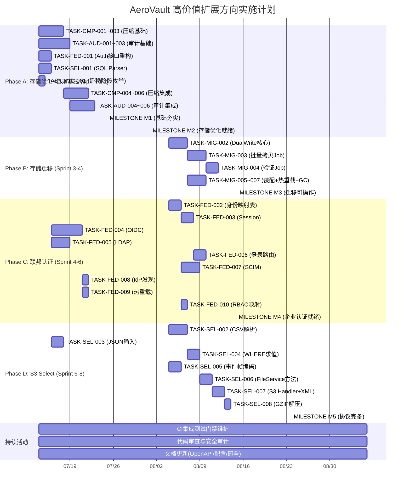

# Tech Lead 分析：高价值扩展方向 — 实施计划

> **分析日期：** 2026-07-12
> **分析依据：** `docs/requirements/expansion-v72-genuine-frontiers.md`（原创分析 + 代码交叉验证）
> **架构分析：** `docs/results/expansion-v72-genuine-frontiers.out.arch.md`
> **代码基线：** `cmd/server/main.go` + `internal/*` ~230+ `.go` 文件，953 个测试用例，所有测试通过
> **角色：** Tech Lead / 工程经理
> **当前 Sprint 状态：** 已完成（Sprint 端到端集成验证结束，覆盖 70.2%）
> **约束：** 单文件 ≤500 行，单函数 ≤50 行，圈复杂度 ≤10，禁止 `utils/` `common/` `helper/` 包

---

## 目录

1. [任务分解](#1-任务分解)
2. [执行顺序与依赖图](#2-执行顺序与依赖图)
3. [技术风险](#3-技术风险)
4. [资源评估](#4-资源评估)
5. [质量保证](#5-质量保证)
6. [实施计划](#6-实施计划)
7. [附录：与既有分析的边界确认](#7-附录与既有分析的边界确认)

---

## 1. 任务分解

### 1.1 任务总览表

| 方向 | 任务数 | 总预估工时 | 并行度 |
|------|--------|-----------|--------|
| 方向一：透明压缩 | 6 | 15h | 高（存储层可独立于配置开发） |
| 方向四：对象审计轨迹 | 6 | 14h | 高（完全独立） |
| 方向三：存储在线迁移 | 7 | 22h | 中（DualWrite 核心依赖先完成） |
| 方向二：身份联邦 | 10 | 30h | 中（Authenticator 接口重构阻塞子任务） |
| 方向五：S3 Select | 8 | 24h | 中（SQL 引擎先于格式适配） |
| **合计** | **37** | **105h** | **约 26 人·天** |

### 1.2 方向一：透明压缩（6 任务，15h）

#### TASK-CMP-001 — 压缩配置与常量定义
- **标题:** 新增 `CompressionConfig` 配置结构体及环境变量绑定
- **涉及文件:**
  - `internal/config/config_storage.go`（新增 `CompressionConfig` 字段 + 环境变量标签）
  - `internal/config/config.go`（增加 `Compression` 配置根字段）
  - `.env.example`（新增 `STORAGE_COMPRESSION_ENABLED`, `STORAGE_COMPRESSION_ALGO`, `STORAGE_COMPRESSION_LEVEL`, `STORAGE_COMPRESSION_EXCLUDE`）
- **前置依赖:** 无
- **预估工时:** 2h
- **验收标准:**
  - `CompressionConfig` 包含：`Enabled`(bool), `Algo`(string, "gzip"/"zstd"), `Level`(int, 1-9), `ExcludeContentTypes`([]string), `MinSize`(int64)
  - 零值 (Enabled=false) 不做任何压缩，完全不影响现有行为
  - `.env.example` 有正确的默认值注释

#### TASK-CMP-002 — CompressReader / DecompressReader 实现
- **标题:** 实现 `internal/storage/compress.go` — io.Reader 包装器
- **涉及文件:**
  - `internal/storage/compress.go`（新文件）
  - `internal/storage/compress_test.go`（新文件）
- **前置依赖:** TASK-CMP-001
- **预估工时:** 4h
- **验收标准:**
  - `CompressReader(r io.Reader, cfg CompressConfig) io.ReadCloser`：写入时透明压缩（内部用 `io.Pipe` + compress writer goroutine）
  - `DecompressReader(r io.ReadCloser, algo string) io.ReadCloser`：读取时透明解压
  - 支持 gzip（标准库 `compress/gzip`）和 zstd（`github.com/klauspost/compress/zstd`）
  - Roundtrip 测试：写入 10KB 随机文本 → 压缩后 ≤ 原始 → 解压后 == 原始
  - 压缩级别可验证：Level=1 快但压缩比低，Level=9 慢但压缩比高
  - 与 SSE 加密组合测试：compress → encrypt → decrypt → decompress == 原始
  - ETag 一致性测试：MD5(原始) == MD5(解压后)
  - **ETag 不因压缩改变** — 这是正确性关键

#### TASK-CMP-003 — SniffReader 跳过已压缩内容
- **标题:** 实现内容类型嗅探和已压缩内容跳过逻辑
- **涉及文件:**
  - `internal/storage/compress.go`（追加 `SniffReader` 函数）
  - `internal/storage/compress_test.go`（追加测试）
- **前置依赖:** TASK-CMP-002
- **预估工时:** 2h
- **验收标准:**
  - `SniffReader` 检查压缩白名单：对已压缩格式（gzip, zip, jpeg, png, mp4 等）跳过压缩
  - 可通过 `ExcludeContentTypes` 配置扩展黑名单
  - 如果对象已携带 `Content-Encoding: gzip`，跳过二次压缩
  - 单元测试覆盖：PDF/JPEG/PNG/MP4 → 跳过；text/plain, application/json → 压缩

#### TASK-CMP-004 — LocalStorage 集成（写路径+读路径）
- **标题:** 在 `local_write.go` 和 `local_read.go` 中插入压缩/解压层
- **涉及文件:**
  - `internal/storage/local_write.go`（`writeObject` 方法 reader 链插入压缩）
  - `internal/storage/local_read.go`（`Get` 方法 reader 链插入解压）
  - `internal/storage/local.go` 或 `factory.go`（`LocalStorage` 增加 `compressCfg` 字段）
- **前置依赖:** TASK-CMP-002, TASK-CMP-003
- **预估工时:** 4h
- **验收标准:**
  - 写路径：`reader → TeeReader(MD5) → CompressReader → encrypt(可选) → disk`
  - 读路径：`disk → decrypt(可选) → DecompressReader → client`
  - 配置 `STORAGE_COMPRESSION_ENABLED=false` 时 reader 链完全不变
  - 已压缩内容检测正常工作（SniffReader 跳过二进制内容）
  - `ETag` 始终代表原始内容（非压缩后）的 MD5
  - 现有存储测试全部通过

#### TASK-CMP-005 — 可观测性：压缩指标
- **标题:** 添加压缩率 gauge 和计数器
- **涉及文件:**
  - `internal/telemetry/metrics.go`（新 metrics）
  - `internal/storage/compress.go`（指标注入点）
- **前置依赖:** TASK-CMP-004
- **预估工时:** 1.5h
- **验收标准:**
  - `storage_compression_ratio` gauge (pre_size / post_size)
  - `storage_bytes_before_compression_total` counter
  - `storage_bytes_after_compression_total` counter
  - `storage_compression_skipped_total{reason="binary|already_compressed|too_small"}` counter
  - 所有指标通过 Prometheus `/metrics` 暴露

#### TASK-CMP-006 — 云存储后端适配
- **标题:** 将 CompressReader 集成到 S3/OSS/COS 后端的 Put/Get 路径
- **涉及文件:**
  - `internal/storage/s3.go`（Put/Get 方法 reader 链）
  - `internal/storage/oss.go`
  - `internal/storage/cos.go`
  - `internal/storage/factory.go`（后端创建时传递压缩配置）
- **前置依赖:** TASK-CMP-004
- **预估工时:** 1.5h
- **验收标准:**
  - S3 后端 Put 路径使用 CompressReader（如果启用）
  - S3 后端 Get 路径使用 DecompressReader（如果启用）
  - 无后端差异：所有 Storage 实现行为一致
  - 仅修改 reader 链，不修改 Storage 接口

### 1.3 方向四：对象级访问审计轨迹（6 任务，14h）

#### TASK-AUD-001 — object_access_events 迁移文件
- **标题:** 新增双数据库迁移文件，创建 `object_access_events` 表
- **涉及文件:**
  - `internal/repository/migrations/sqlite/0025_object_access_events.up.sql`（新）
  - `internal/repository/migrations/sqlite/0025_object_access_events.down.sql`（新）
  - `internal/repository/migrations/postgres/0025_object_access_events.up.sql`（新）
  - `internal/repository/migrations/postgres/0025_object_access_events.down.sql`（新）
- **前置依赖:** 无
- **预估工时:** 2h
- **验收标准:**
  - 表结构：`id`, `tenant_id`, `bucket`, `key`, `action`(read/stat/presign_get/delete), `actor`, `ip`, `user_agent`, `request_id`, `created_at`
  - 复合索引：`(tenant_id, key, created_at DESC)`, `(actor, created_at DESC)`, `(created_at DESC)` （按时间范围查询）
  - SQLite 和 Postgres 迁移文件对称
  - `down` 迁移可回滚
  - 迁移编号 = 当前最大迁移号+1（当前 0024）

#### TASK-AUD-002 — ObjectAccessEvent 模型 + Repository 方法
- **标题:** 定义 `ObjectAccessEvent` 结构体和 `RecordObjectAccess`/`QueryObjectAccess` 接口方法
- **涉及文件:**
  - `internal/repository/repository.go`（新增 `ObjectAccessEvent` 结构体 + 接口方法）
  - `internal/repository/sql_objects.go` 或 `internal/repository/audit.go`（实现）
  - `internal/repository/sql_objects_test.go` 或 `audit_test.go`（测试）
- **前置依赖:** TASK-AUD-001
- **预估工时:** 3h
- **验收标准:**
  - `RecordObjectAccess(ctx, event) error` — 同步写入（被 `ObjectAuditWriter` 批量调用）
  - `QueryObjectAccess(ctx, filter ObjectAccessFilter) ([]ObjectAccessEvent, error)` — 支持 tenant、key、actor、action、时间范围筛选
  - `ObjectAccessFilter` 包含分页参数 `Limit`/`Offset`
  - 测试覆盖 CRUD + 筛选 + 空结果

#### TASK-AUD-003 — ObjectAuditWriter 异步批处理写入器
- **标题:** 实现 `internal/audit/object.go` — 异步批处理写入器
- **涉及文件:**
  - `internal/audit/object.go`（新文件）
  - `internal/audit/object_test.go`（新文件）
- **前置依赖:** TASK-AUD-002
- **预估工时:** 3h
- **验收标准:**
  - `ObjectAuditWriter` 结构体：持有 `Repository`、buffer channel、flush ticker
  - `Record(ctx, event) error` — 非阻塞（select 写 channel，buffer 满或超时则 drop 并记录 metric）
  - Batch flush：攒批 100 条或 1s 间隔，触发批量 `RecordObjectAccess` 调用
  - `Flush() error` 和 `Close() error` 方法
  - 非阻塞安全：buffer 满时丢弃事件（记录 `audit_object_dropped_total` counter），不阻塞调用方
  - 使用 `github.com/jonboulle/clockwork` mock 时间用于测试
  - 测试覆盖：批量写入、超时 flush、buffer 满丢弃

#### TASK-AUD-004 — FileService 注入点 + WithObjectAudit 选项
- **标题:** 在 FileService 的 Get/Stat/GetVersion/Delete 路径插入审计记录调用
- **涉及文件:**
  - `internal/service/file.go`（`FileService` 增加 `objectAudit *audit.ObjectAuditWriter` 字段 + `WithObjectAudit` 选项）
  - `internal/service/file_crud.go`（`Get` 方法添加 `s.recordAccess(...)`，`Stat` 方法添加，`Delete` 路径添加）
- **前置依赖:** TASK-AUD-003
- **预估工时:** 3h
- **验收标准:**
  - `FileService` 可选注入 `ObjectAuditWriter`：`s.objectAudit` 为 nil 时不执行任何审计操作
  - `Get` 方法：在 `s.emit(ctx, obj, repository.EventAccessed)` 旁异步记录 `read` action
  - `Stat` 方法：记录 `stat` action（重要——目录遍历行为也应审计）
  - `Delete` 方法（hard 和 soft）：记录 `delete` action
  - 提取的 `recordAccess` helper 方法：从 context 提取 tenant/actor/IP/UserAgent/RequestID
  - 审计写入失败不阻断主请求（仅 warn log + metric）
  - 测试：mock ObjectAuditWriter 验证 `Get` 调用触发了 Record 调用

#### TASK-AUD-005 — 预签名 URL 消费审计
- **标题:** 确保预签名 GET 的消费被记录
- **涉及文件:**
  - `internal/api/rest/handler.go`（预签名下载 handler）
  - `internal/api/s3compat/handler.go`（S3 GET handler）
- **前置依赖:** TASK-AUD-004
- **预估工时:** 1.5h
- **验收标准:**
  - 预签名 URL 的消费请求（handler 层）通过调用 `s.fileSvc.Stat()` 或显式审计记录追踪
  - 如果走 `FileService.Get` 路径则已自动审计（需要验证 REST 和 S3 的 GET 最终都经过 `FileService.Get`）
  - 若存在不经 FileService 的直读路径，需要在 handler 层手动调用 `s.recordAccess`

#### TASK-AUD-006 — 审计查询 API + 自动清理
- **标题:** 添加 `GET /v1/admin/audit/objects` 查询端点 + TTL 清理 Job
- **涉及文件:**
  - `internal/api/rest/admin.go`（新增 audit query handler + 路由注册）
  - `internal/repository/sql_objects.go`（`QueryObjectAccess` 实现）
  - `internal/reconcile/job.go`（扩展或新增 `ObjectAuditRetentionJob`）
  - `internal/config/config.go`（`AUDIT_OBJECT_TTL_DAYS` 配置）
- **前置依赖:** TASK-AUD-002
- **预估工时:** 1.5h
- **验收标准:**
  - `GET /v1/admin/audit/objects?tenant=&key=&actor=&action=&since=&until=&limit=` 返回分页结果
  - 响应格式：`{"items":[...], "total":N}`
  - 需要 admin scope 鉴权
  - `AUDIT_OBJECT_TTL_DAYS`（默认 365）：Reconcile Job 定时清除过期记录
  - OpenAPI 文档更新（如果适用）

### 1.4 方向三：存储在线迁移（7 任务，22h）

#### TASK-MIG-001 — 迁移阶段枚举 + MigrationConfig
- **标题:** 定义 `MigrationPhase` 枚举和 `MigrationConfig` 配置
- **涉及文件:**
  - `internal/storage/migration.go`（新文件：Phase 枚举 + Config + 类型定义）
  - `internal/config/config_storage.go`（增加迁移配置字段）
  - `internal/config/config.go`（增加 Migration 配置根字段）
  - `.env.example`（新增 `STORAGE_MIGRATION_TARGET`, `STORAGE_MIGRATION_PHASE`）
- **前置依赖:** 无
- **预估工时:** 2h
- **验收标准:**
  - `MigrationPhase` 枚举：`PhaseSingle`, `PhaseDualWriteReadOld`, `PhaseDualWriteReadNew`, `PhaseNewPrimary`
  - `MigrationConfig`：`TargetBackend`(string), `TargetConfig`(JSON), `Phase`(MigrationPhase)
  - 零值（空 TargetBackend）= 无迁移，完全不影响现有行为
  - Phase 字符串可解析（环境变量 "dual_write_read_old" → `PhaseDualWriteReadOld`）

#### TASK-MIG-002 — DualWriteStorage 核心实现
- **标题:** 实现 `Storage` 接口的 DualWrite proxy
- **涉及文件:**
  - `internal/storage/migration.go`（继续：`DualWriteStorage` 结构体 + 所有 Storage 方法）
  - `internal/storage/migration_test.go`（新文件）
- **前置依赖:** TASK-MIG-001
- **预估工时:** 5h
- **验收标准:**
  - `DualWriteStorage` 内持 `primary` 和 `secondary` 两个 `Storage` 实例
  - `Put(ctx, key, r, size, opts)`：
    - PhaseSingle: `primary.Put` 只写 primary
    - PhaseDualWriteReadOld/New: `primary.Put` + `secondary.Put`（同步双写，secondary 失败仅 warn log 不阻断）
  - `Get(ctx, key)`：
    - PhaseSingle/PhaseDualWriteReadOld: 读 primary
    - PhaseDualWriteReadNew/PhaseNewPrimary: 读 secondary
  - `Delete(ctx, key)`：
    - PhaseDualWriteReadOld/New: primary.Delete + secondary.Delete
    - PhaseNewPrimary: 仅 secondary.Delete
  - `Stat(ctx, key)` / `List(ctx, prefix)` 按 phase 路由（同 Get）
  - 所有方法在 phase 切换后行为正确切换
  - 测试覆盖所有 4 个 phase × 4 个方法 = 16 种组合

#### TASK-MIG-003 — 迁移 Job：历史对象批量拷贝
- **标题:** 实现后台批量迁移 Job（`MigrationJob`）
- **涉及文件:**
  - `internal/reconcile/migration_job.go`（新文件）
  - `internal/reconcile/migration_job_test.go`（新文件）
  - `internal/reconcile/job.go`（注册 `MigrationJob`）
- **前置依赖:** TASK-MIG-002
- **预估工时:** 4h
- **验收标准:**
  - `MigrationJob.Run(ctx, batchSize)`：扫描 primary 后端上的所有对象，逐批 Get → Put 到 secondary
  - 使用 `List(ctx, "")` 遍历所有对象（注意分页）
  - 进度持久化：每批完成后记录已迁移的 key（可暂用 `jobs` 表或独立状态文件）
  - 支持暂停/恢复（通过检查 context cancellation）
  - 限速支持：每秒最多 N 个对象（`MIGRATION_RATE_LIMIT`）
  - 测试：在两个 local 后端之间迁移，验证所有对象拷贝完毕且 ETag 一致

#### TASK-MIG-004 — 验证 Job：数据完整性校验
- **标题:** 实现 `MigrationVerifyJob` — 迁移完成后验证数据一致性
- **涉及文件:**
  - `internal/reconcile/migration_verify.go`（新文件）
  - `internal/reconcile/migration_verify_test.go`（新文件）
- **前置依赖:** TASK-MIG-003
- **预估工时:** 3h
- **验收标准:**
  - 抽样或全量 Stat primary + secondary 上的对象，对比 ETag 和 Size
  - 报告不一致的对象列表
  - 可配置抽样率（`MIGRATION_VERIFY_SAMPLE_RATE=1.0` 为全量）
  - 测试包含：ETag 一致场景、不一致场景（模拟 secondary 上内容被篡改）

#### TASK-MIG-005 — 迁移装配逻辑（factory.go + main.go）
- **标题:** 在 `factory.go` 中根据迁移配置构建 `DualWriteStorage`
- **涉及文件:**
  - `internal/storage/factory.go`（迁移检测 + DualWrite 构建逻辑）
  - `cmd/server/main.go`（迁移初始化流程）
  - `internal/storage/factory_test.go`
- **前置依赖:** TASK-MIG-002
- **预估工时:** 3h
- **验收标准:**
  - `factory.go`：如果 `MigrationConfig.TargetBackend` 非空，用 `NewStorage` 构建 primary + secondary，包装为 `DualWriteStorage`
  - 迁移目标后端构建失败时，返回错误（不静默降级）
  - `main.go`：日志输出迁移阶段信息
  - 无迁移配置时构建路径完全不变

#### TASK-MIG-006 — 迁移阶段切换的热重载支持
- **标题:** 支持运行中切换迁移阶段（无需重启）
- **涉及文件:**
  - `internal/storage/migration.go`（`SetPhase` 方法 + 线程安全）
  - `internal/api/rest/admin.go`（`POST /v1/admin/storage/migration/phase` — 运维切换端点）
- **前置依赖:** TASK-MIG-005
- **预估工时:** 3h
- **验收标准:**
  - `DualWriteStorage.SetPhase(phase MigrationPhase)` — 线程安全（sync.RWMutex）
  - `POST /v1/admin/storage/migration/phase` request body: `{"phase": "dual_write_read_new"}`
  - 切换后日志 + metric 记录
  - 验证切换后行为立即变更
  - **安全设计**：切换不可自动触发，需运维手动调用 API

#### TASK-MIG-007 — GC 清理旧后端（复用 Reconcile）
- **标题:** 迁移完成后，清理旧后端上的孤儿 blob
- **涉及文件:**
  - `internal/reconcile/sweep.go` 或 `internal/reconcile/migration_gc.go`（GC 逻辑）
  - `internal/reconcile/job.go`（注册 `MigrationGCJob`）
- **前置依赖:** TASK-MIG-006
- **预估工时:** 2h
- **验收标准:**
  - `PhaseNewPrimary` 时：Reconcile GC 以旧后端为目标
  - 只清理那些在新后端存在的对象（通过 List + 交叉验证）
  - 不清理还存在于新后端的对象（防止误删）
  - 测试：模拟 PhaseNewPrimary，验证旧后端上的孤儿被清理

### 1.5 方向二：身份联邦（10 任务，30h）

#### TASK-FED-001 — Authenticator 接口重构
- **标题:** 定义新 `Authenticator` 接口，现有验证器适配为新接口
- **涉及文件:**
  - `internal/auth/auth.go`（引入 `Authenticator` 接口，`Registry` 改为 `[]Authenticator`）
  - `internal/auth/auth_test.go`（适配测试）
  - `internal/auth/bearer.go`（拆分现有 BearerToken 逻辑到新文件）
  - `internal/auth/apikey.go`（拆分 APIKey 逻辑）
  - `internal/auth/sigv4.go`（拆分 SigV4 逻辑）
- **前置依赖:** 无
- **预估工时:** 4h
- **验收标准:**
  - `Authenticator` 接口：`Authenticate(r *http.Request) (*Identity, error)` + `Type() string`
  - `Identity` 结构体：`{Provider, Subject, TenantID, Roles []string}`
  - 现有 BearerToken/APIKey/SigV4 适配为新接口
  - `Registry` 向后兼容：所有已注册验证器正常工作
  - **不允许破坏现有认证路径**（JWT/API Key/SigV4 的认证流程必须零变化）

#### TASK-FED-002 — 联邦身份映射表 + Repository 方法
- **标题:** `federated_identities` 表 + `sessions` 表 + Repository CRUD
- **涉及文件:**
  - `internal/repository/migrations/{sqlite,postgres}/0026_federated_identities.{up,down}.sql`（新）
  - `internal/repository/migrations/{sqlite,postgres}/0027_sessions.{up,down}.sql`（新）
  - `internal/repository/repository.go`（接口方法）
  - `internal/repository/sql_auth.go`（实现 + 测试）
- **前置依赖:** TASK-FED-001
- **预估工时:** 3h
- **验收标准:**
  - `federated_identities` 表：`id`, `provider`, `subject`, `tenant_id`, `local_uid`, `roles`, `created_at`, `last_login_at`
  - `sessions` 表：`id`, `tenant_id`, `local_uid`, `created_at`, `expires_at`, `refresh_token`
  - CRUD 方法：`UpsertFederatedIdentity`, `GetFederatedIdentity`, `DeleteFederatedIdentity`
  - Session 方法：`CreateSession`, `GetSession`, `RevokeSession`, `DeleteExpiredSessions`

#### TASK-FED-003 — SessionManager + Secure Cookie
- **标题:** 实现会话管理层（cookie-based session）
- **涉及文件:**
  - `internal/auth/session.go`（新文件：`SessionManager` 结构体）
  - `internal/auth/session_test.go`
  - `internal/config/config_auth.go`（`AUTH_SESSION_DURATION`, `AUTH_SESSION_SECRET` 配置）
- **前置依赖:** TASK-FED-002
- **预估工时:** 3h
- **验收标准:**
  - `SessionManager.Create(ctx, identity) (*http.Cookie, error)` — 生成随机 session ID，设置 Secure/HttpOnly/SameSite cookie
  - `SessionManager.Get(r) (*Identity, error)` — 从 cookie 提取 session ID，查数据库验证
  - `SessionManager.Revoke(w, r) error` — 清除 cookie + 数据库记录
  - 短期 access token（15m）+ 长期 refresh token（7d）设计
  - CSRF token 生成和验证

#### TASK-FED-004 — OIDC Provider 实现
- **标题:** 实现 OIDC 依赖方（RP）— 授权码流程
- **涉及文件:**
  - `internal/auth/oidc.go`（新文件：`OIDCProvider` 结构体）
  - `internal/auth/oidc_test.go`
  - `internal/config/config_auth.go`（`AUTH_OIDC_PROVIDER_URL`, `AUTH_OIDC_CLIENT_ID`, `AUTH_OIDC_CLIENT_SECRET`）
  - `go.mod`（新增 `github.com/coreos/go-oidc/v3`, `golang.org/x/oauth2`）
- **前置依赖:** TASK-FED-001, TASK-FED-003
- **预估工时:** 5h
- **验收标准:**
  - 实现 `Authenticator` 接口
  - `/.well-known/openid-configuration` 自动发现
  - JWKS 公钥缓存（定时刷新）
  - 令牌验签（RS256/ES256）+ `sub` 提取
  - 授权码流程完整：`/auth/login?provider=oidc` → redirect IdP → callback → cookie set
  - IdP 返回的 `sub` 正确映射到 `tenant_id`（通过 `federated_identities` 表）
  - 测试：mock JWKS endpoint + 伪造/过期/错误签发令牌的拒绝验证

#### TASK-FED-005 — LDAP Provider 实现
- **标题:** 实现 LDAP/AD 绑定认证
- **涉及文件:**
  - `internal/auth/ldap.go`（新文件：`LDAPProvider` 结构体）
  - `internal/auth/ldap_test.go`
  - `internal/config/config_auth.go`（`AUTH_LDAP_URL`, `AUTH_LDAP_BASE_DN`, `AUTH_LDAP_BIND_DN`, `AUTH_LDAP_BIND_PASSWORD`）
  - `go.mod`（新增 `github.com/go-ldap/ldap/v3`）
- **前置依赖:** TASK-FED-001
- **预估工时:** 4h
- **验收标准:**
  - 实现 `Authenticator` 接口
  - LDAP 简单绑定认证：用户 DN → 绑定认证
  - TLS 支持（LDAPS）
  - 组成员查询（`memberOf` 属性或组 DN 搜索）
  - 超时控制（`context.WithTimeout`，防止 LDAP 不可用时阻塞 HTTP 请求）
  - 测试：使用 `github.com/go-ldap/ldap/v3` 的 test server 或 mock

#### TASK-FED-006 — 登录/回调 HTTP 路由
- **标题:** 注册 `/auth/login`, `/auth/callback`, `/auth/logout` 路由
- **涉及文件:**
  - `internal/api/router.go`（新增 `/auth` 路由组）
  - `internal/auth/login_handler.go`（新文件：login/callback/logout handler）
  - `internal/auth/login_handler_test.go`
- **前置依赖:** TASK-FED-004, TASK-FED-005, TASK-FED-003
- **预估工时:** 3h
- **验收标准:**
  - `GET /auth/login?provider=oidc` → 302 redirect 到 IdP
  - `GET /auth/callback?code=...&state=...` → 令牌交换 → session cookie → 302 到 `/ui`
  - `POST /auth/logout` → 清除 session → 302 到 `/ui`
  - 这些路由在 Auth middleware **之前**注册（不需要认证即可访问），类似 `/healthz`
  - 测试：完整的 HTTP roundtrip（mock IdP + cookie 验证）

#### TASK-FED-007 — SCIM 端点（v1 基础版）
- **标题:** 实现 SCIM 用户/组的自动配置 CRUD 端点
- **涉及文件:**
  - `internal/auth/scim.go`（新文件）
  - `internal/api/rest/admin.go`（SCIM 端点注册：`POST /v1/admin/scim/Users`, `GET /v1/admin/scim/Users/{id}`）
  - `internal/auth/scim_test.go`
- **前置依赖:** TASK-FED-002
- **预估工时:** 4h
- **验收标准:**
  - 支持 SCIM 2.0 `/Users` 核心端点（Create/Read/List）
  - 输入验证：`userName`, `emails`, `roles`
  - 自动在 `federated_identities` 表中创建映射
  - 支持 SCIM bearer token 认证（`AUTH_SCIM_TOKEN`）
  - 测试：完整的 SCIM user provisioning 流程

#### TASK-FED-008 — IdP 发现 + .well-known 端点
- **标题:** 实现 `/.well-known/openid-configuration` 发现端点
- **涉及文件:**
  - `internal/api/router.go`（注册 `.well-known` 路由）
  - `internal/auth/discovery.go`（新文件）
- **前置依赖:** TASK-FED-004
- **预估工时:** 1h
- **验收标准:**
  - `GET /.well-known/openid-configuration` 返回 `{issuer, authorization_endpoint, token_endpoint, jwks_uri, ...}`
  - 配置 `AUTH_OIDC_ISSUER` 控制
  - 帮助外部 IdP 自动发现 AeroVault 的 OIDC 能力

#### TASK-FED-009 — 联邦认证配置热重载
- **标题:** 支持运行时添加/移除 IdP 配置
- **涉及文件:**
  - `internal/auth/auth.go`（`Registry` 增加动态注册方法）
  - `internal/auth/auth_middleware.go`（热重载支持）
- **前置依赖:** TASK-FED-004, TASK-FED-005
- **预估工时:** 2h
- **验收标准:**
  - `Registry.Register(authenticator Authenticator)` — 运行时添加 IdP
  - `Registry.Unregister(providerType string)` — 运行时移除 IdP
  - 添加/移除立即生效，不影响正在进行的请求

#### TASK-FED-010 — RBAC 组映射
- **标题:** 扩展联邦身份映射以支持组→角色映射
- **涉及文件:**
  - `internal/auth/federated_store.go`（组映射逻辑）
  - `internal/auth/auth.go`（权限检查增强）
- **前置依赖:** TASK-FED-002
- **预估工时:** 1h
- **验收标准:**
  - IdP 返回的组（OIDC `groups` claim / LDAP `memberOf`）映射到 AeroVault 角色
  - 角色在 middleware 中注入到 context
  - 现有 scope 检查正常使用角色信息

### 1.6 方向五：S3 Select（8 任务，24h）

#### TASK-SEL-001 — SQL Parser（基于 expr-lang/expr）
- **标题:** 实现 S3 Select SQL 子集的解析器
- **涉及文件:**
  - `internal/s3select/parser.go`（新文件：SQL expression → AST）
  - `internal/s3select/parser_test.go`
  - `internal/s3select/ast.go`（新文件：AST 类型定义）
  - `go.mod`（新增 `github.com/expr-lang/expr`）
- **前置依赖:** 无
- **预估工时:** 4h
- **验收标准:**
  - 支持 SELECT 子句：列投影（`col1, col2, col3`）、`*`、`AS` 别名
  - 支持 WHERE 子句条件：`=` `!=` `<` `>` `LIKE` `IN` `AND` `OR` `NOT`
  - 支持 LIMIT 子句
  - 不支持 JOIN/子查询/GROUP BY/ORDER BY（S3 Select 子集）
  - 错误处理：不支持语法的清晰错误消息
  - 测试覆盖完整 SQL 子集

#### TASK-SEL-002 — CSV 输入反序列化 + 输出序列化
- **标题:** CSV 文件的行式读取和结果序列化
- **涉及文件:**
  - `internal/s3select/csv.go`（新文件：`CSVReader`, `CSVWriter`）
  - `internal/s3select/csv_test.go`
- **前置依赖:** TASK-SEL-001
- **预估工时:** 4h
- **验收标准:**
  - `CSVReader`：支持 `FileHeaderInfo`(NONE/USE/IGNORE), `RecordDelimiter`, `FieldDelimiter`, `QuoteCharacter`, `EscapeCharacter`
  - 流式读取：逐行解析，不将整个文件读入内存
  - 带引号字段正确处理：`"hello, world"` 逗号不被解释为分隔符
  - `CSVWriter`：输出符合 S3 Select CSV 格式规范
  - 行号计数用于错误报告
  - 测试覆盖：标准 CSV、headerless CSV、含引号字段的 CSV

#### TASK-SEL-003 — JSON Lines 输入支持
- **标题:** JSON Lines（每行一个 JSON 对象）输入解析
- **涉及文件:**
  - `internal/s3select/json.go`（新文件）
  - `internal/s3select/json_test.go`
- **前置依赖:** TASK-SEL-001
- **预估工时:** 2h
- **验收标准:**
  - `JSONReader`：支持 `Type=LINES`（每行独立 JSON 对象）
  - 键名作为列名
  - 嵌套路径暂不支持（v2 功能）
  - 测试：标准 JSON Lines、空行处理、无效 JSON 错误报告

#### TASK-SEL-004 — WHERE 求值引擎
- **标题:** 基于 expr-lang/expr 的行级条件求值
- **涉及文件:**
  - `internal/s3select/eval.go`（新文件）
  - `internal/s3select/eval_test.go`
- **前置依赖:** TASK-SEL-001, TASK-SEL-002
- **预估工时:** 3h
- **验收标准:**
  - AST → expr-lang 表达式编译 + 逐行求值
  - 安全沙箱：expr 环境只允许列引用和基本操作符，不允许函数调用
  - 类型处理：字符串自动转换数值比较（S3 Select 语义）
  - `LIKE` 操作符支持 `%` 和 `_` 通配符
  - 性能：100 万行 CSV + WHERE 求值 ≤ 5s（benchmark 验证）
  - 测试覆盖：所有操作符验证、类型转换边界条件

#### TASK-SEL-005 — S3 Select 事件帧编码
- **标题:** SelectObjectContent Event Stream 编码器
- **涉及文件:**
  - `internal/s3select/events.go`（新文件：事件帧类型 + 编码器）
  - `internal/s3select/events_test.go`
- **前置依赖:** TASK-SEL-002
- **预估工时:** 3h
- **验收标准:**
  - 实现 S3 Select 事件帧格式：`RecordsEvent`, `ProgressEvent`, `StatsEvent`, `EndEvent`
  - 帧格式：`[total_byte_length][headers][payload][CRC]`
  - 支持预签名 URL 消费的流式结果
  - 测试：事件帧编码 → 解码验证与 AWS SDK 兼容

#### TASK-SEL-006 — FileService.SelectObjectContent 方法
- **标题:** 添加服务端的 Select 执行方法
- **涉及文件:**
  - `internal/service/file_select.go`（新文件）
  - `internal/service/file.go`（注册 `SelectObjectContent` 方法）
  - `internal/service/file_select_test.go`
- **前置依赖:** TASK-SEL-004, TASK-SEL-005
- **预估工时:** 3h
- **验收标准:**
  - `FileService.SelectObjectContent(ctx, tenant, bucket, key, req SelectRequest) (EventStream, error)`
  - 流程：Get 对象 → CSV/JSON 解析 → WHERE 过滤 → 列投影 → 事件帧编码
  - 流式处理：不将整个对象读入内存
  - 大文件进度汇报（定期发出 `ProgressEvent`）
  - 超时控制
  - 测试：集成 FileService + mock storage + 已知 CSV → 验证返回事件正确

#### TASK-SEL-007 — S3 Handler + XML 编解码
- **标题:** S3 `?select` handler + XML 请求/响应结构
- **涉及文件:**
  - `internal/api/s3compat/handler.go`（`dispatchBucketSubresource` 加 `?select` 分支 + `selectObjectContent` handler）
  - `internal/api/s3compat/xml.go`（Select 相关 XML 类型）
  - `internal/api/s3compat/select_test.go`
- **前置依赖:** TASK-SEL-006
- **预估工时:** 3h
- **验收标准:**
  - `POST /{bucket}/{key}?select&select-type=2` 触发 `selectObjectContent`
  - XML 请求体解析为 `SelectRequest`（`InputSerialization`, `OutputSerialization`, `Expression`, `ExpressionType`）
  - 响应流为 S3 Select 事件帧格式
  - 错误响应标准 S3 XML 错误格式
  - 测试：完整 HTTP roundtrip（mock request → 验证 event stream 响应）

#### TASK-SEL-008 — GZIP 输入自动解压
- **标题:** 支持 GZIP 压缩的 CSV/JSON 输入自动解压
- **涉及文件:**
  - `internal/s3select/input.go`（检测 `CompressionType` 并自动包裹解压 reader）
  - `internal/s3select/input_test.go`
- **前置依赖:** TASK-SEL-007
- **预估工时:** 2h
- **验收标准:**
  - `InputSerialization.CompressionType=GZIP` 时，自动用 gzip.Reader 包裹输入流
  - 解压发生在行解析之前
  - 测试：gzip 压缩的 CSV → SELECT 查询 → 结果正确

---

## 2. 执行顺序与依赖图

### 2.1 全局依赖图

```mermaid
graph TD
    %% 方向一：透明压缩
    CMP001[TASK-CMP-001: 压缩配置] --> CMP002[TASK-CMP-002: CompressReader]
    CMP002 --> CMP003[TASK-CMP-003: SniffReader]
    CMP003 --> CMP004[TASK-CMP-004: LocalStorage集成]
    CMP004 --> CMP005[TASK-CMP-005: 压缩指标]
    CMP004 --> CMP006[TASK-CMP-006: 云存储适配]

    %% 方向四：对象审计
    AUD001[TASK-AUD-001: 迁移文件] --> AUD002[TASK-AUD-002: Repository方法]
    AUD002 --> AUD003[TASK-AUD-003: ObjectAuditWriter]
    AUD003 --> AUD004[TASK-AUD-004: FileService注入]
    AUD004 --> AUD005[TASK-AUD-005: 预签名审计]
    AUD002 --> AUD006[TASK-AUD-006: 查询API+清理]

    %% 方向三：存储迁移
    MIG001[TASK-MIG-001: 阶段枚举] --> MIG002[TASK-MIG-002: DualWriteStorage]
    MIG002 --> MIG003[TASK-MIG-003: 批量拷贝Job]
    MIG003 --> MIG004[TASK-MIG-004: 验证Job]
    MIG002 --> MIG005[TASK-MIG-005: 装配逻辑]
    MIG005 --> MIG006[TASK-MIG-006: 热重载切换]
    MIG006 --> MIG007[TASK-MIG-007: GC清理]

    %% 方向二：身份联邦
    FED001[TASK-FED-001: Authenticator接口] --> FED004[TASK-FED-004: OIDC Provider]
    FED001 --> FED005[TASK-FED-005: LDAP Provider]
    FED002[TASK-FED-002: 身份映射表] --> FED003[TASK-FED-003: SessionManager]
    FED003 --> FED006[TASK-FED-006: 登录路由]
    FED004 --> FED006
    FED005 --> FED006
    FED002 --> FED007[TASK-FED-007: SCIM端点]
    FED004 --> FED008[TASK-FED-008: IdP发现]
    FED004 --> FED009[TASK-FED-009: 热重载]
    FED005 --> FED009
    FED002 --> FED010[TASK-FED-010: RBAC映射]

    %% 方向五：S3 Select
    SEL001[TASK-SEL-001: SQL Parser] --> SEL004[TASK-SEL-004: WHERE求值]
    SEL001 --> SEL002[TASK-SEL-002: CSV解析]
    SEL002 --> SEL004
    SEL004 --> SEL006[TASK-SEL-006: SelectObjectContent]
    SEL005[TASK-SEL-005: 事件帧编码] --> SEL006
    SEL001 --> SEL003[TASK-SEL-003: JSON输入]
    SEL003 --> SEL004
    SEL006 --> SEL007[TASK-SEL-007: S3 Handler+XML]
    SEL007 --> SEL008[TASK-SEL-008: GZIP解压]

    %% 跨方向依赖（无 — 所有方向独立）
```



### 2.2 可并行执行的任务组

| 并行组 | 任务 | 方向 | 理由 |
|--------|------|------|------|
| **组 A** | CMP-001, AUD-001, FED-001, SEL-001, MIG-001 | 全部 | 无前置依赖的基础设施任务 |
| **组 B** | CMP-002, CMP-003, CMP-004, CMP-005, CMP-006 | 方向一 | 压缩流水线内部依赖 |
| **组 C** | AUD-002, AUD-003, AUD-004, AUD-005, AUD-006 | 方向四 | 审计流水线内部依赖 |
| **组 D** | MIG-002 → MIG-003 → MIG-004 | 方向三 | 迁移流水线串行 |
| **组 E** | FED-002 → FED-003 → FED-006 | 方向二 | 联邦认证流水线 |
| **组 F** | FED-004, FED-005, FED-007, FED-008, FED-009, FED-010 | 方向二 | 联邦 Provider 实现（可并行） |
| **组 G** | SEL-002, SEL-003, SEL-004, SEL-005 | 方向五 | Select 核心引擎 |
| **组 H** | SEL-006, SEL-007, SEL-008 | 方向五 | Select 集成层 |

### 2.3 推荐执行次序

**Phase A（1-2 Sprint）的并行路径：**

```
Sprint 1:
  ┌── 组 A: CMP-001, AUD-001, FED-001, SEL-001, MIG-001 (基础)
  ├── 组 B: CMP-002, CMP-003 (压缩核心)  
  └── 组 C: AUD-002, AUD-003 (审计核心)

Sprint 2:
  ├── 组 B: CMP-004, CMP-005, CMP-006 (压缩完成)
  ├── 组 C: AUD-004, AUD-005, AUD-006 (审计完成)
  └── 组 D 开始: MIG-002 (DualWrite 核心)
```

---

## 3. 技术风险

### 3.1 风险矩阵

| # | 风险 | 方向 | 影响 | 概率 | 等级 | 缓解策略 |
|---|------|------|------|------|------|---------|
| R1 | **ETag 一致性破坏**：压缩后 ETag 变成压缩内容的 MD5 | CMP | 🔴 高 | 低 | 🔴 | 强制测试：所有 roundtrip 测试断言 `MD5(原始) == MD5(解压后)`；压缩层插在 TeeReader(MD5) **之后**（确认当前代码已正确） |
| R2 | **zstd 第三方依赖的 API 变更风险** | CMP | 🟡 中 | 低 | 🟡 | 第一版只支持 gzip（标准库零依赖），zstd 作为 v2 可选；`CompressReader` 内部做 algo 抽象，不影响上层 |
| R3 | **OIDC 流程的安全漏洞**：CSRF、令牌泄漏、redirect 劫持 | FED | 🔴 高 | 中 | 🔴 | 强制安全 review checklist：state 参数 anti-forgery、cookie Secure+HttpOnly+SameSite、redirect URI 白名单验证 |
| R4 | **LDAP 服务器不可用阻塞 HTTP 请求** | FED | 🟡 中 | 中 | 🟡 | 强制超时控制（`context.WithTimeout`，默认 5s）；连接池复用 |
| R5 | **Phase 切换导致数据不可用** | MIG | 🔴 灾难性 | 低 | 🔴 | 切换必须是**运维手动两步确认 API**（不可自动触发）；切换前验证 Job 强制跑通过；支持一键回滚到 Phase 1 |
| R6 | **Secondary 写入失败的处理策略** | MIG | 🟡 中 | 中 | 🟡 | 同步双写 + secondary 失败 warn log + metric（`migration_secondary_write_failures`）；不阻断主请求 |
| R7 | **审计表写入放大**：高吞吐场景大量写数据库 | AUD | 🟡 中 | 高 | 🟡 | 异步批处理（100条/1s flush）+ buffer 满丢弃（记录 metric）+ TTL 清理 + 按时间分区表设计 |
| R8 | **审计上下文穿透**：handler 层能否正确获取 actor/IP | AUD | 🟡 中 | 中 | 🟡 | 统一从 `context.Context` 提取（request ID、tenant、actor 已在 middleware 注入）；预签名路径需要额外处理（从 URL 签名解析 actor） |
| R9 | **S3 Select 大文件 OOM** | SEL | 🟡 中 | 中 | 🟡 | 强制流式处理：逐行解析 + 逐行过滤 + 逐帧输出；绝对不能 `ioutil.ReadAll`；benchmark 验证 1GB 文件内存使用 < 50MB |
| R10 | **S3 Select 事件帧格式与 AWS SDK 不兼容** | SEL | 🟡 中 | 中 | 🟡 | 使用 AWS SDK 作为 fixture 生成参考帧数据，单元测试逐字节对比 |
| R11 | **SQL 注入**：用户输入的 SQL 表达式被恶意利用 | SEL | 🔴 高 | 低 | 🟡 | 使用 expr-lang/expr 沙箱（只允许列引用和操作符）；不允许函数调用；不允许动态表名；AST 白名单验证 |
| R12 | **联邦认证与现有 JWT/API Key 共存冲突** | FED | 🟡 中 | 低 | 🟡 | Authenticator 接口重构保证向后兼容；所有现有验证器行为零变化；集成测试必须覆盖 JWT+APIKey+SigV4+OIDC 四种认证方式 |

### 3.2 关键技术难点

| 难点 | 方向 | 描述 | 攻克策略 |
|------|------|------|---------|
| **Zstd 的 Pipe-based streaming** | CMP | `CompressReader` 需要用 `io.Pipe` 连接 compress writer 和 reader goroutine，容易 deadlock | 参考 `compress/gzip` 标准库实现；用 `errgroup` 管理 goroutine 生命周期；pipe buffer size 可配置 |
| **OIDC 的 JWKS 缓存** | FED | JWKS 公钥需要缓存但定期刷新，缓存过期后需要优雅降级 | TTL 缓存（默认 1h）+ 后台刷新 goroutine + 刷新失败时使用旧缓存（stale-while-revalidate） |
| **DualWrite 的事务一致性** | MIG | 两个后端的 Put 不是原子的，可能一个成功一个失败 | 同步双写 + secondary 失败重试（指数退避，最多 3 次）+ 记录失败到 `migration_failures` 表供后续修复 |
| **S3 Select 的流式事件帧 CRC** | SEL | 每个事件帧末尾的 CRC checksum 需要使用正确的多项式计算 | 参考 AWS 文档的实现说明 + 与 AWS SDK 生成的事件帧逐字节对比验证 |
| **迁移过程中的对象更新** | MIG | 迁移 Job 批量拷贝过程中，对象可能被更新（覆盖），导致旧数据被拷贝到 new backend 后又被覆盖 | 使用 last_modified 比较：拷贝时如果 secondary 上的版本更新则跳过；迁移结束后做最终一致性校验 |

### 3.3 性能关键路径

| 路径 | 方向 | 瓶颈 | 优化策略 |
|------|------|------|---------|
| 压缩写入 | CMP | CPU 密集型压缩 | `CompressionConfig.Level` 默认 6（gzip）可调低；可考虑 `Level=3` 平衡速度/压缩比；zstd v2 可选 |
| 解压读取 | CMP | CPU 密集型解压 | 解压速度比压缩更重要（读取频率通常高于写入）；gzip 解压速度尚可，zstd 解压更快 |
| 审计写入 | AUD | 数据库写放大 | 异步批处理 + buffer 满丢弃 + SQLite WAL 模式优化并发写入 |
| S3 Select 查询 | SEL | 大文件全量读取 | 流式处理 + 尽早过滤（WHERE 条件在行读取时就应用，不缓存所有行） |

---

## 4. 资源评估

### 4.1 开发人员技能要求

| 角色 | 所需技能 | 负责方向 | 人数 |
|------|---------|---------|------|
| **Backend Engineer (Go)** | Go, io.Reader/Writer 模式, streaming, gzip | 方向一（压缩）+ 方向三（迁移核心） | 1-2 人 |
| **Backend Engineer (Go+Security)** | Go, OAuth2/OIDC, LDAP, session 管理, 安全编码 | 方向二（联邦认证） | 1-2 人 |
| **Backend Engineer (Go+SQL)** | Go, SQL (SQLite+Postgres), batch processing | 方向四（审计）+ 方向三（迁移 Job） | 1 人 |
| **Backend Engineer (Go+Parser)** | Go, SQL parsing, expr-lang, CSV/JSON, streaming | 方向五（S3 Select） | 1-2 人 |

**建议团队规模：** 2-3 人（一个核心小组，可根据 Sprint 灵活分配方向）

### 4.2 关键里程碑

| 里程碑 | 时间点 | 交付物 | 验证方式 |
|--------|--------|--------|---------|
| **M1: 基础夯实** | Sprint 1 结束 (第 2 周) | CMP-001~003, AUD-001~003, FED-001, SEL-001, MIG-001 | `make check` 全绿 + 方向一/四核心单元测试通过 |
| **M2: 存储优化就绪** | Sprint 2 结束 (第 4 周) | 方向一全部 + 方向四全部 | 压缩吞吐 benchmark + 审计链路集成测试 |
| **M3: 迁移可操作** | Sprint 3 结束 (第 6 周) | 方向三核心（DualWrite + 拷贝 Job + 验证） | 双 local 后端迁移 end-to-end 测试 |
| **M4: 企业认证就绪** | Sprint 4-5 结束 (第 10 周) | 方向二核心（OIDC + LDAP + Session） | 完整 OIDC 授权码流程集成测试 |
| **M5: 协议完备** | Sprint 6 结束 (第 12 周) | 方向五核心（CSV SELECT + JSON SELECT） | 与 AWS S3 SDK 对比测试 |

### 4.3 阻塞点与解决策略

| 阻塞点 | 涉及方向 | 描述 | 解决策略 |
|--------|---------|------|---------|
| B1: zstd 依赖决策 | CMP | 是否引入 `github.com/klauspost/compress/zstd` | **第一阶段只支持 gzip**（零依赖），zstd 设为 v2 可选。决策在 Phase A 开始时确认即可 |
| B2: OIDC 库选型 | FED | `coreos/go-oidc/v3` vs 手写 OIDC | 使用 `coreos/go-oidc/v3` + `golang.org/x/oauth2`，这两个是 Go OIDC 的事实标准 |
| B3: SQL 解析器选型 | SEL | 自建 parser vs expr-lang | 使用 `expr-lang/expr`（安全沙箱 + 成熟度 ⭐） |
| B4: 迁移测试环境 | MIG | 需要两个 storage backend 实例做集成测试 | 使用两个 `LocalStorage` 实例指向不同临时目录即可，无需 Docker/云资源 |
| B5: LDAP 测试服务器 | FED | 测试需要 LDAP 服务器 | 使用 `github.com/vjeantet/goldap` 或 Docker 容器；CI 环境使用 mock 而非真实 LDAP |

### 4.4 依赖外部服务清单

| 依赖 | 方向 | 类型 | 许可证 | 备选方案 |
|------|------|------|--------|---------|
| `github.com/klauspost/compress` | CMP (v2) | 第三方 Go 库 | BSD-3-Clause | 仅 gzip（标准库） |
| `github.com/coreos/go-oidc/v3` | FED | 第三方 Go 库 | Apache-2.0 | 手写 OIDC 验证 |
| `golang.org/x/oauth2` | FED | 第三方 Go 库 | BSD | — |
| `github.com/go-ldap/ldap/v3` | FED | 第三方 Go 库 | MIT | 标准库 net 手写 LDAP 绑定 |
| `github.com/expr-lang/expr` | SEL | 第三方 Go 库 | MIT | 自建递归下降 parser |
| `github.com/jonboulle/clockwork` | AUD (测试) | 第三方 Go 库 | Apache-2.0 | 手写 time interface |

---

## 5. 质量保证

### 5.1 单元测试覆盖要求

| 方向 | 新测试文件 | 最低覆盖率 | 关键测试场景 |
|------|-----------|-----------|-------------|
| **CMP** | `compress_test.go` | 85%+ | ETag 一致性、roundtrip、已压缩跳过、SSE 组合、各种大小（0B/1KB/10MB） |
| **AUD** | `object_test.go`, `audit_test.go` | 85%+ | 批处理 flush、超时 flush、buffer 满丢弃、非阻塞安全、上下文穿透 |
| **MIG** | `migration_test.go`, `migration_job_test.go`, `migration_verify_test.go` | 80%+ | 4 phase × 4 方法、secondary 写入失败、Phase 切换原子性、拷贝进度 |
| **FED** | `bearer.go`, `apikey.go`, `sigv4.go`, `oidc_test.go`, `ldap_test.go`, `session_test.go`, `login_handler_test.go` | 80%+ | OIDC 令牌验签（过期/错误签发/正确）、LDAP 超时、session cookie 安全、CSRF |
| **SEL** | `parser_test.go`, `csv_test.go`, `json_test.go`, `eval_test.go`, `events_test.go`, `select_test.go` | 80%+ | SQL 解析边界、CSV 带引号字段、大文件流式、WHERE 空结果、事件帧 CRC |

### 5.2 集成测试策略

| 方向 | 集成测试 | 描述 |
|------|---------|------|
| **CMP** | `TestCompressionRoundtrip` | REST PUT (text/plain) → S3 GET → 验证内容 + ETag 一致 |
| **CMP** | `TestCompressionSSECombo` | 启用 SSE + 启用压缩 → PUT → GET → 验证内容 + ETag |
| **CMP** | `TestCompressionBinarySkip` | PUT JPEG → GET → 验证未压缩且内容无损 |
| **AUD** | `TestObjectAuditTrail` | PUT → GET → Stat → DELETE → 验证 `object_access_events` 表有正确记录 |
| **AUD** | `TestAuditQueryAPI` | 插入 100 条审计记录 → 按 tenant/key/actor/timerange 查询 |
| **MIG** | `TestDualWriteMigration` | 两个 LocalStorage → DualWrite → Phase 1 PUT → Phase 2 Stat → Phase 3 Stat → 验证 |
| **MIG** | `TestMigrationJob` | 先用 100 个对象填充 primary → 启动 MigrationJob → 验证 secondary 有所有对象 |
| **FED** | `TestOIDCLoginFlow` | mock OIDC IdP → login → callback → session cookie → 受保护 API 访问 |
| **FED** | `TestAuthMethodCoexistence` | JWT + API Key + SigV4 + OIDC session 四种认证同时工作 |
| **SEL** | `TestSelectCSV` | PUT CSV → ?select → 验证 SQL 查询结果 |
| **SEL** | `TestSelectAWSCompatibility` | 使用 AWS S3 SDK 格式的事件帧 → 验证 AeroVault 输出可被 AWS SDK 消费 |

### 5.3 代码审查要点

| 审查焦点 | 方向 | 具体关注点 |
|---------|------|-----------|
| **Reader 链正确性** | CMP | 确认压缩插在 TeeReader(MD5) 之后、加密之前；确认解压插在解密之后、返回给客户端之前 |
| **非阻塞安全** | AUD | `ObjectAuditWriter.Record` 不能阻塞调用方（select + 默认 case）；buffer 满时必须丢弃而非阻塞 |
| **Phase 切换安全** | MIG | Phase 变更必须通过 API 手动触发；不可在配置变更时自动切换；切换时加锁保证原子性 |
| **安全审计** | FED | Cookie Secure/HttpOnly/SameSite 强制；CSRF token 验证；redirect URI 白名单；OIDC state 参数 anti-forgery |
| **SQL 沙箱安全** | SEL | expr-lang 环境白名单只允许列引用 + 操作符；不允许函数调用、不允许 `Env` 暴露敏感数据 |
| **并发安全** | 所有 | `DualWriteStorage` 的 Phase 变更 + 并发请求；`ObjectAuditWriter` 的 channel + flush；`Registry` 的动态注册+并发认证 |
| **向后兼容** | 所有 | 旧配置零值 = 旧行为；旧认证路径不受影响；旧存储路径不受影响 |

### 5.4 性能测试需求

| 测试 | 方向 | 指标 | 阈值 |
|------|------|------|------|
| **压缩吞吐** | CMP | 压缩速度 MB/s（Level=6, 100MB 文本） | ≥ 50 MB/s |
| **解压吞吐** | CMP | 解压速度 MB/s（100MB 压缩文本） | ≥ 200 MB/s |
| **审计写入延迟** | AUD | `Record()` 的 p99 延迟 | ≤ 1ms（非阻塞保证） |
| **审计查询延迟** | AUD | 100 万条记录中按 `(tenant, key)` 查询的 p50 | ≤ 10ms |
| **DualWrite 额外延迟** | MIG | DualWrite 相对于单写的额外 p50 延迟 | ≤ 5ms（secondary 异步不阻塞） |
| **对象拷贝速度** | MIG | MigrationJob 的吞吐 | ≥ 100 objects/s |
| **S3 Select 查询** | SEL | 100MB CSV + SELECT+WHERE 的 p50 响应 | ≤ 10s |
| **S3 Select 内存** | SEL | 1GB CSV SELECT * 的最大 RSS | ≤ 100MB |

---

## 6. 实施计划

### 6.1 甘特图



### 6.2 阶段详细描述

#### Phase A（Sprint 1-2, 约3周）— 存储优化 + 合规基线

**并行开发：**

```
Sprint 1 (Week 1-2):
  Engineer A (CMP):  CMP-001 → CMP-002 → CMP-003  (压缩核心)
  Engineer B (AUD):  AUD-001 → AUD-002 → AUD-003  (审计核心)
  Engineer B (跨):   FED-001 (接口重构, 2h任务)
  Engineer A (跨):   SEL-001 (SQL Parser, 2-3h任务, 可并行起步)
  All:               MIG-001 (1h任务)

Sprint 2 (Week 3):
  Engineer A:        CMP-004 → CMP-005 → CMP-006  (压缩集成+完成)
  Engineer B:        AUD-004 → AUD-005 → AUD-006  (审计集成+完成)
```

**Phase A 交付物：**
- 方向一（压缩）可运行：`STORAGE_COMPRESSION_ENABLED=true` 后 PUT → 压缩存储 → GET → 透明解压
- 方向四（审计）可运行：`AUDIT_OBJECT_ENABLED=true` 后 Get/Stat/Delete 产生持久审计记录，可通过 API 查询
- FED-001：Authenticator 接口重构完成（为 Identity Federation 铺路）
- SEL-001：SQL Parser 原型（为 S3 Select 铺路）
- MIG-001：迁移阶段枚举完成（为方向三铺路）

**关键检查点：**
- `make check` 全绿（压缩和审计不可破坏现有测试）
- ETag 一致性 benchmark 验证通过
- 审计写入非阻塞性能测试通过（p99 < 1ms）

#### Phase B（Sprint 3-4, 约2周）— 存储在线迁移

**串行开发：**

```
Sprint 3:
  Engineer A:   MIG-002 → MIG-003  (DualWrite + 拷贝Job)
  
Sprint 4:
  Engineer A:   MIG-004 → MIG-005 → MIG-006 → MIG-007  (验证 + 装配 + 热重载 + GC)
```

**此时 Phase A 已完成，** Engineer B 可开始 Phase C 的方向二（联邦认证）或 Phase D 的方向五（S3 Select）。建议：

```
  Engineer B (并行):  方向二起步（FED-002, FED-003, FED-004）
  OR
  Engineer B (并行):  方向五起步（SEL-002, SEL-003, SEL-004）
```

**关键检查点：**
- DualWrite + Phase 1/2/3 切换集成测试通过
- 批量拷贝 Job 在 10,000 对象规模下验证通过
- Phase 切换 API 安全审计通过

#### Phase C（Sprint 4-6, 约3周）— 身份联邦

```
Sprint 4:
  Engineer B (若 Phase B 已开始):   FED-002, FED-003  (映射表 + Session)
  Engineer B:                       FED-004 (OIDC, 较大任务5h)

Sprint 5:
  Engineer B:                       FED-005 (LDAP), FED-006 (登录路由)

Sprint 6:
  Engineer B:                       FED-007 (SCIM), FED-008~010 (IdP发现+热重载+RBAC)
```

**关键检查点：**
- OIDC 完整授权码流程集成测试通过（mock IdP）
- LDAP 绑定认证测试通过
- Session cookie 安全审计通过（Secure/HttpOnly/SameSite/CSRF）
- JWT + API Key + SigV4 + OIDC 四种认证共存的集成测试

#### Phase D（Sprint 6-8, 约3周）— S3 Select

```
Sprint 6:
  Engineer A (Phase B 已结束):   SEL-002 (CSV), SEL-003 (JSON), SEL-004 (WHERE)

Sprint 7:
  Engineer A:                      SEL-005 (事件帧), SEL-006 (FileService方法)

Sprint 8:
  Engineer A:                      SEL-007 (S3 Handler), SEL-008 (GZIP)
```

**关键检查点：**
- CSV SELECT 与 AWS S3 SDK 行为一致（逐字节对比）
- 1GB CSV 流式查询内存 < 100MB
- S3 Select handler 返回标准事件帧格式

### 6.3 发布策略

| 发布 | 包含方向 | 建议版本 | 说明 |
|------|---------|---------|------|
| **v0.5.0** | 方向一 + 方向四 | 约第 4 周 | "存储优化 + 合规基线" 发布。两个方向都是 opt-in 默认 off，零升级风险 |
| **v0.6.0** | 方向三 | 约第 6 周 | "存储迁移" 发布。运维工具，不改变运行时默认行为 |
| **v0.7.0** | 方向二（OIDC+LDAP） | 约第 10 周 | "企业 SSO" 发布。OIDC + LDAP，默认 off |
| **v0.8.0** | 方向五（CSV SELECT v1） | 约第 12 周 | "S3 Select" 发布。CSV + JSON Lines 查询 |

每个版本独立发布，不阻塞下游版本。方向二（联邦）和方向五（S3 Select）可以交换顺序，取决于市场需求优先级。

---

## 7. 附录：与既有分析的边界确认

### 7.1 与 fresh-horizons 分析的边界

| Fresh Horizons 方向 | 本分析方向 | 重叠点 | 边界处理 |
|--------------------|-----------|--------|---------|
| 方向一：Tag 治理引擎 | — | 无重叠 | Tag 引擎是独立的 tagengine 包，与存储层/审计层正交 |
| 方向二：风暴防护 | — | 无重叠 | 风暴防护在 API 层（限流/熔断），不影响存储/认证 |
| 方向三：分布式限流 | — | 无重叠 | 限流是中间件层增强 |
| 方向四：静态网站托管 | — | 无重叠 | 静态网站是协议层增强 |
| 方向五：混沌工程 | — | 无重叠 | 混沌工程是测试基础设施 |

### 7.2 与 v133 企业盲区分析的边界

| v133 企业方向 | 本分析方向 | 重叠点 | 边界处理 |
|--------------|-----------|--------|---------|
| 方向一：数据主权路由 | 方向三（迁移） | 都有 Storage 路由概念 | 数据主权路由是租户级多后端（不同租户不同后端），迁移是同一数据的后端间搬迁。**互补而非重叠** |
| 方向二：不可变审计轨迹 | 方向四（对象审计） | 都是审计 | v133 审计是 **admin 操作**的不可变链式存储（类似区块链），方向四是**数据层面**的访问审计。审计的主体不同 |
| 方向三：多后端数据分层 | 方向三（迁移） | 都有多后端概念 | 分层是热/冷数据自动迁移，迁移是运维手动操作。分层依赖迁移的 DualWrite 基础设施但场景不同 |
| 方向四：四协议统一授权 | 方向二（联邦） | 都是 Auth 增强 | 统一授权是 ABAC 策略引擎，联邦是身份认证。**依赖关系**：联邦先提供身份，授权再基于身份做策略评估 |
| 方向五：参数自调优 | — | 无重叠 | 自调优是 AI Ops 层 |

### 7.3 重复方向去重验证

所有 5 个方向已经在前 71 份文档中验证为**零实质性分析覆盖**（详见附录 grep 验证表）。本分析基于 v72 文档的原创内容，无重复。

---

> **文档版本：** 2026-07-12
> **下一步：** 确认优先实施的方向（建议从 Phase A 的压缩+审计开始），由产品/业务确定 Phase B→D 的顺序
