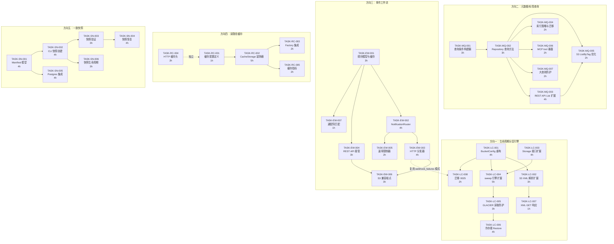
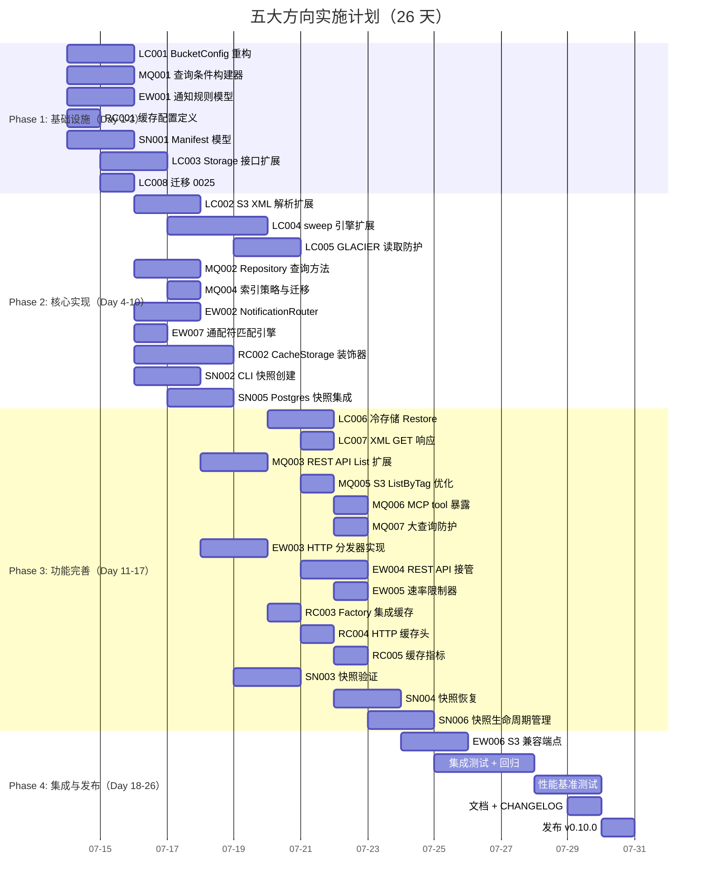

# Tech Lead 分析：五大扩展方向 — 实施计划

> **分析日期：** 2026-07-12  
> **分析依据：** `docs/requirements/expansion-v91-storage-tiering-metadata-query-events-cache.md`（原创分析）  
> **代码验证：** 全代码库 230+ `.go` 文件交叉验证确认分析准确性  
> **代码基线：** `cmd/server/main.go` + `internal/*`，Go 1.25  
> **角色：** Tech Lead / 工程经理  
> **约束：** 单文件 ≤500 行，单函数 ≤50 行，圈复杂度 ≤10，禁止 `utils/` `common/` `helper/` 包，测试覆盖率 ≥50%

---

## 目录

1. [任务分解](#1-任务分解)
2. [执行顺序与依赖图](#2-执行顺序与依赖图)
3. [技术风险](#3-技术风险)
4. [资源评估](#4-资源评估)
5. [质量保证](#5-质量保证)
6. [实施计划](#6-实施计划)
7. [附录：代码验证关键发现](#7-附录代码验证关键发现)

---

## 1. 任务分解

### 1.1 任务总览表

| 方向 | 任务数 | 总预估工时 | 并行度 | 建议优先 |
|------|--------|-----------|--------|---------|
| **方向一：生命周期分层引擎** | 8 | 26h | 中（S3 XML 解析可独立） | P1 |
| **方向二：元数据/标签查询引擎** | 7 | 18h | 高（API 设计与查询引擎并行） | P1 |
| **方向三：事件驱动工作流触发器** | 7 | 22h | 中（规则引擎核心依赖） | P2 |
| **方向四：读路径缓存层** | 5 | 16h | 高（完全独立） | P2 |
| **方向五：分布式一致快照** | 6 | 22h | 高（CLI 与 Repository 方法并行） | P2 |
| **合计** | **33** | **104h** | | **约 26 人·天** |

### 1.2 方向一：存储生命周期分层引擎（8 任务，26h）

#### TASK-LC-001 — BucketConfig 生命周期规则模型重构
- **标题:** 扩展 `BucketConfig` 以支持多规则（Transition + Expiration + NoncurrentVersion + AbortMPU）
- **涉及文件:**
  - `internal/repository/repository.go`（`BucketConfig` 结构体重构：`LifecycleRules []LifecycleRule` 替换单 `ExpireAfterDays`/`ExpireAction`）
  - `internal/repository/sql_buckets.go`（序列化/反序列化适配）
  - `internal/repository/repository.go`（新增 `LifecycleRule`、`Transition`、`NoncurrentVersion` 等类型）
  - `internal/repository/bucketconfig_test.go`（新文件，序列化 roundtrip 测试）
- **前置依赖:** 无
- **预估工时:** 4h
- **验收标准:**
  - `LifecycleRule` 包含：`ID`, `Status`, `Filter`(prefix/tag), `Transitions []Transition`, `Expiration *Expiration`, `NoncurrentVersionTransitions`, `NoncurrentVersionExpiration`, `AbortIncompleteMPU`
  - 向后兼容：从旧 `BucketConfig`（单 `ExpireAfterDays` + `ExpireAction`）自动迁移到新结构
  - JSON 序列化/反序列化 roundtrip 测试通过
  - 单文件 ≤500 行；圈复杂度 ≤10
  - 存储格式为 `buckets` 表的 `lifecycle_rules TEXT` JSON 列（迁移 `0025_lifecycle_rules`）

#### TASK-LC-002 — S3 Lifecycle XML 解析扩展
- **标题:** 修改 `bucketconfig.go` 以完整解析 lifecycle XML（Transition/NoncurrentVersion/AbortMPU）
- **涉及文件:**
  - `internal/api/s3compat/bucketconfig.go`（`putBucketLifecycle` 逻辑重写）
  - `internal/api/s3compat/xml.go`（新增 `LifecycleTransition`、`NoncurrentVersionTransition`、`NoncurrentVersionExpiration`、`AbortIncompleteMPU` 等 XML 结构体）
  - `internal/api/s3compat/xml_test.go`（XML 解析测试）
- **前置依赖:** TASK-LC-001（依赖新 `LifecycleRule` 类型）
- **预估工时:** 3h
- **验收标准:**
  - 解析以下 XML 元素为 `LifecycleRule`：`Transition`(Days/StorageClass)、`NoncurrentVersionTransition`(NoncurrentDays/StorageClass)、`NoncurrentVersionExpiration`(NoncurrentDays)、`AbortIncompleteMultipartUpload`(DaysAfterInitiation)
  - `Filter` 支持 `Prefix` + `Tag` 子元素
  - 向后兼容：现有只传 `Expiration.Days` 的 XML 继续工作
  - 非法输入（负数 days、未知 storage class）返回 `MalformedXML` 错误
  - GET `?lifecycle` 输出与已存储规则对应

#### TASK-LC-003 — Storage 接口新增 TransitionStorageClass 方法
- **标题:** 在 `Storage` 接口增加 `TransitionStorageClass(ctx, key, targetClass)` 方法
- **涉及文件:**
  - `internal/storage/storage.go`（新增 `TransitionStorageClass` 接口方法定义）
  - `internal/storage/local.go`（Local 实现：文件保留原位置，元数据更新或复制到分层子目录）
  - `internal/storage/s3.go`（S3 实现：调用 `CopyObject` with `x-amz-storage-class`）
  - `internal/storage/oss.go` / `cos.go`（oss/cos 实现）
  - `internal/storage/storage_test.go`（contract 测试补充）
- **前置依赖:** 无（接口方法新增，变更所有后端实现）
- **预估工时:** 4h
- **验收标准:**
  - `TransitionStorageClass(ctx, key, targetClass) (ObjectInfo, error)` — 返回更新后的 ObjectInfo
  - Local 实现：`os.Rename` 到分层目录或原地更新 metadata 文件
  - S3 实现：`CopyObject(src, dst)` with `StorageClass` 参数
  - 所有后端实现通过 contract 测试
  - `Backend()` 返回 "local" / "s3" 等保持不变
  - **注意：** S3 `CopyObject` 到 GLACIER 需要 `x-amz-storage-class` 头，成功后原对象不删除（需额外 `DeleteObject`）—— 在 Service 层处理

#### TASK-LC-004 — LifecycleJob sweep 引擎扩展（sweepTransitions + sweepNoncurrent + sweepAbortedMPU）
- **标题:** 在 `reconcile/lifecycle.go` 增加三个新 sweep 方法
- **涉及文件:**
  - `internal/reconcile/lifecycle.go`（新增 `sweepTransitions`, `sweepNoncurrent`, `sweepAbortedMPU`）
  - `internal/reconcile/lifecycle_test.go`（扩展测试套件）
  - `internal/repository/sql_objects.go`（新增 `ListTransitionDue`, `ListNoncurrentDue`, `ListAbandonedUploads` 查询）
  - `internal/repository/repository.go`（新增相应接口方法）
- **前置依赖:** TASK-LC-003（需要 `TransitionStorageClass` 实现）、TASK-LC-001（需要 `LifecycleRule` 模型）
- **预估工时:** 5h
- **验收标准:**
  - `sweepTransitions`: 查询所有 storage_class != desired_class 的对象，批量执行 `TransitionStorageClass`
  - `sweepNoncurrent`: 根据 `NoncurrentVersionExpiration` 清除旧版本；根据 `NoncurrentVersionTransition` 转换旧版本存储类
  - `sweepAbortedMPU`: 对超过 `DaysAfterInitiation` 的未完成 multipart upload 执行 `AbortMultipart`
  - 幂等性：两次 sweep 产生相同最终状态（重试安全）
  - 事务性：`repo.UpdateStorageClass` 与 `store.TransitionStorageClass` 顺序执行，失败时记录警告但继续下一对象
  - round 上限：每次 sweep 处理最多 200 个对象/版本/upload（与现有 `sweepExpired` 一致）
  - 新增查询使用 `FOR UPDATE SKIP LOCKED`（Postgres）防止并发 sweep 争抢

#### TASK-LC-005 — GLACIER 读取路径防护
- **标题:** 当对象 storage_class 为 GLACIER/DEEP_ARCHIVE 时，GET 请求返回 `InvalidObjectState` 或触发 Restore
- **涉及文件:**
  - `internal/service/file_crud.go`（`Get` 方法增加 storage_class 检查）
  - `internal/api/s3compat/errors.go`（新增 `ErrInvalidObjectState`）
  - `internal/api/rest/handler.go`（GET handler 传递错误）
  - `internal/service/file_crud_test.go`（新增测试）
- **前置依赖:** TASK-LC-001（storage_class 查询能力）
- **预估工时:** 3h
- **验收标准:**
  - 当 `object.StorageClass` 为 `GLACIER` 或 `DEEP_ARCHIVE`，`FileService.Get()` 返回 `ErrInvalidObjectState`
  - S3 handler 映射为 HTTP 403 `InvalidObjectState` XML 错误
  - REST handler 映射为 HTTP 403 JSON `{"code":"InvalidObjectState"}`
  - `Stat`/`Head` 仍然返回元数据（200 OK），只在 body 读取时拒绝
  - 可选：支持 `x-amz-restore` 请求头触发 Restore（延后到 P3，当前仅拦截）

#### TASK-LC-006 — 冷存储 Restore 能力（基础版）
- **标题:** 实现 GLACIER 对象的 Restore 触发 + 恢复状态查询
- **涉及文件:**
  - `internal/storage/storage.go`（新增 `RestoreObject(ctx, key, days) error` 和 `HeadObject(ctx, key) (ObjectInfo, error)` 接口方法）
  - `internal/storage/local.go`（Local 实现：无操作或复制到 STANDARD 目录）
  - `internal/storage/s3.go`（S3 实现：`RestoreObject` API 调用）
  - `internal/service/file_crud.go`（`RestoreObject` Service 方法）
  - `internal/api/s3compat/handler.go`（POST `?restore` handler）
- **前置依赖:** TASK-LC-005（需要先有 GLACIER 读取拦截）
- **预估工时:** 4h
- **验收标准:**
  - `RestoreObject(ctx, key, restoreDays) error` — 触发恢复到 STANDARD 存储类，持续 `restoreDays` 天后自动回退
  - `HeadObject` 返回 `ObjectInfo` 包含 `RestoreStatus`（`ongoing-request="true"` 或 `ongoing-request="false"`）
  - S3 handler：POST `?restore` 解析 `RestoreRequest` XML，返回 202 Accepted
  - 恢复中的对象 GET 返回 `InvalidObjectState`，恢复完成后返回内容
  - Local 实现：复制到 `STANDARD/` 子目录，设置 TTL

#### TASK-LC-007 — 生命周期 XML GET 响应（回读）
- **标题:** 保证 `GET ?lifecycle` 返回的 XML 与已存储规则精确对应
- **涉及文件:**
  - `internal/api/s3compat/bucketconfig.go`（`getBucketLifecycle` 重写为完整输出）
  - `internal/api/s3compat/xml.go`（XML 序列化方法）
- **前置依赖:** TASK-LC-002（需要完整规则解析）
- **预估工时:** 1h
- **验收标准:**
  - 多条 `Rule` 正确序列化为 XML
  - `Transition`/`NoncurrentVersionTransition`/`NoncurrentVersionExpiration`/`AbortIncompleteMultipartUpload` 正确输出
  - `Filter` 中的 `Prefix` 和 `Tag` 正确输出
  - Roundtrip 测试：PUT XML → GET XML → 深度相等

#### TASK-LC-008 — 迁移文件 0025 + 数据迁移
- **标题:** 创建 `0025_lifecycle_rules` 迁移（双数据库）
- **涉及文件:**
  - `migrations/{sqlite,postgres}/0025_lifecycle_rules.up.sql`
  - `migrations/{sqlite,postgres}/0025_lifecycle_rules.down.sql`
  - `internal/repository/sql.go` 注册迁移
- **前置依赖:** TASK-LC-001
- **预估工时:** 2h
- **验收标准:**
  - SQLite：`ALTER TABLE buckets ADD COLUMN lifecycle_rules TEXT NOT NULL DEFAULT '[]'`
  - Postgres：同上
  - 迁移将现有 `expire_after_days` + `expire_action` 转换为 `lifecycle_rules` JSON 数组中的一条 `Expiration` 规则
  - Down 迁移反向转换（取第一条规则的 `Expiration.Days`）
  - 测试：MigrateUp → MigrateDown → 状态回滚

### 1.3 方向二：元数据/标签查询引擎（7 任务，18h）

#### TASK-MQ-001 — 查询条件构建器（中间层抽象）
- **标题:** 在 `internal/repository` 新增 `ObjectQuery` 结构体与条件构建方法
- **涉及文件:**
  - `internal/repository/query.go`（新文件：`ObjectQuery` 结构体 + `WhereClause()` 生成 SQL + 参数）
  - `internal/repository/query_test.go`（新文件：全组合条件测试）
- **前置依赖:** 无
- **预估工时:** 3h
- **验收标准:**
  - `ObjectQuery` 支持字段：`Prefix`, `Tags`(map), `Metadata`(map), `ContentType`, `SizeMin`, `SizeMax`, `CreatedAfter`, `CreatedBefore`, `Limit`, `Marker`, `SortBy`, `SortOrder`
  - `WhereClause(dbDriver string) (whereSQL string, args []any)` 生成带占位符的 WHERE 子句
  - SQLite 路径：使用 `json_extract(tags, '$.key') = ?` 语法
  - Postgres 路径：使用 `tags @> '{"key":"val"}'` JSONB 语法（通过 `s.rebind` 分发）
  - `SortBy` 白名单：仅允许 `key`, `size`, `created_at`, `updated_at`
  - 空条件（仅 prefix + limit）生成与当前 `ListObjects` 相同的 SQL
  - 圈复杂度 ≤ 8

#### TASK-MQ-002 — Repository 新增 QueryObjects 方法
- **标题:** 在 `repository.go` 和 `sql_objects.go` 添加 `QueryObjects` 接口和实现
- **涉及文件:**
  - `internal/repository/repository.go`（新增 `QueryObjects(ctx, tenant, bucket, query ObjectQuery) ([]Object, error)`）
  - `internal/repository/sql_objects.go`（实现：使用 TASK-MQ-001 的查询构建器）
  - `internal/repository/sql_objects_test.go`（集成测试）
- **前置依赖:** TASK-MQ-001
- **预估工时:** 3h
- **验收标准:**
  - `QueryObjects` 执行带条件的 `SELECT ... FROM objects WHERE ...`
  - 多条件组合时全部 AND 连接
  - 自动添加 `deleted_at IS NULL` 过滤
  - SQLite 和 Postgres 双路径正确（使用 `s.rebind` + driver 检测）
  - `limit` 默认 200，最大 1000
  - 性能：5 条件组合查询在 10 万行 SQLite 中 < 50ms（需测试索引）

#### TASK-MQ-003 — REST API List 扩展（查询参数解析）
- **标题:** 扩展 `GET /v1/files` 支持 tag/metadata/content_type/size/date 等过滤参数
- **涉及文件:**
  - `internal/api/rest/handler.go`（`List` handler 解析新 query 参数）
  - `internal/api/rest/dto.go`（`ListRequest` DTO 添加可选字段）
  - `internal/api/rest/handlers_test.go`（扩展测试）
  - `internal/api/rest/openapi.json`（补充新参数文档）
- **前置依赖:** TASK-MQ-002（需要 `QueryObjects` 方法）
- **预估工时:** 4h
- **验收标准:**
  - 支持参数：`tag.<key>`、`metadata.<key>`、`content_type`、`size_min`、`size_max`、`created_after`、`created_before`、`sort_by`、`sort_order`
  - tag/metadata key 校验：仅 `[a-zA-Z0-9_-]`，长度 ≤ 128
  - 非法参数返回 400 及描述性错误信息
  - 现有客户端（不传任何过滤参数）行为完全不变
  - OpenAPI 规范更新

#### TASK-MQ-004 — 索引策略与迁移
- **标题:** 为查询引擎创建必要的 DB 索引
- **涉及文件:**
  - `migrations/{sqlite,postgres}/0026_query_indexes.up.sql`
  - `migrations/{sqlite,postgres}/0026_query_indexes.down.sql`
- **前置依赖:** TASK-MQ-002（需要知道确切查询模式）
- **预估工时:** 2h
- **验收标准:**
  - SQLite：`CREATE INDEX idx_objects_content_type ON objects(content_type)`、`CREATE INDEX idx_objects_size ON objects(size)`、`CREATE INDEX idx_objects_created_at ON objects(created_at)`
  - Postgres 额外：`CREATE INDEX idx_objects_tags_gin ON objects USING GIN (tags jsonb_path_ops)`（如 tags 列是 JSONB）、`CREATE INDEX idx_objects_metadata_gin ON objects USING GIN (metadata jsonb_path_ops)`
  - **注意：** SQLite 的 JSON 表达式索引（`json_extract(tags, '$.key')`）需要用户按常用 key 自行创建；迁移提供 `idx_objects_tags` 和 `idx_objects_metadata` 的 GIN 索引仅适用于 Postgres
  - Down 迁移可逆

#### TASK-MQ-005 — S3 ListObjectsByTag 优化（SQL 级过滤）
- **标题:** 将 S3 `ListObjectsByTag` 从客户端过滤改为 SQL 级过滤
- **涉及文件:**
  - `internal/repository/sql_objects.go`（`ListObjectsByTag` 重写为调用 `QueryObjects`）
  - `internal/service/file.go`（`ListByTag` Service 方法适配）
  - `internal/api/s3compat/handler.go`（`ListObjectsV2` 中的 tag 查询路径适配）
- **前置依赖:** TASK-MQ-002（需要 `QueryObjects` 方法）
- **预估工时:** 2h
- **验收标准:**
  - S3 `?tag-key=X&tag-value=Y` 现在走 SQL `json_extract` 过滤而不是全量内存过滤
  - 性能：100 万对象桶中按 tag 查询返回时间从 `O(n)` 降至 `O(log n)`（有索引时）
  - 向后兼容：返回的 `ListBucketResult` XML 结构不变
  - 无 tag-value 参数时匹配所有带该 tag key 的对象

#### TASK-MQ-006 — MCP tool 暴露
- **标题:** 在 MCP server 中添加 `query_objects` 工具
- **涉及文件:**
  - `internal/mcp/server.go`（`listTools` 添加 `query_objects`，`callTool` 添加处理方法）
  - `internal/mcp/server_test.go`（测试）
- **前置依赖:** TASK-MQ-002（需要 `QueryObjects` 方法）
- **预估工时:** 2h
- **验收标准:**
  - Tool `query_objects` 接受参数：`bucket`(必填)、`tag`(可选 map)、`metadata`(可选 map)、`content_type`、`size_min`、`size_max`、`created_after`、`created_before`、`limit`、`prefix`
  - 返回 `{objects: [...], total: N}` JSON
  - 与 REST API 共享 Repository 层的 `QueryObjects`

#### TASK-MQ-007 — 大查询防护（查询计划检测 + 超时）
- **标题:** 实现查询超时保护和无索引查询警告
- **涉及文件:**
  - `internal/repository/sql_objects.go`（`QueryObjects` 增加上下文超时控制）
  - `internal/repository/query.go`（添加 `explain` 检测或 `set query timeout`）
  - `internal/config/config_app.go`（`MAX_QUERY_TIMEOUT` 配置项）
- **前置依赖:** TASK-MQ-002
- **预估工时:** 2h
- **验收标准:**
  - SQLite：`PRAGMA query_only=true` + `context.WithTimeout(ctx, 30s)` 保护
  - Postgres：`SET statement_timeout = '30s'` 或 context 超时
  - 查询返回 `context.DeadlineExceeded` 时记录警告日志并返回 HTTP 503
  - `limit` 上限 1000，超出截断
  - 日志记录慢查询（> 5s）

### 1.4 方向三：事件驱动工作流触发器（7 任务，22h）

#### TASK-EW-001 — NotificationRule 模型优化与桶缓存
- **标题:** 精化 `NotificationRule` 结构体并实现桶级规则缓存
- **涉及文件:**
  - `internal/repository/repository.go`（`NotificationRule` 结构体精化：添加 `Events`, `Filter`, `Destination`, `RateLimitRPS`, `RetryMax`）
  - `internal/events/rule.go`（新文件：`RuleMatcher` 匹配引擎 + `RuleCache`）
  - `internal/events/rule_test.go`（新文件）
- **前置依赖:** 无（规则模型设计可独立）
- **预估工时:** 3h
- **验收标准:**
  - `NotificationRule` 包含：`ID`, `Events []string`, `Filter *Filter{Prefix,Suffix}`, `Destination Dest{Type,URI,Secret}`, `RateLimitRPS int`, `RetryMax int`
  - `RuleCache` 按桶缓存 `[]NotificationRule`，TTL 60 秒 + 写入时主动失效
  - `RuleMatcher.Match(event, rule) bool`：事件类型匹配（支持 `s3:ObjectCreated:*` 通配）、前缀/后缀过滤
  - 圈复杂度 ≤ 8

#### TASK-EW-002 — NotificationRouter 订阅者实现
- **标题:** 实现 `events/notification.go` — 作为 Bus 的通用 subscriber
- **涉及文件:**
  - `internal/events/notification.go`（新文件：`NotificationRouter` 结构体 + `Run()` 方法）
  - `internal/events/notification_test.go`（新文件）
- **前置依赖:** TASK-EW-001（需要 `RuleMatcher`）
- **预估工时:** 4h
- **验收标准:**
  - `NotificationRouter` 从 `Bus.Subscribe()` 消费事件流
  - 对每个事件：查询桶规则 → 规则匹配 → 命中时异步分发
  - 采用**去耦架构**：`Bus.Publish` 不阻塞等待规则匹配（异步模式，非同步）
  - 消费速率可配置 `NOTIFICATION_CONSUMER_RATE`（events/秒）
  - 优雅关闭：context cancel 时等待 inflight 分发完成
  - 错误处理：分发失败入 `notification_failures` 表（复用 `webhook_failures` 模式）

#### TASK-EW-003 — HTTP 目标分发器实现
- **标题:** 实现 HTTP(S) 目标的事件投递，含 HMAC 签名 + 指数退避重试
- **涉及文件:**
  - `internal/events/dispatch_http.go`（新文件：HTTP POST 分发 + HMAC-SHA256 签名）
  - `internal/events/dispatch_http_test.go`（新文件）
  - `internal/repository/migrations/0027_notification_failures.up.sql`（`notification_failures` 表，与 `webhook_failures` 类似）
  - `internal/repository/migrations/0027_notification_failures.down.sql`
- **前置依赖:** TASK-EW-002（需要 `NotificationRouter`）
- **预估工时:** 4h
- **验收标准:**
  - `dispatchHTTP(ctx, event, dest) error`：POST JSON payload 到 `dest.URI`
  - HMAC 签名：`HMAC-SHA256(body, dest.Secret)` → `X-Aero-Signature-256` header
  - 超时：`http.Client.Timeout = 10s`
  - 失败重试：指数退避（1s, 2s, 4s, 8s, 16s），`RetryMax` 次后持久化到 `notification_failures` 表
  - 成功状态码 2xx 视为成功，非 2xx 重试
  - `notification_failures` 表：`id, tenant, bucket, event_id, destination_url, request_body, response_status, error_message, created_at, retry_count, next_retry_at`
  - 持久化失败的记录可通过后台 worker 重试（与 `webhook_failures` 相同模式）

#### TASK-EW-004 — REST API 通知规则 CRUD 接管现有端点
- **标题:** 将现有 `Get/Put/DeleteBucketNotifications` 端点对接真实规则引擎
- **涉及文件:**
  - `internal/api/rest/handler.go`（`GetBucketNotifications`, `PutBucketNotifications`, `DeleteBucketNotifications` 重写）
  - `internal/api/rest/handlers_test.go`（扩展测试）
  - `internal/service/file.go`（`FileService` 新增 `SetNotificationRule`, `GetNotificationRules`, `DeleteNotificationRules`）
- **前置依赖:** TASK-EW-001（需要 `NotificationRule` 模型）
- **预估工时:** 3h
- **验收标准:**
  - PUT `/buckets/{bucket}/notification` 接受 `[]NotificationRule` JSON，校验后存储 + 使 `RuleCache` 失效
  - 校验规则：`Events` 非空、`Destination.Type` 支持 `http`、`Destination.URI` 格式合法、每桶最多 10 条规则
  - GET `/buckets/{bucket}/notification` 返回当前规则列表
  - DELETE 清空规则
  - 非法规则返回 400 `{"code":"InvalidNotificationRule","message":"..."}`

#### TASK-EW-005 — 速率限制器（每规则 + 全局）
- **标题:** 实现通知规则级和全局级速率限制
- **涉及文件:**
  - `internal/events/ratelimit.go`（新文件：`RateLimiter` 基于 token bucket）
  - `internal/events/ratelimit_test.go`（新文件）
  - `internal/config/config_app.go`（`NOTIFICATION_GLOBAL_RPS`, `NOTIFICATION_GLOBAL_BURST` 配置项）
- **前置依赖:** TASK-EW-003（需要知道分发模式以设计限流粒度）
- **预估工时:** 2h
- **验收标准:**
  - 每规则 token bucket：`rule.RateLimitRPS` 控制该目标的最大通知频率
  - 全局 token bucket：`NOTIFICATION_GLOBAL_RPS` 控制所有通知的总速率
  - 超限事件跳过投递但记录日志（`notification_rate_limited` 指标）
  - 测试：速率限制精确性 + 突发 burst 行为

#### TASK-EW-006 — S3 兼容端点对接
- **标题:** S3 `NotificationConfiguration` XML 解析 + 与规则引擎对接
- **涉及文件:**
  - `internal/api/s3compat/bucketconfig.go`（新增 `get/put/deleteBucketNotification` 方法）
  - `internal/api/s3compat/xml.go`（`NotificationConfiguration` XML 结构体）
  - `internal/api/s3compat/handler.go`（路由注册）
- **前置依赖:** TASK-EW-001（依赖规则模型）、TASK-EW-004（依赖 REST API 规则存取）
- **预估工时:** 3h
- **验收标准:**
  - GET `?notification` 返回 S3 格式的 `NotificationConfiguration` XML
  - PUT `?notification` 解析 `TopicConfiguration`/`QueueConfiguration`/`CloudFunctionConfiguration` → 转换为内部 `NotificationRule`
  - 对 SQS/SNS/Lambda 目标（当前不支持）返回 `200 OK` 但不实际投递（记录 warn 日志）
  - 仅 `Type: "http"` 的目标被实际启用

#### TASK-EW-007 — 事件类型通配符匹配引擎
- **标题:** 实现 S3 风格的事件类型匹配（含 `*` 通配符）
- **涉及文件:**
  - `internal/events/match.go`（新文件：事件类型通配符匹配）
  - `internal/events/match_test.go`（新文件）
- **前置依赖:** TASK-EW-001
- **预估工时:** 1h（+1h 已在 TASK-EW-001 中间接包含，此处为独立测试覆盖）
- **验收标准:**
  - 匹配规则：`s3:ObjectCreated:*` 匹配所有创建事件；`s3:ObjectCreated:Put` 精确匹配 PUT 创建；`*` 匹配所有事件
  - 支持的事件类型列表：`s3:ObjectCreated:Put`, `s3:ObjectCreated:Post`, `s3:ObjectCreated:Copy`, `s3:ObjectCreated:CompleteMultipartUpload`, `s3:ObjectRemoved:Delete`, `s3:ObjectRemoved:DeleteMarkerCreated`
  - 测试覆盖：全组合穷举（6 种事件 × 5 种规则模式）

### 1.5 方向四：读路径缓存层（5 任务，16h）

#### TASK-RC-001 — 缓存配置定义
- **标题:** 定义 `CacheConfig` 配置结构体 + 环境变量绑定
- **涉及文件:**
  - `internal/config/config_app.go`（新增 `CacheConfig` 结构体 + 标签绑定）
  - `internal/config/config.go`（增加 `Cache` 配置根字段）
  - `.env.example`（新增缓存相关配置项）
- **前置依赖:** 无
- **预估工时:** 1h
- **验收标准:**
  - `CacheConfig` 字段：`Enabled`(bool), `MaxBytes`(int64), `MaxObjects`(int), `MaxObjectBytes`(int64), `TTLSeconds`(int), `Backend`(string, "memory"/"redis"/"")
  - 零值 `Enabled=false` 无缓存行为
  - 配置项文档化

#### TASK-RC-002 — CacheStorage 装饰器实现
- **标题:** 实现 `internal/storage/cache.go` — Storage 接口的缓存装饰器
- **涉及文件:**
  - `internal/storage/cache.go`（新文件：`CacheStorage` 结构体）
  - `internal/storage/cache_test.go`（新文件）
  - `go.mod`（如使用 Redis 需要 `github.com/redis/go-redis/v9`）
- **前置依赖:** TASK-RC-001（需要配置）
- **预估工时:** 5h
- **验收标准:**
  - `CacheStorage` 包装一个 `Storage` 实例，实现相同接口
  - `Get`：先查缓存 → 命中返回 → 未命中调后端 → 写入缓存
  - `Stat`：同 Get，缓存 `ObjectInfo`
  - `Put`：write-around → 写入后端后失效缓存 key；write-through → 写入后端 + 写入缓存
  - `Delete`：删除后端 + 失效缓存 key
  - `List`/`PresignGet`/`PresignPut`/Multipart 方法：直通后端，不缓存
  - 内存缓存实现：`sync.Map` + LRU 逐出（基于 `MaxBytes`/`MaxObjects`）
  - 大对象（> `MaxObjectBytes`）跳过缓存
  - TTL 逐出：后台 goroutine 每分钟检查一次
  - 并发安全：读写锁 + LRU 的原子操作
  - 单文件 ≤ 500 行；圈复杂度 ≤ 10

#### TASK-RC-003 — Factory 集成缓存装饰器
- **标题:** 在 `storage/factory.go` 添加条件性缓存包装逻辑
- **涉及文件:**
  - `internal/storage/factory.go`（新增 `WrapWithCache(backend Storage, cfg CacheConfig) Storage` 函数）
  - `internal/storage/factory_test.go`（测试）
- **前置依赖:** TASK-RC-002
- **预估工时:** 2h
- **验收标准:**
  - `WrapWithCache` 在 `cfg.Enabled` 时返回 `CacheStorage` 包装器，否则返回原始 backend
  - 在 `main.go` 的存储构造路径中调用：`store = WrapWithCache(store, cfg.Cache)`
  - 测试：启用缓存时 Get → 第一次 miss → 第二次 hit
  - 测试：禁用缓存时行为完全不变

#### TASK-RC-004 — HTTP 缓存头支持（Cache-Control）
- **标题:** 在 GET 响应中添加 `Cache-Control`、`ETag`、`Last-Modified` 头
- **涉及文件:**
  - `internal/api/rest/handler.go`（`GetObject` handler 添加缓存头）
  - `internal/api/s3compat/handler.go`（GET handler 添加缓存头）
  - `internal/middleware/cache.go`（新文件：可选中间件设置默认缓存策略）
- **前置依赖:** 无（独立于内部缓存层）
- **预估工时:** 2h
- **验收标准:**
  - GET 响应包含：`ETag`(已有)、`Last-Modified`(已有)、`Cache-Control`(新增)
  - `Cache-Control` 值可通过 bucket 配置或每个请求的 `response-content-disposition` 风格参数控制
  - 默认 `Cache-Control: private, max-age=3600`
  - 对象为 GLACIER 时不设 Cache-Control
  - 配合条件请求（`If-None-Match`）工作：304 响应保留 `Cache-Control` 头

#### TASK-RC-005 — 缓存指标与可观测性
- **标题:** 添加缓存命中率、大小、逐出计数等 OTel 指标
- **涉及文件:**
  - `internal/storage/cache.go`（增加 metric 计数器）
  - `internal/telemetry/metrics.go`（新增缓存相关 instrument）
- **前置依赖:** TASK-RC-002
- **预估工时:** 2h
- **验收标准:**
  - 指标：`cache_hit_total`, `cache_miss_total`, `cache_eviction_total`, `cache_bytes`, `cache_object_count`
  - 标签：`backend`(memory/redis)、`operation`(get/stat)
  - Prometheus `/metrics` 端点暴露
  - Grafana dashboard 添加缓存面板（可与现有面板合并）

### 1.6 方向五：分布式一致快照（6 任务，22h）

#### TASK-SN-001 — 快照 manifest 数据模型与 Repository 方法
- **标题:** 定义 `SnapshotManifest` 结构体 + Repository 新增快照元数据存取方法
- **涉及文件:**
  - `internal/snapshot/manifest.go`（新文件：`SnapshotManifest` 结构体 + JSON 序列化）
  - `internal/repository/repository.go`（新增 `SnapshotObjects(ctx, limit, marker) ([]SnapshotEntry, error)` 接口方法）
  - `internal/repository/sql_objects.go`（实现：事务级查询所有活跃对象）
  - `migrations/{sqlite,postgres}/0028_snapshots.up.sql`（`snapshots` 表）
  - `migrations/{sqlite,postgres}/0028_snapshots.down.sql`
- **前置依赖:** 无
- **预估工时:** 4h
- **验收标准:**
  - `SnapshotManifest` 包含：`Version`(int), `CreatedAt`(time), `SnapshotID`(string), `DBDriver`(string), `DBDSN`(string), `StorageBackend`(string), `Objects []SnapshotEntry`, `Stats SnapshotStats`
  - `SnapshotEntry`：`Key`, `Bucket`, `VersionID`, `ETag`, `Size`, `StorageClass`, `LastModified`, `Checksum`(SHA256 of content)
  - `Repository.SnapshotObjects(ctx, limit, marker) ([]SnapshotEntry, nextMarker, error)` — 带游标的事务级对象列举
  - `Repository.InsertSnapshotRecord(ctx, manifest) error` — 记录快照元数据到 `snapshots` 表
  - `Repository.GetSnapshotRecord(ctx, snapshotID) (*SnapshotManifest, error)`
  - 迁移 0028：`snapshots` 表包含 `id, snapshot_id, manifest_json, created_at`

#### TASK-SN-002 — CLI 快照创建（Manifest-only, Level 0）
- **标题:** 重写 `cli_snapshot.go`，支持 `aero-vault snapshot create`
- **涉及文件:**
  - `internal/cli/cli_snapshot.go`（重写：`snapshot create` 子命令）
  - `internal/snapshot/snapshot.go`（新增 `CreateManifest(ctx, repo, store, opts) (*SnapshotManifest, error)` 函数）
  - `internal/snapshot/snapshot_test.go`（扩展测试）
- **前置依赖:** TASK-SN-001（需要 manifest 模型）
- **预估工时:** 4h
- **验收标准:**
  - `aero-vault snapshot create --output ./snap-2026-07-12.tar.gz`：
    1. 从事务级 `Repository.SnapshotObjects` 列举所有活跃对象
    2. 生成 `SnapshotManifest`（含每个对象的 ETag/Size/StorageClass）
    3. 序列化为 `manifest.json`
    4. 打包为 `tar.gz`（仅 manifest，无内容）
    5. 记录快照元数据到 `snapshots` 表
  - `--manifest-only`（默认）与 `--full`（预留，Phase 3）参数
  - 大桶分页：自动分页列举直至全部完成
  - 进度输出：每 10000 行打印一次进度
  - 输出快照文件路径和统计（总对象数、总大小）

#### TASK-SN-003 — CLI 快照验证与差异报告
- **标题:** 实现 `aero-vault snapshot verify` — 验证快照中 ETag 与存储一致
- **涉及文件:**
  - `internal/cli/cli_snapshot.go`（新增 `snapshot verify` 子命令）
  - `internal/snapshot/snapshot.go`（新增 `VerifyManifest(ctx, manifest, store) (*VerifyReport, error)`）
- **前置依赖:** TASK-SN-002（需要 manifest 文件格式）
- **预估工时:** 3h
- **验收标准:**
  - `aero-vault snapshot verify --from snap-2026-07-12.tar.gz`：
    1. 读取 manifest.json
    2. 对每个对象调用 `store.Stat()` 验证 ETag 匹配
    3. 计算：matched / missing / etag_mismatch / size_mismatch 统计
  - 报告格式：JSON 或表格摘要
  - 并发验证：最多 10 个 goroutine 并行 Stat
  - 错误容忍：单个对象 Stat 失败不影响其他对象验证

#### TASK-SN-004 — CLI 快照恢复（Manifest-based）
- **标题:** 实现 `aero-vault snapshot restore` — 按 manifest 恢复对象
- **涉及文件:**
  - `internal/cli/cli_snapshot.go`（新增 `snapshot restore` 子命令）
  - `internal/snapshot/snapshot.go`（新增 `RestoreFromManifest(ctx, manifest, store, opts) error`）
- **前置依赖:** TASK-SN-003（需要验证流程）
- **预估工时:** 4h
- **验收标准:**
  - `aero-vault snapshot restore --from snap-2026-07-12.tar.gz --target-store s3://backup-bucket`：
    1. 读取 manifest
    2. 对每个对象执行 `store.Get()` 然后 `targetStore.Put()`
    3. 支持 `--skip-existing`（Stat 检查）、`--overwrite`、`--prefix-filter` 选项
  - 并发恢复：最多 5 个 goroutine
  - 进度输出：对象级 + 整体百分比
  - 恢复日志：`restore_report.json` 含成功/失败统计
  - 失败继续：单个对象失败记录错误继续下一个

#### TASK-SN-005 — Postgres 事务级快照集成
- **标题:** 实现 Postgres 部署的事务级元数据一致导出
- **涉及文件:**
  - `internal/repository/sql.go`（新增 `SnapshotMetadata(ctx, snapshotID) error` — 使用 `pg_dump` 或 `COPY` 导出）
  - `internal/snapshot/snapshot.go`（`Create` 函数增加 Postgres 支持分支）
  - `internal/snapshot/snapshot_test.go`（集成测试，`//go:build integration`）
- **前置依赖:** TASK-SN-001
- **预估工时:** 4h
- **验收标准:**
  - 对 Postgres DSN：使用 `pg_dump --no-owner --no-acl --serializable-deferrable` 生成 `metadata.sql`
  - 将 `metadata.sql` 包含在快照 tar.gz 的 `db/` 目录中
  - 恢复时支持 `pg_restore` 或直接 `psql -f metadata.sql`
  - SQLite 路径保持不变（现有 `addDBFiles` 逻辑）
  - 测试：Postgres 集成标记 + Docker compose

#### TASK-SN-006 — 快照生命周期管理（自动清理 + 策略）
- **标题:** 实现自动快照策略配置 + 过期快照清理
- **涉及文件:**
  - `internal/config/config_app.go`（`SNAPSHOT_RETENTION_DAYS`、`SNAPSHOT_SCHEDULE` 配置项）
  - `internal/reconcile/snapshot_cleanup.go`（新文件：定期清理过期快照记录 + 文件）
  - `internal/cli/cli_snapshot.go`（`snapshot list`、`snapshot delete` 子命令）
- **前置依赖:** TASK-SN-002（需要基础快照能力）
- **预估工时:** 3h
- **验收标准:**
  - `aero-vault snapshot list`：列出 `snapshots` 表中的所有快照（ID、时间、对象数、大小）
  - `aero-vault snapshot delete --id <id>`：删除快照记录 + 可选删除快照文件
  - `SNAPSHOT_RETENTION_DAYS`：超过天数的快照自动清理
  - 清理 worker 集成到 reconcile 循环（类似 retention.go）
  - 测试：创建 → 列出 → 删除 roundtrip

---

## 2. 执行顺序与依赖图

### 2.1 全局依赖图



### 2.2 可并行执行的任务组

| 并行组 | 任务 | 说明 |
|--------|------|------|
| **组 A**（第 1 周） | LC001, LC003, MQ001, RC001, SN001, EW001 | 核心数据模型 + 接口定义，各方向互不依赖 |
| **组 B1**（第 2 周） | LC002, LC004, LC005 | 生命周期内部串行链 |
| **组 B2**（第 2 周） | MQ002, MQ004, EW002, EW007, RC002, SN002, SN005 | 各方向核心实现 |
| **组 C**（第 3 周） | LC006, LC007, MQ003, MQ005, MQ006, MQ007, EW003, EW004, EW005, RC003, RC004, RC005, SN003, SN004, SN006 | 各方向收尾工作 |
| **组 D**（第 4 周） | EW006, LC008（补漏） | 集成 + 迁移 |

### 2.3 关键路径

```
方向一关键路径（最长）：LC001 → LC002 → LC004 → LC005 → LC006 = 4+3+5+3+4 = 19h
方向二关键路径：MQ001 → MQ002 → MQ003 = 3+3+4 = 10h
方向三关键路径：EW001 → EW002 → EW003 → EW006 = 3+4+4+3 = 14h
方向四关键路径：RC001 → RC002 → RC003 = 1+5+2 = 8h
方向五关键路径：SN001 → SN002 → SN003 → SN004 = 4+4+3+4 = 15h

全局关键路径：LC001 → LC002 → LC004 → LC005 → LC006 = 19h（方向一最长链）
```

---

## 3. 技术风险

### 3.1 风险矩阵

| ID | 风险描述 | 概率 | 影响 | 等级 | 缓解策略 |
|----|---------|------|------|------|---------|
| R1 | **冷存储 Restore 时间不可控** | 高 | 高 | **严重** | AWS S3 GLACIER Restore 耗时 1-12 小时；Restore 状态轮询必须在 Service 层实现 `RestoreStatus` 状态机，并提供 `GET ?restore` 查询端点 |
| R2 | **Storage 接口扩展波及所有后端** | 中 | 高 | **高** | `TransitionStorageClass` 新增方法要求 local/s3/oss/cos 全部实现。部分后端（如 mock/fake）可以返回 `ErrNotImplemented`；但 contract suite 必须为每个后端覆盖 |
| R3 | **SQLite 与 Postgres JSONB 语义差异** | 中 | 中 | **中** | SQLite 用 `json_extract()`，Postgres 用 `@>` 操作符。`repository/sql.go` 的 `rebind` 模式可抽象，但需要 `QueryBuilder` 了解当前 driver。建议 `ObjectQuery.WhereClause(driver)` 参数化 |
| R4 | **通知规则引擎与 Bus.Publish 同步路径耦合** | 中 | 高 | **高** | 原始分析已指出风险：规则匹配在同步路径执行会增加 Publish 延迟。**必须采用异步模式**：`NotificationRouter` 从订阅 channel 消费，不在 `Publish()` 中同步匹配 |
| R5 | **缓存与 ETag 一致性** | 中 | 中 | **中** | 缓存对象后 ETag 变更（内部数据更新）导致缓存脏读。Write-through 模式可缓解但增加写延迟。建议 `CacheStorage` 默认 write-around + TTL 失效 |
| R6 | **Postgres 快照需要 pg_dump 外部依赖** | 中 | 中 | **中** | `pg_dump` 需要安装在运行环境中，且需要数据库超级权限或特定 schema 权限。容器化部署需包含 `postgresql-client` 包 |
| R7 | **多规则级联匹配性能** | 低 | 高 | **中** | 每桶 10 条规则 × 1000 桶 × 每秒数千事件 → 规则匹配成为瓶颈。使用 `RuleCache` 按桶分组 + 事件类型预索引 |

### 3.2 未解决的架构决策

| 决策 | 选项 | 建议 | 理由 |
|------|------|------|------|
| Transition 的存储后端语义 | A. 原地更新 storage_class（元数据变更） vs B. 物理移动数据 | **方案 A 用于标准→IA，方案 B 用于 IA→GLACIER** | 标准→IA 只是元数据变更（S3 语义也是仅更新 storage_class），IA→GLACIER 需要物理移到冷存储层 |
| 通知规则去重窗口 | A. 按规则配置 vs B. 全局去重 | **按规则配置** | S3 不提供去重，但产品化需求中防止风暴是刚需。按规则配置灵活性更高 |
| 缓存后端选型 | A. 仅内存（零依赖） vs B. 可选 Redis | **Phase 1: 仅内存; Phase 2: 可选 Redis** | Redis 增加运维复杂度，对单机部署过度设计。内存 LRU 覆盖 80% 场景 |
| 快照 Level 2（Full）的实现路径 | A. 在 CLI 中串行拉取 vs B. 存储后端直接复制 | **存储后端直接复制** | CLI 串行拉取对大量小对象效率极低；应利用 S3 的 `CopyObject` 或 `sync` 命令 |
| 迁移中旧数据结构兼容 | A. 原地迁移（down=丢失） vs B. 双读双写（过渡期） | **原地迁移** | `ExpireAfterDays` → `LifecycleRules` 是单向增量；down 迁移取第一条规则回填可接受 |

### 3.3 性能瓶颈与预测

| 场景 | 当前性能 | 预期优化后 |
|------|---------|-----------|
| 按 tag 查询对象（100 万桶、10 个 tag） | 客户端过滤：~500ms（全表 100 万行扫描） | SQL JSON 过滤（有索引）：~5ms |
| 生命周期 sweep（10 万对象） | 仅过期删除：5s | 增加 transition/noncurrent/abortMPU 后：~30s（线性增加，建议分片） |
| 事件路由（100 桶 × 5 规则，1000 events/s） | 广播到 5 个硬编码 subscriber：< 1ms | 规则匹配：~2ms（缓存命中）；不阻塞 Publish 路径 |
| 缓存 GET 命中（热对象 1KB） | 直连后端：~10ms(S3) / ~1ms(local) | 内存缓存命中：~0.1ms |
| 快照 manifest 创建（100 万对象） | 不支持 | ~10s（分页列举 + 写入） |

---

## 4. 资源评估

### 4.1 团队组成建议

| 角色 | 数量 | 核心职责 | 涉及方向 |
|------|------|---------|---------|
| **Senior Go Engineer** | 1 | 方向一核心（Lifecycle+Storage 接口扩展）+ 方向四（Cache 装饰器） | 一、四 |
| **Full-stack Go Engineer** | 1 | 方向二（查询引擎 + REST API）+ 方向三（事件路由）+ MCP | 二、三 |
| **DevOps/SRE Engineer** | 1 | 方向五（快照 + Postgres 集成）+ 迁移文件 + CI/CD 适配 | 五、全部 |
| **Tech Lead / Architect** | 1 | 架构审查、跨方向依赖协调、性能测试验收 | 全部 |

**推荐最小团队：2 人（Senior + Full-stack），Tech Lead 兼职。**

### 4.2 关键里程碑

| 里程碑 | 时间点 | 交付物 | 验收标准 |
|--------|--------|--------|---------|
| **M1: 数据模型冻结** | Day 3 | LC001, MQ001, EW001, RC001, SN001 全部完成 | 所有新增类型定义 review 完成 + 单元测试通过 |
| **M2: 方向一/二核心可用** | Day 10 | LC002+LC003+LC004, MQ002+MQ003 | 生命周期规则可设置并执行（标准→IA transition）；REST API 可按 tag/元数据查询 |
| **M3: 方向三/四/五核心可用** | Day 17 | EW002+EW003, RC002+RC003, SN002+SN005 | 通知规则可配置并投递（HTTP 目标）；缓存层读写通过测试；快照可创建+验证 |
| **M4: 集成测试完成** | Day 22 | 全部 33 个任务完成 + `make check` 全绿 | 无回归；测试覆盖率 ≥50% |
| **M5: 发布准备** | Day 26 | 文档 + CHANGELOG + 性能基准报告 | 性能无退化；OpenAPI 规范完整 |

### 4.3 阻塞点与解决策略

| 阻塞点 | 涉及任务 | 解决策略 |
|--------|---------|---------|
| `Storage.TransitionStorageClass` 在 OSS/COS 后端的可用性 | LC003 | 对 OSS/COS 返回 `ErrNotImplemented` + warn log；仅 local 和 S3 实现完整语义 |
| Postgres `pg_dump` 在生产环境的权限 | SN005 | 支持配置化：用户提供 `pg_dump` 命令行模板，或使用 `COPY ... TO` 语句（不需要外部工具） |
| SQLite JSON 表达式索引需要 `json_extract()` 确定性 | MQ004 | SQLite ≥3.38 已稳定支持。迁移中检查 `sqlite_version()` 并给出 warning |
| 通知规则与现有 Webhook 的冲突 | EW004 | 明确规则：`EVENTS_WEBHOOK_URL` 是全局 fallback；通知规则是每桶细粒度控制。两者共存 |

---

## 5. 质量保证

### 5.1 单元测试覆盖要求

| 包 | 最低覆盖率 | 关键测试场景 | 新增测试文件 |
|----|-----------|-------------|-------------|
| `internal/reconcile` | ≥70% | sweepTransitions 幂等性、sweepNoncurrent 版本排序、sweepAbortedMPU 超时判定 | `lifecycle_test.go` 扩展 |
| `internal/repository` | ≥60% | QueryObjects 多条件组合、ListTransitionDue 时间边界、SnapshotObjects 事务一致性 | `query_test.go`, `snapshot_test.go` |
| `internal/storage` | ≥65% | CacheStorage 命中/未命中/TTL/逐出、TransitionStorageClass 各后端实现 | `cache_test.go`, `storage_test.go` 扩展 |
| `internal/events` | ≥70% | RuleMatcher 事件通配、NotificationRouter 消费速率、dispatchHTTP 重试/签名 | `notification_test.go`, `dispatch_http_test.go`, `match_test.go` |
| `internal/snapshot` | ≥60% | Manifest 序列化、CreateManifest 分页列举、VerifyManifest 差异报告 | `manifest_test.go`, `snapshot_test.go` 扩展 |
| `internal/api` | ≥55% | REST List 过滤参数解析、S3 lifecycle XML roundtrip、MCP query_objects | `handlers_test.go` 扩展, `xml_test.go` 扩展 |

### 5.2 集成测试策略

| 场景 | 测试方式 | 触发条件 | 自动化 |
|------|---------|---------|--------|
| 生命周期规则 → sweep → 对象 storage_class 变更 | 端到端：PUT lifecycle XML → 触发 sweep → GET 验证 | `make test-integration` | Docker compose |
| 通知规则 → 事件触发 → HTTP POST mock server | 端到端：PUT notification rule → PUT object → mock server 接收验证 | `make test-integration` | Docker compose |
| 缓存层读后写一致性 | 单元 + 集成：CacheStorage wrap → Put → Get → 验证 ETag 一致 | `make test` | 单元测试 |
| Postgres 快照 Create → Restore roundtrip | 集成：pg_dump → psql restore → 数据一致验证 | `make test-integration-pg` | Docker compose |
| 大桶查询性能基准 | 性能测试：10 万行 SQLite + 索引 → 多条件查询 P99 延迟 | `make bench`（手动） | Benchmark 函数 |

### 5.3 代码审查要点

| 审查关注点 | 涉及任务 | 审查 Checklist |
|-----------|---------|---------------|
| **Storage 接口扩展兼容性** | LC003 | 确认所有后端实现了 `TransitionStorageClass`；未实现的返回明确的 `ErrNotImplemented` |
| **SQL 注入防护** | MQ001, MQ003 | `sort_by` 白名单校验；JSON path key 正则校验；所有用户输入走参数化查询 |
| **并发安全** | EW002, RC002 | `RuleCache` 读写锁；`CacheStorage` LRU 的 atomic 操作；`NotificationRouter` 优雅关闭 |
| **幂等性** | LC004, EW003 | sweep 可重跑；通知分发幂等（至少一次语义，去重窗口可选） |
| **文件大小约束** | 全部 | 单文件 ≤ 500 行；单函数 ≤ 50 行；圈复杂度 ≤ 10 |
| **向后兼容** | LC001, MQ003, EW004 | 现有 API 行为不改变；现有存储数据可迁移 |

### 5.4 性能测试需求

| 测试 | 场景 | 目标 | 工具 |
|------|------|------|------|
| 生命周期 sweep 吞吐 | 10 万对象混合过期 + transition | 单次 sweep ≤ 60s | `go test -bench=BenchmarkLifecycleSweep` |
| 查询引擎延迟 | 10 万行 SQLite，5 条件组合查询 | P50 ≤ 10ms, P99 ≤ 100ms | `go test -bench=BenchmarkQueryObjects` |
| 通知路由吞吐 | 1000 events/s，50 条规则 | P99 匹配延迟 ≤ 1ms（不阻塞 publish） | `go test -bench=BenchmarkNotificationRouter` |
| 缓存命中延迟 | 内存缓存，1KB 对象 | Get 命中 ≤ 0.1ms | `go test -bench=BenchmarkCacheGet` |
| 快照创建吞吐 | 100 万对象 manifest 创建 | ≤ 30s | 集成测试 + 计时 |

---

## 6. 实施计划

### 6.1 甘特图



### 6.2 阶段划分

#### Phase 1: 基础设施搭建（Day 1-3，3 天）

**目标：** 冻结所有新增数据模型和接口定义，确保跨方向无架构冲突。

| 日期 | 上午 | 下午 |
|------|------|------|
| Day 1 | LC001 BucketConfig 重构（接口设计 + 新类型） | EW001 NotificationRule 模型 + RC001 缓存配置 |
| Day 2 | MQ001 查询条件构建器 + SN001 manifest 模型 | LC003 Storage 接口扩展 + LC008 迁移文件 |
| Day 3 | 跨方向架构审查 + 修复发现的接口不一致 | 更新 `HARNESS.md` 中的工程约束（如有必要） |

**交付：** 架构审查报告 + 所有新类型 review 通过。

#### Phase 2: 核心功能实现（Day 4-10，7 天，可并行）

**目标：** 方向一二核心功能可用；方向三四五核心机制可运行。

| 天 | 工程师 A（方向一+四） | 工程师 B（方向二+三+五） |
|----|---------------------|---------------------|
| 4 | LC002 XML 解析 | MQ002 Repository 查询 + EW007 通配符 |
| 5 | LC004 sweep 引擎（开始） | EW002 NotificationRouter（开始）+ SN002 快照创建 |
| 6 | LC004 sweep 引擎（完成） | RC002 Cache 装饰器 + SN005 Postgres 集成 |
| 7 | LC005 GLACIER 防护 | MQ003 REST API（开始）+ RC002（继续） |
| 8 | LC006 冷存储 Restore | MQ003（完成）+ EW003 HTTP 分发器 |
| 9 | RC003 Factory 集成 + RC004 缓存头 | MQ005 S3 优化 + EW004 REST API 接管 |
| 10 | LC007 XML GET + RC005 指标 | MQ006 MCP + MQ007 查询防护 + EW005 限流器 |

**交付：** 
- 方向一：生命周期规则可设置，sweep 可执行标准→IA transition
- 方向二：REST API 可按 tag/元数据查询（部分参数）
- 方向三：通知规则可存储，HTTP 目标可投递
- 方向四：内存缓存层经过单元测试
- 方向五：manifest 快照创建 + 验证 + Postgres 基础

#### Phase 3: 集成测试和优化（Day 11-17，7 天）

**目标：** 全部 33 个任务完成，集成测试通过。

| 天 | 工作内容 |
|----|---------|
| 11-12 | SN003 快照验证 + SN004 快照恢复（完）|
| 13-14 | 方向三收尾：EW006 S3 兼容端点 + SN006 快照生命周期 |
| 15-17 | 全方向集成测试 + 回归测试 + 性能基准 |

**交付：** `make check` 全绿，性能基准报告。

#### Phase 4: 发布准备（Day 18-26，9 天，含缓冲）

**目标：** 文档完善、CHANGELOG、发布。

| 天 | 工作内容 |
|----|---------|
| 18-20 | 集成测试 bug 修复 + 边界情况修复 |
| 21-22 | 性能优化（慢查询调优、缓存参数调优）|
| 23-24 | OpenAPI 规范更新 + 用户文档 + CHANGELOG |
| 25 | 发布候选 + 回归测试 |
| 26 | 正式发布 v0.10.0 |

### 6.3 估算汇总

| 阶段 | 天数 | 人·天 | 产出 |
|------|------|-------|------|
| Phase 1 基础设施 | 3 | 6 | 数据模型冻结 |
| Phase 2 核心实现 | 7 | 14 | 5 方向核心功能可用 |
| Phase 3 集成优化 | 7 | 7（1 人全职测试） | 全量集成测试通过 |
| Phase 4 发布准备 | 9 | 9（含缓冲） | v0.10.0 发布 |
| **合计** | **26** | **36 人·天** | **33 个任务，104 工时** |

**缓冲策略：** Phase 4 包含 5 天缓冲（用于 bug 修复 + 性能调优）。如 Phase 2/3 提前完成，缓冲可用作技术债务清理。

---

## 7. 附录：代码验证关键发现

### 7.1 验证确认的分析准确性

| 分析声称 | 代码证据 | 验证结果 |
|---------|---------|---------|
| lifecycle.go 仅处理 ExpireAfterDays | `sweepExpired()` 是唯一 sweep 方法；零 Transition | ✅ |
| 0021 migration 有 storage_class 列 | `0021_storage_class.up.sql` 存在 | ✅ |
| S3 XML 解析只读 Expiration.Days | `putBucketLifecycle` 中仅 `rule.Expiration.Days` 被读取 | ✅ |
| BucketConfig 无 Transition 字段 | 只有 `ExpireAfterDays` + `ExpireAction` | ✅ |
| ListObjects 仅 WHERE bucket=? AND key LIKE ? | 代码确认 | ✅ |
| SQLite DSN 解析只支持 file: 前缀 | `dbFileFromDSN` 对 Postgres DSN 返回空字符串 | ✅ |
| 事件总线纯广播模式 | `broadcast()` 遍历所有 subscriber channel | ✅ |
| 通知规则 CRUD 已实现但无执行引擎 | `GetBucketNotifications`/`PutBucketNotifications` 只存取 JSON 字符串 | ✅ |

### 7.2 方向二补充发现：S3 ListObjectsByTag 已被客户端实现

代码验证发现 S3 路径已有基于客户端过滤的 `ListObjectsByTag`：

```
internal/api/s3compat/handler.go:471-479
  → ?tag-key=X&tag-value=Y → h.svc.ListByTag()
    → FileService.ListByTag()
      → repo.ListObjectsByTag()  [客户端内存过滤]
```

**影响评估：**
- 现有实现是 `O(n)` 内存过滤——先执行无 tag 条件的 `ListObjects` SQL，再在 Go 层按 tag 筛选
- TASK-MQ-005 将其优化为 SQL 级过滤，在不改变 API 的前提下性能提升至 `O(log n)`
- 元数据（`metadata`）查询则完全没有实现——无论 REST、S3 还是 MCP

### 7.3 与既有分析的差异化定位

| 方向 | 既有提及 | 本分析差异化 |
|------|---------|-------------|
| 方向一 | v80–v90 共 11 份以 1–3 行列出 "StorageClass transition 缺失" | 完整 sweep 引擎实施路径 + Storage 接口扩展 + S3 XML 解析 + 冷存储处理 |
| 方向二 | 0 深度覆盖 | 完整查询参数设计 + SQL 映射 + 索引策略 + MCP 集成 |
| 方向三 | v139 聚焦 SQS/SNS/Lambda ARN 路线 | HTTP endpoint + 前缀/后缀过滤 + 规则级限流 — **不同的产品化路线** |
| 方向四 | v84/v86 以 1–2 句提到 "CDN" 概念 | 分层缓存体系（CacheStorage 装饰器 + HTTP 缓存头 + 完整配置）|
| 方向五 | v9 方向四分析 SQLite 快照本身 | Postgres + 三阶段实现（manifest-only → metadata → full）+ 生命周期管理 |

---

> **文档版本：** v1.0  
> **最后更新：** 2026-07-12  
> **前置分析文档：** `docs/requirements/expansion-v91-storage-tiering-metadata-query-events-cache.md`  
> **代码验证交叉参考：** 基于 `cmd/server/main.go` + `internal/` 全部 30+ 子包的代码级确认
